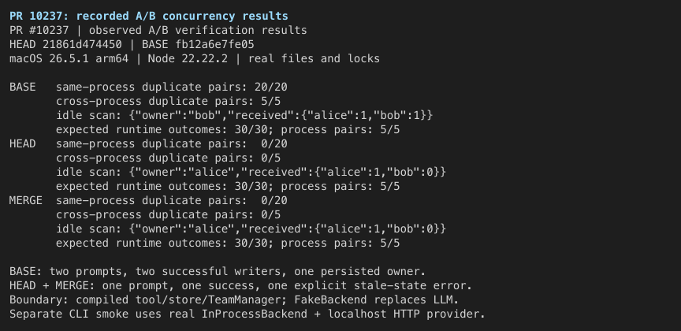
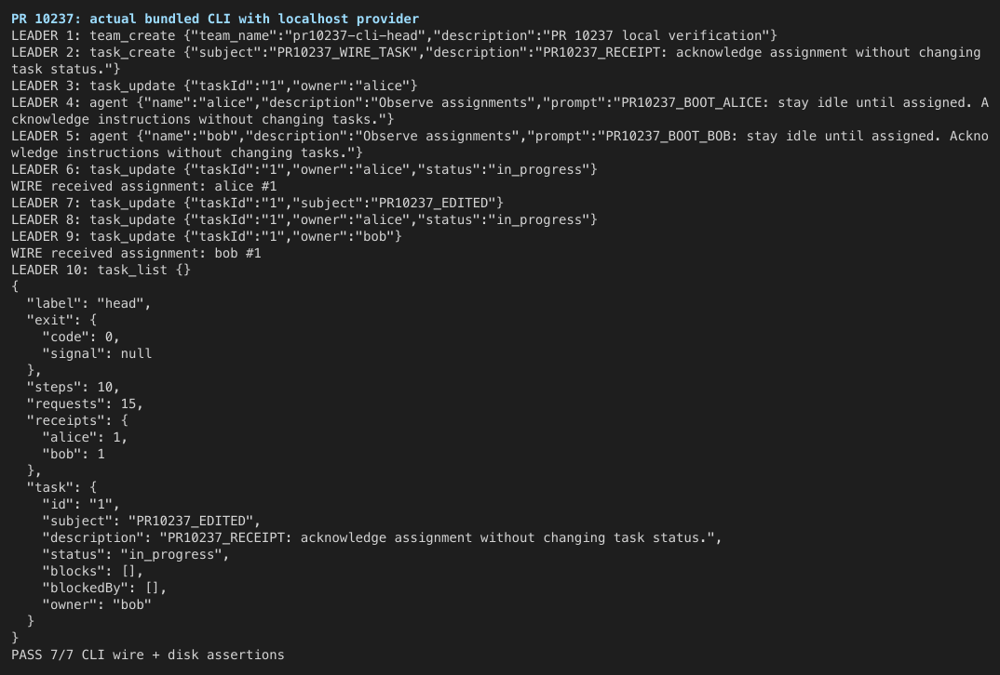
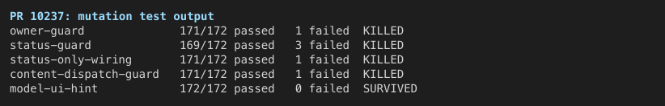

**Local verification: the stale-concurrent-assignment fix is demonstrated at `21861d474450c115a383281ef7e8529de1ceea07`. No merge-blocking regression was reproduced in the tested scope.** All **124/124 composite behavioral expectations** passed; the nonblocking diagnostic and test-coverage observations below remain. This is advisory verification evidence, not a formal approval or a merge action.

中文版：本地真实运行验证报告与合并参考

本次验证针对 PR 当前头提交 `21861d474450c115a383281ef7e8529de1ceea07`。结论：**过期并发分配修复有效，已执行范围内没有复现阻断合并的回归**；保留下面说明的非阻断提示文案和测试覆盖问题。共 124/124 组行为预期通过，基线中的缺陷现象属于预期对照结果，不算验证失败。

环境是 macOS 26.5.1 / arm64、Node 22.22.2。分别建立了基线 `fb12a6e7fe05`、PR 头提交和当前 `main`（`70cf3633950b`）的本地试合并环境。测试运行在独立目录和 macOS `sandbox-exec` 下，清空凭据环境变量，拒绝读取本机 SSH、GitHub 和 Qwen 配置。没有使用云端模型或真实 API 凭据。

**真实运行结果：**

- 同进程、真实文件锁控制的 20 组并发：基线 20/20 都向两个 teammate 投递；PR 和试合并均为 0/20 重复，每组恰好一个成功、一个明确的过期状态错误，唯一接收者与磁盘 owner 一致。
- 两个独立 Node 进程竞争同一个任务文件：基线 5/5 重复投递；PR 和试合并均为 0/5 重复。
- 真正的 teammate `IDLE` 事件触发自动认领，再恢复持有旧快照的 leader：基线 Alice、Bob 各收一次且磁盘 owner 是 Bob；PR 和试合并只有 Alice 收到，过期的 Bob 分配被拒绝。
- owner-only、status-only、完成状态保护、内容修改、原 owner 失活后的恢复、teammate 权限保护均已覆盖。每个版本完成 30/30 组运行时预期和 5/5 组跨进程预期。
- 完整 CLI 冒烟使用真实工具调度器和 `InProcessBackend`，只有 OpenAI 模型接口由本地可控 HTTP 服务提供。全局 CLI 和本地 PR bundle 各执行 10 次工具调用、产生 15 次模型 HTTP 请求；实际在线路上观察到 Alice 首次接收一次、Bob 顺序改派接收一次，内容修改和相同 owner/status 重试没有重复投递。两组各 7/7 断言通过。

**检查与证据：** PR 全仓 build、bundle、typecheck 和四个改动文件的 ESLint 通过；定向单测基线 162/162，PR 与试合并各 172/172。试合并的 core 构建和 typecheck 也通过。删除 owner、status、status-only 接线、content-only 派发保护后，定向测试分别出现 1、3、1、1 个行为断言失败，证明测试能检测到保护失效。截图和原始日志见英文正文对应链接。

**合并时需要明确的范围：** 本 PR 保留有意的顺序改派。Alice 已收到任务后再改派给 Bob，Bob 仍会收到任务；本改动不会撤回 Alice 的旧消息或取消其工作，因此不等于“同一个任务一生只能投递一次”。若 #10207 要求覆盖这一更强语义，仍需单独处理。PR 描述里的 `TaskOwnerChangedError` 和 `165 passing` 已过时，当前实现是 `TaskSnapshotChangedError`，本次实测为 172 项定向单测。

**非阻断观察：** 取消分配（`owner: ''`）与认领竞争时，会被正确拒绝，但仍附带“content-only 不会重新派发”的提示；纯内容重试并不能完成取消分配。另一个已知测试缺口也被确认：只从 `llmContent` / `returnDisplay` 去掉重试提示、保留 `error.message` 时，172 项单测仍通过；当前真实运行三个错误字段保持一致。建议作为小范围后续改进，不需要扩大本次并发修复。

**未覆盖：** 真实云端模型的决策、Linux/Windows、完整 TUI 交互、长时间压力、进程崩溃/重启和所有并发交错。并发探针使用真实编译后的工具、存储、锁和 TeamManager，teammate 模型执行由仓库 FakeBackend/FakeAgent 模拟；完整 CLI 冒烟则使用真实 InProcessBackend 和本地模型接口。截图是原始终端输出的渲染，不是 TUI 的屏幕截图。没有修改或推送产品代码，也没有合并 PR。

### Scope and exact builds

The central claim is that competing leader assignments based on one stale owner/status snapshot cannot both commit and dispatch. Secondary checks cover completed-state preservation and compatibility with deliberate reassignment/content edits.

| Build | Exact source | Use |
| --- | --- | --- |
| Base | `fb12a6e7fe0586a6c0d75e7ba72fc8a1aad0fe0c` | PR metadata's base SHA; expected-broken control |
| PR | `21861d474450c115a383281ef7e8529de1ceea07` | Exact current head, rebuilt locally |
| Current-main trial merge | `d55ed477279cd2ac5926eef7c83219930b38baa4` | Clean local merge of head into `main` at `70cf3633950b90c0ddc82b9fa4ee8791d2c373e3` |

The branch merge-base is `ac013952404f2386d01a67283c82af4bad93eaa8`; it was not substituted for the metadata base. The relevant team/task production files are unchanged between that merge-base, the metadata base, and the sampled current main. Base and head have identical dependency manifests/lockfile. Internal core workspace links were checked by realpath in each tree, so the base cannot silently import the head's built core. The current-main merge used its own lockfile install. Source hashes and resolved paths are in [environment.json](environment.json).

### A/B results

These assertions inspect the task JSON and the actual received prompt queue, not only whether a dispatch function was called.

| Scenario / observable | Base | PR head | Current-main merge |
| --- | --- | --- | --- |
| 20 concurrent leader pairs, real mutex + OS lock | **20/20 duplicate pairs**; both updates succeed | **0/20 duplicates**; one success + one conflict per pair | **0/20 duplicates** |
| 5 pairs in separate Node processes sharing task files | **5/5 duplicate pairs** | **0/5 duplicates**; recipient equals disk owner | **0/5 duplicates** |
| Actual IDLE event → auto-claim → stale leader resumes | Alice 1 + Bob 1; disk owner Bob | Alice 1 + Bob 0; disk owner Alice, leader rejected | Same fixed result |
| Stale owner-only assignment | Overwrites claim; dispatches to Bob | Rejected; Alice preserved | Same fixed result |
| Stale assignment after Alice completes | Reopens task; dispatches to Bob | Completed state preserved; no Bob prompt | Same fixed result |
| Stale status-only update | Overwrites newer status | Rejected | Rejected |
| Content-only edit racing a claim | Edit persists **and spuriously dispatches** | Edit persists; **no dispatch** | Same fixed result |
| Sequential reassignment, identical retries, inactive-owner recovery, teammate ownership | Existing contracts preserved | Existing contracts preserved | Existing contracts preserved |

Each arm completed **30/30 runtime scenario expectations and 5/5 cross-process pair expectations**. Base passes mean the expected bug was observed. The empty-owner diagnostic case is characterization, not an endorsement of its wording.

Raw evidence: [base runtime](base-runtime/summary.json), [head runtime](head-runtime/summary.json), [merge runtime](merge-runtime/summary.json), [base cross-process](base-cross-process/summary.json), [head cross-process](head-cross-process/summary.json), [merge cross-process](merge-cross-process/summary.json). Per-case JSON beside each summary includes the exact task, error fields, recipient prompts, and worker PIDs where applicable.

### Full CLI and delivery-path smoke

The globally installed standalone CLI and the locally built PR bundle each ran the same 10-tool scenario against a loopback OpenAI-compatible provider. The CLI scheduler, tool validation, team lifecycle, and `InProcessBackend` were real. Only model responses were scripted. Each run generated **15 actual HTTP model requests** and passed **7/7 wire/disk assertions**: successful exit, all steps reached, one Alice assignment, one Bob reassignment, final owner Bob, persisted content edit, and final CLI completion. Content-only updates and unchanged owner/status retries produced no extra assignment receipt.

See [head wire/disk result](cli-head/result.json), [global CLI result](cli-global/result.json), and [the reproducible driver](cli-smoke.mjs). The adjacent directories retain request bodies and CLI stdout/stderr. An initial isolated global run lacked auth; the completed loopback-provider run supersedes that setup attempt.

### Build gates and test sensitivity

| Check | Result |
| --- | --- |
| Exact-head full repository `npm run build`, `npm run bundle`, `npm run typecheck` | All exit 0 |
| ESLint on all four changed files | Exit 0; an inserted unused binding was first detected, then removed |
| Task store + task_update + coordination suites | Base **162/162**, head **172/172**, merge **172/172** |
| Current-main trial merge | Conflict-free; core build and core typecheck exit 0 |
| Source integrity after temporary mutation/lint probes | All three product worktrees clean; exact source hashes retained |

The mutation matrix ran the same 172-test suite after one isolated change at a time. Failures were behavioral assertion failures, not import/setup failures. All source mutations were restored.

| Mutation | Passed / failed | Interpretation |
| --- | --- | --- |
| Disable in-lock owner comparison | 171 / 1 | Test observes two fulfilled writes instead of one |
| Disable in-lock status comparison | 169 / 3 | Tests observe accepted stale writes instead of rejection |
| Remove status-only guard wiring | 171 / 1 | Stale status-only update is no longer rejected |
| Remove content-only dispatch exclusion | 171 / 1 | Content-only update calls dispatch once |
| Strip retry hint only from model/UI error fields | 172 / 0 | Existing coverage gap; same-file wiring mutants above prove the suite is live |

Logs: [build](build-head.log), [bundle](bundle-head.log), [typecheck](typecheck-head.log), [head tests](unit-head.log), [merge tests](unit-merge.log), [mutation results](mutation-matrix.json), [lint positive control](lint-control.log). `124/124` counts 90 runtime scenarios, 15 process pairs, 14 CLI assertions, and 5 expected mutation outcomes; unit test counts are reported separately. [Machine-readable assertions](assertions.json).

### Corrections and remaining nonblocking observations

- **Earlier Critical findings were rechecked at this head.** The initial “no production fix” objection is obsolete. The later missing owner-only guard / stale content dispatch Critical is fixed: both the real runtime probes and mutation failures demonstrate the current guards. The old owner-only comparison now also checks status under the lock.
- **PR-description correction:** the current error class is `TaskSnapshotChangedError`, and the three focused suites now contain 172 passing tests, rather than the description's `TaskOwnerChangedError` / 165 count.
- **Known diagnostic issue remains:** a rejected `owner: ''` unassignment also receives the content-only/re-delivery hint. The rejection safely preserves the new owner, but a content-only retry cannot unassign the task. This reproduces the already-reported [unassignment wording suggestion](https://github.com/QwenLM/qwen-code/pull/10237#discussion_r3957718109); no new blocking behavior was demonstrated.
- **Known error-surface coverage gap remains:** removing the retry hint from `llmContent` and `returnDisplay` leaves the suite green while keeping it in `error.message`. The unmodified runtime delivers identical error text in all three fields. This confirms the existing [test-coverage suggestion](https://github.com/QwenLM/qwen-code/pull/10237#discussion_r3957718097).

**Merge scope:** this evidence supports the PR's stated stale-snapshot fix. Intentional sequential reassignment still delivers first to Alice and later to Bob; it does not revoke the earlier prompt or cancel Alice's work. Do not read the result as an exactly-once guarantee across a task's lifetime. If the broader sequential variant discussed in #10207 is part of its closure criteria, it needs a separate product decision/follow-up.

### Method and limits

Local macOS 26.5.1 arm64, Node 22.22.2, npm 10.9.7, 2026-09-09. PR code ran in scratch worktrees through a clean-environment macOS `sandbox-exec` wrapper, with host-home reads denied except the Node installation, scratch Qwen storage, and no inherited API/GitHub/SSH credentials. Credential-file reads were verified to fail. This is a native macOS sandbox adaptation, not a container/VM run. Git metadata stamping therefore fell back to unavailable in the build; exact source SHAs were checked separately. Builds emitted nonfatal bundle-size warnings.

Concurrency probes use compiled production tool/store/TeamManager code and real filesystem locks. Repository FakeBackend/FakeAgent replace teammate model execution, and Config accessor barriers force the measured interleavings. The actual idle event and automatic claim path run unmodified. The complementary CLI smoke uses the actual InProcessBackend with a scripted HTTP model peer. See [runtime harness](runtime-harness.mjs), [cross-process harness](cross-process-harness.mjs), [test-engineer notes](test-engineer-report.md), and [rerun instructions](README.md).

Not covered: live-cloud-model decision-making, Linux/Windows, full interactive TUI behavior, prolonged stress, crash/restart or every possible interleaving, full repository tests, and a full repository rebuild of the current-main merge. The three images render recorded terminal output; they are not TUI screen captures. Validation is for the pinned SHAs above. No product code was committed/pushed, no review state was changed, and this PR was not merged.
