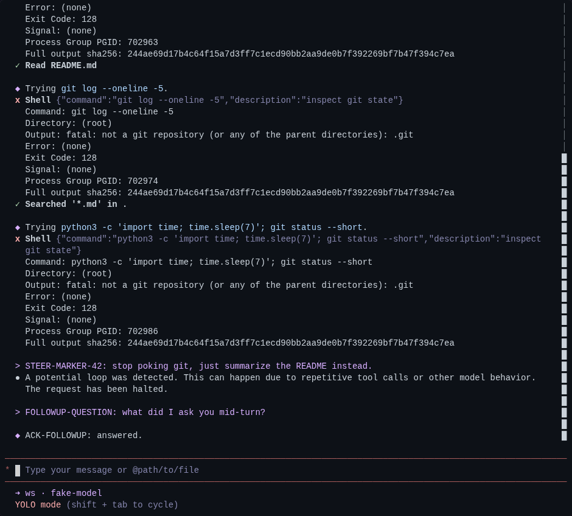
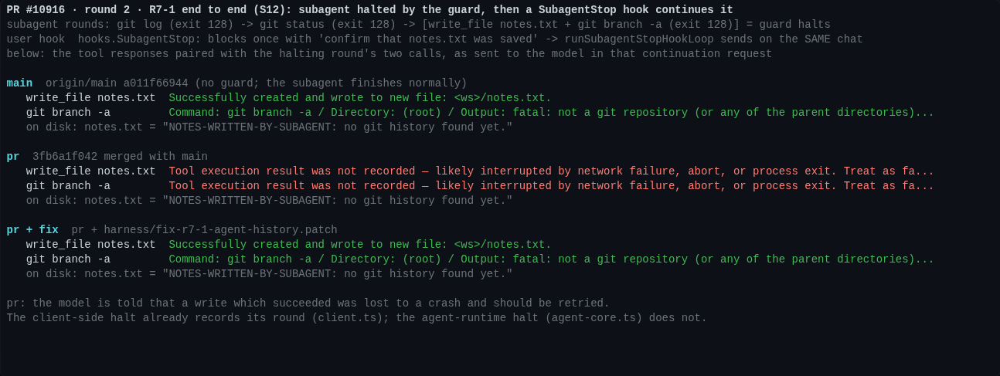
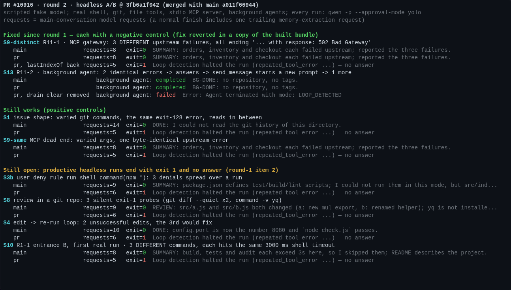

<!-- PR #10916 maintainer verification, round 2, head 3fb6a1f042; posted as a PR comment -->

## 维护者验证，第 2 轮（仅增量）@ `3fb6a1f042`

第 1 轮是 `965900af` 上的 [5918529257](https://github.com/QwenLM/qwen-code/pull/10916#issuecomment-5918529257)。本轮只覆盖此后的改动，以及第 1 轮留下的未决项。

**结论：第 1 轮的阻断项已修复，但目前仍不能原样合入。**
- **已修复，并在真实会话中验证：** R6-1（第 1 轮的阻断项）、R11-1 和 R11-2。每一项都做了负对照。
- **合入前必须修复：R7-1。** 第 1 轮没有评估它。本轮已端到端复现，路径真实可达。下文附一个经过验证的 11 行补丁。
- **仍需维护者裁定：第 1 轮的第 2 项。** 正常推进的 headless 运行仍以 exit 1 结束、没有回答。本轮在真实会话中实测到第四类情形：互不相关的 shell 超时。

### 环境

| 臂 | 提交 |
|---|---|
| `main` | `origin/main` `a011f66944` |
| `pr` | `3fb6a1f042` 合并 `a011f66944` → `09741fcd71`（无冲突） |
| `pr + fix` | `pr` + [`fix-r7-1-agent-history.patch`](harness/fix-r7-1-agent-history.patch) |
| 负对照 | 复制 `pr` 构建好的 bundle，只还原其中一处修复 |

- 每个臂都执行了真实的 `pnpm install --frozen-lockfile` 和 `npm run build && npm run bundle`。
- harness 与第 1 轮相同。模型是脚本化的 OpenAI 兼容假服务器。
- 其余全部是真实组件：
  - shell、`git` 和文件工具
  - 一个 stdio MCP server
  - 后台 agent、teammate 和 SubagentStop hook
  - headless `qwen -p --approval-mode yolo`
  - TUI（node-pty + xterm.js）
  - `qwen --acp`

### 第 1 轮之后已修复

| 项 | 修复 | `pr` 上的真实会话 | 负对照 | 单测 |
|---|---|---|---|---|
| **R6-1**（第 1 轮阻断项）：终止后插话被送达模型两次 | `cd82572d25`（原样应用补丁 B） | TUI，3 次运行均如此：终止之后的每个请求里，插话都**只出现一次**，`[0,0,0,0,0,1,1,1,1,1]`。这与第 1 轮的补丁 B 臂完全一致。第 1 轮的 `pr` 从终止起每次都发两遍（图 1）。 | 第 1 轮的 `pr` 臂 | 去掉 `accept()` 后，`settles a steer carrier written by the halt …` 失败（1/480） |
| **R11-1**：MCP 载荷引用 ` with response: ` 时，不同的失败被合并成一个 | `56bd035e48` | 一个真实 stdio MCP 网关返回三个**不同**的上游失败，文本都以 `… with response: 502 Bad Gateway` 结尾。`pr` 在第 8 个请求后给出回答，与 `main` 完全相同。 | 还原 `lastIndexOf` 后，同一会话在第 5 个请求处终止，exit 1 | 还原切分后失败 1/173 |
| **R11-2**：agent 运行时的连续计数跨越了 prompt | `56bd035e48` | 一个真实后台 agent 先遇到 2 次相同错误，然后作答。`send_message` 开启新的 prompt，其中又出现 1 次相同错误。结果：`pr` 和 `main` 都是 `completed`。 | 去掉 immediate-drain 处的 `clearToolErrorStreaks()` 后：`failed`，`Agent terminated with mode: LOOP_DETECTED` | 见下文 |

R11-2 的单测只覆盖了两处清零中的一处：
- post-wait 清零（`agent-core.ts:1411`）有覆盖：删掉它会失败 1/76。
- immediate-drain 清零（`agent-core.ts:1385`）**没有**覆盖。删掉它之后 `src/agents/runtime` 仍全绿（1376 通过）。这证实了第 12 轮延后的那一项。目前唯一能抓住它的是本轮的 S13 会话。

检测器在该触发的地方仍然触发：
- S1（issue 形状）在第 5 个请求处终止；`main` 发了 14 个。
- MCP 死循环（参数各不相同，载荷完全一样）在第 5 个请求处终止；`main` 发了 8 个。



### 仍未解决

**1.【合入前修复】R7-1 已端到端复现，路径是 SubagentStop hook。**

被终止的子 agent 是如何在同一个 chat 上再发一次请求的：
- 终止分支在 `agent-core.ts:1353` 跳出，早于 `:1356` 的 `currentMessages = toolCallResult.messages`。终止那一轮的结果从未写入 chat。
- `runSubagentStopHookLoop`（`agent.ts:2026`；`background-agent-resume.ts:1944` 有同样的代码）不检查终止模式。用户的 SubagentStop hook 一旦阻断，它就在**同一个** chat 上再次调用 `subagent.execute()`（`agent.ts:2090`）。
- 这次发送会运行 `repairOrphanedToolUseTurns`（`llm-chat.ts:5801`），用 `ORPHAN_TOOL_USE_REPAIR_REASON` 补齐缺失的结果。

实际运行的场景（S12，图 2）：
1. 一个前台子 agent 运行 `git log` 和 `git status`，都以 exit 128 失败。
2. 第三轮运行 `write_file notes.txt`，**成功**（文件在磁盘上）；同时运行 `git branch -a`，这是第三次相同的 exit-128 失败。守卫终止了子 agent。
3. 用户的 SubagentStop hook 阻断一次："confirm that notes.txt was saved"。
4. 在延续请求里，第 2 步的两个调用都被配上了 `Tool execution result was not recorded — likely interrupted by network failure, abort, or process exit. Treat as failure and retry if needed.`

在 `main` 上，同一个请求里是 `Successfully created and wrote to new file` 和真实的 `git` 输出。也就是说，模型被告知一次已经成功的写入丢失了，应该重试。

终止确实来自这个守卫：
- 在带 `--telemetry-outfile` 的运行里，这次终止被记录为 `loop_detected`，`loop_type: repeated_tool_error`，其 `prompt_id` 属于子 agent（`…#general-purpose-call_l0`）。
- S12 在 `pr` 上 3 次运行中有 2 次触发终止。第三次的第 2 轮碰上了 `Output: (empty)` 问题（见第 3 项），连续计数被重置，守卫没有触发。



下面这些路径**不会**在被终止的 chat 上再发一次请求。每一条都实测过或追过代码：
- **团队 teammate（实测）：** `TeamManager` 只向 IDLE 状态的 agent 投递消息（`TeamManager.ts:2076`）。终止后 teammate 变为 FAILED（`agent-interactive.ts:425`）。leader 的 `send_message` 得到 `Teammate "worker" is no longer active and cannot receive messages.`
- **agent 视图输入框（追代码）：** 发给 FAILED agent 的排队消息会被丢弃（`AgentViewContext.tsx:203`）。
- **对后台 agent 调用 `send_message`（追代码）：** LOOP_DETECTED 后 agent 被标记为 failed（`agent.ts:4031`），`send_message` 返回 `Cannot send messages to stopped tasks`（`send-message.ts:343`）。

所以 R7-1 线程描述的触发方式（teammate 的排队消息）目前看来不可达，但 hook 路径可达。

这种"先跳出、后记录"的结构在 merge base 上就已经存在于 #9450 有状态读取守卫的终止分支（`agent-core.ts:1340`）。本 PR 让终止对普通失败常驻生效，这也是它在 client 侧修了同一个缺口的原因（`client.ts:4676`）。agent 运行时需要同样的修复。

修复方式是在跳出前记录该轮结果，与 `client.ts` 的做法对称：
```diff
           if (terminateMode === AgentTerminateMode.LOOP_DETECTED) {
+            // This round's calls already executed — files were written,
+            // commands ran — but breaking here skips the send that would put
+            // their results into history. Record them, as the client-side
+            // halt does (client.ts), so the model's functionCall turn stays
+            // paired: left dangling, a later send on this chat (a blocking
+            // SubagentStop hook continues it) runs the orphan repair, which
+            // tells the model those calls were lost to a crash and should be
+            // retried — including the ones in this batch that succeeded.
+            for (const content of toolCallResult.messages) {
+              chat.addHistory(content);
+            }
             break;
           }
```
验证方式：
- **打补丁后的 S12：** 延续请求里带的是真实结果（图 2）。
- **新增单测：** 终止那一轮的 `functionResponse` 被写入 history。
- **负对照：** 只还原 `agent-core.ts` 的改动，新测试失败（1/77）。
- **更大范围的套件：** `src/agents/runtime` + `loopDetectionService` + `client` 全部通过（2030 通过，7 跳过）。
- **静态检查：** core 的 `tsc --noEmit`、`eslint --max-warnings 0` 和 prettier 全部干净。
- **可干净应用**到 `3fb6a1f042`。

这个补丁只让 history 如实记录。SubagentStop hook 是否应该被允许继续一个已被守卫终止的运行，是另一个问题，我没有对此下结论。

带测试的完整补丁见 [`harness/fix-r7-1-agent-history.patch`](harness/fix-r7-1-agent-history.patch)。

**2.【合入前需裁定；与第 1 轮相同，另新增一类】正常推进的 headless 运行仍以 exit 1 结束、没有回答（图 3）。**

在当前 head 重跑，下面每一项在 `pr` 上仍然 exit 1，而 `main` 给出了回答：
- **S3b：** 用户 deny 规则 `run_shell_command(npm *)`。
- **S8：** 静默 exit-1 探测。
- **S4：** 编辑 → 重跑的循环。

**本轮新实测 S10：** 三条*不同*的命令，各自都触发了同一个显式的 shell `timeout: 3000`。这是 R1-1 [线程](https://github.com/QwenLM/qwen-code/pull/10916#discussion_r3944127927)里的 Entrance B；作者在该线程中已确认其机制，这是它第一次在真实会话中被实测。
- 模型看到的错误是 `Command timed out after 3000ms before it could complete.`（`shell.ts:2978`），其中不包含命令本身。
- 因此三次超时的指纹完全相同，`pr` 在第 5 个请求处 exit 1。`main` 跑完并给出总结。
- 不显式设置 timeout 也会遇到。不设置时，所有前台命令都使用同一个 120000 ms 默认值（`shell.ts:2415`），所以任意三条各自运行超过 2 分钟的不相关命令都会产生完全相同的错误文本。
- 第 12 轮又以探测项的形式把同一失败方式延后了（`loopDetectionService.ts:836`）。
- 调度器级别的超时（`coreToolScheduler.ts:479`）同样不带工具身份。这一条我没有实际运行。

headless 下仍然没有关闭开关，也没有阈值设置。我在第 1 轮的建议不变，二选一或两者都做：
- (a) **不再把非错误信息当作证据计数：** 策略拒绝（`not_started`）、超时、静默的 exit-1 回答。
- (b) **提供阈值设置**，0 = 关闭。



**3. 无变化；属于后续事项，此处不再展开：**
- **ACP：** 用真实的 `qwen --acp` 会话重放了 S1。它发了 14 个请求，以 `end_turn` 结束，与 `main` 相同。守卫仍未接入 ACP / daemon。
- **R4-2（引用的 digest）：**
  - S7 中三个**不同**的失败各自引用了一行 digest。`pr` 的 4 次运行中有 1 次在三个请求后终止。
  - 另外 3 次碰上了第 1 轮提到的间歇性 `Output: (empty)` shell 问题。在这些运行里，负载下 15 条命令中有 6 条返回空输出，而空结果会重置连续计数。`main` 上也出现过这个问题，不是本 PR 引起的。
- **可见改动：** 每条失败的 shell 结果末尾的 `Full output sha256:` 行仍然可见，PR 描述中仍未说明。

### 门禁

| 检查 | 结果 |
|---|---|
| 两个臂的完整 `packages/core` 套件 | `main` 34,095 通过 / 6 失败；`pr` 34,134 通过 / 6 失败（多 39 个测试）。**失败集完全相同**：6 个 root 用户 / 计时相关的环境测试。 |
| `pr` 上的聚焦 core 套件 | 11 个文件，1926 通过（loopDetection、client、agent-headless、agent-core、shell、truncation、finalizer、loggers、qwen-logger、log-to-span、scheduler） |
| `pr` 上的 `packages/cli` `nonInteractiveCli` | 180 通过，1 跳过（`main` 跳过同一个） |
| `3fb6a1f042` 的 CI | 绿色。`Test (windows/macos)` 和 `Integration Tests (CLI)` 被跳过。 |

### 未验证

- 调度器级别超时的端到端表现。
- R11-2 的 post-wait 分支的端到端表现。它需要一个被 monitor 挂住的后台 agent；单测已覆盖这一分支。
- Windows、macOS、OpenTUI，以及 `qwen serve` daemon 运行。

### 证据

全部放在 本目录：
- 新场景、MCP server 和 hook 脚本
- R7-1 补丁
- 图的源文件
- `data/results.json`，包含每次运行的结果以及模型实际看到的工具结果

第 1 轮的 harness 原样保留在 `pr-10916/`。
