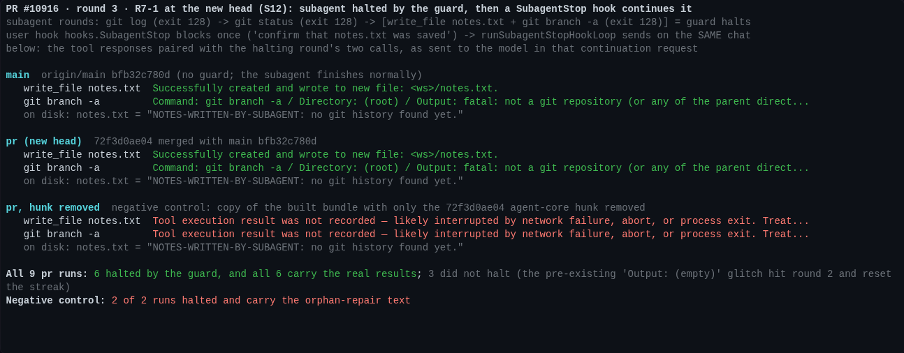
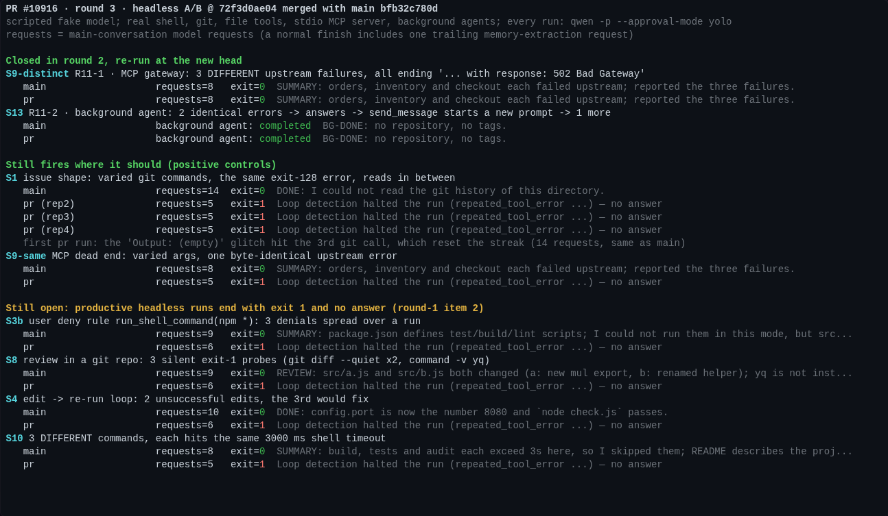
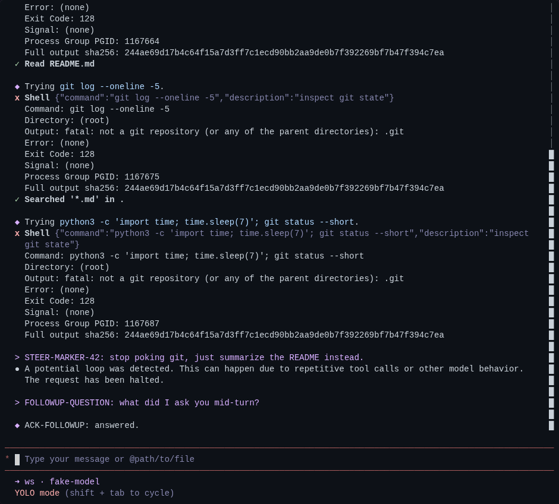

## Maintainer verification, round 3 (delta only) @ `72f3d0ae04`

Round 2 was [5963467302](https://github.com/QwenLM/qwen-code/pull/10916#issuecomment-5963467302) at `3fb6a1f042`. Since then the head has gained one commit, `72f3d0ae04`. It applies round 2's R7-1 patch: its added and removed lines are byte-identical to [`fix-r7-1-agent-history.patch`](https://github.com/wenshao/qwen-code/blob/5ece30944b947d102bbbf1a0a0801bbcf745f260/pr-10916-round2/harness/fix-r7-1-agent-history.patch). This round verifies that commit on a fresh build and re-runs what round 2 closed.

**Verdict: R7-1 is fixed and nothing regressed. One thing still has to happen before merge: a ruling on item 2 (headless false halts).**
- **Fixed and verified in real sessions:** R7-1, with a negative control.
- **Still fixed at the new head:** R6-1, R11-1 and R11-2.
- **Needs a ruling:** item 2. The new commit does not touch its code, and S3b, S8, S4 and S10 still end with exit 1 and no answer.

### Setup

| Arm | Commit |
|---|---|
| `main` | `origin/main` `bfb32c780d` |
| `pr` | `72f3d0ae04` merged with `bfb32c780d` → `c72e773b17` (clean merge) |
| negative control | a copy of `pr`'s built bundle with only the `agent-core.ts` hunk of `72f3d0ae04` removed |

- Each arm had a real `pnpm install --frozen-lockfile` and `npm run build && npm run bundle`.
- `main` gained 16 commits since round 2. Only one touches a file this PR changes: `9b4960a089` (#13126), a notification-recording change in `client.ts`. It is away from the halt.
- The harness, scenarios, MCP server and hook script are round 2's, unchanged.

### R7-1: fixed (Fig. 1)

This is the same S12 session as round 2:
1. A foreground subagent runs two failing `git` calls.
2. Its third round writes `notes.txt`, which succeeds, and makes a third identical failing `git` call. The guard halts the subagent.
3. A user SubagentStop hook blocks once, and `runSubagentStopHookLoop` sends again on the same chat.

What the continuation request carries for the halting round's two calls:

| Arm | Result paired with `write_file` and `git branch -a` |
|---|---|
| `main` | The real results. There is no guard, so the subagent finishes normally. |
| `pr` | The real results: `Successfully created and wrote to new file` and the real `git` output. This held in **all 6 runs that the guard halted**. |
| negative control | `Tool execution result was not recorded — … Treat as failure and retry if needed.` for both calls, in 2 of 2 runs. This is round 2's failure. |

Details:
- **Run count:** I ran `pr` 9 times. In 3 of them the guard did not fire. In each of those 3, the second `git` call came back as `Output: (empty)` (the same pre-existing glitch as in rounds 1 and 2), which reset the streak. All 9 runs are in `data/results.json`.
- **The halt is the guard's:** in a run with `--telemetry-outfile`, the halt is logged as `loop_detected` with `loop_type: repeated_tool_error`. Its `prompt_id` is the subagent's (`…#general-purpose-call_l0`).
- **Unit test:** the new test passes. If I revert only the `agent-core.ts` hunk in source, it fails (1/77).
- **Static checks:** core `tsc --noEmit` exits 0 on a real install. The 10 errors in `src/code-mode/host.ts` that the landing note reported came from its local environment: `quickjs-emscripten-core` is present after `pnpm install --frozen-lockfile`. `eslint --max-warnings 0` and prettier are clean on both changed files.
- **Other halts (read, not run):**
  - The recording runs after both halting checks in that block (`agent-core.ts:1353`). So it also covers the older #9450 stateful-read halt (`recordToolResult`, `:1331`), which had the same gap.
  - The duplicate provider tool-call halt (`:1321`) breaks earlier. Its batch is dropped before any call runs, so it has nothing to record.
- **Still open from round 2, not a blocker:** whether a SubagentStop hook should be allowed to continue a run that the guard halted. This fix only makes the history truthful.

### Round 2's fixes, re-run at the new head (Fig. 2, Fig. 3)

- **R6-1:** real TUI steer run. The markers per request are `[0,0,0,0,0,1,1,1,1,1]`, and the follow-up carries the steer once (Fig. 3).
- **R11-1:** in S9-distinct, `pr` answers after 8 requests, like `main`.
- **R11-2:** in S13, the background agent is `completed` on both arms.
- **The guard still fires where it should:**
  - S1 halts at request 5 in 3 of 3 repeats; `main` makes 14 requests. One more run hit the glitch on its third `git` call and ran 14 requests, like `main`.
  - S9-same halts at request 5; `main` makes 8.

### Still open: item 2, needs a ruling before merge

This is unchanged since round 2. `72f3d0ae04` does not touch `loopDetectionService.ts`, `shell.ts` or `coreToolScheduler.ts`. At this head, `pr` stops with exit 1 and no answer while `main` answers:

| Scenario | `pr` | `main` |
|---|---|---|
| S3b: a user deny rule on `run_shell_command(npm *)` | exit 1 at request 6 | answers at request 9 |
| S8: silent exit-1 probes | exit 1 at request 6 | answers at request 9 |
| S4: an edit → re-run loop | exit 1 at request 6 | answers at request 10 |
| S10: three different commands hit the same shell timeout | exit 1 at request 5 | answers at request 8 |

The review threads on these sites (R7-2, R7-7, R1-1) were re-checked against `72f3d0ae04` and are marked as waiting for this ruling. My round-2 recommendation stands. Either or both of:
- **(a) Stop counting evidence that is not an error message:** policy denials (`not_started`), timeouts, and silent exit-1 answers. This covers S3b, S8 and S10. S4 is a real failure repeated, so (a) leaves it halting.
- **(b) Ship a threshold setting, with 0 = off.** This gives every case an escape hatch.

### Unchanged follow-ups (not merge blockers)

- **R11-2:** the immediate-drain `clearToolErrorStreaks()` (`agent-core.ts:1396` at this head) still has no unit test that catches its removal. Only S13 catches it.
- **ACP:** the guard is not wired into ACP or the daemon.
- **R4-2:** the quoted-digest case.
- **Visible change:** the undisclosed `Full output sha256:` line on failed shell results.

### Gates

| Check | Result |
|---|---|
| Full `packages/core` suite, both arms | `main` 34,165 passed / 6 failed; `pr` 34,205 passed / 6 failed (+40 tests). The **failure set is identical** (the same 6 root-user / timing environment tests as round 2). |
| Focused core suites on `pr` | `src/agents/runtime` + `loopDetectionService` + `client`: 28 files, 2031 passed, 7 skipped |
| `packages/cli` `nonInteractiveCli` on `pr` | 180 passed, 1 skipped |
| Static | core `tsc --noEmit` exit 0; `eslint --max-warnings 0` and prettier clean on both changed files |
| CI at `72f3d0ae04` | Green: `Test (ubuntu)`, `Lint & Static`, `Integration Tests (no-AK)`. `Test (windows/macos)` and `Integration Tests (CLI)` were skipped. |

### Not verified

- The #9450 stateful-read halt with the new recording (code reading only).
- Same as round 2:
  - the scheduler-level timeout, end to end
  - R11-2's post-wait branch, end to end
  - Windows, macOS, OpenTUI and a `qwen serve` daemon run

### Evidence

Everything is in [`this directory`](.):
- the figures and their sources
- the round-3 drivers
- `data/results.json`, with per-run outcomes and the tool results the model saw

The scenarios are in `pr-10916-round2/harness/`.
