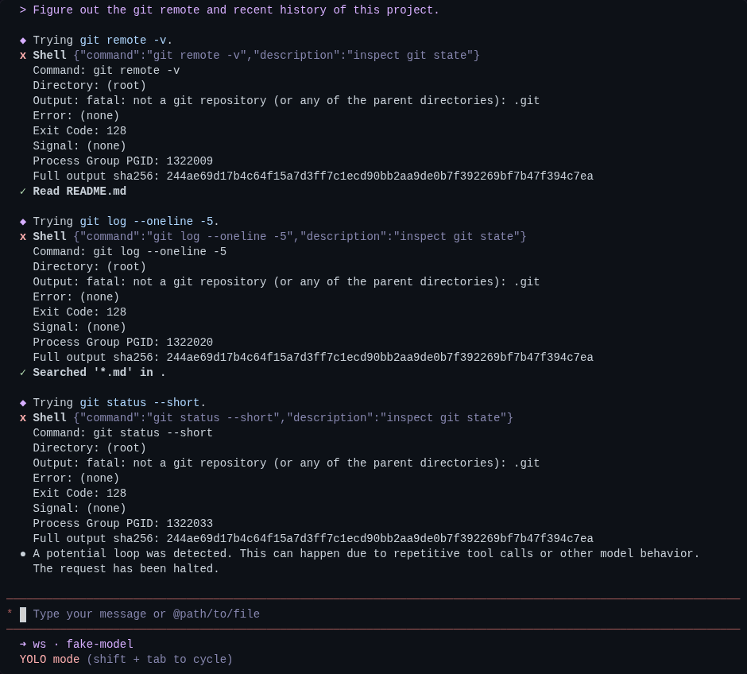
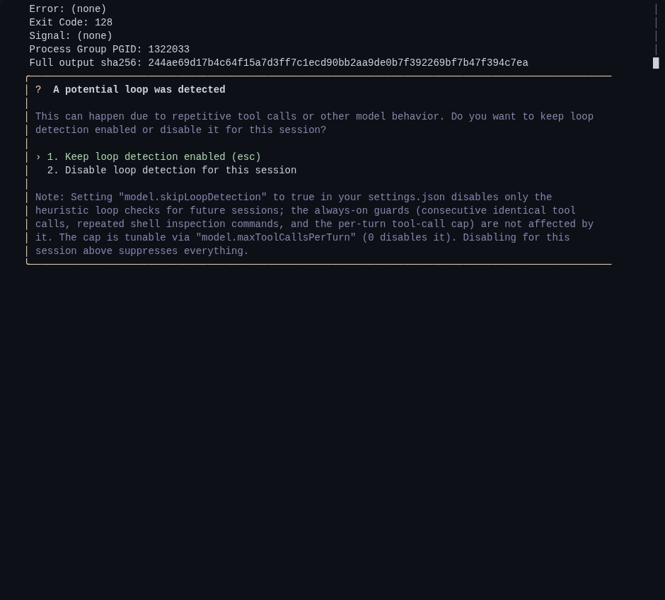
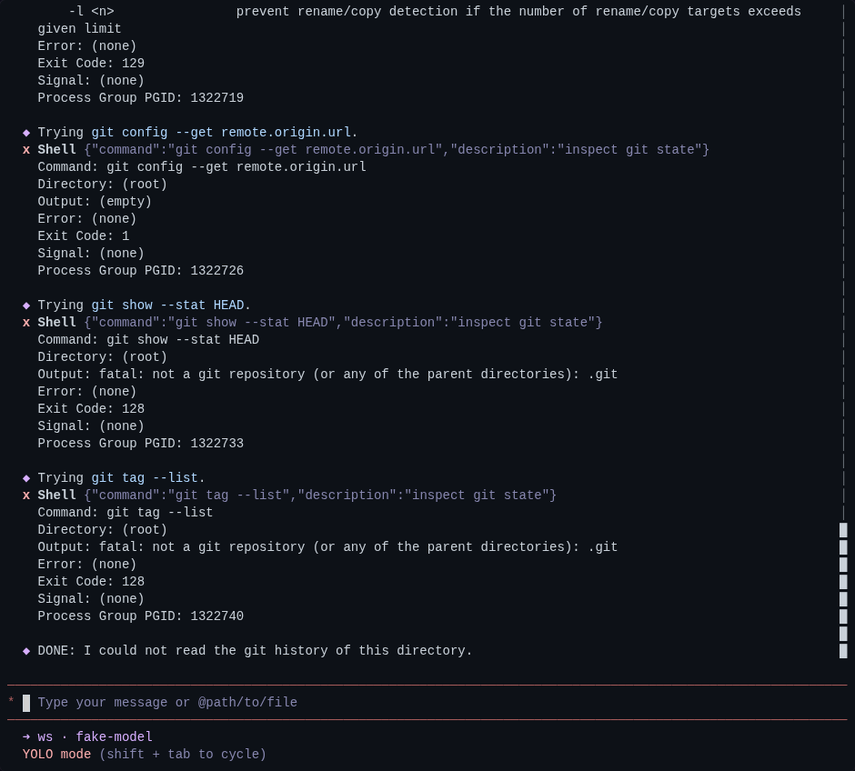
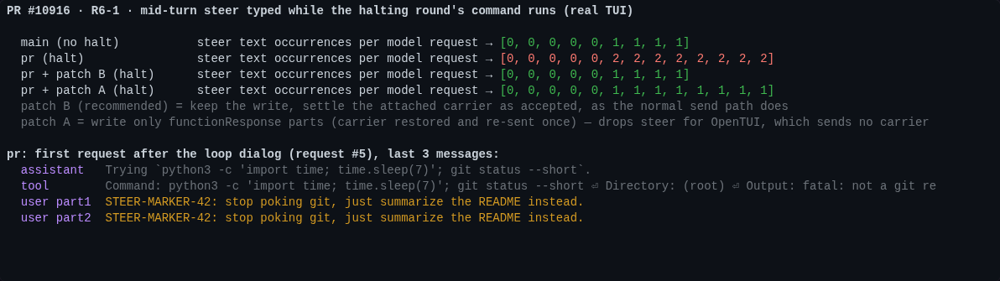
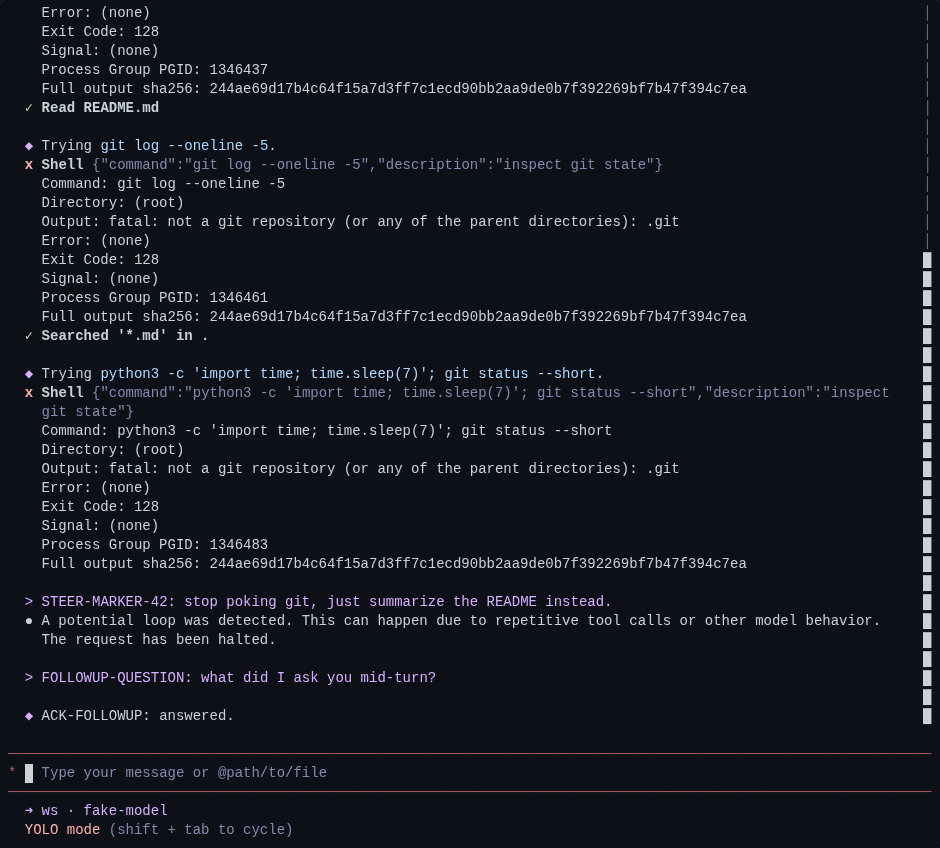
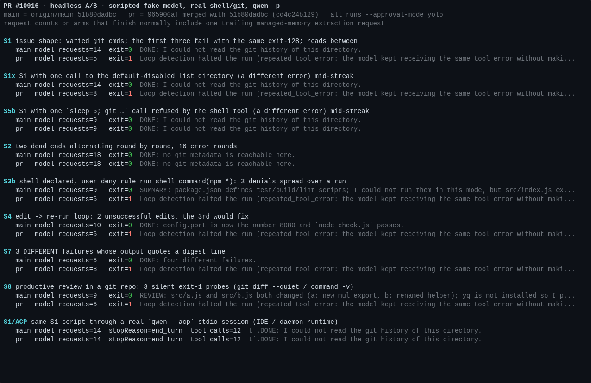

<!-- PR #10916 maintainer verification, head 965900af; posted as a PR comment -->

## Maintainer verification: real builds, real TUI/headless/ACP sessions @ `965900af`

**Verdict: not mergeable as-is.**
- **Blocking:** R6-1 is a regression this PR introduces. I reproduced it in the real TUI and attached a verified patch; it is small.
- **Needs a maintainer ruling:** productive headless runs get killed with exit 1 and no answer (item 2).
- **Needs a maintainer ruling:** R7-1 (Gate 2 in [5860841209](https://github.com/QwenLM/qwen-code/pull/10916#issuecomment-5860841209)). I did not evaluate it.

The detector works for the case it was built for. The telemetry privacy concern is closed. The full `packages/core` suite shows no regressions. Everything else below is a follow-up.

**Relation to earlier rounds:**
- The 2026-09-04 sandboxed verification ([5540535668](https://github.com/QwenLM/qwen-code/pull/10916#issuecomment-5540535668), `8a8240c4`) ran scripted assertions against the built detector.
- This round is the first to drive **complete sessions** on the current head: the real TUI, headless `qwen -p`, a real `qwen --acp` session, and a subagent.
- Where a run confirms an existing thread, I cite its ID (R6-1, R7-2, R5-1, R4-2, R3-2, R3-4) instead of re-filing it.

### Setup

| Arm | Commit | Notes |
|---|---|---|
| `main` | `origin/main` `51b80dadbc` | control |
| `pr` | `965900af` merged with `51b80dadbc` → `cd4c24b129` | clean merge; this is what would land |
| `pr + patch B` / `pr + patch A` | `cd4c24b129` + one `client.ts` hunk each | candidate fixes for R6-1 |

- Each arm had a real `pnpm install --frozen-lockfile` and `npm run build && npm run bundle` (exit 0, about 4 min per arm).
- The model is a scripted OpenAI-compatible fake server. Everything else is real: shell, `git`, file tools, the TUI (node-pty + xterm.js screenshots), `qwen -p`, and `qwen --acp` over stdio.
- The same script is replayed on both arms.

### What works (verified)

| Check | Result |
|---|---|
| **Issue shape.** Every round runs a different `git` command. The first three fail with the identical exit-128 `not a git repository`, with successful reads in between. | **`pr` halts after 5 model requests; `main` makes 14.** Headless exits 1 with `Loop detection halted the run (repeated_tool_error: …)`; the TUI shows the loop dialog (Fig. 1). |
| Telemetry (`--telemetry-outfile`) | The `loop_detected` record carries `loop_type: repeated_tool_error` and `error_signature: f8a402…`. I recomputed that value independently as `sha256("<persisted-stub>sha256:" + 244ae6…)`, where `244ae6…` is the `sha256` of the `Output/Error/Exit Code/Signal` core. The record contains no `error_excerpt` and no command text. |
| Subagent path (`agent-core.ts:1323`) | A general-purpose subagent on the same dead end stops after 5 tool uses (`main`: 10; tokens 5,250 vs 11,550). The parent gets `<status>failed</status> … Agent terminated with mode: LOOP_DETECTED`. |
| Focused unit suites on the merged tree | core 1784/1784 (loopDetection 171, client 476, scheduler 473, shell 370, truncation 44, finalizer 28, loggers 97, log-to-span 55, agent-core 70); cli `nonInteractiveCli` 180 passed + 1 skipped (`main` has the same skip) |
| **Full `packages/core` suite, both arms** | `main` 33,818 pass / 6 fail; `pr` 33,848 pass / 6 fail, with an **identical failure set** (6 root-user/timing environment tests). There is no conflict inside core with the 91 commits `main` gained since the merge base. I ran only `nonInteractiveCli` from cli. |
| CI at `965900af` | Green. The Windows/macOS `Test` lanes and `Integration Tests (CLI)` were skipped. |



<details><summary>Fig. 1b/1c: the dialog on <code>pr</code>, and <code>main</code> running all 12 rounds on the same script</summary>



</details>

### Findings, most severe first

**1. [Blocking; this PR's own fix causes it] R6-1 / Gate 1 reproduced: a mid-turn steer message reaches the model twice.**

What happens in the real TUI when a message is typed while the halting round's command is still running:
1. The CLI drains the message into the same `ToolResult` submission and attaches the carrier as `steerInput`.
2. The halt branch writes `requestToSend` to history, steer parts included (`client.ts:4632`).
3. `pushInitiated` is still false at that point, so the outer `finally` calls `restore()`. The message is queued again and re-sent after the dialog.

As a result, the first request after the dialog carries the steer text **twice**, and it stays doubled for the rest of the session. On `main` it appears once. The comment at `client.ts:4626` ("requestToSend still holds exactly the tool-result parts") does not hold for the TUI.



I tested two patches. Each one passes the real TUI run and a new unit test, and has a negative control: reverting only the `client.ts` hunk turns that test red. Both also pass client + loopDetection 648/648, `eslint --max-warnings 0`, and `tsc --noEmit` on core.

- **Patch B (recommended).** Keep the write and settle the attached carrier as accepted, the same way the normal send path does after its push. This is the accept-on-halt option Gate 1 describes. It is safe for every caller, because a send without a carrier makes it a no-op.
- **Patch A (not recommended as it stands).** Write only the `functionResponse` parts and let the carrier restore and re-send once. It fixes the ink TUI, but it would **drop** the steer for OpenTUI. `ui/opentui/live-session.ts:1031` puts drained steer parts into the `ToolResult` request without a carrier and marks them delivered on the first stream event (`:756`). The halt's `LoopDetected` event triggers that, and patch A then filters the parts out. This conclusion comes from reading the code; I did not run OpenTUI.

Patch B, `client.ts` hunk:
```diff
           this.getChat().addHistory(createUserContent(requestToSend));
+          // requestToSend also carries the parts of an attached steer /
+          // teammate carrier (the CLI appends them after the tool results),
+          // and they were just written to history above. Settle the carrier
+          // as accepted, as the normal send path does after its push —
+          // otherwise the outer finally restores it and the same user input
+          // is delivered to the model a second time.
+          if (
+            attachedSteerInput &&
+            !this.settledSteerInputs.has(attachedSteerInput)
+          ) {
+            this.settledSteerInputs.add(attachedSteerInput);
+            try {
+              attachedSteerInput.accept();
+            } catch (error) {
+              debugLogger.warn(`Failed to settle steer input: ${error}`);
+            }
+          }
```
Full patches with their tests: [B](harness/fix-r6-1-steer-accept.patch) · [A](harness/fix2-r6-1-toolresults-only.patch).

<details><summary>Fig. 4: TUI with patch B. The steer is recorded once, in place, before the halt notice.</summary>


</details>

**2. [Needs a ruling before merge] Productive headless runs are killed: exit 1, no answer, and no switch to turn the guard off.**

The author ruled R5-1 a deliberate trade-off in [5853819880](https://github.com/QwenLM/qwen-code/pull/10916#issuecomment-5853819880) and invited reviewers to say so if they considered it blocking. The runs below show what that trade-off costs productive headless runs, so I'm flagging it for a ruling before merge rather than as a follow-up. Measured headless A/Bs (Fig. 2):

- **S3b: R7-2, which is Gate 3's R7-7 re-filed.**
  - Setup: shell is declared to the model, and a user deny rule `permissions.deny: ["run_shell_command(npm *)"]` is set.
  - Every denial returns the same byte-identical `This "run_shell_command" invocation was denied by permission rules. …` (`permissionFlow.ts:122`).
  - Three denied `npm` calls, spread across a run with successful reads between them: `pr` exits 1 with no answer; `main` prints its summary.
- **S8: R5-1, [thread](https://github.com/QwenLM/qwen-code/pull/10916#discussion_r3944127930).**
  - A normal review turn in a real git repo: `git diff --quiet -- src/a.js`, `git diff --quiet -- src/b.js`, then `command -v yq`, with reads in between.
  - Each is an informative answer ("changed" / "not installed"), and each reduces to the same core `Output: (empty) / Exit Code: 1`.
  - `pr` halts at the third probe; `main` returns the review.
- **S4: working as designed, per the comment at `loopDetectionService.ts:88`.**
  - An edit → re-run loop whose first two edits don't fix the check.
  - `pr` halts on the third identical failure, even though edits succeeded in between. `main` reaches the fix on attempt 3.

In the TUI, the user can dismiss the dialog and disable detection for the session. Headless has no escape hatch: `model.skipLoopDetection` does not apply, and the threshold is hard-coded (the issue asked for "configurable, default 3").

My recommendation is either or both of:
- (a) **Stop counting evidence that is not an error message.**
  - Policy denials: the consumer only sees `response.error`, so `EXECUTION_DENIED` / `not_started` would first have to be passed down to it.
  - Silent exit-1 answers: `shell.ts:398` `EXIT_ONE_IS_NOT_ERROR_COMMANDS` is the natural place to stop them from being treated as errors.
- (b) **Ship a setting** (threshold, with 0 = off) so headless operators have a remedy.



**3. [Scope question] Does `Fixes #10887` hold for ACP/daemon sessions?**

I replayed the S1 script through a real `qwen --acp` stdio session. `pr` behaves exactly like `main`: 14 model requests, 12 tool calls, `end_turn`. That is despite 7 identical exit-128 results, each carrying the new digest line.

This matches the PR's stated scope:
- `recordToolErrorBatch` is wired only into `client.ts` and `agent-core.ts`.
- The ACP-only `repeated-tool-failure-guard.ts` "remains independent and unchanged". It defaults to `shadow` (`Session.ts:2423`, env `QWEN_CODE_ACP_REPEATED_TOOL_FAILURE_GUARD`), counts per (tool, errorType), and uses a threshold of 8.
- The `model.skipLoopDetection` description says daemon sessions share the ACP path.

So for IDE/ACP, and per that description daemon/Web Shell, top-level sessions nothing enforces this today. If the `0.20.1-dataworks` sessions in #10887 ran through ACP or the daemon, the issue stays open for them.

**4. [Coverage, follow-up] The design rule "a different error restarts the count" makes the guard easy to sidestep.** This is by design (the PR body; pinned by the test that mutation M7 breaks), but it has measurable consequences:
- **S2:** two dead ends alternating round by round, 16 error rounds with zero successes, never trip it.
- **S1x:** one call to the default-disabled `list_directory` mid-streak moves the halt from request 5 to 8.
- **S5b:** one `sleep 6; git …` that the shell tool refuses with its own `Blocked: sleep N …` advisory means it never halts.

Separately, I saw an intermittent `Output: (empty)` on fast-failing commands that should print: 12 of 211 across all runs, **6 of 104 on `main`**. The root cause is not determined; it is not this PR's, but it interacts with it in two ways:
- It resets the streak. Three loaded S1 repeats on `pr` halted at 5, at 8, and not at all.
- It collapses unrelated failures onto the same `(empty) / Exit Code: 1` signature that S8 hits.

A decay that drops a signature only after it has been absent for K error-bearing rounds would be a design change worth considering.

**5. [Low likelihood] R4-2 reproduced (S7).** Three different failures (different messages; exit codes 1, 2, 3) each output a line-anchored `Full output sha256: 000…`. They fingerprint as one signature, and `pr` halts after the third. The consumer takes the first anchored digest (`loopDetectionService.ts:289`), and the quoted line comes before the producer's own.

**6. [Undisclosed visible change] Every failed shell result now ends with `Full output sha256: <64 hex>`.** It shows in the TUI (Fig. 1) and in the model-facing text. The PR says "no user-visible UI change". For shell the label is also inaccurate, because it is a digest of the failure core, not of the full output. Moving the identity out of band, which the author already named as the proper fix for R4-2, would retire this item and item 5 together.

**7. [Test witness gaps; R3-2 and R3-4 confirmed by mutation]** Mutations applied to the merged tree, each followed by a re-run of the relevant suites:

| Mutation | Suites | Result |
|---|---|---|
| M1: drop the `agent-core.ts` `recordToolErrorBatch` wiring | `src/agents` (2774) | **all green**; the subagent E2E above is the only witness |
| M4: drop the qwen-logger `error_signature` spread | `src/telemetry` (1068) | **all green** |
| M5: change the new headless label text | `nonInteractiveCli` (180) | **all green** |
| M2 halt `addHistory` · M3 batch feed · M6 threshold 3→4 · M7 decay · M8 deferred-cancel clause · M9 shell digest line · M10 `error_excerpt` scrub key | respective suites | caught (1 / 2 / 16 / 1 / 1 / 1 / 1 failures) |

Minor wording issues:
- The TUI dialog note (`LoopDetectionConfirmation.tsx:89`) and `settingsSchema.ts:1885` list the always-on guards without this one.
- `agent-interactive.ts:543` labels a `repeated_tool_error` stop as a "duplicate tool-call loop".

### Not verified

- R7-1 (agent-runtime history pairing for interactive agents with queued messages).
- Windows and macOS.
- MCP error normalization (R3-3) end to end.
- A `qwen serve` daemon run. I measured ACP directly and inferred the daemon from code and the schema text.
- The full `packages/cli` suite.

### Evidence

Everything is in this directory:
- the fake-model server and scenario scripts
- the headless, TUI and ACP drivers
- the mutation runner
- both patches
- per-run results and tool-result transcripts (`data/results.json`)

`harness/README.md` lists the runs affected by the empty-output glitch.
