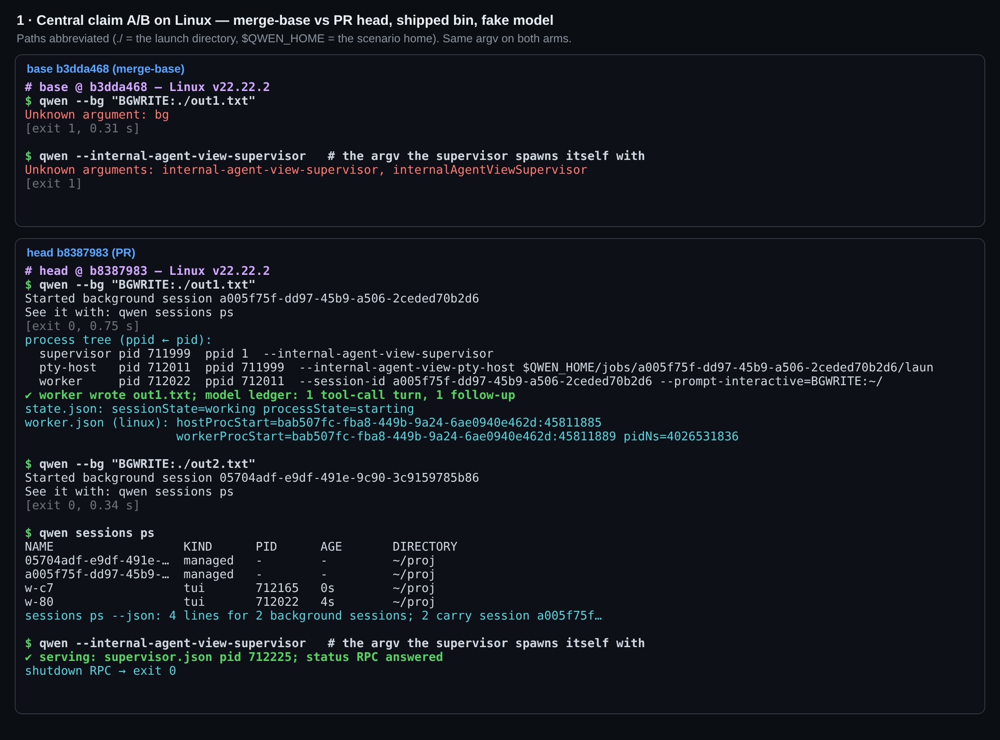
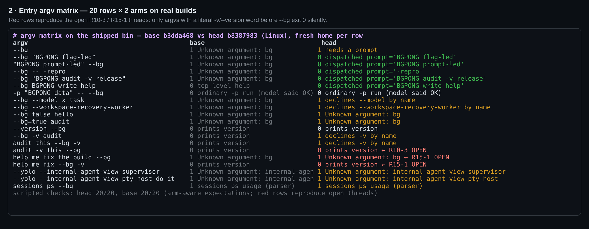
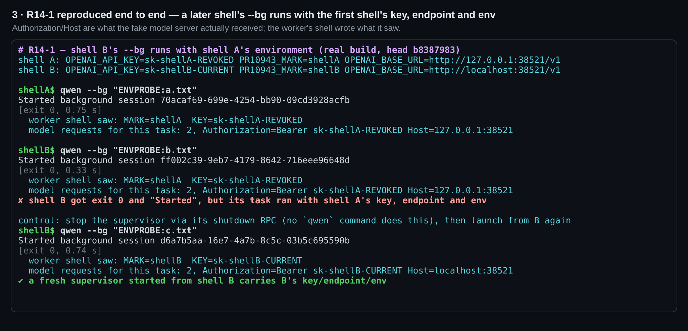
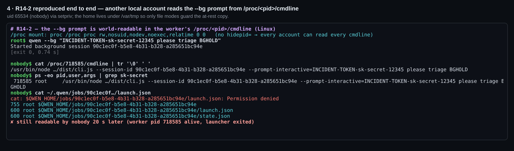
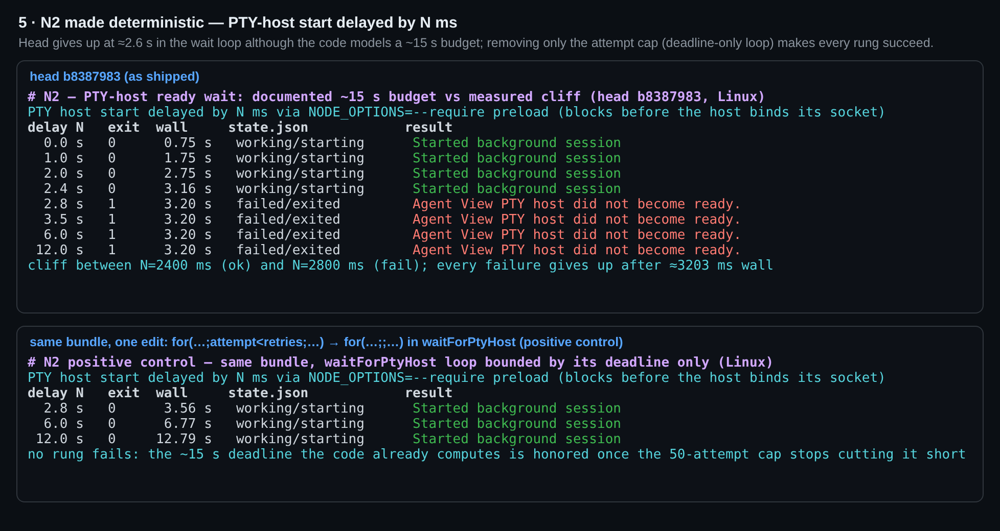
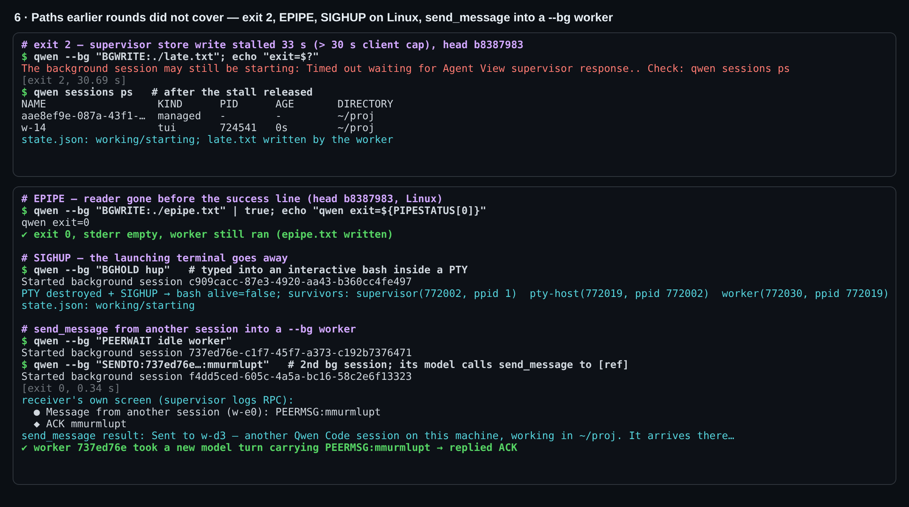
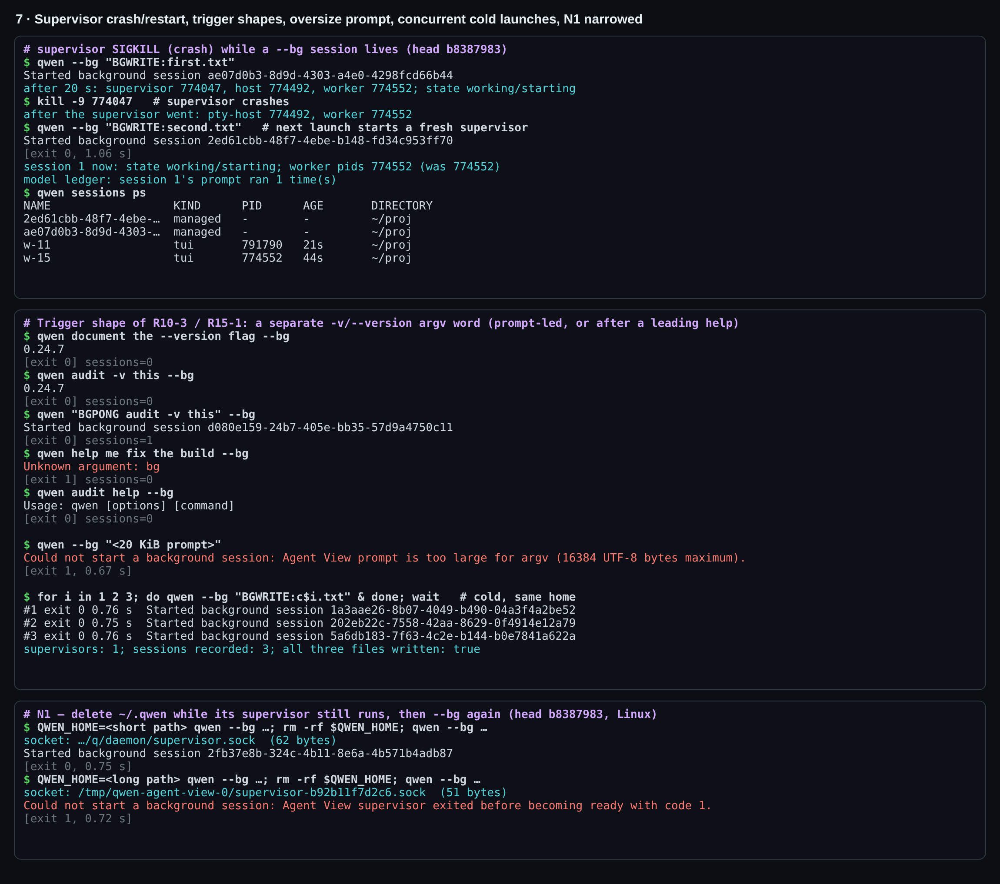
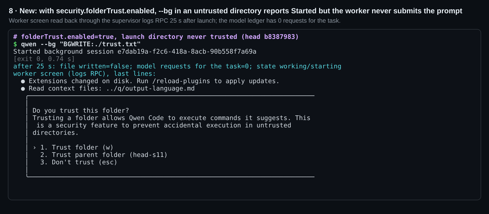

## 第三轮本地真实构建验证（Linux）—— head `b8387983`

**结论：功能在 Linux 上端到端可用；第二轮之后的两次 `main` 合并没有改变它的任何行为。五个未解决的 Critical 都在真实构建上复现了，其中 R10-3、R15-1 实际触发所需的 argv 比线程描述的少。在我驱动的范围内，没有崩溃，也没有任何 prompt 被执行两次。五个线程之外有一个新缺陷 N3：开启 folder trust（需主动启用）后，`--bg` 报告会话已启动，但 worker 从未提交 prompt。**

共执行 126 条脚本断言，125 条通过；唯一失败的那条是 N3 的复现，属于有意保留。两臂的构建和打包均通过。`packages/cli` 522/522，`cli-entry` 17/17。17 个改动代码文件的 eslint 无问题，19 个改动文件的 prettier 也无问题。该 head 上的 CI 全绿。

第 [1](https://github.com/QwenLM/qwen-code/pull/10943#issuecomment-5925453999)、[2](https://github.com/QwenLM/qwen-code/pull/10943#issuecomment-5952793894) 轮都在 macOS 上进行。本轮只报告它们没有覆盖的部分：

- Linux 平台。
- `ee479d9f` 之后的增量。
- 当前未解决的五个线程（R14-1、R14-2、R10-3、R15-1、R15-2）：这次做了端到端驱动，而不只是读代码。
- 第二轮列为「未覆盖」的路径。

### 环境

| | |
|---|---|
| 双臂 | **head** `b8387983`（PR head）与 **base** `b3dda468`（与 `main` 的 `git merge-base`），各自是独立的 detached worktree |
| 依赖 / 构建 | head 执行 `pnpm install --frozen-lockfile`。lockfile 完全一致，所以 base 通过 `cp -al` 复用同一份 `node_modules`。`npm run build && npm run bundle` 在两臂均 exit 0 |
| 入口 | 发布用的 bin `scripts/cli-entry.js` → `dist/cli.js`，不走 `packages/cli/dist` |
| 隔离 | 每个场景使用全新的 `HOME`/`QWEN_HOME`/`QWEN_RUNTIME_DIR`/cwd。环境变量从零重建：不带代理变量，也不继承 `QWEN_*`/`OPENAI_*` |
| 审批模式 | 场景 home 设置了 `tools.approvalMode: yolo`，因为 `ENVPROBE` 的 shell 调用需要它：默认模式下，worker 的 shell 调用会停在一个 CLI 目前还无法回应的审批上。N3 的对照 home 完全没有设置，即默认的 Auto 模式，其 worker 正常完成了写入 |
| 模型 | 仓库自带的 `integration-tests/fake-openai-server.ts`，外面包一层记录器：每个请求连同 `Authorization`、`Host` 头一起写入 JSONL 账本。回复按最后一条 user 消息里的标记决定：`BGWRITE:` → 一次 `write_file`；`ENVPROBE:` → 一次 shell 调用；`SENDTO:` → `send_message`；`BGHOLD` → 让这一轮一直不结束 |
| 主机 | Debian 13，Linux 6.12 x86_64，Node 22.22.2，以 root 运行；`/proc` 相关检查另用一个账号（uid 65534） |
| 合并等价性 | 与当前 `main`（`1a933f7b`）做 `git merge-tree` 无冲突，PR 的 19 个文件中有 18 个在合并结果里逐字节相同。`settings.md` 只差 main 自身的文档改动；自 merge-base 以来 main 也没有改动解析器选项。我预期这些结论同样适用于合并后的代码树，但没有重新构建验证。 |

**相对第二轮的增量**（`ee479d9f` → `b8387983`）：两次 `main` 合并。

- **`cli.ts` / `cli.test.ts`：** main 在 `runCliEntry` 顶部新增的 `--workspace-recovery-worker` 提前返回，以及对应的测试。
- **`settings.md`：** main 与本 PR 无关的 `tools.freeform` 段落和表格行。

`agent-view/**`、version 拦截和 `--bg` 门禁均逐字节未变，所以第二轮的变异结论依然成立，本轮没有重做。main 新增的这个 flag 在下面的矩阵里占一行。

### 1. 中心主张在 Linux 上的 A/B

- **Base：** `--bg` 报 `Unknown argument: bg`（exit 1），什么都没记录。supervisor 自己的 spawn argv 同样被拒，报 `Unknown arguments: internal-agent-view-supervisor`（exit 1）。4/4。
- **Head：** 18/18。启动 exit 0，输出恰好是文档里的两行。冷启动 **0.75 s**；supervisor 已在运行时 **0.34 s**，且复用了它（pid 相同）。
- **进程树：** supervisor（ppid 1）→ PTY host → worker，worker 以 `--session-id <id> --prompt-interactive=<prompt>` 启动。
- **worker 确实执行了 prompt：** 文件已写出，账本里恰好只有一轮工具调用。
- **状态：** `state.json` 为 `working`。Linux 上的 `worker.json` 带有 `hostProcStart`/`workerProcStart`/`pidNs`，所以第二轮的 O3（这些字段为 `null`）只出现在 macOS。
- **supervisor 裸 argv：** 直接启动后能正常服务，`status` RPC 有应答，`shutdown` 后 exit 0。

### 2. 入口 argv 矩阵（20 行 × 两臂）

每一行对两臂分别设定预期，两臂均 20/20 通过。

- **派发行：** 该派发的行全部派发，`launch.json` 里的 prompt 与预期一字不差。
- **拒绝：** 每个拒绝都点名了被拒的 flag，包括 main 新增的 `--bg --workspace-recovery-worker`。
- **解析器接管的启动：** R13-2 的两种 argv 在两臂报出相同的解析器错误；凡是由解析器接管的启动，行为都与 base 一致。
- **exit 0 但没有会话：** 除了本就如此设计的 `--version --bg` 与 `-p … -- --bg` 两行，只有两行红色（见下一节）。

### 3. 五个未解决的 Critical：端到端驱动

**R14-1：环境冻结在首次启动时。** 已复现，10/10（图 3）。

- **设置：** shell A 导出 `sk-shellA-REVOKED`，endpoint 为 `127.0.0.1`；shell B 导出 `sk-shellB-CURRENT`，endpoint 为 `localhost`。
- **结果：** B 的 `--bg` exit 0 并打印 "Started …"，但 B 的 worker 的 shell 打印出的仍是 A 的变量。模型服务器收到 B 这个任务时，带的是 **`Authorization: Bearer sk-shellA-REVOKED`**，发往的是 **A 的 host**，B 的 key 从未被发出。
- **对照：** 通过 supervisor 的 shutdown RPC 停掉它之后，B 的下一次启动带上了 B 的 key、host 和环境。没有任何 `qwen` 命令能停掉 supervisor，所以用户自己做不到这一步。原因就是 supervisor 被复用。

**R14-2：prompt 进入所有人可读的 argv。** 已复现，7/7（图 4）。

- **暴露：** 这里的 `/proc` 挂载没有 `hidepid`。以 uid 65534 执行 `cat /proc/<worker>/cmdline` 和 `ps -eo args`，都能看到 `INCIDENT-TOKEN-sk-secret-12345`。
- **持续时间：** 20 s 后启动器早已退出，复查 cmdline 时仍然可见。
- **范围：** 只有 worker 的 argv 带着 prompt，supervisor 和 host 的都没有。
- **落盘副本：** 权限为 `0600`，`nobody` 读取得到 `Permission denied`。对线程的一处更正：`jobs/<id>/` 创建时没有指定 mode，这里是 `755` 而不是 `0700`，起保护作用的是文件本身的权限。
- **长度上限：** prompt 被限制在 **16 KiB** 以内，也是这个 argv 通道造成的。20 KiB 的 prompt 会 exit 1，报 `Agent View prompt is too large for argv (16384 UTF-8 bytes maximum)`，而新文档没有提到这个上限。

**R10-3：prompt 开头的启动里出现 version 词。** 已复现。

- **结果：** `audit -v this --bg`，以及 bot 自己举的 `document the --version flag --bg`，都打印 `0.24.7`，exit 0，stderr 为空，不启动会话。
- **范围比线程里的包装器示例窄：** 线程写的是 `qwen "$TASK" --bg`，但带引号的 `$TASK` 是一个 argv 词，`qwen "audit -v this" --bg` 会正常派发。只有不加引号、被分词的 `$TASK`，或者一个字面的、独立的 `-v`/`--version` 词才会触发。
- **base：** 对 `audit -v this --bg` 同样打印版本号。新增的是 `--bg` 带来的退出码契约。

**R15-1：prompt 以 `help` 开头。** 只部分复现。

- **`help me fix --bg -v`：** 确实静默 exit 0，与线程一致。
- **首要示例 `help me fix the build --bg`：** 并*不*走 version 路由，而是明确报 `Unknown argument: bg`，exit 1，与 base 相同。线程自己的见证也写着 `STUB main() reached`。
- **因此：** 静默的情形需要一个 version 词；没有的话，缺陷只是 prompt 不能以 `help` 开头。
- **相关、属设计行为：** 以 `help` 结尾的 prompt 开头 argv（`audit help --bg`）会交给解析器，解析器打印 usage 并 exit 0，不启动会话。

**R15-2：一个会话在 `ps` 中出现两行。** 已复现。

- **结果：** 两个 `--bg` 会话在 `sessions ps` 中显示 4 行，`--json` 输出 4 条。每个 id 出现两次：一次是 `managed`（`PID -`），一次是带真实 pid 的 `tui`。
- **文档：** 「列为一条 `managed` 行」只描述了其中一半。
- 与第二轮的 O1 相同。

### 4. 遗留发现的重新测量

**N2：PTY host 就绪等待在远低于预算处就失败（图 5）。**

- **方法：** 用 `NODE_OPTIONS=--require` preload 让 PTY host 在绑定 socket 之前先阻塞 N ms。
- **head：** N ≤ 2.4 s 全部启动成功。N ≥ 2.8 s 全部在约 **3.2 s 墙钟** 时失败，报 `Agent View PTY host did not become ready.`，并记录为 `failed/exited`，N = 12 s 也一样。而代码注释写的是「~15 s 墙钟预算」。
- **正对照：** 对同一个 bundle 只改一处：把循环条件 `attempt<retries` 改成只受 deadline 约束。改完后 N = 2.8、6、12 s 全部启动（3.6 / 6.8 / 12.8 s）。所以过早结束等待的是 50 次的尝试上限：对一个还不存在的 socket，每次探测约 1 ms 就失败。
- **正对照没有证明的部分：** 我没有在这处改动上跑单测。同一个循环也服务 `connectAgentViewPtyHostProcess`（预算 10 × 300 ms）；在那条路径上去掉上限，探测一个已死的 host 会从约 0.5 s 变成约 3 s。所以修复可能只应作用于 spawn 路径，或者改为按已用时间计算尝试次数。
- **影响面：** 不注入延迟时，本机一次完整的冷启动只要 0.76 s，所以只有慢机器或高负载机器才会碰到这个断崖。代码来自 #7800，但 `--bg` 是第一个依赖它的用户路径。

**N1：范围收窄。**

- **会出问题的情况：** 在 supervisor 运行期间删掉 `QWEN_HOME`，只有当 socket 已回退到 home 之外时，下一次 `--bg` 才会失败；这发生在 home 路径较长时。此处 socket 位于 `/tmp/qwen-agent-view-0/supervisor-<digest>.sock`，下一次启动 exit 1，报 `supervisor exited before becoming ready with code 1`。
- **能恢复的情况：** 常见的短路径 `~/.qwen` 下，socket 在 home 里面，会随 home 一起被删除，下一次启动 exit 0。
- **运行次数：** 3/3 次有记录的运行结果一致。

**仍然成立、没有变化：**

- `--bg=true` 被解析器以 `Unknown argument: bg` 拒绝，而 `--help` 却列出了 `--bg [boolean]`。
- PR 描述仍是 `STATE working` 表格和「derived from the option tables」那句话，也仍写着没有跑过构建和类型检查。

### 5. 前几轮未覆盖或只在 macOS 上覆盖过的路径（图 6–8）

| 路径 | 结果 |
|---|---|
| **exit 2**（客户端超时） | 让 supervisor 在 `jobs/` 下的第一次存储 I/O 卡住 33 s，超过客户端 30 s 上限。启动器在 30.7 s 时 exit **2**，输出「may still be starting … Check: qwen sessions ps」。之后会话确实启动了，worker 也写出了文件，说明「仍在进行」的说法属实。6/6。小问题：消息里出现双句号（`…supervisor response.. Check:`），因为 reason 本身已以 `.` 结尾，又被追加了 `${reason}.` |
| **EPIPE** | `qwen --bg "…" \| true` exit 0，stderr 为空，worker 照常运行。3/3 |
| **Linux 上的 SIGHUP** | 在 PTY 中的交互式 bash 里输入 `--bg`，然后销毁 PTY。bash 退出，supervisor（被挂到 pid 1 下）、host、worker 全部存活，会话仍是 `working`。4/4 |
| **向 `--bg` worker 发送 `send_message`** | 第二轮只有注册表层面的证据。这次第二个 `--bg` 会话的模型对第一个 worker 的 `[ref]` 调用 `send_message`，工具返回 "Sent to w-…"。通过 `logs` RPC 读取接收方自己的屏幕，可以看到 `Message from another session (w-…): PEERMSG:…`，后面是它的模型的回复。4/4。范围说明：发送方必须有 inbox。交互式会话、ACP 会话和其他 `--bg` worker 都有；在一次调试探针中（不计入断言），headless 的 `qwen -p` 无法发送，报 "cross-session messaging is not active in this session"。 |
| **supervisor 崩溃 / 重启** | worker 空闲后，一次对 supervisor 执行 `kill -9`，另一次以 `keepWorkers` 方式 shutdown，然后再次启动。新的 supervisor 正常起来；第一个 worker 的 pid 不变，没有被重新 spawn，它的 prompt 也**没有重跑**（账本中仍只有 1 轮）。两种方式各 4/4 |
| **并发冷启动** | 在同一个全新的 home 里同时发起 3 次 `--bg`，全部在 0.75 s 内 exit 0。结果只有**一个** supervisor 和三个会话，三个都执行了。3/3 |

**新发现 N3：开启 folder trust 后，`--bg` 声称已启动的会话其实永远不会开始（图 8）。**

- **设置：** `security.folderTrust.enabled: true`，启动目录从未被信任过。
- **结果：** `qwen --bg "…"` exit 0，打印 "Started background session …"，记录状态为 `working`。25 s 后，模型收到的该任务请求数为**零**。通过 `logs` RPC 读取 worker 自己的屏幕，停在「Do you trust this folder?」对话框上。CLI 目前没有任何方式能回应它，所以任务永远不会执行，也没有任何地方提示这一点。
- **对照：** 同一个 home 关闭 folder trust 时，任务正常执行；完全没有选择 auth 类型、只在环境变量里提供 `OPENAI_*` 的 home 同样正常执行。
- **影响面：** folder trust 默认关闭，只影响主动开启的用户。
- **可能的防护：** folder trust 开启且目录未被信任时，`--bg` 直接用一句话拒绝。
- **现状：** bot 第 15 轮 review 把这个问题列为「未探查」。实测表明，信任对话框确实会阻塞 `--prompt-interactive` 的提交。

**常驻开销。** `--bg` 会话完成任务后不会退出，worker 一直停在输入提示处。本机上一个空闲 worker 约占 262 MB RSS，它的 PTY host 约 56 MB，另有共享 supervisor 约 160 MB。目前没有 stop 命令，所以这些内存会一直占着，直到手动 kill。

**另记一点（用户不可见）。** 任务完成、worker 空闲后，`sessionState` 仍为 `working`；worker 运行期间 `processState` 一直是 `starting`（R13-1 只推进了 `sessionState`）。本 PR 没有任何地方显示这两个字段，在我驱动的所有场景里（包括上面的重启）也没有因为它们而改变行为。bot 第 15 轮 review 推迟处理的一条相关提示指出：`working` 会否决 supervisor 的回收。

### 6. 门禁（Linux）

- **构建：** `npm run build`（全部 workspace 的 tsc）与 `npm run bundle` 在**两臂**均 exit 0。
- **`packages/cli` 单测：** `vitest run src/cli.test.ts src/agent-view/ src/commands/sessions/ src/config/top-level-options.test.ts` 在默认 pool 下 **20 个文件 522/522**。第二轮在 macOS 上报告 521，当时需要绕开 pool 问题；多出的 1 条是 main 的 recovery-worker 测试。
- **`cli-entry` 单测：** `scripts/tests/cli-entry.test.js` **17/17**。
- **lint：** 17 个改动代码文件的 `eslint --max-warnings 0` exit 0；19 个改动文件的 `prettier --check` exit 0。
- **`b8387983` 上的 CI：** 全绿，包括 `Test (ubuntu)`、`Lint & Static`、`Integration Tests (no-AK)`、`web-shell E2E Smoke` 及各 Java lane。macOS、Windows 的 `Test` lane 被跳过。

### 供合并决策参考

本 PR 要接的线是真实的，而且能用。没有这个 PR，supervisor 根本起不来；有了它，`--bg`：

- 能够启动，终端关闭后、supervisor 崩溃后都还在运行；
- prompt 恰好送达一次；
- 能接收其他会话发来的消息。

五个未解决的线程里，没有一个是崩溃，也没有一个是对现有路径的回归。我试过的所有不带 `--bg` 的 argv 都与 base 一致，只有两个内部 spawn argv 例外：它们现在按设计提供服务。这五个都是针对一个标注为 Experimental 的 flag 的契约与设计问题，现在都已实测。

如果决定接受风险合入，我仍希望以下几项随合并落地，或在合并后立即跟上：

- **R14-2：** 在文档中加警告，说明本机其他用户可以在进程列表里看到 prompt，写法参照 `serve` 对 `--token` 的提示；同一段里也写明 16 KiB 的上限。
- **R14-1：** 在文档中补一句：在 supervisor 退出之前，之后的 `--bg` 启动都会沿用第一次启动时的环境。
- **N3：** 至少写入文档，最好在启动时直接拒绝；在这个 flag 去掉 Experimental 之前处理掉。
- **N2：** 后续把 spawn 路径上的等待改为按时间限制，而不是按尝试次数。上面的对照已表明这就是关键所在。

R10-3、R15-1、R15-2 可以作为后续 issue 跟进：

- **R10-3 / R15-1：** 静默 exit 0 需要一个独立的 `-v`/`--version` argv 词：要么在 prompt 开头的启动里位于 `--bg` 之前，要么在 prompt 以 `help` 开头时出现在任意位置。
- **R15-2：** `ps` 重复行只是外观问题，但会让 `--json` 重复计数。

### 未覆盖

- macOS 与 Windows。macOS 已由第 1、2 轮覆盖。
- 真实的模型提供方；本轮只用了假模型。
- attach、reply、stop，这些属于 #7802 的范围。
- N2 在真实慢机器上的自然复现。本轮的断崖是人为注入的，但数值精确；第二轮曾在 macOS 的一次 spawn 卡顿中自然遇到过。
- 针对 N2 那处改动的单测。

### 方法

- **harness：** 全部是带 PASS/FAIL 断言的脚本。每个场景都用全新的 home，残留进程按记录下的 pid 清理。
- **重跑：** 核心 A/B、矩阵的 base 臂、N2、send_message 和触发形态这几个场景，在修复 harness 后重跑过。上文的数字都来自完整的运行。
- **故障注入：** 一个约 50 行的 `--require` preload，只按进程自身的 argv 生效。它要么延迟 PTY host 的启动，要么让 supervisor 在 `jobs/` 下的第一次存储调用卡住。
- **正对照：** 在 head bundle 的硬链接副本里做一处字符串替换。head 本身的文件没有改动；副本是独立的 inode，已确认。
- **证据：** 各 harness、每个场景的 JSON 结果、N1 的运行日志，以及每张图背后的原始 ANSI 记录，都在[证据目录](.)中。
