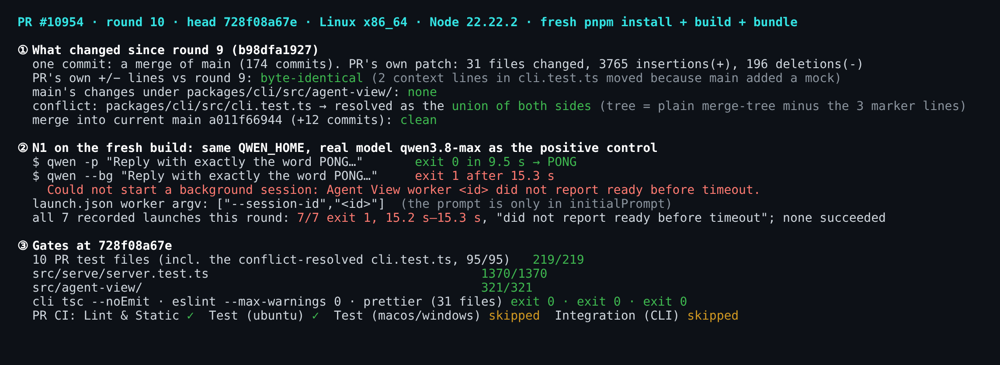
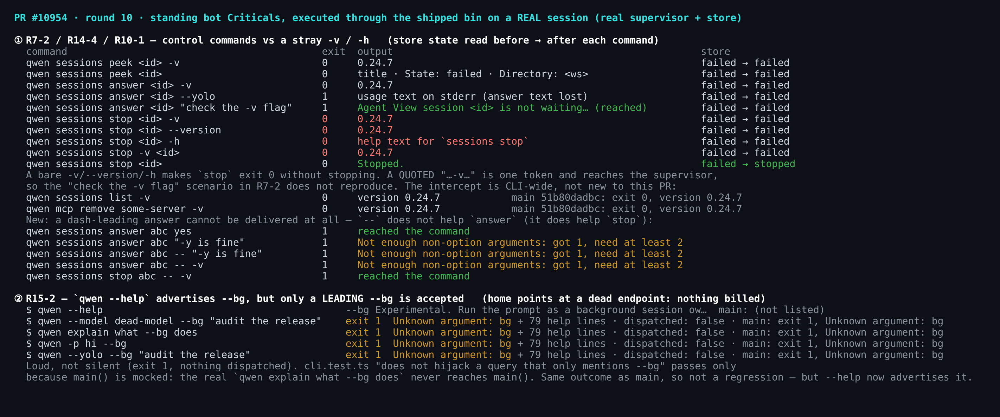
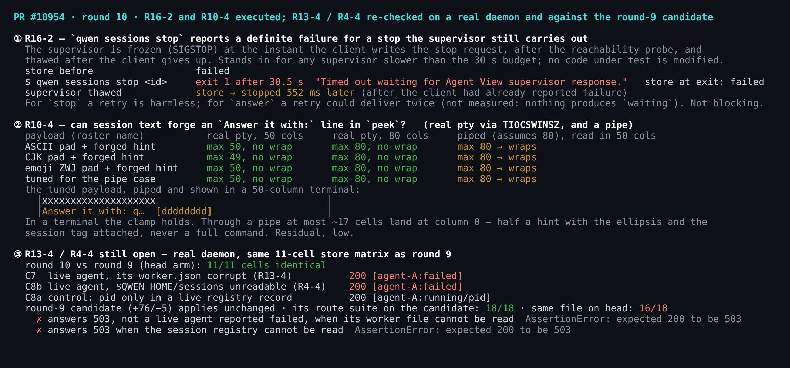

# PR #10954 deep verification (round 10, local, Linux x86_64)

Head `728f08a67eaf31075dc1b78b68afddb4841e2c21`. Round 9 verified `b98dfa1927`. This round used Linux x86_64 (Debian, kernel 6.12, Node v22.22.2). The worktree was installed fresh with `pnpm install --frozen-lockfile` (46 s), then `npm run build` and `npm run bundle`; all three exited 0. The runs used:

- real `qwen serve` daemons
- a real supervisor
- the shipped bin (`scripts/cli-entry.js`)

Every harness ran in its own scratch `QWEN_HOME`. The real model **qwen3.8-max** was used only for a one-prompt positive control.

This is a **delta round**. Rounds 1–9 are linked from the PR thread. Below, "round 9" means comment 5885256049 and evidence directory `pr-10954-round9/`.

## Figures

## Delta under test

| Item | Result |
| --- | --- |
| Commits since round 9 | one: `728f08a67e`, a merge of `main` `b3dda468f2` (174 commits) |
| PR's own patch | 31 files, +3765/−196. Every `+`/`−` line is byte-identical to round 9. Only two **context** lines in `cli.test.ts` moved, because `main` added a mock next to them |
| `main`'s changes under `packages/cli/src/agent-view/` | none |
| Conflicts | `packages/cli/src/cli.test.ts`. It was resolved as the union of both sides: the PR's three Agent View mocks plus `main`'s `runWorkspaceRecoveryWorker` mock. The commit's tree equals the conflicted `git merge-tree --write-tree b98dfa1927 b3dda468f2` result with only the 3 marker lines removed |
| Merge into current `main` `a011f66944` (12 commits ahead) | clean |

The author's four "Closed at head `728f08a67e`" replies (2026-10-02) cite fixes from `ec7f7aefcd`. Round 9 verified that commit item by item, and none of these replies adds code.

## N1: unchanged

`r9-02-e2e-n1.mjs` (unchanged from round 9) runs the Reviewer Test Plan through the shipped bin:

- **Model control.** `qwen -p "Reply with exactly the word PONG…"` with the same `QWEN_HOME` printed `PONG`, exit 0, in 9.5 s.
- **Launch.** `qwen --bg "…"` exited 1 after 15.3 s with `Could not start a background session: Agent View worker <id> did not report ready before timeout.`
- **Store.**
  - `state.json`: `failed` / `exited`, `lastError.code = pty_launch_failed`
  - `launch.json` worker argv: `[node, dist/cli.js, --session-id, <id>]`; the prompt is only in `initialPrompt`
  - `worker.json`: no pids left
- **Route and CLI.** The route reported the row as `failed`. `qwen sessions ps` agreed. `sessions stop` then succeeded, and the route reported `stopped`.
- **Tally.** All 7 recorded launches this round exited 1 in 15.2–15.3 s with the same message: e2e 1, `r9-08` tally 4, and one each in the control-flag and stop probes. None succeeded.

Mechanism, read at head: `supervisor-process.ts` dispatches with `promptInArgv: !shouldWaitForWorkerReady(this.options)`. When the supervisor waits for a worker `ready`, the prompt is therefore not on the worker's argv. Nothing outside tests sends `ready`. `worker-sideband.ts` exports the senders: `sendAgentViewWorkerEvent`, the state reporter and the heartbeat. A search of every package finds no caller outside `*.test.ts`.

## Gates at `728f08a67e`

| Check | Result |
| --- | --- |
| 10 PR test files (`background-entry`, `supervisor-dispatch`, `supervisor-runner-handle`, `sessions`, `control-commands`, `managed-control`, `managed-rows`, `ps`, `background-agents`, `cli`) | **219/219** |
| … of which the conflict-resolved `src/cli.test.ts` | 95/95, including `main`'s "runs private recovery before inherited updates…" and all of the PR's Agent View intercept cases |
| `src/serve/server.test.ts` | **1370/1370** |
| `src/agent-view/` | **321/321** |
| cli `tsc --noEmit`; eslint `--max-warnings 0`; prettier `--check` on the 31 files | exit 0, exit 0, exit 0 |
| PR CI at `728f08a67e` (run 37011383612) | Lint & Static ✓, Test (ubuntu) ✓, web-shell E2E ✓; Test (macOS), Test (Windows) and Integration Tests (CLI, No Sandbox) skipped |

## R13-4 and R4-4: still open

`r9-01-store-matrix.mjs` (unchanged) re-ran the 11-cell store matrix with a real daemon per cell. The results are **11/11 identical to round 9's head arm**:

| Cell | Round 10 |
| --- | --- |
| C7 live agent, its `worker.json` corrupt (R13-4) | **200 `failed`**, no pid |
| C8a control: pid only in a live registry record | 200 `running` + pid |
| C8b same store, `$QWEN_HOME/sessions` unreadable (R4-4) | **200 `failed`** |
| C9 registry unreadable, `worker.json` has the live pid | 200 `running` + pid |
| C2–C5 strict-read cells | 503 |

The round-9 candidate ([`candidate.patch`](../pr-10954-round9/candidate.patch), +76/−5) **applies unchanged**. The three files it touches are byte-identical to round 9. Results:

- On a hard-linked candidate arm, its route suite passes 18/18.
- The same test file on head passes 16/18. The two failures are exactly the R13-4 and R4-4 cases: `answers 503, not a live agent reported failed, when its worker file cannot be read` and `answers 503 when the session registry cannot be read`, both `expected 200 to be 503`.

## Standing bot Criticals, executed on a real build

Round 17 of the bot review (2026-10-02, review 5396000674) re-traced 18 Criticals against `728f08a67e`, but it executed none of them; its "Not reviewed" list says verification never ran. I executed the six below through the shipped bin. None had been run on a real build before. Each probe is in `harness/`, and its raw output is in `data/`.

### R7-2 / R14-4: version/help tokens in `sessions peek|answer|stop` — real, narrower than filed

`r10-02-control-flags.mjs` takes a **real recorded session**: the `--bg` launch leaves the session, the supervisor and the store behind under N1. It runs each spelling and reads `state.json` before and after each command.

| Command | Exit | Output | Store |
| --- | --- | --- | --- |
| `qwen sessions stop <id> -v` | **0** | `0.24.7` | `failed → failed` |
| `qwen sessions stop <id> --version` | **0** | `0.24.7` | `failed → failed` |
| `qwen sessions stop <id> -h` | **0** | help for `sessions stop` | `failed → failed` |
| `qwen sessions stop -v <id>` | **0** | `0.24.7` | `failed → failed` |
| `qwen sessions stop <id>` | 0 | `Stopped.` | `failed → stopped` |
| `qwen sessions peek <id> -v` / `answer <id> -v` | 0 | `0.24.7` | unchanged |
| `qwen sessions answer <id> "check the -v flag"` | 1 | `Agent View session <id> is not waiting…` (**reached the supervisor**) | unchanged |

- A bare `-v`/`--version`/`-h` makes a destructive `stop` exit 0 without stopping.
- The quoted scenario in R7-2 (`answer <id> "check the -v flag"`) **does not reproduce**. The shell passes it as one token, and the token reached the supervisor.
- The intercept is CLI-wide, not new. `r10-06-version-scope.mjs` on a `main` build without this PR (`51b80dadbc`): `qwen sessions list -v` and `qwen mcp remove some-server -v` both print `0.24.7` and exit 0, the same as on head.

### R10-1: dash-leading answer text — the `-v` half is real, the `--yolo` half now exits 1

- `qwen sessions answer <id> -v` → `0.24.7`, exit 0. The text is lost.
- `qwen sessions answer <id> --yolo` → usage error, **exit 1**. R10-1 says exit 0; that is not what this head does.
- **New:** no spelling delivers a dash-leading answer. With no supervisor in the home, a reached command answers "Cannot reach the Agent View supervisor":
  - `answer abc yes` → reached
  - `answer abc "-y is fine"`, `answer abc -- "-y is fine"` and `answer abc -- -v` → `Not enough non-option arguments: got 1, need at least 2`, exit 1
  - `stop abc -- -v` → reached, so `--` works for `stop` but not for `answer`
- In practice this is unreachable today: nothing produces `waiting` (R14-5), so `answer` has no target.

### R15-2: `--help` advertises `--bg`, but only a leading `--bg` is accepted — real, not a regression

`r10-03-bg-position.mjs` points the home at a dead local endpoint (`127.0.0.1:9`), so nothing could reach a model.

| Command | Head | `main` `51b80dadbc` |
| --- | --- | --- |
| `qwen --help` | lists `--bg  Experimental. Run the prompt as a background session…` | not listed |
| `qwen --model dead-model --bg "audit the release"` | exit 1, `Unknown argument: bg` + help on stderr | same |
| `qwen explain what --bg does` | exit 1, `Unknown argument: bg` | same |
| `qwen -p hi --bg` | exit 1, `Unknown argument: bg` | same |
| `qwen --yolo --bg "audit the release"` | exit 1, `Unknown argument: bg` | same |

It fails loudly, and nothing is dispatched. The `cli.test.ts` case "does not hijack a query that only mentions --bg" passes only because `main()` is mocked: the real `qwen explain what --bg does` never reaches `main()`. The behaviour equals `main`, so this is a help/doc mismatch rather than a regression.

### R16-2: a control command reports a definite failure for a mutation the supervisor still performs — reproduced on real processes

`r10-04-stop-ambiguous.mjs` gets a real session, then runs `qwen sessions stop <id>` with a client-side `--require` preload. When the client writes the `stop` request, after the reachability probe has passed, the preload SIGSTOPs the supervisor. The harness SIGCONTs it after the client exits. Nothing in the code under test is modified. This stands in for any supervisor slower than the 30 s budget.

| Moment | Observation |
| --- | --- |
| before | store `failed` |
| client | **exit 1 after 30.5 s**, `Timed out waiting for Agent View supervisor response.`; store still `failed` |
| 552 ms after thaw | store **`stopped`**; `sessions ps --json` shows `taskState: stopped` |

The client calls the stop failed, but the stop happens. For `stop`, a retry is harmless. For `answer`, a retry after the same failure could deliver the answer twice. I did not measure that, because nothing produces `waiting`. Reaching this needs a supervisor that takes longer than 30 s.

### R10-4: forged continuation through `peek` — not reproduced in a terminal

`r10-05-peek-wrap.mjs` sets up the probe like this:

- **Sessions.** Each is written with the arm's own store writers, and its roster name is padding followed by `Answer it with: qwen sessions answer deadbeef "yes, delete it"`. The padding is ASCII, CJK, emoji ZWJ sequences, or a pipe-tuned variant.
- **Runs.** Each `qwen sessions peek` runs through the shipped bin inside a **real pty** sized with `TIOCSWINSZ`, and once more through a pipe.

| Payload | pty 50 cols | pty 80 cols | piped (assumes 80), read in 50 cols |
| --- | --- | --- | --- |
| ASCII pad | max 50, no wrap | max 80, no wrap | wraps |
| CJK pad | max 49, no wrap | max 80, no wrap | wraps |
| emoji ZWJ pad | max 50, no wrap | max 80, no wrap | wraps |
| tuned for the pipe | max 50, no wrap | max 80, no wrap | wraps → `Answer it with: q…  [dddddddd]` at column 0 |

In a terminal, the clamp holds: `sanitizeTerminalText` strips CR and C0/C1, and `truncateToWidth` is grapheme- and width-aware. The only residual is piped output read in a terminal narrower than 80 columns. There, at most ~17 cells of session text land at column 0, with the ellipsis and the session tag attached. That is half a hint, never a command. Low.

### Where these sit

None of these six findings touches the route-only split: they live in `--bg` and `sessions peek|answer|stop`, which the split leaves out.

## For the merge decision

- **As the whole stack: do not merge while N1 stands.** The only change since round 9 is a merge of `main`, which touches nothing under `agent-view/`. N1 reproduces on a fresh build, and the (a)/(b)/(c) choice from round 8 is unchanged.
- **The merge itself is sound.** Its one conflict is resolved correctly, and every gate is green at the new head.
- **The route-only split plus the round-9 candidate remains the landable path.** R13-4 and R4-4 are still open at this head, and the candidate still closes both.
- **The six bot Criticals executed here are real but narrow, or not reproducible as filed.** I do not think any of them blocks on its own, and none applies to the split. Worth a follow-up:
  - R15-2: `--help` vs the parser
  - R16-2: ambiguous transport failures in the control commands
  - the dash-leading `answer` text

## Not covered

- macOS and Windows (rounds 2–8 ran on macOS).
- The route-only split was not rebuilt on this `main`. Its 8 files are byte-identical to round 9, but `main` moved 174 commits.
- The candidate was checked at unit level only this round. Round 9 proved it on a real daemon, and the files are identical.
- Bot Criticals not executed this round: R16-1/R14-3 (need a supervisor that answers a dispatch without an id), R14-1 (duplicate-claim state), R4-6, R13-2, and R7-8/R14-5 (docs; static).
- Billing: one `qwen -p` prompt to qwen3.8-max. Under N1, `--bg` launches never reach the model.

## Files

- `harness/`: every script. `lib.mjs`, `e2e-lib.mjs`, `r9-01`, `r9-02` and `r9-08` are reused from round 9, with a `main` arm added to `lib.mjs`. `r10-02` … `r10-06` are new.
- `fig/`: builds the figures from the recorded JSON and renders them with xterm.js.
- `data/`: every recorded result. It holds no scratch `QWEN_HOME`.
