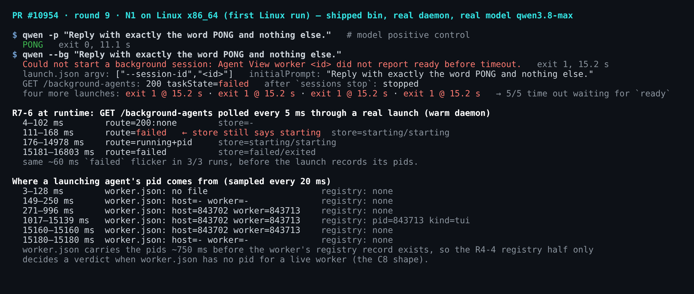
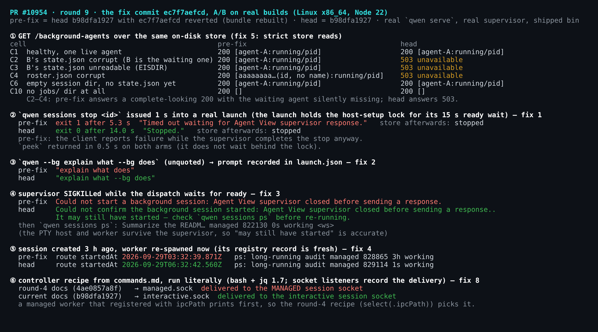
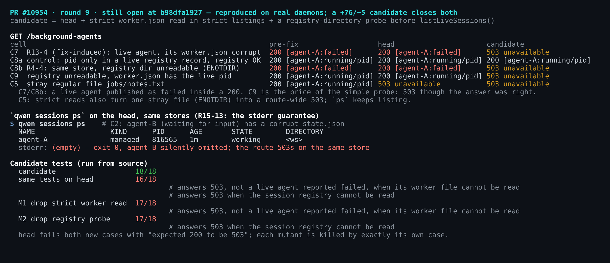
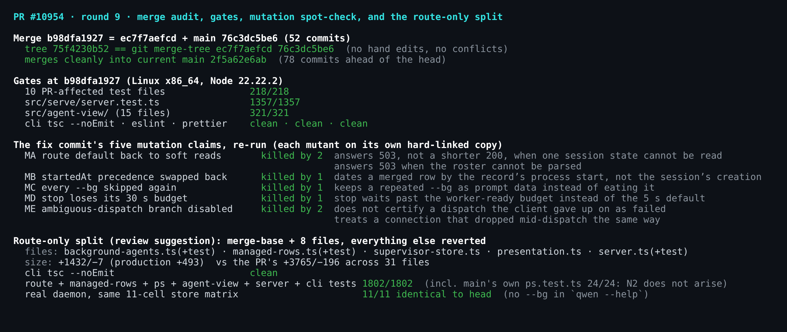

# PR #10954 深度验证（第九轮，本地，Linux x86_64）

Head 为 `b98dfa1927fc7ff54c2ad2ecaedd3b4b27123744`，第八轮验证的是 `4ae0857a8f`。第 1–8 轮都在 macOS arm64 上跑，每一轮都把 Linux 列为「未覆盖」。本轮在 Linux x86_64 上验证（Debian，内核 6.12，Node v22.22.2），全新执行 `pnpm install --frozen-lockfile`、`npm run build`、`npm run bundle`，全部 exit 0。用到的都是真实组件：`qwen serve` daemon；经发布的 bin 入口（`scripts/cli-entry.js`）执行的 `qwen --bg`；真实 supervisor；以及作为阳性对照的真实模型 **qwen3.8-max**。每个装置都使用独立的临时 `QWEN_HOME`。

## 本轮待验证的增量

| 提交 | 内容 | 审计 |
| --- | --- | --- |
| `ec7f7aefcd` | autofix 轮次：10 个文件，+339/−17。涉及 stop/peek 超时预算、重复 `--bg`、派发不确定失败的提示、合并行 `startedAt`、存储严格读取，以及 3 处文档 | 下文逐项 A/B |
| `b98dfa1927` | merge main `76c3dc5be6`（52 个提交） | 其 tree `75f4230b52` 与 `git merge-tree --write-tree ec7f7aefcd 76c3dc5be6` 完全相同，说明合并是机械合并，没有手工改动 |

`ec7f7aefcd` 里把 `readJsonRecordForConditionalWrite` 改名为 `readJsonRecordStrict`，函数体逐字节相同，是纯改名，supervisor 的条件写入行为不变。head 与当前 main `2f5a62e6ab`（领先 78 个提交）合并无冲突。

**对照臂说明**：
- head 臂：`b98dfa1927`。
- 修复前臂：在 head 上 revert `ec7f7aefcd`（`git revert -n` 可干净应用）并重建 bundle，使每组 A/B 只差这一个提交。
- 候选臂：head 加上下文的补丁。
- 拆分臂：合并基点加上路由的 8 个闭包文件。

除 head 外，各臂都是硬链接副本，改动文件前先断开硬链接；每一步之后 head 的 `git status` 都是干净的。

## 发现状态

| # | 发现 | 第八轮 | 第九轮（`b98dfa1927`） | 证据 |
| --- | --- | --- | --- | --- |
| **N1** | `--bg` 永远无法完成（生产代码没有 `ready` 产出方） | 成立，阻塞 | **成立，阻塞，Linux 上同样复现** | 5/5 次真实启动在 15.2 秒超时；argv 仍只有 `--session-id <id>` |
| 修复 1（R13-1） | stop/peek 客户端先超时，服务端却已完成 | 未修 | **已修复** | 修复前：stop 在 5.3 秒后 exit 1，存储最终为 `stopped`；head：14.0 秒后 exit 0 |
| 修复 2 | 重复的 `--bg` 被从 prompt 中吃掉 | 未修 | **已修复** | `explain what does` → `explain what --bg does` |
| 修复 3（R10-7） | 连接中断被报告为确定的失败 | 未修 | **已修复** | 派发中途 SIGKILL supervisor，提示变为「可能已启动」 |
| 修复 4（R13-3） | 合并行按会话创建时间标注 | 未修 | **已修复** | 路由/ps：3 小时 → 刚刚 |
| 修复 5（R13-4 / F1 存储半侧） | 部分可读的存储返回看似完整的 200 | 成立（F1） | **已修复** | 单元格 C2–C4：缺了等待中 agent 的 200 → 503 |
| 修复 8（R9-1） | 控制器接入配方 | 第四轮判「已修」 | **现在才真正修复，第四轮判断有误** | 第四轮的配方会投递到 **managed** 会话的 socket |
| **R13-4（修复引入）** | `worker.json` 仍走宽松读取 | 新（bot） | **真实 daemon 复现** | 活着的 agent → 200 `failed`，没有 pid |
| **R4-4（registry 半侧）** | registry 不可读 → 活着的 agent 被报 `failed` | 未修（doudouOUC） | **复现，并测量了触发面** | 200 `failed`；仅当 `worker.json` 没有 pid 时 registry 才决定判定 |
| R7-6 | 启动窗口被报成 `failed` | 未修（bot） | **运行时确认** | 约 60 ms 的 `failed` 闪烁，3/3 次 |
| R15-13 | 单条记录读失败时 `ps` 静默少列 | 未修（bot） | **运行时确认** | exit 0，stderr 为空，等待中的 agent 不见了 |
| R14-2 | 以短横线开头的词被拒绝，但提示不提 `--` | 未修（bot） | **运行时确认** | 提示为 "Re-run without it." |
| N2 | 重新放大 #10942 的 `sessions ps` | 待维护者决定 | 不变（`ps.ts` 未改） | 拆分形态下不出现 |
| F3 | 没有 capability 标记 | 成立 | 成立 | `capabilities.ts` 里没有相关条目 |
| R6-1 | 信任范围 | 已修 | 仍修复（静态核对） | 路由范围代码自 `420ab834` 以来未变；`server.ts` 只有合并带来的行移动 |

## N1：没有变化，Linux 上同样复现

`r9-02-e2e-n1.mjs` 经发布的 bin，按 Reviewer Test Plan 逐步执行：

- **模型阳性对照**：同一个 `QWEN_HOME` 下执行 `qwen -p "Reply with exactly the word PONG…"`，11.1 秒输出 `PONG`，exit 0。
- **后台启动**：`qwen --bg "…"` 在 15.2 秒后 exit 1，报错 `Could not start a background session: Agent View worker <id> did not report ready before timeout.`
- **真实的 `launch.json`**：worker 的 argv 是 `[node, dist/cli.js, --session-id, <id>]`，prompt 只出现在 `initialPrompt` 字段里。
- **超时之后**：路由把这一行报告为 `failed`；执行 `sessions stop` 后路由报告 `stopped`。
- **统计**：`r9-08-n1-tally.mjs` 又连续启动 4 次，全部在 15.17–15.24 秒 exit 1，合计 **5/5**。本轮其他所有启动（stop/peek 探针、启动窗口轮询、pid 来源采样）也都以同样的超时结束，没有一次成功。

文档 `commands.md:775-779` 仍然展示 `# Started background session 0f8e...c31`。

## 修复提交 `ec7f7aefcd` 逐项验证（修复前臂 vs head）

1. **启动期间执行 stop**（`r9-03-stop-during-launch.mjs`）。真实启动在整个 15 秒 ready 等待期间都持有该会话的 host-setup 锁，所以借助 N1 就能复现，不需要假 supervisor。在启动开始后约 1 秒执行 `qwen sessions stop <id>`：
   - 修复前：5.3 秒后 exit 1，输出 `Timed out waiting for Agent View supervisor response.`，但存储最终是 `stopped`，说明客户端放弃之后 stop 仍然生效，正是 R13-1 描述的情形。
   - head：14.0 秒后 exit 0，输出 `Stopped.`。
   - `peek` 在两臂都 0.5 秒返回：它并不排在锁后面，因此加大超时预算无害，但在这条路径上并不需要。
2. **重复 `--bg`**（`r9-04-entry.mjs`）。对未加引号的 `qwen --bg explain what --bg does`，`launch.json` 里记录的 `initialPrompt`：
   - 修复前：`"explain what does"`
   - head：`"explain what --bg does"`

   加引号的写法两臂相同。
3. **派发中途杀掉 supervisor**。在 ready 等待开始 1.5 秒后 SIGKILL supervisor：
   - 修复前：`Could not start a background session: Agent View supervisor closed before sending a response.`
   - head：`Could not confirm the background session started: … It may still have started — check qwen sessions ps before re-running.`

   这个「可能已启动」的说法是准确的：PTY host 和 worker 在 supervisor 死后仍然存活，`ps` 显示该会话为 `working` 且 pid 存活。按恢复路径操作：下一次 `qwen --bg` 会拉起新的 supervisor，之后 `qwen sessions stop <id>` 能在 10 秒优雅停止窗口内结束这两个孤儿进程（3 秒时仍在，15 秒时已消失）。小问题：原因字符串本身以句号结尾，拼接后输出成 `response..`。
4. **合并行的时间标注**（`r9-05-rows.mjs`）。会话创建于 3 小时前，worker 刚刚重新拉起，已登记到 registry，`worker.json` 也记录了它的 pid：
   - 修复前：路由 `startedAt` 取会话创建时间，`ps` 的 AGE 为 `3h`。
   - head：路由 `startedAt` 取进程启动时间，`ps` 的 AGE 为 `1s`。
5. **存储严格读取**（`r9-01-store-matrix.mjs`，每个单元格起一个真实 daemon）。对比体现在修复前臂上：C2（B 的 `state.json` 损坏，B 是正在等待的 agent）、C3（EISDIR）、C4（roster 损坏）都返回 200，但 B 被静默丢掉，或名字丢失。head 上这三格都返回 503 `background_agents_unavailable`。C1（正常）、C6（会话目录为空）、C10（没有 `jobs/`）两臂都保持 200。
6. / 7. **文档**：没有 registry 记录的失败会话，其真实 `ps --json` 行里没有 `pid`/`startedAt`，与文档改为「按条件出现」后的表述一致。
8. **控制器配方原样执行**。用 bash、真实 `jq` 1.7，外加一个指向该臂 bin 的 `qwen` 薄包装；两个会话的 `ipcPath` 上各挂一个 Unix socket 监听器，记录消息实际投递给了谁。
   - 当前配方 `select(.managed == false and .ipcPath)` 投递给交互会话。
   - **更正我第四轮的结论**：当时我用配方 `select(.ipcPath) | .ipcPath | head -1` 判定 R9-1 已修复，但那次的存储里没有「本身也有 registry 记录的 managed 会话」。当 managed worker 带着 `ipcPath` 登记时（当前文档特别点出的情形），那条配方解析到的是 managed 会话的 socket，监听器也确实在那里收到了控制器消息。当前文档才真正修好。

**`ec7f7aefcd` 自称的变异检验，重跑结果**（每个变异体都在独立的硬链接副本上运行）：

| 变异 | 被哪些测试杀死 |
| --- | --- |
| 路由默认值改回宽松读取 | 两个真实存储的 503 用例 |
| `startedAt` 优先级换回原来的顺序 | 合并行时间用例 |
| 恢复为跳过所有 `--bg` | 重复 `--bg` 用例 |
| `stop` 失去 30 秒预算 | stop 预算用例 |
| 禁用派发不确定分支 | 两个新增的派发用例 |

五条声明全部成立。

## 当前 head 上仍未关闭：R13-4（修复引入）与 R4-4（registry 半侧）

`r9-01-store-matrix.mjs` 用各臂自己的存储写入函数构造存储。需要存活的 registry 记录时，由一个子进程通过 core 的 `registerSession` 为自己登记。然后每个单元格各起一个真实 daemon。

| 单元格 | 修复前臂 | head | 候选臂 |
| --- | --- | --- | --- |
| C7 agent 存活，但其 `worker.json` 损坏（R13-4） | 200 `failed`，无 pid | **200 `failed`，无 pid** | 503 |
| C8a 对照：pid 只存在于存活的 registry 记录中 | 200 `running` + pid | 200 `running` + pid | 200 `running` + pid |
| C8b 同一份存储，`$QWEN_HOME/sessions` 不可读（ENOTDIR）（R4-4） | 200 `failed` | **200 `failed`** | 503 |
| C9 registry 不可读，但 `worker.json` 里有存活 pid | 200 `running` + pid | 200 `running` + pid | 503（简单探测的代价） |
| C5 `jobs/` 下有一个多余的普通文件 `notes.txt` | 200 | 503（ENOTDIR） | 503 |

**R4-4 的触发面**（`r9-07-pid-source.mjs`，一次真实启动中每 20 ms 采样一次）：

| 启动后 | `worker.json` | registry |
| --- | --- | --- |
| 约 271 ms | 已记录 host 和 worker 的 pid | 还没有记录 |
| 约 1017 ms | 同上 | worker 自己的记录出现 |

因此只有当某个存活 worker 在 `worker.json` 里没有 pid 时，registry 才会决定判定结果，也就是 C8 那种形态：无 pid 的派发窗口，或 `worker.json` 不可读。这比「registry 退化就会把活着的 agent 报成 failed」的一般说法要窄，但确实存在，而且路由会以 200 发布这个错误结论。

**候选修复：+76/−5，涉及 3 个文件，可干净应用到 `b98dfa1927` 和拆分臂**（`candidate.patch`）：
- `supervisor-store.ts`：严格列表时，`worker.json` 也严格读取，并更正注释，写明 worker 文件为何与 launch/activity 不同。
- `background-agents.ts`：默认的 `listRecords` 先 `readdir` 一次 `getSessionRegistryDir()`，除 ENOENT 以外的错误都抛出，走已有的 503 路径。`listLiveSessions` 对交互式调用方「永不抛错」的约定保持不变。
- 3 个路由测试：
  - worker 文件不可读 → 503
  - registry 不可读 → 503
  - registry 不存在 → 200（ENOENT 对照）

结果：

| 检查 | 结果 |
| --- | --- |
| 候选臂路由套件 | 18/18 |
| 同一测试文件放到 head 上 | 16/18，两个 503 用例都失败：`expected 200 to be 503` |
| 变异：去掉 worker 严格读取 | 恰好杀死 worker 用例 |
| 变异：去掉 registry 探测 | 恰好杀死 registry 用例 |
| 路由 + `server.test.ts` + `agent-view/` + `commands/sessions/` | 1828/1828 |
| cli `tsc`、eslint、prettier | 全部通过 |
| 真实 daemon | C7、C8b → 503；C8a 对照仍为 200 |

代价：C9 也变成 503，尽管 head 在这一格的回答本来是正确的。若在意这一点，可以把探测收窄为「只有 reconcile 翻转了某行时才失败」。这个变体我没有实测。

## 运行时观察（非阻塞）

- **R7-6**：`r9-06-launch-window.mjs` 在 daemon 预热后，于一次真实启动中每 5 ms 轮询一次路由。新 agent 在 111–170 ms 显示为 `failed`，而此时存储仍是 `starting/starting`；之后显示 `running` + pid，直到超时。3/3 次都出现。在本机上这个窗口约 60 ms，但轮询型客户端（例如计划中的 Web Shell 面板）有可能恰好读到。
- **R15-13**：在单元格 C2 的存储上，经 bin 执行 `qwen sessions ps`，只列出 agent-A，exit 0，stderr 为空；等待中的 agent-B 被静默省略，而同一份存储上路由返回 503。`commands.md:874-877` 承诺会在 stderr 给出原因。PR 声称 CLI 与路由「不会对同一会话给出两种说法」，在存储部分可读时这一点不成立。
- **全有或全无的 503**：严格读取会让任何一条坏记录都使整个路由 503，直到有人修复。例如 `jobs/` 里一个多余的普通文件（ENOTDIR），或长期保留、从不清理的已结束会话中某个文件损坏。`ps` 和修复前臂则照常列出。这与文档契约一致，但值得有意识地做个决定，比如跳过非目录条目，或在列表中带一个明确的「不完整」标记。
- **R14-2**：`qwen --bg tune the -O2 flag` 输出 `qwen --bg runs only the prompt and does not honor -O2. Re-run without it.`，没有提到可用的 `--` 写法（`qwen --bg -- "-O2 tune the flag"` 会派发 `-O2 tune the flag`）。

## 仅路由拆分（评审建议）的实测

拆分臂以合并基点 `76c3dc5be6` 为基础，只从 head 取以下 8 个文件，其余 23 个 PR 文件都回退到合并基点：
- `background-agents.ts` 及其测试
- `managed-rows.ts` 及其测试
- `supervisor-store.ts`（严格读取）
- `presentation.ts`
- `server.ts`（接线）与 `server.test.ts`

| 检查 | 结果 |
| --- | --- |
| 规模 | +1432/−7（生产代码 +493），对比 PR 整体 31 个文件 +3765/−196 |
| cli `tsc --noEmit` | 通过 |
| 路由 + managed-rows + `ps` + `agent-view/` + `server` + `cli` 测试 | **1802/1802**，包括 main 自己的 `ps.test.ts` 24/24；N2 不会出现，因为 main 的 `ps.ts` 没有被改动 |
| 真实 daemon，同一套 11 格存储矩阵 | **11/11 与 head 完全一致** |
| `qwen --help` | 没有 `--bg` |
| 候选补丁 | 可原样应用 |

拆分后仍会带上的，是路由自己在 `managed-rows.ts` 里的存活判定逻辑：上面的 R13-4 和 R4-4（候选补丁都能关闭）、R7-6，以及 R4-6（pid 身份）。

## 门禁

| 检查 | 结果 |
| --- | --- |
| PR 涉及的 10 个测试文件 | 218/218 |
| `src/serve/server.test.ts` | 1357/1357 |
| `src/agent-view/` | 321/321 |
| cli `tsc --noEmit`，31 个文件上的 eslint（`--max-warnings 0`）与 prettier | 全部通过 |
| 与当前 main `2f5a62e6ab` 合并 | 无冲突 |
| `b98dfa1927` 上的 PR 检查 | 26 通过，35 跳过 |

## 合并建议

- **整栈合入：N1 未解决前不建议合并。** 本轮增量没有触及 N1，而且现在 Linux 上也能复现。第八轮给出的 (a)/(b)/(c) 选项不变。
- **修复提交本身没问题**：8 项在真实构建上都符合描述，自称的 5 条变异检验也都成立。
- **如果采纳 doudouOUC 建议的「仅路由拆分」**：拆分形态能独立构建、独立通过测试。我建议先并入这份 +76/−5 的候选补丁，它能关闭 R13-4（修复引入）以及 doudouOUC 提出的 R4-4 条件。约 60 ms 的 R7-6 闪烁、R4-6、以及「全有或全无的 503」，我认为可以作为后续跟踪项，最终由 owner 决定。

## 未覆盖

- 本轮未覆盖 macOS 和 Windows（第 1–8 轮在 macOS 上）。
- 方案 (a)/(b) 本轮没有重新实测。
- R16-2：控制命令在服务端已执行变更之后遇到不确定的传输失败。要触发它，需要锁被持有超过 30 秒，或服务端执行后连接断开。
- EACCES/EIO/EMFILE 本身没有测。本轮以 root 运行，`chmod` 拦不住 root，所以用 EISDIR、ENOTDIR 和损坏的 JSON 代表「读不了」。
- 真实的 `peek`/`answer` 流程：N1 使其无法触达。
- 上文未提及的其余挂起 bot 线程。

## 文件

- `harness/`：本轮用到的全部脚本（`lib.mjs`、`e2e-lib.mjs`、`r9-01` … `r9-08`）。
- `fig/`：从记录下的 JSON 生成插图，并用 xterm.js 渲染。
- `data/`：全部记录结果。
- `candidate.patch`：候选修复补丁。
