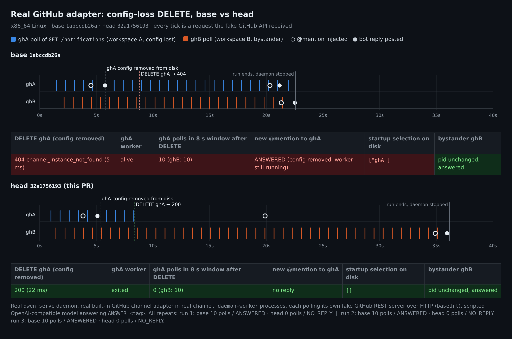
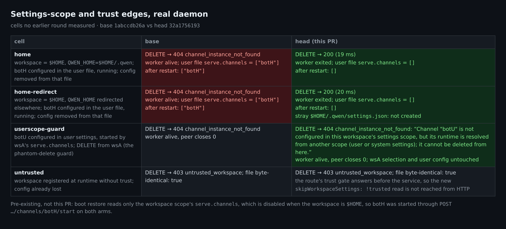
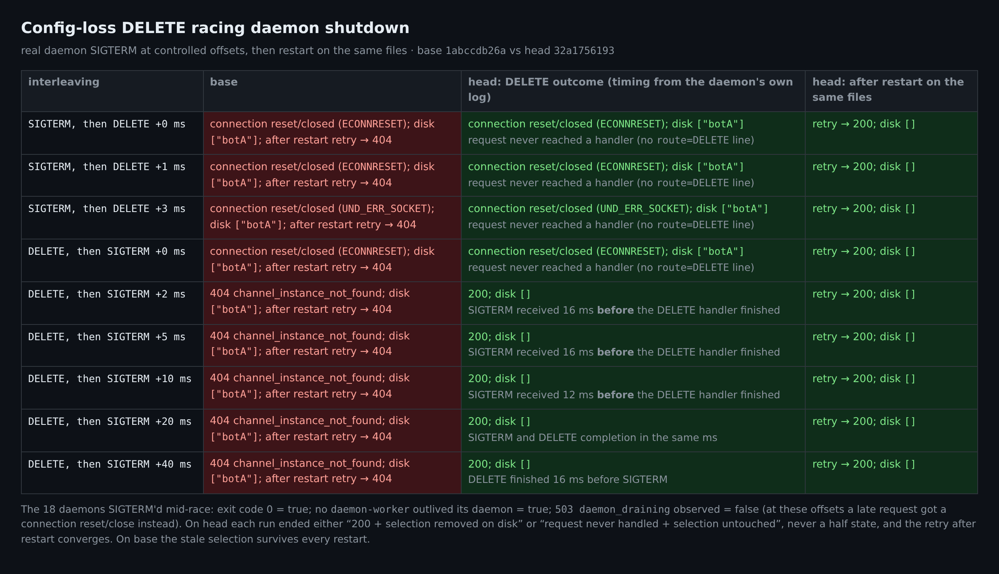
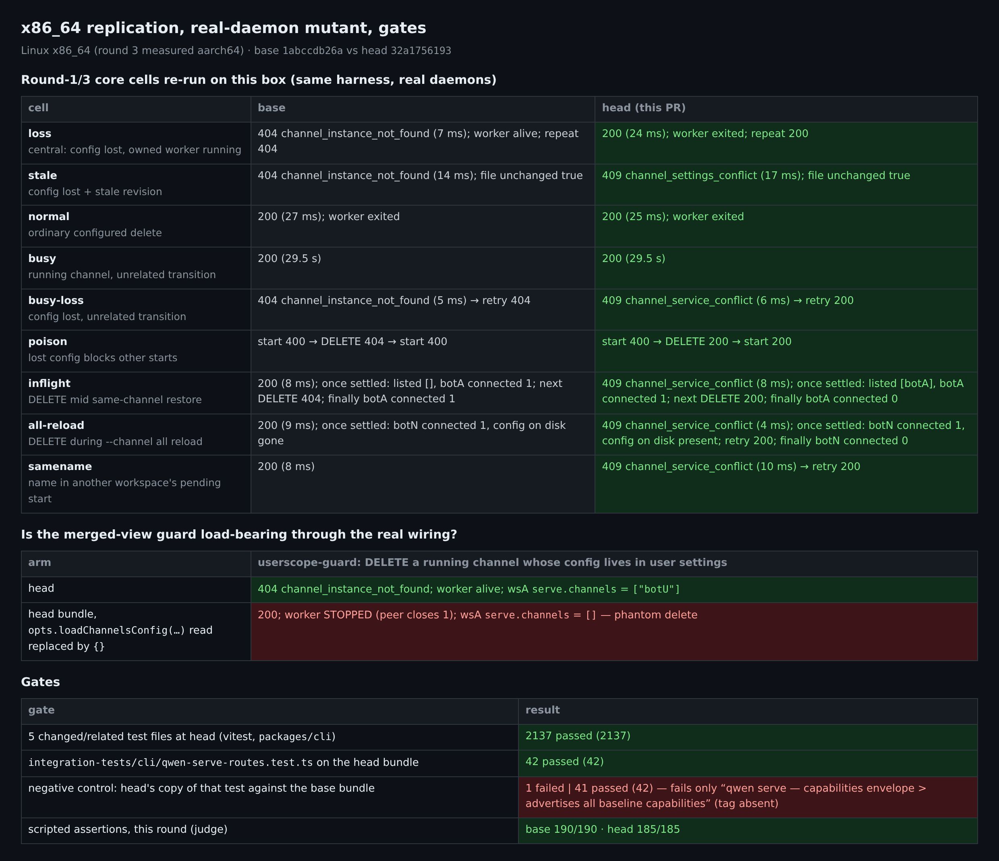

# PR #11071 维护者验证第 4 轮（中文）

英文版见 [REPORT.md](REPORT.md)。

## 维护者验证第 4 轮（仅增量）：真实 GitHub 适配器、关闭竞态、`$HOME` 作用域 —— head `32a1756193`

**结论不变：可以合入（merge-ready）。本轮没有发现 PR 的新缺陷。**

[第 3 轮](https://github.com/QwenLM/qwen-code/pull/11071#issuecomment-5963680532)已经在真实 daemon 上把这个 head 完整重测过一遍，所以本轮只补三件事：
- 第 [1](https://github.com/QwenLM/qwen-code/pull/11071#issuecomment-5920864237)、[2](https://github.com/QwenLM/qwen-code/pull/11071#issuecomment-5959798240)、[3](https://github.com/QwenLM/qwen-code/pull/11071#issuecomment-5963680532) 轮列为"未覆盖"的部分；
- 一个此前没有任何一轮测过的场景：经过真实接线的 user scope 防误删闸门，外加变异体；
- 在 Linux x86_64 上于当前 head 重跑核心场景。

第 1–6 项都跑在真实 `qwen serve` daemon 上，与 base `1abccdb26a`（即 merge-base）做 A/B 对照。**共执行 375 条脚本断言：base 190/190，head 185/185，0 失败。**（base 上预期出现的 bug 现象已经编码成 base 臂的通过条件。）

1. **真实消息适配器。** 此前的维护者轮次用的是 plugin-example，或直接驱动 service 层。这次换成内置 GitHub 适配器，跑在真实 worker 进程中，通过 `baseUrl` 对接假 GitHub REST 服务，再配一个脚本化模型，每个臂各跑 3 次。
   - base：配置被移除后 DELETE 返回 404，该通道仍在运行：8 秒窗口内**继续轮询 GitHub 10 次（3/3）**，并且**继续回复新的 @提及**，`serve.channels` 仍残留在磁盘上。
   - head：200（22–25 ms），worker 退出，**轮询 0 次（3/3）**，不再回复，`serve.channels` 被清空，重复 DELETE 也是 200。
   - 旁观的 ghB 在两个臂上 PID 不变、照常回复。
2. **DELETE 与 daemon 关闭竞态。** 共 9 种时序，每次之后在同一份文件上重启并重试。
   - head：daemon 自己的日志显示，在 +2/+5/+10 ms 三次中，SIGTERM 是在 DELETE 处理器**仍在执行时**到达的，比处理完成早 12–16 ms。这三次都返回 **200，且磁盘上的选择已移除**；+20/+40 ms 时处理器在同一毫秒或更早完成，同样是 200。4 次连接被重置/关闭的运行中，请求根本没到达处理器（日志里没有 `route=DELETE`），选择保持不变。从未出现半截状态；重启后重试返回 200 并完成清理。
   - base：每次都是 404 或连接重置/关闭，残留选择在重启后依然存在，重试仍是 404。
3. **工作区就是 `$HOME`**（作用域塌缩到 user 文件），默认 `QWEN_HOME` 和重定向 `QWEN_HOME` 各测一次。
   - head：200，worker 退出，user 文件里的 `serve.channels` 被清空，重启后仍为空；重定向时 DELETE 之后检查过，没有写出 `$HOME/.qwen/settings.json`。
   - base：404，worker 存活，残留选择在重启后依然存在。
4. **经过真实接线的 user scope 防误删闸门**（此前没有任何一轮测过）。
   - base 和 head 都返回 404，worker 不受影响；head 返回的是新的提示文案。
   - **变异体：**只把 head bundle 中 `opts.loadChannelsConfig(…)` 这一处读取替换成 `{}`，结果就变成 200、worker 被停、wsA 的选择被清空。这说明 `run-qwen-serve.ts` 注入的 merged view 读取正是防止"幻影删除"的关键。
5. **不受信任的工作区。** 两个臂都返回 `403 untrusted_workspace`，文件逐字节不变。这些路由是该 service 工厂的唯一调用方，而且在解析 service 之前就检查了信任。所以新增的 `skipWorkspaceSettings: !trusted` 参数取 `true`（不受信任）的情况从 HTTP 到达不了，它只是防御性代码。
6. **在 Linux x86_64 上于当前 head 重跑 9 个核心场景**（第 1 轮曾在本机、收窄前的 head `39f8072927` 上跑过；第 3 轮在 aarch64 上测过当前 head）。结论与第 3 轮一致；busy 场景两个臂都是排队约 29.5 s 后返回 200。
7. **门禁**（vitest，不起 daemon）。
   - 5 个相关单测文件 2137/2137。第 3 轮唯一失败的 `[::1]` 用例在本机通过，与它"环境问题"的归因一致。
   - 集成测试 `qwen-serve-routes` 在 head bundle 上 42/42，第 2、3 轮都没有跑过它。
   - 负对照：把 head 的测试文件放到 base bundle 上跑，结果 41/42，唯一失败的正是能力标签断言。

**旁注（两个臂上都存在，与本 PR 无关）：**工作区为 `$HOME` 时，启动恢复只读 workspace 作用域的 `serve.channels`，而这个作用域对 `$HOME` 是禁用的。所以写在 user 文件里的选择在启动时不会被恢复，而 settings store 读写的又恰好是同一个 user 文件。这不阻塞合入；如果 `$HOME` 工作区有实际用途，可以另开 follow-up。

**仍未覆盖：**
- 真实的 github.com 及其他平台；
- macOS/Windows；
- `503 daemon_draining` 分支本身；
- `late-collateral` 残留问题（本轮没有重跑）。

变异体的结果单独报告，不计入 375 条断言。

