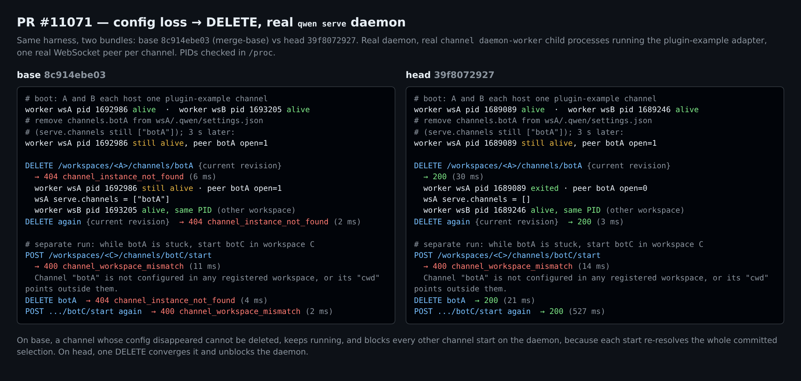
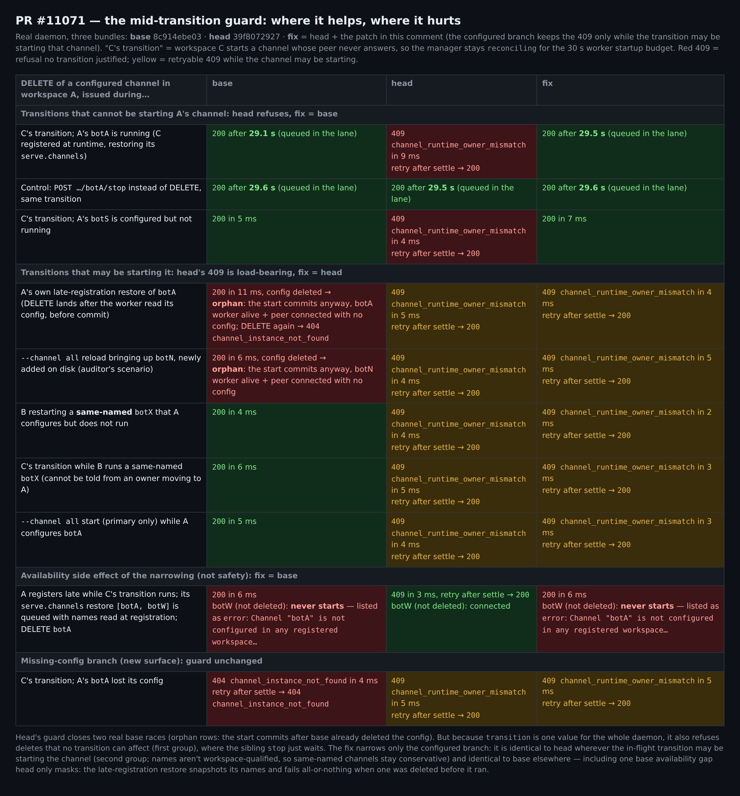
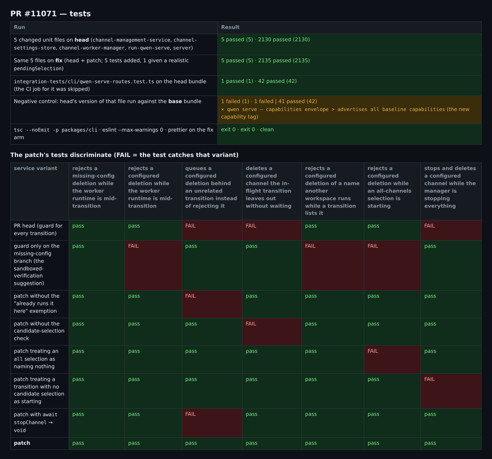

## 维护者验证：真实 `qwen serve` daemon，base / head / 收窄闸门三臂对照（head `39f8072927`）

**结论：核心修复在真实 daemon 上成立，值得合入；但建议先收窄一个条件。** `3130436fc` 挪到分支之前的 mid-transition 闸门是承重的：我在 base 上复现了它所防的两个竞态。但 `transition` 是整个 daemon 共用的单一值，所以只要**其他** workspace 处于 transition 中，head 也会拒绝与任何 transition 都无关的*普通*已配置 Channel `DELETE`，误报 `409 channel_runtime_owner_mismatch`。这既包括在自己 workspace 中正在运行的 Channel，也包括根本没在运行的 Channel。

§4 的补丁保留 head 的闸门，只在已配置分支上收窄条件（service +22/−2，主要是注释）。在进行中的 transition 可能正在启动该 Channel 的地方，它与 head 完全一致；其余地方与 base 完全一致。以下全部为实测。

**环境。** Linux、Node 22.22.2。对 **base** `8c914ebe03`（merge-base）和 **head** `39f8072927` 分别完整执行 `npm run build && npm run bundle`，另加第三个 bundle **fix** = head + §4 的补丁。每次运行都启动一个真实 daemon（`dist/cli.js serve`），由真实的 `channel daemon-worker` 子进程运行 plugin-example 适配器。每个 Channel 配一个真实 WebSocket 对端，记录连接与断开。worker PID 在 `/proc` 中核对。HTTP 路由以下没有任何 mock。每臂 18 个场景，每次运行的原始 JSON 见文末。补丁经过了三轮独立的对抗性审计。

### 1. 核心主张：真实 daemon 上成立



| 步骤（A、B 各托管一个 Channel；从磁盘删除 A 的 `channels.botA`） | base | head |
| :-- | :-- | :-- |
| `DELETE /workspaces/A/channels/botA`（当前 revision） | `404 channel_instance_not_found`；A 的 worker PID 存活；`serve.channels` 仍为 `["botA"]` | `200`（30 ms）；A 的 worker PID 退出、对端断开；`serve.channels: []`；**B 的 worker PID 不变** |
| 以当前 revision 重复删除 | 仍 `404`，无法收敛 | `200`（幂等） |
| 过期 revision | `404` | `409 channel_settings_conflict`；worker 存活，settings 文件逐字节不变 |
| 普通已配置删除（回归对照） | `200`，worker 退出 | 完全一致 |

PR 描述低估了一点：**#11063 的卡死状态影响整个 daemon。** 只要配置丢失的 Channel 仍在已提交的 selection 里，在*任何* workspace 启动*任何其他* Channel 都会重新解析整个 selection，并以 `400 channel_workspace_mismatch` 失败（"Channel "botA" is not configured in any registered workspace…"）。base 上这是永久的，因为 DELETE 一直返回 404。head 上一次 DELETE 即可解除，随后那个启动成功（`200`，527 ms）。

### 2. 发现：闸门拒绝了与任何 transition 都无关的删除（已复现，建议修）

这复现了沙箱验证的 Finding 1 与延后项 D8-3，这次是在真实 daemon 上、由日常生命周期事件触发。见下图第一组。

运行时注册 workspace **C**。C 的 `serve.channels` 恢复会启动一个对端永不应答的 Channel，于是 manager 在 30 s 启动预算内一直处于 `reconciling`。在这段时间内：

- **A 正在运行的 `botA`**，用正确的 revision 删除：base 在 manager lane 中排队，**29.1 s** 后返回 `200`，worker 退出。head **9 ms** 返回 `409 channel_runtime_owner_mismatch`："does not have one confirmed runtime owner in this workspace. The channel runtime is mid-transition."。而 A 唯一归属的 worker 全程存活。
- **A 已配置但未运行的 `botS`：** base 5 ms 返回 `200`；head 返回 `409`。
- **对照：** 同一 transition 期间 `POST /workspaces/A/channels/botA/stop` 在**三臂**上都等待约 29.5 s 后成功。也就是说，在 head 上这两个同级变更行为不一致：`stop` 排队等待，`delete` 直接拒绝。

机器可读的 `code` 声称是归属问题，客户端无法区分"繁忙、稍后重试"与真正的归属歧义。只要其他 workspace 在启动、恢复或重载 Channel，这个窗口就会打开。

### 3. 该闸门是承重的，不能简单挪回

它防住了 base 上的两个竞态，都是 DELETE 在 worker 已读取配置、manager 尚未提交之间到达：

- **同一 Channel 的晚注册恢复**（R6-1）。运行时注册 workspace A，A 恢复 `serve.channels: ["botA"]`；对端 6 s 后才应答。base 11 ms 返回 `200` 并删除配置。6 秒后恢复照样提交，留下**孤儿**：A 的 worker 存活、对端已连接，列表为 `[]`，再次 DELETE 返回 `404`。这等于从干净状态直接造出 #11063。head 返回 `409`，manager 稳定后重试返回 `200`。
- **`--channel all` 下 reload 拉起一个刚在磁盘上新增的 Channel。** 这是我的一轮审计发现的。base 返回 `200`，`botN` 的 worker 却在没有配置的情况下保持连接；head 返回 `409`，重试后收敛。
- 如果 DELETE 在 worker 读取配置*之前*到达，base 碰巧是安全的：worker 以 "Channel "botA" not found in settings" 退出（`data/base-inflight-early.json`）。

只在配置缺失分支保留闸门（沙箱验证的建议）的话，已配置分支与 base 完全相同，两个竞态都会以**隐藏**孤儿的形式回来：删除返回 200、列表为空，worker 却继续运行并阻塞其他启动。借助本 PR 的收敛路径可以恢复，但前提是去删除一个列表里已经看不到的名字。补丁中有三个测试对该变体失败（§5）。

### 4. 建议修正：已配置分支的闸门只在 transition 可能正在启动该 Channel 时生效

manager 仍在启动中的 worker 是不可见的：既不在 `committedChannelNames()` 里，也不在 worker 快照里。唯一公开的痕迹是 transition 的 `pendingSelection`。

因此在已配置分支上，补丁保留 head 的 409，只有以下三种情况例外：
- **(a) 本 workspace 已经在运行该 Channel**（已提交且归属于本 workspace）。现有的 stop 经过 `setChannelEnabled`，会排在 transition 之后，并在 manager lane 内重新校验归属；配置只在 stop 完成后才删除。
- **(b) 候选 selection 不包含该名字**，进行中的 transition 不会启动它。
- **(c) transition 根本没有候选 selection。** 这只有 `stopping`，它不启动任何东西。

配置缺失分支完全不动。

<details>
<summary>补丁（可干净应用到 <code>39f8072927</code>；service +22/−2，测试 +91/−0）</summary>

```diff
--- a/packages/cli/src/serve/channel-management-service.ts
+++ b/packages/cli/src/serve/channel-management-service.ts
@@ -284,6 +284,22 @@
     throw runtimeOwnerMismatch(name, reason);
   };
 
+  // Whether a mid-transition manager may be bringing this channel up. It
+  // publishes neither a committed name nor a worker for a channel it is still
+  // starting, so any name in its candidate selection that this workspace does
+  // not already run is unknown until it settles. A channel this workspace
+  // runs is safe to act on — its stop queues behind the transition and
+  // rechecks the owner inside the manager's lane — and so is one the
+  // candidate selection leaves out.
+  const mayBeStarting = (name: string): boolean => {
+    const { transition, pendingSelection } = opts.manager.state();
+    if (transition === 'idle' || !pendingSelection) return false;
+    if (workspaceCommittedNames().includes(name)) return false;
+    return (
+      pendingSelection.mode === 'all' || pendingSelection.names.includes(name)
+    );
+  };
+
   const runtimeFor = (name: string): ChannelRuntimeState => {
     const retainedError = diagnostics.get(name);
     if (retainedError) return { state: 'error', lastError: retainedError };
@@ -510,8 +526,13 @@
       // workers and nothing committed, which reads as silent without being
       // it; the caller retries once the manager settles. Guarded above the
       // branch split because the configured branch reads the same
-      // mid-transition committed set.
-      if (opts.manager.state().transition !== 'idle') {
+      // mid-transition committed set, but only for a channel the transition
+      // may be starting: `transition` is one value for the whole daemon.
+      if (
+        configured
+          ? mayBeStarting(name)
+          : opts.manager.state().transition !== 'idle'
+      ) {
         throw runtimeOwnerMismatch(
           name,
           'The channel runtime is mid-transition.',
--- a/packages/cli/src/serve/channel-management-service.test.ts
+++ b/packages/cli/src/serve/channel-management-service.test.ts
@@ -1033,6 +1033,7 @@
     vi.mocked(manager.state).mockReturnValue({
       ...state,
       transition: 'starting',
+      pendingSelection: { mode: 'names', names: ['bot'] },
       workers: [
         {
           enabled: true,
@@ -1057,6 +1058,108 @@
     expect(store.remove).not.toHaveBeenCalled();
   });
 
+  it('queues a configured deletion behind an unrelated transition instead of rejecting it', async () => {
+    // `transition` is one value for the whole daemon: another workspace
+    // starting its channel must not turn this workspace's ordinary delete of
+    // a channel it runs into a 409. The stop queues behind that transition,
+    // and the configuration is removed only once the stop has settled.
+    const { service, store, manager } = setup({ committedNames: ['bot'] });
+    const state = manager.state();
+    vi.mocked(manager.state).mockReturnValue({
+      ...state,
+      transition: 'reconciling',
+      pendingSelection: { mode: 'names', names: ['bot', 'other'] },
+    });
+    let settleStop!: () => void;
+    vi.mocked(manager.setChannelEnabled).mockReturnValueOnce(
+      new Promise<void>((resolve) => {
+        settleStop = resolve;
+      }),
+    );
+
+    const removal = service.remove('bot', { expectedRevision: 'rev-1' });
+    await vi.waitFor(() =>
+      expect(manager.setChannelEnabled).toHaveBeenCalledWith(
+        { name: 'bot', workspaceCwd: WORKSPACE },
+        false,
+      ),
+    );
+    expect(store.remove).not.toHaveBeenCalled();
+    settleStop();
+    await removal;
+    expect(store.remove).toHaveBeenCalledTimes(1);
+  });
+
+  it('deletes a configured channel the in-flight transition leaves out without waiting', async () => {
+    const { service, store, manager } = setup({ committedNames: [] });
+    const state = manager.state();
+    vi.mocked(manager.state).mockReturnValue({
+      ...state,
+      transition: 'reconciling',
+      pendingSelection: { mode: 'names', names: ['other'] },
+    });
+
+    await service.remove('bot', { expectedRevision: 'rev-1' });
+
+    expect(manager.setChannelEnabled).not.toHaveBeenCalled();
+    expect(store.remove).toHaveBeenCalledTimes(1);
+  });
+
+  it('rejects a configured deletion of a name another workspace runs while a transition lists it', async () => {
+    // Selection names are not workspace-qualified, and a worker the
+    // transition is still starting is not visible yet, so a name another
+    // workspace runs cannot be told apart from one moving to this workspace.
+    const { service, store, manager } = setup({
+      committedNames: ['bot'],
+      workspaceCwd: '/tmp/other-workspace',
+    });
+    const state = manager.state();
+    vi.mocked(manager.state).mockReturnValue({
+      ...state,
+      transition: 'reconciling',
+      pendingSelection: { mode: 'names', names: ['bot', 'other'] },
+    });
+
+    await expect(
+      service.remove('bot', { expectedRevision: 'rev-1' }),
+    ).rejects.toMatchObject({ code: 'channel_runtime_owner_mismatch' });
+    expect(store.remove).not.toHaveBeenCalled();
+  });
+
+  it('rejects a configured deletion while an all-channels selection is starting', async () => {
+    const { service, store, manager } = setup({ committedNames: [] });
+    const state = manager.state();
+    vi.mocked(manager.state).mockReturnValue({
+      ...state,
+      transition: 'starting',
+      pendingSelection: { mode: 'all' },
+    });
+
+    await expect(
+      service.remove('bot', { expectedRevision: 'rev-1' }),
+    ).rejects.toMatchObject({ code: 'channel_runtime_owner_mismatch' });
+    expect(store.remove).not.toHaveBeenCalled();
+  });
+
+  it('stops and deletes a configured channel while the manager is stopping everything', async () => {
+    // A stopping transition starts nothing, so it has no candidate
+    // selection; the stop queues behind it.
+    const { service, store, manager } = setup({ committedNames: ['bot'] });
+    const state = manager.state();
+    vi.mocked(manager.state).mockReturnValue({
+      ...state,
+      transition: 'stopping',
+    });
+
+    await service.remove('bot', { expectedRevision: 'rev-1' });
+
+    expect(manager.setChannelEnabled).toHaveBeenCalledWith(
+      { name: 'bot', workspaceCwd: WORKSPACE },
+      false,
+    );
+    expect(store.remove).toHaveBeenCalledTimes(1);
+  });
+
   it('rejects a missing-config deletion when the configuration reappears during the worker stop', async () => {
     // The revision token covers only this scope's files, so a configuration
     // written back to another scope while the worker stop is in flight must
```

</details>



真实 daemon 实测：
- **(a)、(b) 两种情况：** fix = base。运行中的 `botA` 29.5 s 后返回 `200`，与 `stop` 相同；未运行的 `botS` 7 ms 返回 `200`。
- **两个竞态：** fix = head。返回 `409`，重试后收敛，没有孤儿。
- **其余场景：** loss、stale、normal、poison、twin-loss、transition 期间的配置缺失删除，都与 head 一致。
- **arm 有效性：** 归一化 chunk 哈希与路径后，head 与 fix bundle 的语句级 diff 只包含补丁改动的语句。

与 triage 评审的关系（我在实测完成后才读到）：
- **"等待 transition 而不是拒绝"**（stage 2）：在本版之前，我实现并实测了这个思路的两个草稿。只要 manager 不是 idle 就推迟：未运行 Channel 的 DELETE 要等 **29.5 s**，同名 Channel 在 29.3 s 后**迟到地**得到 409。只对 pending 且未提交的名字推迟：当另一个 workspace 正在启动同名 Channel 时，仍会在 **6.0 s** 后返回 409，在 `--channel all` 下要等 5.9 s。只在可能正在启动的地方拒绝、其余地方立即应答，是实测下最干净的行为。这些运行在 `data/superseded-*`。
- **"限定在首次启动窗口"**（stage 3）：仅靠这一条会漏掉我实测到的竞态。那次竞态发生在 `reconciling` 期间，因为 primary 已经托管着 `botP`。`pendingSelection` 两种情况都能覆盖。
- **错误码：** 我同意剩下的拒绝最好有自己的可重试错误码（例如现有的 `channel_service_conflict`，本身就是 409），而不是 `channel_runtime_owner_mismatch`。补丁没有改它，以保持已发布契约和 PR 自身测试的稳定。收窄之后，剩下的每一个 409 都确实意味着"该 Channel 可能正在启动，请重试"。

需要知情接受的三点：
- **同名 Channel 与 `--channel all` 仍保持保守。** selection 中的名字不带 workspace 限定，所以名字被其他 workspace 运行或正在启动的 Channel，以及 `all` 启动期间的非 primary Channel，仍会得到 head 的可重试 409（这些行 fix = head）。归属正移交给本 workspace 的情况看起来完全一样，放开就会重新打开竞态。
- **收窄会重新暴露一个 base 上已有、head 只是碰巧掩盖的可用性缺口。** 假设 workspace A 在一个无关 transition 进行期间晚注册，它的 `serve.channels` 恢复 `[botA, botW]` 已在 lane 中排队。此时 `DELETE botA` 在 base 与 fix 上立即成功。排队的恢复用的是注册时读到的名字，随后整体失败：**`botW` 并未被删除，却永远起不来**，A 的列表把它显示为 `error`，带着 botA 的报错。head 的全面 409 把删除推迟到一切都起来之后，所以 `botW` 得以保留。只要 lane 被一个不改变 transition（保持 `idle`）的操作占用，比如另一个 `restoreWorkspace`，head 也有同样的缺口（代码追踪）。根因是晚注册恢复基于名字快照、要么全成要么全败。更好的修法在那里（容错分组，或在 lane 内重新读取 `serve.channels`），作为一个小的后续修复，而不是扩大闸门。
- **transition 期间删除运行中的 Channel 会在 lane 中等待**，与 base 相同，也与 `POST …/stop` 现有行为一致。lane 是 FIFO，前面排着多个慢操作时等待时间会累加；同一 workspace 之后的变更也会在 service lane 中排在它后面。daemon 关闭期间，这条路径得到 `setChannelEnabled` 的 `503 daemon_draining` 而不是 409，覆盖了延后项 D8（"settle guard also fires on `stopping`"）。该路径我只做了代码追踪，没有实测。

### 5. 测试



- **单测（head）：** 5 个变更单测文件 2130/2130 通过。打补丁后（新增 5 个测试，并为已有的已配置删除测试补上真实的 `pendingSelection`）2135/2135。
- **变异：** 补丁的每个子条件及其 `await` 都由各自的测试钉住。head 变体与仅配置缺失分支变体在 7 个 transition 测试中各失败 3 个。
- **集成测试：** 本 PR 的 `Integration Tests (CLI, No Sandbox)` job 被**跳过**，所以 `qwen-serve-routes.test.ts` 从未在 CI 跑过。本地用 head bundle 跑 **42/42** 通过。把 head 版本的这个测试文件跑在 **base** bundle 上，只有 `advertises all baseline capabilities`（新 tag）失败，说明这一行是承重的。
- **补丁的静态检查：** `tsc --noEmit -p packages/cli`、`eslint --max-warnings 0`、prettier 全部通过。

### 6. 其他观察（非阻断）

- **两个 Channel 同时丢失配置**（PR 已披露的限制）：在 head 上分别删除，都返回 `400 channel_workspace_mismatch`，且点名的是*另一个* Channel，两者都无法收敛。实测的出路：先 `DELETE /workspace/channel`（会停掉 daemon 上**全部**托管），然后两个 DELETE 都返回 `200`，两处启动选择都被清理。base 上即使停掉托管，两者仍然是 `404`。这个运维步骤值得在文档里加一句。
- **各臂都已存在（代码追踪，未复现）：** 在 transition 为 `idle` 时执行的 `restoreWorkspace`，若 selection 为 `all` 模式，启动中的 worker 快照只列出 `['all']` 而没有 `requestedChannels`。这时到达的已配置删除会跳过 stop。head 与 fix 可以通过收敛路径再删一次来恢复；base 不能。
- **文档：** `15-channel-adapters.md` 里 "a delete arriving mid-transition is rejected with `channel_runtime_owner_mismatch`…" 这句位于配置丢失段落，仍然准确。收敛后启动选择被写成 `serve.channels: []`，而不是删除该键，无害。
- **未覆盖：** macOS 与 Windows、真实消息平台、daemon 关闭路径（仅代码追踪）。

**证据**（harness、每次运行的原始 JSON、变异报告、日志、补丁、截图；补丁的早期草稿及其运行保存在 `data/superseded-*`）：[本目录](.)：`harness/probe.mjs`（真实 daemon 场景）、`harness/render.cjs`（截图，所有数字均读自 `data/`）、`data/SUMMARY.txt`、`fix-scoped-transition-guard.patch`
