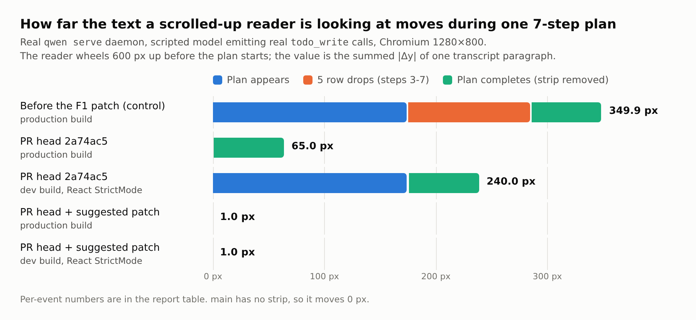
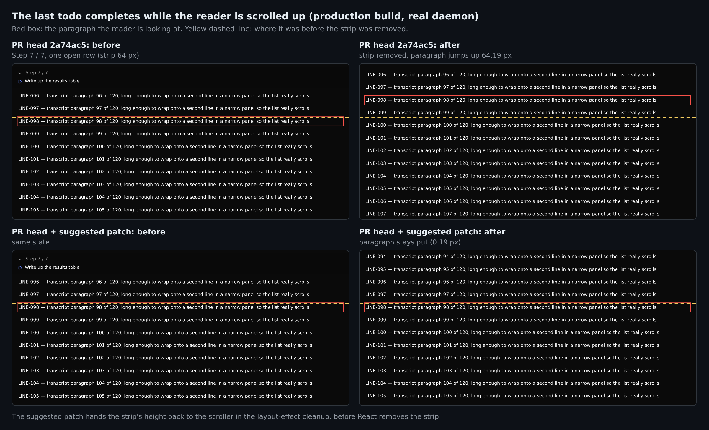

## 维护者验证第 4 轮：真实 daemon + 生产包，head `2a74ac5a`（只报增量）

前几轮：[R1，真实 daemon，`8cac35c`](https://github.com/QwenLM/qwen-code/pull/12134#issuecomment-5762945477) · [沙箱，`f523b8e`](https://github.com/QwenLM/qwen-code/pull/12134#issuecomment-5769601038) · [R3，F1 复测，`e433da2`](https://github.com/QwenLM/qwen-code/pull/12134#issuecomment-5831128856) · [沙箱，`e433da2`](https://github.com/QwenLM/qwen-code/pull/12134#issuecomment-5830813149)。本轮只覆盖前几轮留下的空白。

**形态决定：选 (a)，保留置顶条。** @holny，久等了。按现在的实现保留置顶条，默认展开，保留折叠开关。不需要改成 cockpit 入口。

**结论：打上一个 13 行补丁、加一个 e2e 用例后即可合并（两者见下文，都已验证）。** F1 的滚动补偿在真实 daemon + 生产包下是正确的。还剩两个缺口，一个补丁同时解决：

- **G3。** 计划全部完成时置顶条卸载，已上翻的读者正在读的文字会上跳，幅度等于置顶条最后的高度（7 步计划里是 64.19 px）。
- **G1。** 仅开发构建：React StrictMode 让挂载补偿执行两次，文字反向跳 175 px。

新增的 e2e 用例关闭 F2/G2：此前置顶条从 `App` 里消失、或补偿逻辑被删掉，CI 都不会发现。

### 1. 本轮新测了什么

**装置。** 把 PR head `2a74ac5a` 合入当前 `main` `d5a157c45e`。合并无冲突，相对 main 的 diff 恰好是 PR 的 6 个文件（+548/−0）。以真实 `qwen serve` daemon 运行，托管生产版 Web Shell 包，开启 `tools.todoWrite.enabled`。脚本化的 OpenAI 兼容模型发出真实 `todo_write` 调用，并把每个请求挂起到 harness 放行为止，所以每次计划更新都走完 core → ACP → SSE → Web Shell 全链路。输入是 Chromium 1280×800 下的真实滚轮和点击。客户端各臂在同一个 daemon 下热切换，每次运行都记录实际服务的 `index-<hash>.js`。

| 臂 | 含义 |
|---|---|
| head | `2a74ac5a` 原样 |
| control | head 去掉 F1 的补偿 effect（即 `e433da2` 之前的文件） |
| patch | head 加上 §3 的补丁 |
| dev | 同一份代码在 `vite` 开发模式下运行（`main.tsx` 开启了 `React.StrictMode`） |

**1a. 读者先上滚 600 px，再跑一个 7 步计划（见上图）。** 每格是同一段屏幕上转录段落的 Δy。

| 事件 | control（生产） | head（生产） | head（dev） | patch（生产） | patch（dev） |
|---|---|---|---|---|---|
| 置顶条出现（+174.94 px） | +174.94 | −0.06 | **−175.06** | −0.06 | −0.06 |
| 5 次减行（每次 −22 px），合计 | 110.75 | 0.75 | 0.75 | 0.75 | 0.75 |
| 计划完成、置顶条移除 | −64.19 | **−64.19** | **−64.19** | **−0.19** | **−0.19** |
| 合计 | 349.88 | 65.00 | 240.00 | 1.00 | 1.00 |

- 沙箱轮对 G1 的"生产环境不受影响"是推断，没有实测。这一半现在实测了：生产包挂载时位移 −0.06 px。
- G1 在真实 daemon 的开发模式下复现：−175.06 px。

**1b. 跟随底部（新增）。** 前几轮都没跑过"读者在底部时，一次 `todo_write` 批量完成多项"或"点击折叠"这两种情形。担心的是：浏览器会钳位 `scrollTop`，让 `fromBottomBefore` 公式拿到错误的值，把正在跟随底部的读者推离底部。实测不会发生。下表每一行在 head、control、patch 三臂上完全相同：

| 跟随底部时的事件 | 置顶条高度变化 | 稳定后 `fromBottom` | 已绘制帧中 `fromBottom` 最大值 |
|---|---|---|---|
| 计划出现 | +174.94 | 0 | 0 |
| 完成 1 项 | −22.00 | 0 | 0 |
| 一次 `todo_write` 完成 3 项 | −66.56 | 0 | 0 |
| 随后流式输出 60 段 | – | 0，最后一段在屏幕上 | – |
| 点击折叠 ×6 | −112.94 | 0 | 0 |
| 点击展开 ×6 | +112.94 | 0 | 0 |
| 计划完成 | −64.19 | 0 | 0 |

"已绘制帧"指在每个 `requestAnimationFrame` 之后排队执行的采样器，读到的是该帧实际绘制的状态。如果在 rAF 内部采样（早于该帧的 ResizeObserver 回调），head 在展开时 6/6 次都能看到一个 113 px 的中间态。这个中间态从未被绘制：帧后采样器 6 次全是 0，所以不是肉眼可见的闪烁。

**1c. Historical 视口（新增）。** triage 第 2 阶段把这一项列为"未验证"。我通过 daemon API 播种了 300 轮对话，用轮次导航进入 `data-history-viewport="historical"`，在查看这段旧区间时推进计划。

- **读者在区间中部**（距顶 5503 px，距底 3438 px）：每次减行都补偿到 −0.19 px，额外历史请求 **0** 次，视图保持 historical。计划完成：head −64.19 px，patch −0.19 px。
- **读者距顶 215 px**（视口的旧页加载阈值是 200 px）：head 上第一次 22 px 补偿越过阈值，恰好触发 **1 次** `GET /session/:id/transcript` 加载旧页。视口的锚点恢复把段落保持在 +0.25 px 以内，视图仍是 historical。control 上不加载，文字每步移动 −22 px。所以 triage 的猜测成立，但效果等同于用户自己滚动 22 px，没有危害。

**1d. `mobileWelcomeGroup` 分支里的插入点不可达。** 前几轮把这个分支列为"未测"。它不可能渲染置顶条：

- `showMobileWelcomeFooterMiddle` 依赖 `useMobileWelcomeMiddleLayout`，后者依赖 `isChatEmptyState`。
- `isChatEmptyState` 包含 `!showFloatingTodos`（`2a74ac5a` 上的 `App.tsx:18366`）。
- `stickyPlanStrip` 要求 `showFloatingTodos`（`App.tsx:20642`），而 `showFloatingTodos` 只有一处声明（`App.tsx:7447`）。

所以 `App.tsx:20843` 处的 `{stickyPlanStrip}` 恒为 `null`（nit，可放进后续 issue）。

### 2. 前几轮发现在 `2a74ac5a` 上的状态

| 发现 | 状态 |
|---|---|
| R2-F1：每次减行时阅读位置跳动 | **已修复。** 已在真实 daemon + 生产包下实测（§1a）。 |
| G1：StrictMode 下挂载补偿不幂等 | **仅影响开发构建。** 生产环境已实测无问题。**补丁可关闭。** |
| G3 / F1-r3：计划完成时跳 64 px | **head 上仍存在，补丁可关闭。** |
| F2 / G2：App 接线与补偿在 CI 中无覆盖 | **由新 e2e 用例关闭**（见 §3 矩阵）。 |
| R3：Lint & Static 在门禁新鲜度检查上变红 | **head 上已修复。** `2a74ac5a` 上所有实际运行的检查都是绿的。但自被合入的 main 提交 `790bd83c2b` 之后，main 又 5 次修改了门禁文件 `.github/workflows/ci.yml`（#12709、#12733、#12780、#12864、#12833），所以**下次推送前请先合并 `origin/main`**，否则这一步会再次变红。 |
| SB-F1 惰性的 `position: sticky` / `backdrop-filter`；SB-F3 重复的 `Current tasks` 地标（复数仍为 2）；SB-F4 与 TodoPanel 的重复代码；上限注释与终端实现不符；§1d 的死插入点 | 不阻塞。**请合并成一个后续 issue 提交**，不要在本 PR 里继续扩大改动。 |

### 3. 补丁与用例

补偿本来就在 layout effect 里。React 会在删除置顶条的 DOM 节点之前执行 layout effect 的 cleanup，所以 cleanup 看到的仍是移除前的布局，可以把置顶条的高度交还给滚动容器。同一段 cleanup 也会在 StrictMode 重跑 effect 时撤销第一次挂载补偿：+H、−H、+H，净效果 +H，所以不需要 ref。cleanup 沿用 effect 已有的 30 px 规则，跳过正在跟随底部的读者。

补丁（13 行）见英文部分 §3 的 diff 块。

用例是 `client/e2e/web-shell.sticky-plan.spec.ts`，192 行，带 `@smoke` 标签，只使用现有的 `mockDaemon`。包含三条测试：

- **t1，App 接线。** 置顶条挂载在消息列表上方，与底部 chip 显示相同步数，默认展开（5 行加 `... 2 more`），随实时 `todo_write` 更新，计划完成后卸载。
- **t2。** 读者上翻后，一次批量 `todo_write` 减少两行时，阅读位置偏移小于 2 px。
- **t3。** 同一读者在计划出现和完成时，偏移都小于 2 px。

完整文件：[`patch/web-shell.sticky-plan.spec.ts`](patch/web-shell.sticky-plan.spec.ts)。合并 diff 为 [`patch/sticky-plan-strip-cleanup-plus-e2e.diff`](patch/sticky-plan-strip-cleanup-plus-e2e.diff)，在 `2a74ac5a` 上 `git apply --check` 通过，该分支上的 e2e 工具函数与 `main` 完全一致。

| 臂（e2e 在 `vite` 开发模式下运行，StrictMode 开启） | t1 接线 | t2 减行 | t3 出现 + 完成 |
|---|---|---|---|
| head `2a74ac5a` | ✅ | ✅ | ❌ 出现时 175.06 px（G1） |
| **head + 补丁** | ✅ | ✅ | ✅（`--repeat-each=5` 共 15/15） |
| control，去掉 F1 effect | ✅ | ❌ 44.19 px | ❌ 174.94 px |
| 变异体：`App` 不渲染置顶条 | ❌ | ❌ | ❌ |
| 变异体：`App` 默认折叠 | ❌ | ✅ | ❌ 40 px |
| 变异体：修了出现、没补偿完成 | ✅ | ✅ | ❌ 完成时 174.94 px |

head 的 t1、t2 重复运行 6/6 通过，t3 确定性失败（3/3，均为 175.06 px）。最后一个变异体说明 t3 的"完成"断言可以独立于"出现"断言失败。

### 4. 门禁

| 门禁 | 结果 |
|---|---|
| 在合并结果上跑完整 `packages/web-shell` vitest | **393 个文件 / 10385 条测试全部通过** |
| 应用补丁和用例后：`eslint --max-warnings 0`、`prettier --check`、`tsc -p tsconfig.json --noEmit` | 全部干净 |
| 应用补丁后：`StickyPlanStrip`、`TodoPanel`、`todos` 测试 | 95/95 |
| 补丁在生产包下跑 §1a–§1c 全部场景 | 每步位移 ≤ 0.19 px；跟随底部各情形均为 0 px；区间中部无额外历史请求 |
| `2a74ac5a` 上的 CI | 实际运行的检查全部通过：Test (ubuntu)、Lint & Static、Integration (no-AK)、web-shell E2E Smoke、visuals（macOS 与 Windows 测试被跳过） |

### 5. 未覆盖

- macOS 和 Windows；只测了 Linux Chromium。
- WebKit 和移动端项目。
- 本轮没有用真实模型。R1 跑过 glm-5.3-flash，它覆盖的路径没有变化。
- `onOpen` / cockpit 路径（R1 和单测已覆盖）。
- 折叠状态持久化（PR 声明为范围外）。
- 惰性 CSS 的像素差未复测；`StickyPlanStrip.module.css` 在沙箱实测之后没有改动。

**解除合并阻塞需要：** 先合并一次 `main`（为了 lint 门禁），再应用补丁和用例，并提交后续 issue。届时仍挂着的机器人 `CHANGES_REQUESTED` 锚定在修复前的提交 `521493f`，需要维护者 dismiss。

证据：图、harness（假模型、驱动脚本、300 轮播种脚本、合图脚本）、各臂原始 JSON 与用例日志都在 `asserts` 分支的 [`pr-12134-round4/`](.) 目录下。
