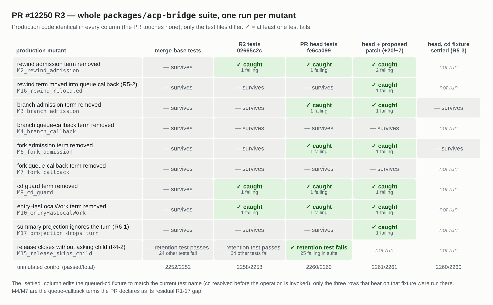
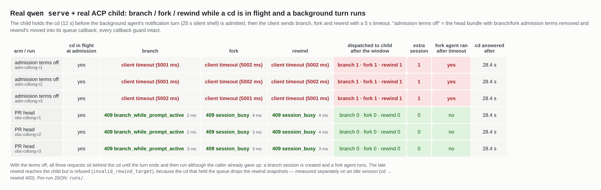

## 本地验证第 3 轮：head `fe6ca099f6`

我的[第 2 轮报告](https://github.com/QwenLM/qwen-code/pull/12250#issuecomment-5775790237)基于 `02665c2cf7`。此后分支新增两个纯测试提交（`bridge.test.ts` +88/−16），没有合入 `main`（merge-base 仍是 `97b1b252e3`），生产代码仍未改动。两个提交的内容是：

- 一张用未 resolve 的 `cd` 占住队列的计时表（bot 的 R4-1）；
- 在释放之后加上 `expect(conditionalCloseCalls).toBe(1)`（R4-2，即我第 2 轮 §5 测过的那一行）；
- 重写了两段注释。

我重新构建了 head，用新测试重跑了整包变异矩阵，并在真实 `qwen serve` + 真实 ACP 子进程上跑了新表所建模的场景。

**结论：可以合并，没有发现阻塞问题。**

- **两处新增的钉住都是实打实的。** 新表是第一个能单独抓到“移除 branch 或 fork 的 admission 项”的测试。在真实栈上，正是这一项阻止了 branch/fork 在调用方已经放弃之后照样执行（§1、§2）。
- **bot 针对当前 head 的四条 deferred 意见都成立。** 我实际执行复现了 R5-2、R5-3、R6-1（§3）。一个 +20/−7 的纯测试补丁可以同时关掉这四条，下文已验证。建议在本 PR 一并采纳，但不阻塞合并。
- **检查全部通过。** head 以及 head 合入当前 `main` 后都是全绿，eslint、prettier、tsc 均 exit 0（§4）。

### 1. 新提交带来了什么

对每个生产代码变异跑一次整个 `packages/acp-bridge` 套件，每一列的生产代码都完全相同。

- **queued-cd 表有效。** 单独移除 branch 的 admission 项（M3）或 fork 的 admission 项（M6），现在对应的行会失败：`expected 'queued-timeout' to be an instance of …`。用第 2 轮的测试时，这两个变异都能存活。R4-1 由此关闭。
- **R4-2 这一行是有效的。** M15 让释放路径不询问子进程就直接关闭会话。第 2 轮的保留测试在 M15 下通过，head 版本则失败：`expected +0 to be 1`。套件里另有 24 个测试本来就能抓到 M15，所以这一行钉住的是*这个*测试自身的声明，而不是唯一的防线。
- **仍然存活的正是描述里声明的部分：** 两个队列回调项（M4、M7）。另外两个存活的变异 M16、M17 在 §3 讨论。
- **新表很稳定。** 计时表（含补丁新增的 `rewind` 行）和保留测试在 8 个满载 CPU 进程并行（16 核上负载约 9.4）的情况下 **20/20** 通过。100 ms 的 race 并不紧：只要 admission 守卫完好，它在任何计时器触发之前就已拒绝。

### 2. 真实栈：新表所建模的场景

新夹具的前提是：后台 turn 被 admit 时，有一个 `cd` 正在执行。我先确认了产品能到达这个状态：`start_turn` 的 admission（`session-control-plane.ts` 中的 `onBackgroundTurnStart` hook）会检查 prompt、goal turn 和 reset，但不检查 prompt 队列。然后在真实栈上构造了它：

- 子进程把一个 `cd` 挂住 12 秒（在 head bundle 里加一行插桩）；
- 后台 agent 完成，它的通知 turn（一个静默 25 秒的 shell）被 admit；
- 客户端发出 `branch`、`fork`、`rewind`，每个请求都设 5 秒超时。

两个 arm：一个是 head bundle；另一个移除 branch 和 fork 的 admission 项，并把 rewind 的那一项挪进它的队列回调，所有回调守卫保持不动。

- **Head（3/3 次）：** 三个请求都在 2–4 ms 内得到 409，没有任何请求派发到子进程。
- **去掉 admission 项（3/3 次）：** 三个请求都触发客户端超时。`cd` 要等 turn 结束才返回（28.4 秒；真实的 `cd` 本身也会等 turn），到那时回调里的 `backgroundTurn` 检查已经没有东西可拦。于是三个请求都在调用方放弃*之后*被派发：
  - 创建了一个 branch 会话；
  - 一个 fork agent 实际运行，并把通知写进了父会话历史。
- **rewind 在这个场景里没有造成破坏，但原因与本 PR 无关。** 迟到的 rewind 到达子进程，被以 `invalid_rewind_target` 拒绝。原因是占住队列的 `cd` 会让 rewind 快照失效：在空闲会话上先 `cd` 再 `rewind` 会返回 400。所以这个场景展示不出迟到的截断，我也不这样声称。失去 admission 位置的具体代价，是 branch 和 fork 那两项。

### 3. 仍未关闭的 deferred 意见，逐条实测（均不阻塞）

| 意见 | 在 `fe6ca099` 上的实测 |
| --- | --- |
| **R5-1** 注释准确性 | 有改进，但仍然难读。“rewind's admission disjunct and the queued-cd table below pin branch and fork admission individually” 读起来像是 rewind 的那一项钉住了 branch。另外，引用的 `session-control-plane.ts:10836` / `:13674` 在当前 `main` 上已经是 `:10852` / `:13690`（+16 行）。改用符号名就不会漂移。 |
| **R5-2** rewind 的位置 | 成立。M16 把 rewind 的 `backgroundTurn` 项挪进队列回调，**整个套件照样全绿**（2260/2260）。在 queued-cd 表里加一行 `rewind` 就能抓到：`expected 'queued-timeout' to be an instance of SessionBusyError`。§2 表明，同类改动放在 branch/fork 上会有真实后果。 |
| **R5-3** 测试名 | 成立。把夹具改成与当前测试名一致（在 admit 之前 resolve 并 await 这个 `cd`）后，M3 和 M6 都**存活**（2260/2260）。这个名字恰好会引导别人做出让这张表失效的修改。 |
| **R6-1** 摘要投影 | 成立。M17 让 `entryActiveWorkState` 不再计入后台 turn，保留逻辑不变。它**能通过整个套件**，也就是说，一个正在跑 turn 的 detached 会话会在侧栏显示 `idle`。加一条断言即可抓到：`expected 'idle' to be 'active'`。这正是 #11768 中 R1-16 的修复方案要求的 `activeWorkState` 检查。 |

补丁 +20/−7，纯测试，见上方英文部分的折叠块：

- 能干净地应用到 `fe6ca099`，`eslint --max-warnings 0`、`prettier --check`、`tsc --noEmit`（包的 tsconfig 覆盖测试文件）均 exit 0。
- 整包通过 2261/2261；在 head 合入 `main` `64ac2faae7` 的树上通过 2316/2316。
- 打上补丁后，M2、M3、M6、M9、M10、M16、M17 都被各自对应的测试抓到，只剩已声明的 M4、M7 存活。
- §1 中负载下的 20 次运行用的就是这个补丁的测试代码；它在最后一次编辑之前运行，而那次编辑只改了注释。

### 4. 测试、lint、CI

| | |
| --- | --- |
| head 上整个 `packages/acp-bridge` | **2260 / 2260**（merge-base 的测试文件为 2252） |
| head 合入 `main` `64ac2faae7`（无冲突） | **2315 / 2315** |
| PR 自带命令（`-t "background"`） | **45 passed** / 1072 skipped，与描述一致 |
| 两个测试文件的 `eslint --max-warnings 0`、`prettier --check`、`tsc --noEmit` | exit 0 |
| 构建 | head 上 `npm run build && npm run bundle` exit 0。Linux x86_64，Node 22.22.2，真实执行 `pnpm install --frozen-lockfile`。 |

`fe6ca099` 的 CI：`Lint & Static`、`Integration Tests (no-AK)`、Java 各 job 和 Desktop Shell 都已通过。`Test (ubuntu-latest, Node 22.x)` 在我发帖时仍在运行（第 2 次尝试，17:09 UTC 开始）。如果它以同样方式变红，`main` 一侧的原因见第 2 轮 §4。

证据（harness、每次运行的 JSON、两个 arm 的 bundle diff、带源码哈希的矩阵汇总、补丁）：本目录
