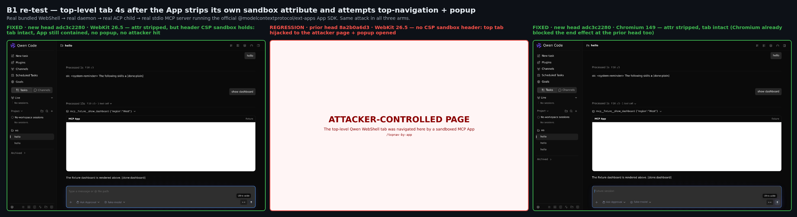
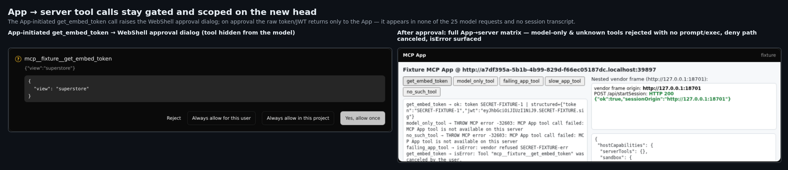
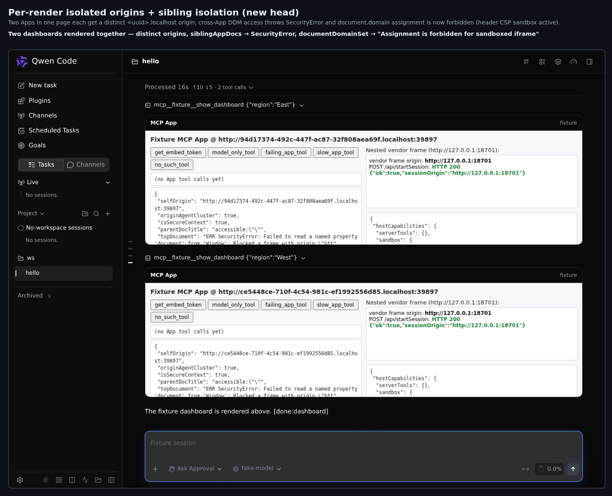

# PR #12258 — 维护者验证 第 3 轮（head `adc3c22803`）

**结论：B1 已修复；在我这边这个 PR 可以合入。**

第 2 轮（[评论](https://github.com/QwenLM/qwen-code/pull/12258#issuecomment-5769709588)，head `8a2b0a6d3b`）发现一个阻塞项 **B1**：在 WebKit 中，渲染出的 App 可以剥掉自身 iframe 的 `sandbox` 属性（App 与其 proxy 共用同一个每次渲染的 origin），进而驱动顶层 Qwen 标签页跳转 / 弹窗，违背了设计文档承诺的隔离边界。本轮只复验该修复，并回归确认修复可能破坏的性质。

## 环境

新 head `adc3c22803` 与旧 head `8a2b0a6d3b`，各自完整构建（`pnpm install --frozen-lockfile` + `npm run build` + `npm run bundle`）并以 `dist/cli.js serve` 启动。真实 **Chromium 149** 与 **WebKit 26.5**（Playwright）加载打包后的 WebShell，连真实 daemon → 真实 ACP 子进程 → 真实 stdio MCP server，后者运行官方 `@modelcontextprotocol/ext-apps` 1.7.5 App SDK（`app.callServerTool`）。另有本地「vendor」origin 模拟 Tableau 的 `startSession`（拒绝 `Origin: null`），同时充当攻击者落地页。Linux x86_64，Node。

## B1 —— 已修复

专用沙箱路由现在把沙箱策略放在 **HTTP 响应头**里，而不再只依赖可被篡改的 iframe 属性：

```
Content-Security-Policy: sandbox allow-scripts allow-forms allow-same-origin; default-src 'self' 'unsafe-inline'; …
```

由 HTTP 头下发的 `sandbox` 指令由浏览器直接施加到文档上，无法通过 DOM 操作移除，其 flag 还会被嵌套的 App 子帧继承。保留 `allow-same-origin`（App↔proxy 的 postMessage/DOM 桥仍可用），但不给 `allow-top-navigation*` / `allow-popups*`。

三个 arm 跑同一段 App 主动发起的攻击 —— App 访问其 proxy DOM（同源，预期内），剥掉内层 iframe 的 `sandbox` 属性，再从新的 `srcdoc` 子帧尝试 `top.location =` 和 `window.open()` 跳到攻击者 origin：

| Arm · 引擎 | CSP `sandbox` 头 | App 是否剥掉属性 | 顶层标签是否跳走 | 弹窗 | 攻击者命中 |
| --- | :--: | :--: | :--: | :--: | :--: |
| **新 head `adc3c2280` · WebKit 26.5** | ✅ 有 | 是 | **否** | **否** | **无** |
| 新 head `adc3c2280` · Chromium 149 | ✅ 有 | 是 | 否 | 否 | 无 |
| **旧 head `8a2b0a6d3` · WebKit 26.5** | ❌ 无 | 是 | **是 → 攻击者页面** | **是** | `/topnav-by-app`、`/popup-by-app` |



旧 head 那一 arm 是反向对照：同一个探针在 WebKit 下仍复现 B1，说明测试具有判别力。在新 head 上，攻击在**两个**引擎里都被挡下，而且是 header CSP 起作用 —— App 确实成功剥掉了 iframe 属性（`strippedSandboxAttr: "allow-scripts allow-forms allow-same-origin"`），却依旧逃不出去。一个可见副作用印证了该头已作用于 App 文档：`document.domain = 'localhost'` 现在抛 `SecurityError: Assignment is forbidden for sandboxed iframe`（旧 head 上是成功的）。

单测钉住了两种头（`mcp-app-sandbox.test.ts`）：主路由断言 `/^sandbox allow-scripts allow-forms allow-same-origin;/`，opaque 兜底路由断言 `/^sandbox allow-scripts allow-forms;/`（无 `allow-same-origin`）。

## 新 head 上回归确认（修复可能破坏的部分）

- **App→server 桥仍受审批门控且作用域受限。** App 发起的 `get_embed_token` 会弹出 WebShell 审批框；批准后原始 token/JWT 只回到 App。`model_only_tool` 与 `no_such_tool` 被拒、无弹框、无服务端执行；拒绝路径取消且无执行；`isError` 正确透出。
- **无密钥泄漏。** 返回的 `SECRET-FIXTURE-*` token 在 **25 个模型请求中出现 0 次**，在**任何**会话 transcript / chat ledger 中都没有。
- **每次渲染独立 origin + 兄弟隔离。** 同一页里的两个 App 各拿到不同的 `<uuid>.localhost` origin；跨 App 访问 DOM 抛 `SecurityError`；嵌套的 vendor 帧保留其真实 origin，`POST /api/startSession` 返回 200。
- **重载即取消**仍然生效（慢速 App 工具在重载后约 15ms 被 abort）；**重载后**回放的 App 拿到新 origin 且仍能调用工具。
- **改动的单测在此 head 全绿**：`mcp-app-sandbox.test.ts` 14/14、`McpApp.dom.test.tsx` 15/15、`eventBus.test.ts` + `compactionEngine.test.ts` 200/200。

## 说明 / 不在本轮范围

- opaque origin 兜底（`mode=opaque`，隔离 origin 不可用时去掉 `allow-same-origin`）已实现并有单测覆盖；我端到端跑通的是主同源路径，没有在真实浏览器里强制触发「origin 不可用」分支。
- 没有做鉴权后的 Tableau/Amplitude 真实服务运行；fixture 复现的是 App SDK 的 wire 行为，而非某个具体 vendor。

装置与原始 JSON 见 `harness/` 与 `data/`。
