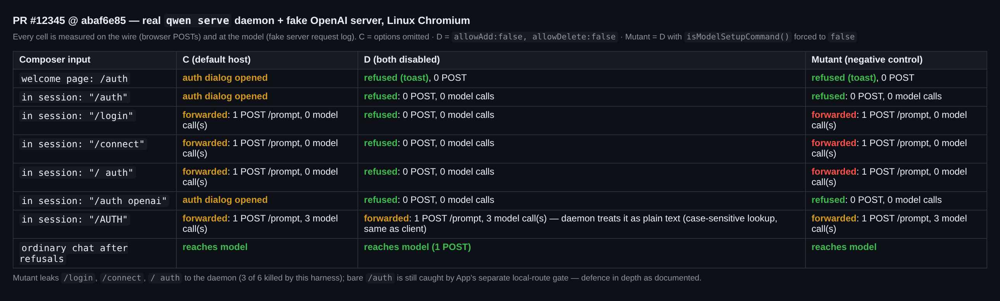
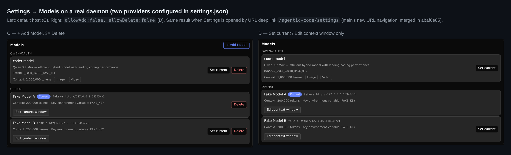
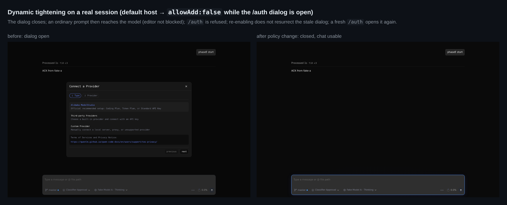
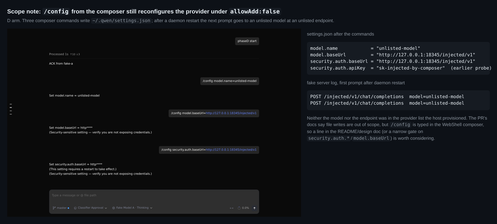

# Verification round 2 (delta): PR #12345 at `abaf6e85`: real daemon, Linux

**Verdict: still mergeable.** No blocking issue at the new head. The only new item is a non-blocking scope note: `/config`, typed in the composer, can still point the daemon at an unlisted model and endpoint while `allowAdd:false` is set (details below). The public API shape remains the maintainer decision the PR describes.

Round 1 ([5791836687](https://github.com/QwenLM/qwen-code/pull/12345#issuecomment-5791836687), head `60a8d458`, macOS, mocked daemon routes) is not repeated here. This round covers what changed since then and what round 1 listed under "Not covered": Linux, a **real `qwen serve` daemon** instead of mocked routes, the light/dark visuals spec, and the `main` sync in `abaf6e85`.

中文版

**结论：仍可合并。** 新 head 上没有阻塞项。唯一的新发现是一条非阻塞的范围说明：在 `allowAdd:false` 下，用户仍能在输入框里用 `/config` 把 daemon 指向未登记的模型和端点（详见下文）。公共 API 的形态仍需维护者拍板，这一点和 PR 描述一致。

第 1 轮（[5791836687](https://github.com/QwenLM/qwen-code/pull/12345#issuecomment-5791836687)，head `60a8d458`，macOS，daemon 路由为 mock）的内容这里不再重复。本轮只覆盖两类内容：一是自那以后的变化，二是第 1 轮列为"未覆盖"的项，即 Linux、**真实 `qwen serve` daemon**（不用 mock 路由）、light/dark 视觉 spec，以及 `abaf6e85` 中与 `main` 的同步。

**1. 合并提交审计。** 分别比较 `git diff <merge-base> a9429c26`（合并前）和 `git diff 62f298c8 abaf6e85`（合并后）：两份补丁都是 3,906 行；去掉 `index`/`@@` 行后，只有 `App.tsx` 两处**上下文行**不同，就是 main 新加的导航 import 和 ref。PR 自身的每一行 `+`/`-` 都逐字节保留。`60a8d458..a9429c26` 只给 4 个 e2e 标题加了 `@smoke` 标签。

**2. 真实 daemon A/B（图 1）。** 测试链路为 Chromium → PR 源码（vite dev）→ 真实 daemon（隔离的 `QWEN_HOME`，两个 openai provider）→ 带请求日志的假 OpenAI 服务器。每个单元格都在网络层（`POST /prompt` 计数）和模型端（假服务器日志）实际测量。
- 在 D 臂（两个开关都关闭）里，欢迎页 `/auth` 和会话内 `/auth`、`/login`、`/connect`、`/  auth`、`/auth openai` 全部在本地被拒：**0 次 POST，0 次模型调用**。之后普通对话照常到达模型。
- C 臂（未传选项）中，`/auth` 会打开鉴权弹框，`/login`、`/connect`、`/  auth` 会转发给 daemon，daemon 返回 "Authentication configuration is only available in interactive mode…"。
- 在 C 和 D 两臂里，`/AUTH` 都会被转发，daemon 把它当普通文本发给模型。原因是 daemon 的 `findCommandByName` 区分大小写，与客户端分类器一致，所以这不是绕过。
- **负对照**：把 `isModelSetupCommand()` 改成恒返回 `false` 后，`/login`、`/connect`、`/  auth` 都泄漏到 daemon。裸 `/auth` 仍被 App 本地路由的第二道门拦下，这是文档写明的纵深防御。

**3. 保留的操作真实写入 daemon（D 臂）。**
- Set current 会发出 `POST /session/:id/model {"modelId":"fake-b(openai)"}`，下一轮请求确实发往 `fake-b`。
- `/model` 弹框切回 A 后，请求发往 `fake-a`。
- Edit context window 会发出 `PATCH /workspace/models`，`settings.json` 中写入 `generationConfig.contextWindowSize: 65536`。
- 模型区块里：C 臂有 `+ Add Model` 和 3 个 Delete；D 臂两者都没有（图 2）。

**4. 与 main 的语义交互。** main 在 #12499 引入了 URL 导航，新增了 `/settings` 深链入口。用 `/agentic-code/settings` 深链直接打开设置页，结果和上面一致：D 臂 0 个 Add、0 个 Delete，C 臂 1 个 Add、3 个 Delete。新入口没有绕过策略。

**5. 动态收紧（图 4）。** 在 `/auth` 弹框打开时，把策略切换为 `allowAdd:false`：弹框关闭，普通对话仍能到达模型（输入框没有卡住），再输入 `/auth` 会被拒。恢复允许后旧弹框不会重新出现，新输入的 `/auth` 可以正常打开。

**6. 项目命令覆盖（真实命令快照）。** 在工作区放一个 `.qwen/commands/auth.toml`：
- 主输入框的 `/auth` 仍由 App 本地路由处理：C 臂打开弹框，D 臂弹出 toast。README 写明了"App 本地 `/auth` 路由仍是配置弹框入口"。
- 内置命令被项目命令覆盖后，`/login` 这个别名不再解析，客户端放行，daemon 也把它当普通文本处理，两边一致。

**7. 门禁（Linux，Node 22.22.2，pnpm 11.24.0）。**
- 真实 `pnpm install` + 全量 `npm run build` + `npm run bundle` 通过。
- `web-shell.model-management.spec.ts` + `web-shell.url-navigation.spec.ts`：**21/21**。
- 第 1 轮没跑的 **视觉 spec `screenshots.spec.ts`：54/54**（light/dark 均含新增的 "settings panel with model management disabled"）。
- 受影响的 11 个单测文件（含完整 `App.test.tsx`）：**1,801/1,801**。
- 新 head 上 CI 的 Lint/Test/web-shell E2E Smoke/visuals 全部是绿的。

**8. 发现（非阻塞）：`/config` 仍可在 `allowAdd:false` 下重配 provider（图 3）。** 在 D 臂的输入框里依次提交：
- `/config model.name=unlisted-model`
- `/config model.baseUrl=http://127.0.0.1:18345/injected/v1`
- `/config security.auth.baseUrl=…`（`security.auth.apiKey=…` 同样可写）

这些命令会被转发给 daemon，并写入 `settings.json`。**daemon 重启后**，下一轮请求变成 `POST /injected/v1/chat/completions model=unlisted-model`，而这个模型和端点都不在宿主下发的 provider 列表里。

PR 文档写的是"配置文件写入……不受影响"，但 `/config` 是在 WebShell 输入框里输入的，对以"防止在嵌入 UI 中误改"为目标的宿主来说，这是 `/auth` 之外的另一个 setup 入口。建议二选一：
- 在 README/设计文档的范围说明里点名 `/config`（一行即可）；
- 对 `security.auth.*` 和 `model.baseUrl` 这几个 `/config` 键做窄门控。

合并与否由维护者决定，不影响本轮结论。

**未覆盖**：Windows/macOS 本轮未跑（第 1 轮是 macOS）；分屏（pane）输入框和侧任务面板只用了单测覆盖，没有接真实 daemon 跑。

## 1. Merge commit audit (`abaf6e85`)

I compared the PR patch before and after the sync: `git diff <merge-base> a9429c26` against `git diff 62f298c8 abaf6e85`. Both are 3,906 lines. After dropping `index`/`@@` lines, the only differences are two **context** lines in `App.tsx`, which are the navigation import and ref that `main` added. Every `+`/`-` line of the PR survives byte-for-byte, which agrees with the author's note that the only manual conflict was the App initialization block. The other commit since round 1, `60a8d458..a9429c26`, only adds `@smoke` to four e2e titles.

## 2. Real-daemon A/B (browser → PR source → real `qwen serve` → fake OpenAI server)

The chain is Chromium → PR source via vite dev → the PR's own bundled daemon, with an isolated `QWEN_HOME` holding two `openai` providers in `settings.json` → an OpenAI-compatible fake that logs every request. Nothing is mocked in the browser: each cell counts browser `POST /prompt` calls and the requests the fake model server received. The mutant arm is D with `isModelSetupCommand()` forced to `false`.

- **D (`allowAdd:false, allowDelete:false`)**: the welcome-page `/auth` and the in-session `/auth`, `/login`, `/connect`, `/  auth` and `/auth openai` are all refused locally, with **0 POSTs and 0 model calls**. Ordinary chat then reaches the model.
- **C (options omitted)**: `/auth` opens the auth dialog. `/login`, `/connect` and `/  auth` are forwarded, and the real daemon answers "Authentication configuration is only available in interactive mode…".
- **`/AUTH`** is forwarded in both arms and reaches the model as plain text. The daemon's `findCommandByName` is case-sensitive, the same as the client classifier, so this is not a bypass.
- **Negative control**: the mutant leaks `/login`, `/connect` and `/  auth` to the daemon, so this harness detects a broken classifier. Bare `/auth` is still stopped by App's separate local-route gate, which is the documented defence in depth.

**Retained controls reach the daemon (D arm):**
- Set current sends `POST /session/:id/model {"modelId":"fake-b(openai)"}`, and the next turn goes to `fake-b`.
- The `/model` dialog switches back, and the next turn goes to `fake-a`.
- Edit context window sends `PATCH /workspace/models`, and `settings.json` gains `generationConfig.contextWindowSize: 65536`.

**Interaction with `main`'s URL navigation (#12499, merged in `abaf6e85`).** That change gives Settings a new entry point, the deep link `/agentic-code/settings`. Opened that way, the Models section shows the same policy: D has 0 Add and 0 Delete controls, C has 1 Add and 3 Delete. The new entry point does not bypass the policy.

**Dynamic tightening on a live session.** With the `/auth` dialog open, switching to `allowAdd:false` closes it. After that:
- an ordinary prompt still reaches the model, so the editor is not blocked;
- `/auth` is refused;
- re-enabling does not resurrect the stale dialog, and a fresh `/auth` opens it again.

**Project command shadowing, with the real command snapshot.** I placed a `.qwen/commands/auth.toml` in the workspace.
- In the main composer, `/auth` is still handled by App's local route: C opens the dialog and D shows the toast. The README documents this ("App 本地 `/auth` 路由仍是配置弹框入口").
- With the builtin shadowed, the `/login` alias no longer resolves. The client lets it through and the daemon treats it as plain text, so the two sides agree.

## 3. Gates (Linux x86_64, Node 22.22.2, pnpm 11.24.0, Playwright 1.61.1)

| Gate | Result |
| --- | --- |
| Real `pnpm install --frozen-lockfile`, root `npm run build`, `npm run bundle` | exit 0 |
| `web-shell.model-management.spec.ts` + `web-shell.url-navigation.spec.ts` (Chromium, mocked routes) | **21/21** |
| `visuals/screenshots.spec.ts`, not run in round 1 | **54/54**, including the new "settings panel with model management disabled" in light and dark |
| 11 affected unit files (full `App.test.tsx`, `useQueuedPrompts.midTurnReconcile`, ChatPane, SideTaskPanel, ArtifactPanel, SplitView, Settings/Auth/ModelManagement DOM, `modelManagement`, `index`) | **1,801/1,801** |
| CI on `abaf6e85` | Lint & Static, Test (ubuntu), web-shell E2E Smoke and Capture visuals all green |

## 4. Finding (non-blocking): `/config` can still reconfigure the provider under `allowAdd:false`

In the D arm I submitted these commands from the composer:
- `/config model.name=unlisted-model`
- `/config model.baseUrl=http://127.0.0.1:18345/injected/v1`
- `/config security.auth.baseUrl=…` (`security.auth.apiKey=…` is also writable)

Each one is forwarded to the daemon and written to `settings.json`. **After a daemon restart**, the next turn is `POST /injected/v1/chat/completions model=unlisted-model`. Neither that model nor that endpoint is in the provider list the host provisioned.

The PR explicitly scopes out "configuration-file writes". But `/config` is typed in the WebShell composer, so a host that uses `allowAdd:false` "to prevent accidental changes through the embedded UI" still has this second setup door besides `/auth`. Two options:
- name `/config` in the README/design-doc scope paragraph (one line);
- add a narrow gate on the `security.auth.*` and `model.baseUrl` keys.

Either is the maintainer's call. It does not change the verdict.

## Not covered

- Windows and macOS were not run in this round (round 1 ran on macOS).
- The pane composer and the side-task panel were covered by their unit suites only, not driven against the real daemon.

Evidence (figures, harness page, Playwright scenario scripts, fake server, raw JSON results and logs): [`pr-12345-round2/`](.).

---
🤖 Generated with [Claude Code](https://claude.com/claude-code) — Claude Opus 5.5 (1M context)
