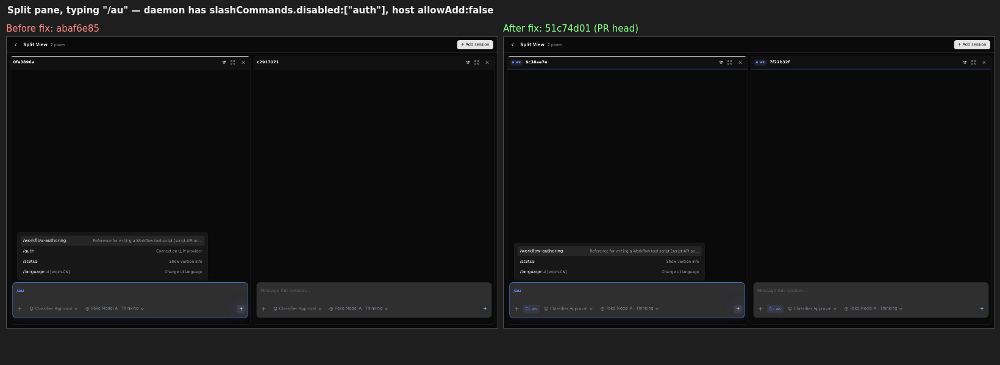
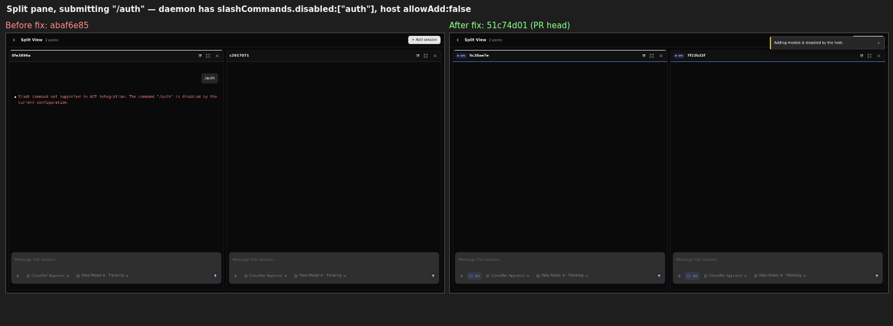
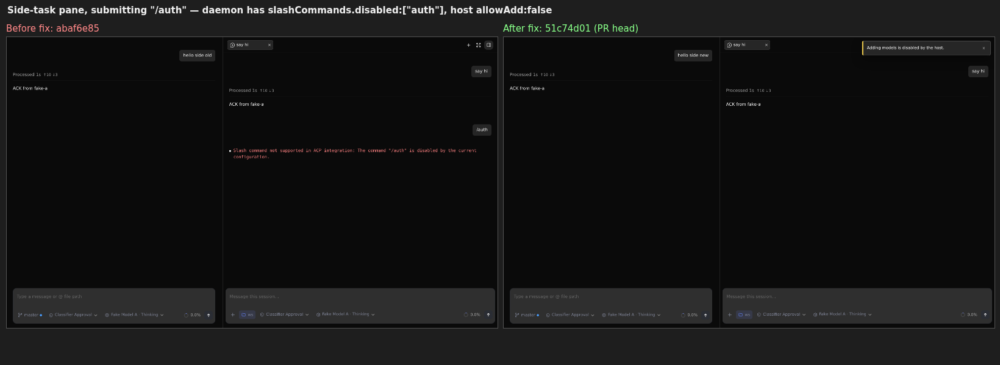

# Verification round 3 (delta): PR #12345 at `51c74d01`: real daemon, Linux

**Verdict: still mergeable.** The R6-1 fix (`b2c9d90f`, fail closed on a ready command snapshot that has no `auth` entry) does what it says against a real `qwen serve` daemon. It also closes two leaks on the main composer that R6-1 did not name. The `main` merge (`51c74d01`) is clean. No new blocking issue.

Rounds 1 ([5791836687](https://github.com/QwenLM/qwen-code/pull/12345#issuecomment-5791836687)) and 2 ([5797332888](https://github.com/QwenLM/qwen-code/pull/12345#issuecomment-5797332888), head `abaf6e85`) are not repeated. This round covers only `abaf6e85..51c74d01`, plus the item round 2 listed under "Not covered": the split-pane and side-task composers against a real daemon.

## 1. Merge audit (`51c74d01`)

I compared `git diff <merge-base> b2c9d90f` with `git diff 64ac2faa 51c74d01`, the PR patch before and after the sync (3,923 and 3,925 lines). After dropping `index`/`@@` lines, the only differences are in `client/index.tsx` and one `App.tsx` import context. `index.tsx` keeps the PR's `WebShellModelManagementOptions` export and main's message-navigation export, each once. Every PR `+`/`-` line survives. The PR's blank separator line in `index.tsx` is now context, because main supplies it.

## 2. Real-daemon A/B for R6-1

**Rig.** One real daemon bundled from `51c74d01`, one logging fake OpenAI endpoint, and two vite dev servers on the same daemon: **before** = `abaf6e85` (round-2 head, pre-fix) and **after** = `51c74d01`. The daemon settings use `slashCommands.disabled: ["auth"]`, which is the ready-but-auth-less snapshot R6-1 describes. The workspace has a project command `.qwen/commands/login.toml` that shadows the `login` alias. The host passes `modelManagement={allowAdd:false}`. Split panes are real sessions opened with `?split=a,b`, and side tasks come from `/btw side …`. Each row counts the browser's `POST /session/:id/prompt` requests. Every row ran twice (the second run was on a restarted daemon), with identical results.

| Surface / input (`allowAdd:false`) | Before `abaf6e85` | After `51c74d01` |
|---|---|---|
| Split pane, typing `/au` | menu lists `/auth` | `/auth` hidden |
| Split pane, submit `/auth` | **POST `/auth`**, no notice | refused with toast, 0 POST |
| Split pane, submit `/connect` | **POST `/connect`** | refused, 0 POST |
| Side-task pane, submit `/auth` | **POST `/auth`**, no notice | refused with toast, 0 POST |
| Main composer, submit `/connect` | **POST `/connect`** | refused, 0 POST |
| Main composer, `/btw side /auth` | **side task created and `/auth` POSTed into it** | refused, no side task |
| Main composer, menu `/au` and submit `/auth` | hidden and refused | hidden and refused (unchanged) |
| **Control:** project `login` shadow, `/login x` in split and side-task panes | runs (fake model receives `PROJECT-LOGIN-COMMAND ran with: x`) | **runs the same way** |
| **Control:** `allowAdd:true`, split pane `/auth` | listed, POSTed | listed, POSTed (unchanged) |

- **Blast radius before the fix matches R6-1's bound.** The daemon itself answered the leaked `/auth` with `The command "/auth" is disabled by the current configuration.` (left half of the screenshots), and the fake model saw 0 calls. So the pre-fix behavior was a policy/UX inconsistency, not a provisioning path.
- **Correction to R6-1's premise.** R6-1 says App is already fail-closed and only the panes leak. That holds for App's menu and for bare `/auth`, which App's local dialog route catches. But on `abaf6e85` the main composer also dispatched `/connect` and `/btw side /auth` (rows 5 and 6). Those go through the same `isModelSetupCommand`, so the shared-predicate fix closes them too. The unit tests do not pin these two App paths. Only the `modelManagement` and `ChatPane` tests kill the mutant (§3). A regression that reintroduced a per-call-site check in App would therefore not go red. This is optional hardening, not a merge condition.

## 3. Unit tests and mutant

- `modelManagement.test.ts`, `ChatPane.test.tsx`, `SideTaskPanel.test.tsx`: **219/219** at `51c74d01`.
- Mutant `if (!resolved) return false;` (reverting the new branch): exactly the 2 new tests go red (`fails closed when a ready snapshot carries no setup command at all` and `uses loaded missing identity for the auth menu and dispatch`), and 217 stay green. Restored afterwards; the tree is clean.
- CI on `51c74d01`: 13 pass, 8 skipped, `review-pr` pending.

## Still open (unchanged, not blocking)

- The public `WebShellModelManagementOptions` API shape is the maintainer decision (R2-8).
- Round 2's `/config` scope note (composer `/config model.baseUrl=…` under `allowAdd:false`) is deferred by the bot to `deferred-findings.json`, not fixed. It is still gate-or-document, the maintainer's call.

## Not covered

- The SSH workspace whitelist path (R6-1's second trigger). It feeds the same predicate the same snapshot shape (builtin entries, no `auth`), but it was not driven live.
- Windows/macOS. The Playwright `web-shell.model-management.spec.ts` was not rerun locally; CI covers it.
- Rig note, not a PR issue: once earlier runs hit the daemon's live-session cap (`maxSessions`, default 32), `POST /session` answers 503 and a pane opens with no command snapshot. The pre-ready path then refuses bare setup names, including a project `login` shadow. That is the documented "fail closed until the snapshot loads" behavior from round 1, unchanged here.

Evidence (figures, harness page, Playwright probes, fake server, settings, raw JSON/text results): this directory.
