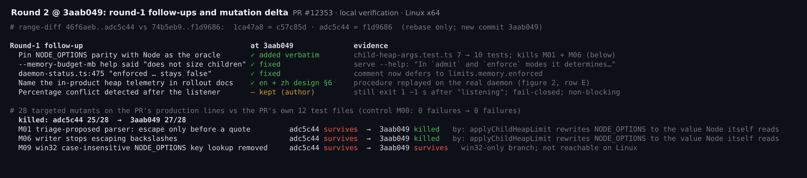
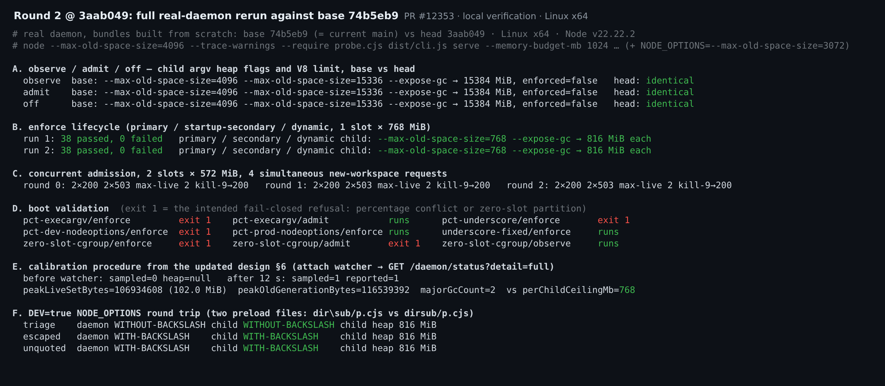

## Maintainer verification, round 2: `3aab049` (delta over [round 1](https://github.com/QwenLM/qwen-code/pull/12353#issuecomment-5772724630))

**Verdict: still mergeable from my side.** Every round-1 follow-up I asked for is in, and a full rebuild and rerun at `3aab049` matches round 1.

- **Rebase only.** `git range-diff` shows both original commits unchanged (`1ca47a8 = c57c85d`, `adc5c44 = f1d9686`). `child-heap-args.ts`, `spawnChannel.ts` and `child-heap-policy.ts` are byte-identical to `adc5c44`. The only new change is `3aab049`: one test, two corrected strings, and design §6 in English and Chinese (+28/−6).
- **Arms rebuilt from scratch.** I rebuilt head `3aab049` and base `74b5eb9` (the merge-base, which is current `main`), each with a real `pnpm install --frozen-lockfile`, build and bundle. The harness is the same as in round 1.

| Round-1 item | At `3aab049` | How I checked |
| --- | --- | --- |
| Pin `NODE_OPTIONS` parity with Node as the oracle | added verbatim | `child-heap-args.test.ts` went from 7 to 10 tests, all pass. Mutants M01 (the triage-proposed parser) and M06 (the writer stops escaping `\`) are now killed, by exactly these cases. Overall: 25/28 → **27/28** killed |
| `--memory-budget-mb` help said the budget does not size children | fixed | The built `serve --help` now says: "In `admit` and `enforce` modes it determines managed ACP child capacity; `enforce` also applies the modeled per-child old-space ceiling." |
| Stale "`enforced` … stays `false`" comment in `daemon-status.ts` | fixed | read the diff |
| Rollout docs should name the heap telemetry | design §6, English and Chinese | I replayed the documented steps on the real daemon. Before a watcher is attached: `sampled: 0, heap: null`. With one SSE watcher, 12 s later: `sampled: 1, reported: 1, peakLiveSetBytes` ≈ 102 MiB, beside `perChildCeilingMb: 768` |
| Percentage conflict is detected after the listener | unchanged (author's call) | Still exits 1 about 1 s after `listening`, with the same clear message. This is fine by me |

Rerun at `3aab049`; everything matches round 1:

- **Tests.** The PR's 12 test files pass: 140 + 2077 tests, including an ordinary full `server.test.ts` run at 1319/1319. `eslint --max-warnings 0` and prettier are clean on the 21 changed TS files (27 files for prettier).
- **`observe` / `admit` / `off`.** Child heap flags, the V8 limit (15384 MiB) and `enforced: false` are identical to base `74b5eb9`.
- **`enforce` lifecycle.** 38/38 checks in both of 2 runs. Every primary, startup-secondary and dynamic child gets exactly `--max-old-space-size=768 --expose-gc`, and its V8 limit is 816 MiB.
- **Concurrent admission.** 3/3 rounds gave 2 × 200 and 2 × 503, never more than 2 live children, and `kill -9` freed a slot. All 9 boot-matrix cases gave the same outcomes as round 1. In the three `DEV=true` `NODE_OPTIONS` shapes, the daemon and the child loaded the same preload file.
- **CI on `3aab049`.** 20 checks succeeded and 3 were skipped: the macOS and Windows `Test` jobs, and CLI integration. The web-shell E2E smoke was still running when I checked. The Java 21 job that failed on the earlier head is green now.

**Still not verified** (unchanged from round 1):

- Windows and macOS at runtime.
- Real-model GC and latency cost, and multi-hour stability.
- M09, the win32 case-insensitive key lookup, still survives, but that code path cannot run on Linux.

Evidence: [`pr-12353-round2/`](.); the round-1 harness and oracle are in [`pr-12353/`](https://github.com/wenshao/qwen-code/tree/23298692b1a8f8dd23828d7674f4aa2230ba33b7/pr-12353).
