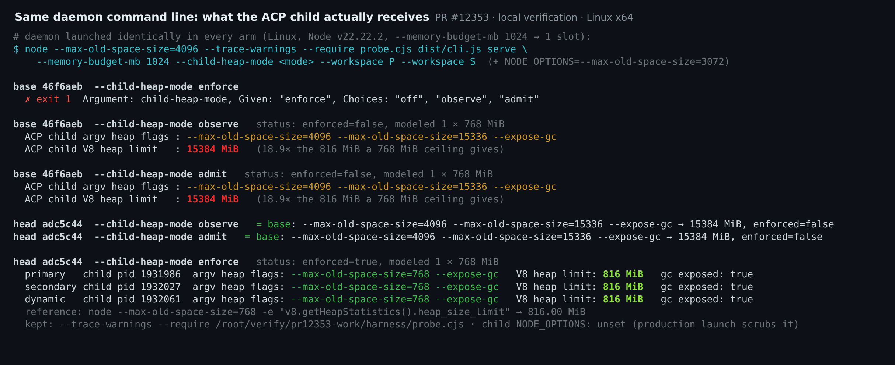
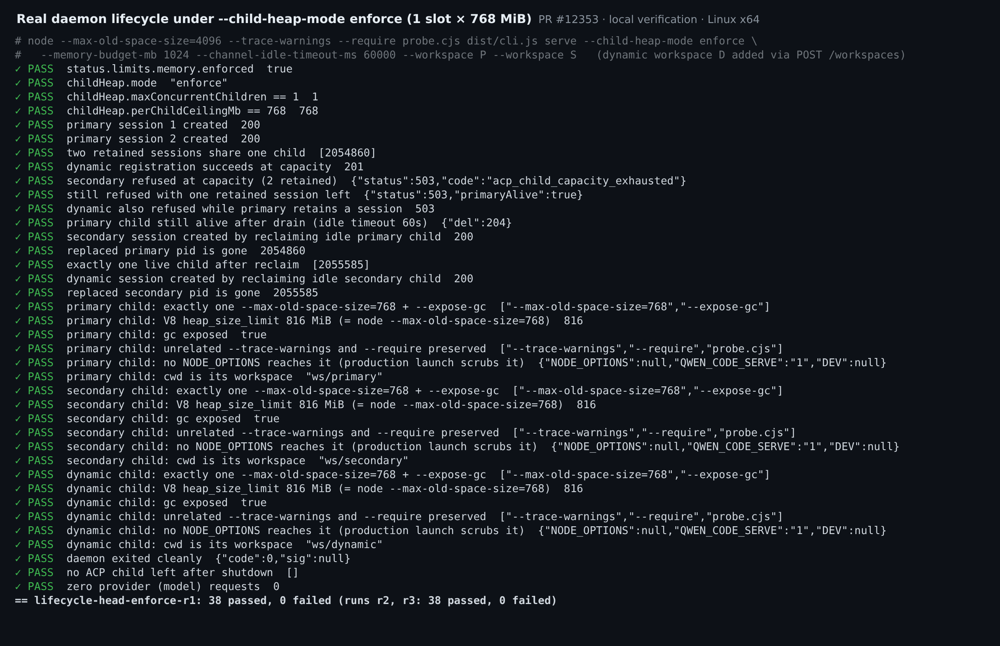
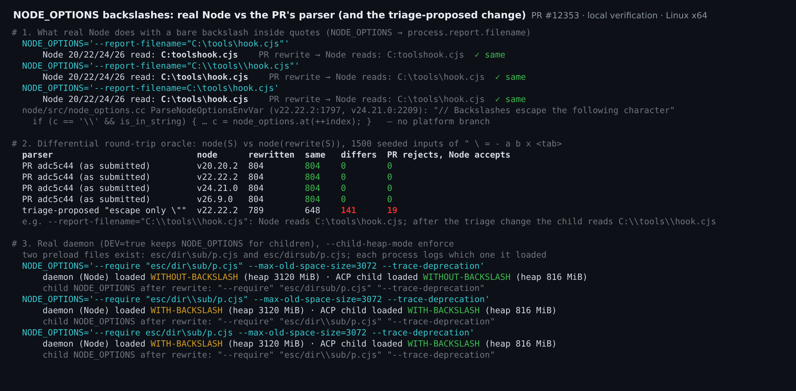
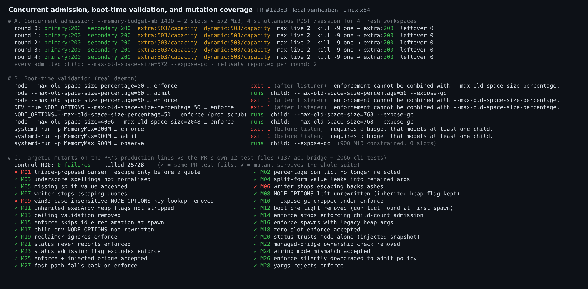

## Maintainer verification: real build and real daemon on Linux (`adc5c44`)

**Verdict: mergeable from my side.** I found no blocking defect. `enforce` does what the PR says on a real daemon. Every managed ACP child gets exactly one `--max-old-space-size=<ceiling>`, and the child's own V8 limit matches a plain `node --max-old-space-size=<ceiling>`. The default modes behave exactly as they do on base. The same results hold after a local merge with current `main`.

On the triage `parseNodeOptions` finding: the author already answered it above from the Node 22 source. I confirmed that answer independently on four Node versions. I also found that the fix the bot proposes would introduce the very bug it describes, and CI would stay green. Please don't change the parser. I'd add the small parity test in §1 instead.

### What I ran

- **Arms.** I built three trees, each with a real `pnpm install --frozen-lockfile`, a full `npm run build` and `npm run bundle`: base `46f6aeb` (the merge-base), head `adc5c44`, and a local test merge of head into current `main` `a64d8de` (57 commits ahead). All ran on Linux x64 with Node v22.22.2.
- **Daemon.** Each daemon ran from its bundle as `node --max-old-space-size=4096 --trace-warnings --require probe.cjs dist/cli.js serve …` with `NODE_OPTIONS=--max-old-space-size=3072`. Each run had an isolated `QWEN_HOME`, trusted temp workspaces, loopback with a token, and a fake provider that records every request (the lifecycle and A/B runs made zero provider requests).
- **Ground truth.** Child arguments come from `/proc/<pid>/cmdline`. The V8 limit comes from the child itself: the `--require` probe travels in the inherited execArgv into every ACP child and records `v8.getHeapStatistics().heap_size_limit`.

| Check | base `46f6aeb` | head `adc5c44` | head merged into `main` |
| --- | --- | --- | --- |
| PR's 12 test files (4 acp-bridge, 8 cli, including all of `server.test.ts`) | — | 137 + 2066 pass | 137 + 2077 pass |
| `eslint --max-warnings 0` and prettier on the 21 changed TS files (27 files for prettier) | — | clean | — |
| `enforce` lifecycle: primary, startup-secondary and dynamic workspaces, 1 slot × 768 MiB | `enforce` rejected by yargs | 38/38 checks, 4 runs | 38/38 |
| Child heap under `enforce` (including the boot-time preheated primary) | — | exactly `--max-old-space-size=768 --expose-gc`; V8 limit **816 MiB**, same as `node --max-old-space-size=768` | same |
| `observe` / `admit` / `off` child args and `enforced` | `4096` + `15336` flags, V8 limit **15384 MiB**, `false` | identical to base | identical |
| Concurrent admission: 2 slots, 4 simultaneous requests for new workspaces | — | 5/5 rounds: 2 × 200 and 2 × 503 `acp_child_capacity_exhausted`; never more than 2 live children; `kill -9` on a child frees its slot; no leftovers | 3/3 |
| Boot validation: percentage flag in argv, underscore spelling, `DEV` `NODE_OPTIONS`; zero-slot host via cgroup `MemoryMax=900M` | — | all fail closed with the intended message; `admit` and `observe` unaffected | same |
| 28 targeted mutants on the PR's production lines | — | 25 killed (unmutated control: 0 failures) | — |





### 1. NODE_OPTIONS backslashes: the parser is correct; please don't apply the suggested fix

- **Real Node.** Node 20.20.2, 22.22.2, 24.21.0 and 26.9.0 all read `--report-filename="C:\tools\hook.cjs"` as `C:toolshook.cjs`. `ParseNodeOptionsEnvVar` consumes whatever character follows a backslash inside quotes, and it has no platform branch. The PR's parser mirrors it line for line.
- **Differential oracle.** I generated 1,500 seeded strings from `" \ = - a b x <tab>` and compared `node(S)` with `node(rewrite(S))`. On all four Node versions there were 0 differences and 0 cases where the PR rejected a string that Node accepts.
- **Real daemon.** I ran with `DEV=true`, the only launch mode in which `NODE_OPTIONS` reaches children. Two preload files existed, `dir\sub/p.cjs` and `dirsub/p.cjs`. For the bare-backslash-in-quotes, escaped-in-quotes and unquoted shapes, the daemon and the child loaded the same file every time. The inherited `--max-old-space-size=3072` was removed, and the child heap limit was 816 MiB.
- **The triage-proposed change** ("escape only before `"`") breaks 160 of the 1,500 inputs on Node 22: 141 values change and 19 valid strings are rejected. For example, a correctly escaped `"C:\\tools\\hook.cjs"` would reach the child as `C:\\tools\\hook.cjs`.
- **Test gap.** That change survives the PR's whole suite (mutant M01). So does removing the writer's backslash escaping (M06). Linux CI never puts a backslash in a path, and the Windows `Test` job is skipped on this PR.

This test uses Node itself as the oracle, so it runs the same on every platform. I verified that it passes on head and fails on both M01 and M06 ([diff](patch/suggested-test.diff)):

```ts
  it.each([
    '--report-filename="C:\\tools\\hook.cjs"',
    '--report-filename="C:\\\\tools\\\\hook.cjs"',
    '--report-filename=C:\\tools\\hook.cjs',
  ])('rewrites NODE_OPTIONS to the value Node itself reads: %s', (value) => {
    const read = (nodeOptions: string) =>
      execFileSync(
        process.execPath,
        ['-e', 'process.stdout.write(process.report.filename)'],
        {
          env: { ...process.env, NODE_OPTIONS: nodeOptions },
          encoding: 'utf8',
          timeout: 10_000,
        },
      );
    const env = { NODE_OPTIONS: value };
    applyChildHeapLimit([], env, 544);
    expect(read(env.NODE_OPTIONS)).toBe(read(value));
  });
```

**How far this reaches.** In any launch without `DEV=true`, `NODE_OPTIONS` never reaches an ACP child. `scrubInheritedLoaderEnv` removes it from the daemon's base env, and project `.env` / `settings.env` loading skips it via `isLoaderEnvKey`. I checked this directly: the children's `/proc/<pid>/environ` has no `NODE_OPTIONS`, and a percentage flag placed in production `NODE_OPTIONS` never even reaches the conflict check. In production the heap flags that matter arrive through `process.execArgv`, and the lifecycle above covers that path. The rewrite matters only for `DEV` launches and embedded callers that pass their own `sourceEnv`.



### 2. The per-child peak measurement already exists

Both the triage and the reply above describe per-child peak telemetry as missing, or as follow-up work. The daemon already publishes it (#9380). I attached one SSE watcher to a daemon running `enforce` and read `GET /daemon/status?detail=full`. It reported `runtime.memory.children.heap = { peakLiveSetBytes: 106139648 (≈101 MiB), peakOldGenerationBytes: 113106944, majorGcCount: 2, majorGcMs: 14.8, reported: 1 }` beside `limits.memory.childHeap.perChildCeilingMb: 768`.

The figure is a maximum across the sampled children, and the daemon samples only while a watcher is attached. Even so, it is exactly the "old-generation peaks, major GC" data that the rollout step in design §6 asks operators to record. I'd name this path in the rollout docs, so that calibration becomes a status read rather than external tooling. On that basis I'm fine with shipping `enforce` as an opt-in mode.

### 3. Non-blocking nits

- `packages/cli/src/commands/serve.ts:500`: the `--memory-budget-mb` help still says "It does not change how any `qwen --acp` child is sized; the one consumer today is adaptive live-journal growth". Under `enforce` the budget sizes every child, and under `admit` it sets the child count. `docs/users/qwen-serve.md` was updated; the CLI help was not.
- `packages/cli/src/serve/daemon-status.ts:475`: "see `limits.memory.enforced`, which stays `false`" is now stale.
- The percentage conflict is detected only when the deferred runtime is built, after the listener is up. The daemon prints `listening on …`, then exits 1 about a second later with `runtime startup failed after listener was ready: ACP heap enforcement cannot be combined with --max-old-space-size-percentage.` This fails closed and the message is clear. Moving the check earlier only matters if a supervisor treats "listening" as healthy. A zero-slot partition already fails before the listener starts.



### Not verified

- Windows and macOS at runtime. I ran Linux only; Node's tokenizer has no platform branch, but I did not run it on Windows.
- Real-model workloads, GC and latency cost, and multi-hour stability.
- The two macOS HTTP status mismatches in the PR body. On Linux an ordinary full `server.test.ts` run passed 1315/1315 on head and 1319/1319 on the merge.
- Mutant M09 (win32 case-insensitive key lookup) survives, but that code path cannot run on Linux.

The harness, mutant driver, oracle and raw JSON are in [`pr-12353/`](.).
