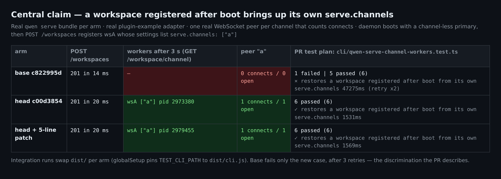
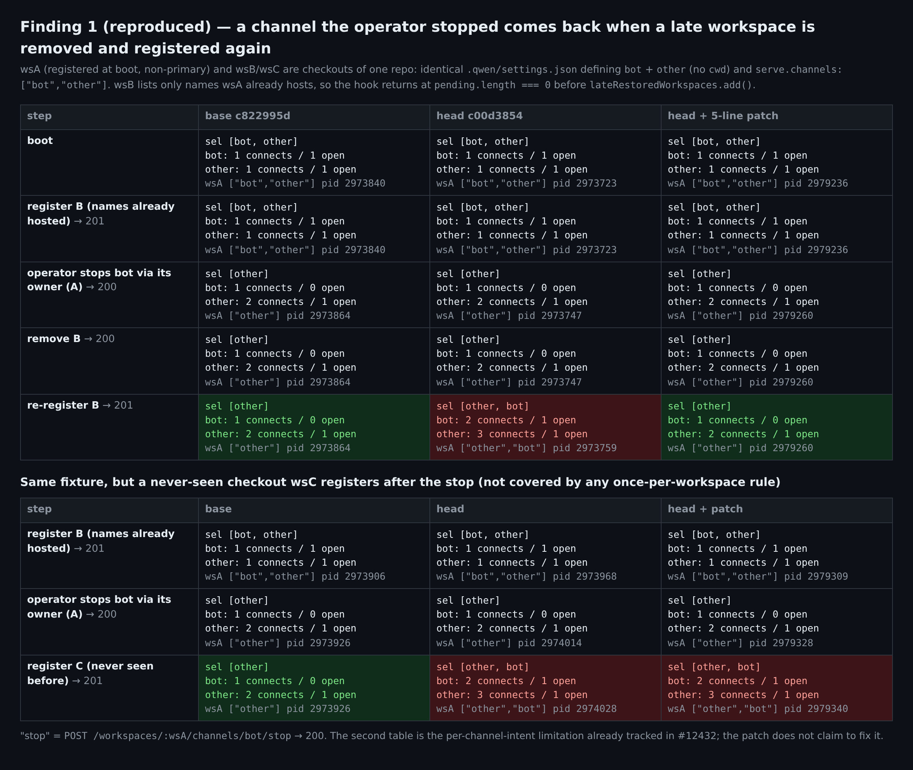
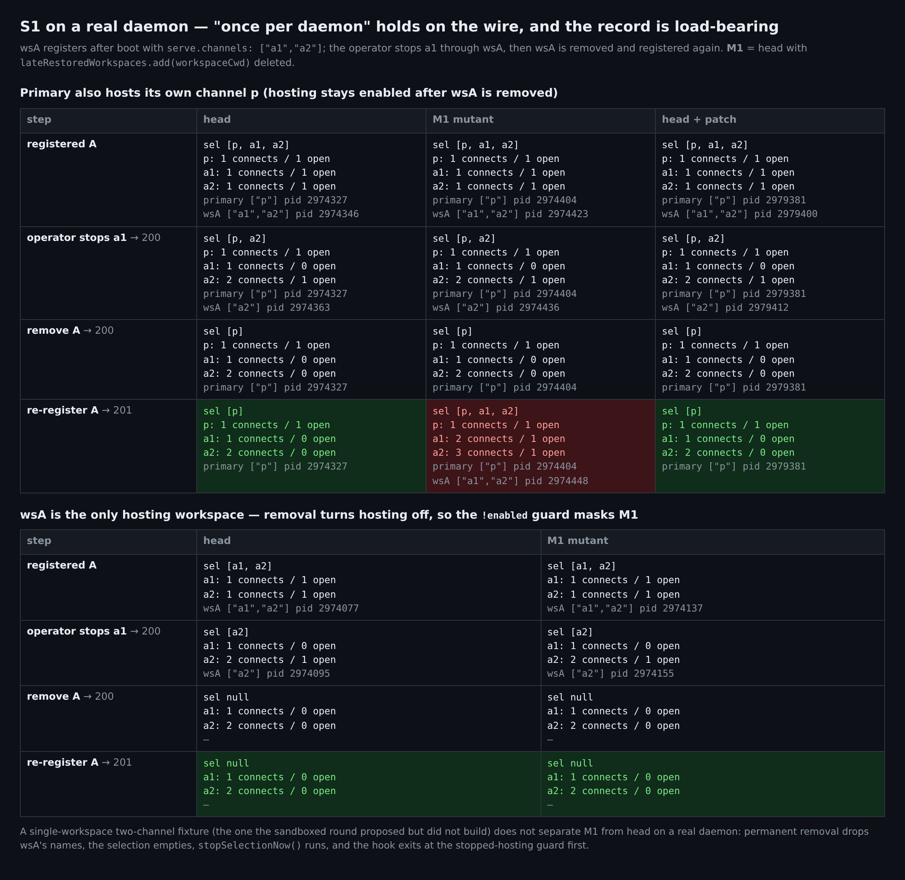
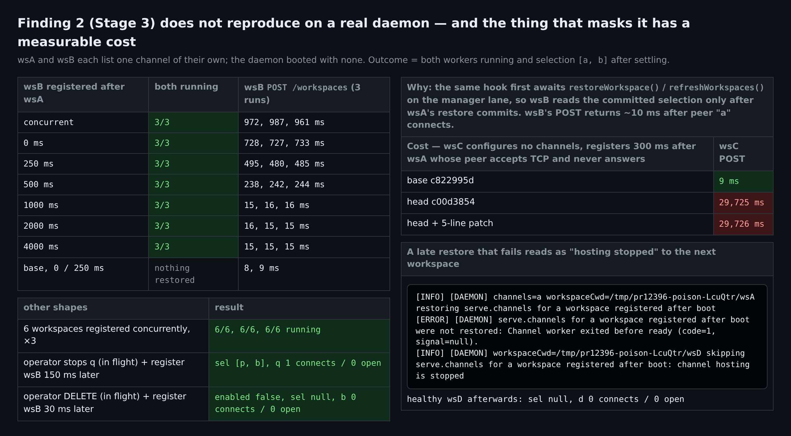
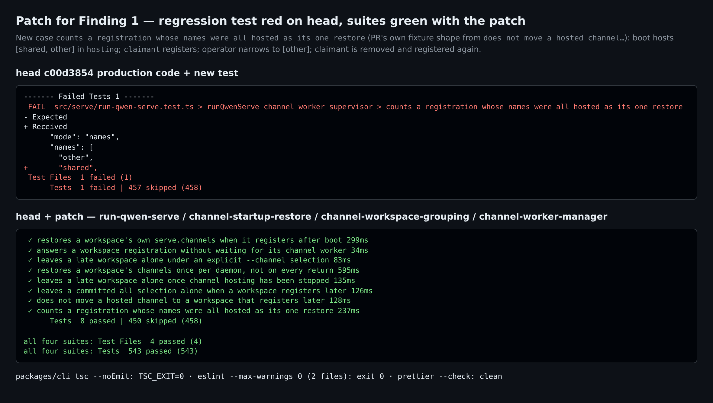

## 维护者验证 —— 真实 daemon，head `c00d385`

我在本地构建了这个 PR，并为每个臂驱动一个真实的 `qwen serve` daemon。主要目标有两个：一是实测 Stage 3 评审里的两条 Critical 发现（此前只做过静态追踪，从未运行），二是沙箱验证连续五轮都没覆盖到的 S1。本评论只写之前各轮没有确立的东西。

**结论（我个人的判断）：打上一个 5 行修复后可合入（补丁见下，已验证）。**

- Stage 3 **发现 1 在真实 daemon 上复现**。操作者停掉一个频道后，把一个"名字全都已被托管"的晚注册 workspace 移除再注册，这个频道会被重新拉起。base 上停止保持有效。
- Stage 3 **发现 2 未复现**：21 次成对注册、3 轮各 6 个并发注册、操作者 stop/DELETE 在途时注册，全部 0 失败。我不会因此阻塞。但它没有复现的原因本身有代价（下文有实测），这个代价应当写进 PR 正文，或者记入 #12432。

| 主张 / 发现 | 真实 daemon 结果 |
| --- | --- |
| 中心主张：晚注册的 workspace 拉起自己的 `serve.channels` | ✅ head：worker 运行，对端被连上。base：什么都没有。测试计划 E2E：head **6/6**，base **5/6**（只有新用例失败，共 3 次尝试），head + 补丁 **6/6** |
| Stage 3 发现 1：名字全都已被托管时，"每 daemon 一次"的记录被跳过 | ❌ **复现**。head 复活了被停掉的 `bot`（`sel [other] → [other, bot]`，owner 的 worker 被重启）。base 与 head + 补丁都保持停止 |
| Stage 3 发现 2：前后脚的两次注册互相拆台 | ✅ **未复现**。钩子里既有的 `await restoreWorkspace()/refreshWorkspaces()` 会把第二个钩子扣住，直到第一次恢复提交 |
| 这层遮蔽的代价：第二个注册要等第一个的 worker 启动 | ⚠️ **已实测**。在一个对端卡死的 workspace 注册 300 ms 后，再注册一个**没配任何频道**的 workspace：`POST /workspaces` 在 head 上耗时 **29,725 ms**，base 上 **9 ms** |
| 沙箱 S1（停掉两个频道之一 → 移除 → 重注册） | ✅ head 上保持停止。M1（删掉记录）会复活该频道，但**只有**在另一个 workspace 让托管保持开启时才会 |

### 环境与臂

Linux x86_64，Node v22.22.2。`pnpm install --frozen-lockfile` → `npm run build` → `npm run bundle`。本 PR 只改了一个生产文件 `packages/cli/src/serve/run-qwen-serve.ts`，所以每个臂都是在 head 树上只替换这一个文件，再跑 `esbuild` + `copy_bundle_assets`：

| 臂 | chunk |
| --- | --- |
| head | `run-qwen-serve-3Y3UMMS2.js`。esbuild 重建产物与完整 `npm run bundle` 的产物逐字节一致，sha256 `39669f79…` |
| base | merge-base `c822995d`，`ZBOGR544` |
| M1 | head 删掉 `lateRestoredWorkspaces.add(workspaceCwd)` |
| head + 补丁 | `4BR4CFW7` |

所有判据都在线级：

- 每个臂的 bundle 起一个真实 daemon
- 真实的 `plugin-example` 适配器
- 每个频道一个真实 WebSocket 对端，记录每次连接和断开
- 通过 `QWEN_CODE_TRUSTED_FOLDERS_PATH` 配置的真实文件夹信任
- 状态从 `GET /workspace/channel` 读取

E2E 每臂替换一次 `dist/`，因为 `integration-tests/globalSetup.ts` 把 `TEST_CLI_PATH` 钉死为 `dist/cli.js`。我第一次尝试时设置了 `TEST_CLI_PATH`，结果两次静默地跑了同一个 bundle。

### 发现 1 —— 已复现，5 行修复

**夹具**：同一仓库的两个 checkout：

- `wsA` 在启动时注册，是非主 workspace。
- `wsB` 之后才注册。
- 两者的 `.qwen/settings.json` 完全相同：定义 `bot` 和 `other`（都没有 `cwd`），`serve.channels: ["bot","other"]`。

**步骤**：

1. `wsB` 注册。它列出的名字都已被托管，钩子在 `pending.length === 0` 处返回，走不到 `lateRestoredWorkspaces.add()`。
2. 操作者执行 `POST /workspaces/:wsA/channels/bot/stop` → 200。因为还剩 `other`，托管保持开启。
3. 移除 `wsB`，再注册一次。

| 重注册 wsB 之后 | selection | 对端 `bot` | wsA 的 worker |
| --- | --- | --- | --- |
| base `c822995d` | `[other]` | 连接 1 次 / 在线 0 | pid 不变 |
| **head `c00d385`** | **`[other, bot]`** | **连接 2 次 / 在线 1** | **被重启**（2973747 → 2973759） |
| head + 补丁 | `[other]` | 连接 1 次 / 在线 0 | pid 不变 |

这与 `docs/users/qwen-serve.md` 及设计文档写下的保证相矛盾：「registering it again later … does not repeat the restore, so a channel you stopped in between stays stopped」。

**修复**：只要 workspace 列了任何频道，就在过滤掉已托管名字**之前**记为已恢复。没有 `serve.channels` 的 workspace 在记录之前就返回，所以 Stage 3 提到的取舍不会出现：之后才加上 `serve.channels` 的 workspace，重注册时照样恢复。这一点由代码结构保证，我没有实测。

```diff
         const requested = startupChannelsForWorkspace(workspaceCwd);
+        if (requested.length === 0) return;
+        // Recorded before the hosted names are filtered out: a workspace whose
+        // every name was already hosted has had its restore, and coming back
+        // later must not bring up a name an operator stopped in between.
+        lateRestoredWorkspaces.add(workspaceCwd);
         const committed =
           committedSelection?.mode === 'names' ? committedSelection.names : [];
         const pending = requested.filter((name) => !committed.includes(name));
         if (pending.length === 0) return;
-        lateRestoredWorkspaces.add(workspaceCwd);
```

**回归单测**：新增 `counts a registration whose names were all hosted as its one restore`，沿用你 `does not move a hosted channel…` 用例的夹具。操作者的停止用 `PUT /workspace/channel` 收窄到 `[other]` 来表达。结果：

| 运行 | 结果 |
| --- | --- |
| 新用例跑在 head 上 | **变红**：`names: ["other", + "shared"]` |
| 新用例跑在打补丁后的代码上 | 变绿 |
| 打补丁后跑 `run-qwen-serve` / `channel-startup-restore` / `channel-workspace-grouping` / `channel-worker-manager` | **543/543** |
| `tsc --noEmit`（packages/cli） | exit 0 |
| `eslint --max-warnings 0` | exit 0 |
| `prettier --check` | 通过 |
| 在补丁代码上再删掉记录（M1） | 新用例**失败**；`restores a workspace's channels once per daemon…` 仍然通过 |

最后一行很关键：M1 在现有套件下是存活的（沙箱那轮 457/457）。钉住它的是这个新用例。含测试的完整 diff 在证据目录的 `fix-f1.patch`。

### Stage 3 发现 2 —— 未复现，以及原因

**夹具**：`wsA` 与 `wsB` 各列一个自己拥有的频道。daemon 启动时没有任何频道。

| wsB 在 wsA 之后多久注册 | 两个 worker 都运行 | wsB 的 `POST /workspaces` |
| --- | --- | --- |
| 并发 | 3/3 | 961–987 ms |
| 0 ms | 3/3 | 727–733 ms |
| 250 ms | 3/3 | 480–495 ms |
| 500 ms | 3/3 | 238–244 ms |
| ≥ 1000 ms | 9/9 | 15–16 ms |
| base，0 / 250 ms | 什么都没恢复 | 8–9 ms |

**其他形状**：

- 6 个并发注册：3 轮都是 6/6 运行。
- 操作者 stop `q`（仍在途），150 ms 后有 workspace 注册：selection 最终为 `[p, b]`，`q` 保持停止。
- 操作者 `DELETE /workspace/channel`（仍在途），30 ms 后有 workspace 注册：托管保持关闭。

**为什么不复现**：manager 已经存在时，同一个钩子会先 await `channelWorkerManager.restoreWorkspace()` 和 `refreshWorkspaces()`。两者都排在 manager lane 上、在途恢复的后面，所以 `wsB` 读 `state()` 的时候，`wsA` 的选择已经提交了。全部 12 次重叠运行中，第二个注册的 POST 都在第一个 workspace 的对端连上后 10–11 ms 返回。

**剩余窗口**：如果第二次激活在 daemon 的**第一个** manager 被创建之前进入钩子（即 `wsA` 的钩子返回之后、`ensureChannelWorkerManager` 完成赋值之前），它仍会读到旧状态。这是推演，没有观测到。TLS 模式下创建 manager 时会多一次实时握手探测，可能把窗口拉宽；TLS 我没有测。

### 这层遮蔽的代价 —— 注册会排在别的 workspace 的频道启动后面

**夹具**：`wsA` 的频道对端接受 TCP 但永远不回应 upgrade。`wsC` **完全不配频道**，在 `wsA` 注册后 300 ms 注册。

| 臂 | wsC 的 `POST /workspaces` |
| --- | --- |
| base | **9 ms** |
| head | **29,725 ms** |
| head + 补丁 | 29,726 ms |

daemon 日志显示，`wsC` 的请求在 `serve.channels … were not restored: Channel worker did not become ready within 30000ms` 之后 1 ms 完成。

这就是 rev1 测到的旁观者阻塞（29.9 s），只是往后挪了一次注册。`void` 保护了发起注册的那个 workspace；下一次注册的钩子仍然在持有 runtime-topology 闸门的情况下 await lane。而新加的注释说 detach 恰恰是为了避免这种情况（"every other registration … queues behind it, including workspaces that configure no channels at all"）。

对端健康时，阻塞时长就是一次 worker 启动剩下的时间：上表中是 0.2–1 s。所以我不会因此阻塞合入。但 PR 正文里「`POST /workspaces` itself is not slower」只对第一次注册成立，应当更正，或记入 #12432。

这两件事是耦合的：把既有的 await 分离掉可以消除阻塞，但也会拿掉目前遮住发现 2 的那道屏障。要修这个阻塞，必须同时把选择差分挪到 manager lane 内部计算。

### 非阻塞观察

- **一次失败的晚恢复会被下一个 workspace 当成"托管已停止"**。`wsA` 的频道指向一个已关闭的端口，恢复失败。之后健康的 `wsD` 注册时被跳过，日志为 `skipping serve.channels … channel hosting is stopped`，`d` 从未被连上。没有任何人停过托管。base 同样不会恢复 `wsD`，所以这是新功能的缺口而非回归。它就是 Stage 3 说的"守卫分不清操作者停止与本功能自身的启动"，只是以"失败"而不是"在途"的形式被测出来。
- **从未见过的同仓兄弟 checkout 会复活被停掉的频道**。夹具与发现 1 相同，但在停止之后注册一个全新的 `wsC`：head **和** head + 补丁都会把 `bot` 拉回来，base 保持停止。这是你已经列进 #12432 的逐频道意图限制，这里不要求处理。如果以后想要一个低成本的收窄：只恢复"解析后 owner 就是注册者本身"的名字。这一条单独也能修掉发现 1。
- **S1 真实 daemon 结果**。当主 workspace 也托管着 `p` 时，head 在移除再注册后保持 `a1` 停止，M1 会复活它（`a1` 连接 2 次 / 在线 1）。
  - 沙箱那一轮提出、但没有构建的"单 workspace 两频道"夹具，在真实 daemon 上**分不出** M1 和 head。永久移除会删掉 `wsA` 的名字，选择变空，执行 `stopSelectionNow()`；钩子随后先在"托管已停止"守卫处退出，M1 的日志里正是 `hosting is stopped`。
  - 按文档，操作者从未停过的 `a2`，在移除再注册后同样不会回来。
- `restoring channels from workspace serve.channels` 这条日志会打出 `requestedByWorkspace="[object Object]"`。它早于本 PR，来自 #12385。

### 未覆盖

- macOS 与 Windows。
- TLS 模式。
- 信任重新物化触发的激活路径，我没有驱动。
- 真实第三方适配器；我只用了 `plugin-example`。
- 发现 2 的剩余窗口：没有注入延迟去强制触发。
- 有频道启动在途时的 SIGTERM：没有复测。

### 证据

证据目录：`wenshao/qwen-code` 的 `asserts` 分支下的 `pr-12396/`。里面有 `harness/probe.mjs`（12 个场景）、各臂构建脚本、`facts.json`（上文所有数字）以及每次运行的 JSON。图表由 `facts.json` 生成，不是手填的。






