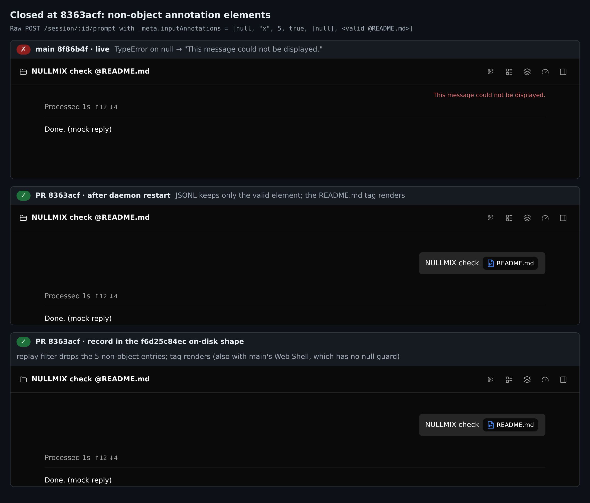
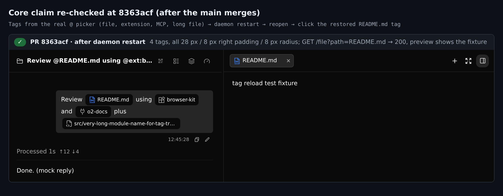
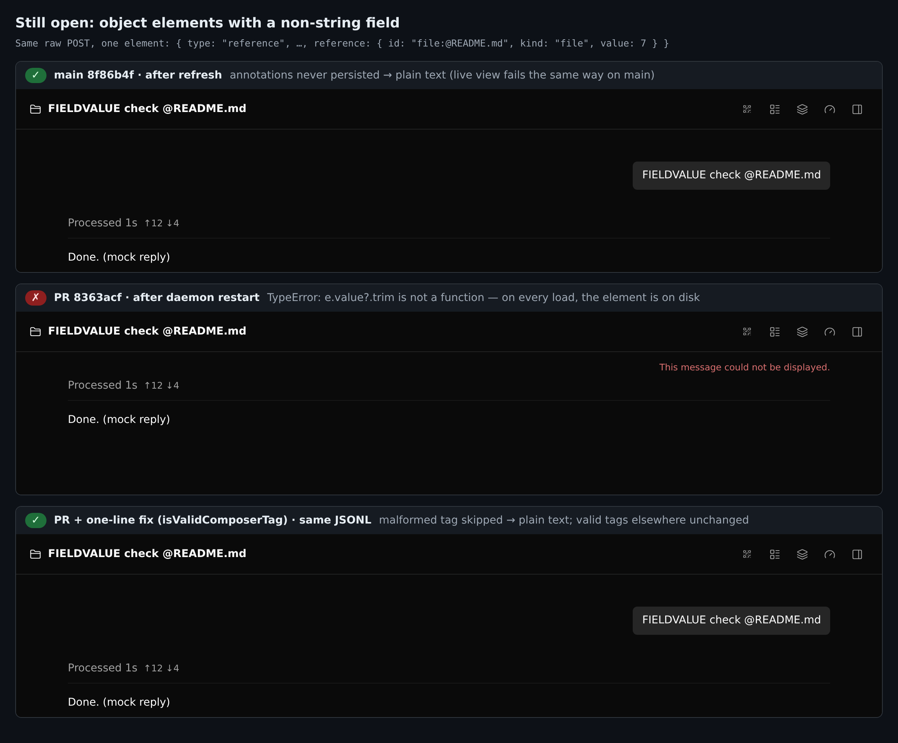

## 本地运行时验证，第 2 轮（仅增量）— PR #12404 @ `8363acf1a8`

本轮只看[第 1 轮](https://github.com/QwenLM/qwen-code/pull/12404#issuecomment-5761788081)（`f6d25c84ec`）之后的改动。

**结论：仍建议合并。**

- **第 1 轮提出的两项加固都已修复**，我在真实 daemon 上做了验证：
  - 非对象元素（§6a）在记录、回放、渲染三处都会被丢弃。
  - 数量上限（§6b）生效：257 个及以上元素完全不会持久化。第 1 轮那条 9,301 个元素（10.3 MB）的记录，现在只有 430 字节。
- **核心主张在两次合入 main 之后依然成立。** 选择器生成的 4 个标签在刷新和 daemon 重启后都保留，文件预览返回 200。
- **还剩一个与 §6a 同类的问题（不阻断）。** 如果元素是**对象**，但 `label`、`value` 或 `serialized` 不是字符串，它能通过所有新过滤。它会被持久化，之后每次加载都渲染失败。这一点纠正了沙箱 triage 轮 F1 的结论（“不构成渲染漏洞”）。一行修复已验证，建议一并合入（§2）。
- **几处小的后续项，都不阻断：**
  - 实时回显没有过滤（§3）；
  - 重试路径上的标题输入变化（§4）；
  - 上限边界缺测试（§5）。
- **顺带进来的测试修复 `d9b55cd629` 是正确的**（§6）。

### 第 1 轮之后的改动

- **`72518f83cb`：** 在三处校验注解元素：
  - 记录时（`readDaemonInputAnnotations`：只保留对象元素，最多 256 个）；
  - 回放时（逐个元素做 `isObjectRecord` 检查）；
  - 渲染时（null 防护）。

  同一提交还新增了共享常量 `DAEMON_INPUT_ANNOTATIONS_META_KEY`，恢复了 `/advisor` 的“无 payload”测试钉子，并更新了文档。
- **`d9b55cd629`：** 只改测试，在 `git-branch-ops.test.ts`，与标签无关。
- **两次合入 main：** `ba27ef0d7d` 和 `8363acf1a8`。

### 测试方式

- **构建：**
  - **PR** = `8363acf1a8`：全新 worktree，执行 `pnpm install --frozen-lockfile` 和 `npm run build && npm run bundle`。
  - **main** = merge base `8f86b4f1a8`，同样方式构建。
  - **fix** = 在 PR 上只改 `composerTag.ts` 的一行（§2），只重建 Web Shell。
  - **mixed** = PR 的 daemon 配 main 的 Web Shell，用来把回放过滤和渲染防护分开验证。
- **测试环境：** 与第 1 轮相同。
  - 真实 `qwen serve` → ACP 子进程 → 磁盘上的 JSONL。
  - 在 Chromium（Playwright）中打开 daemon 自带的 Web Shell。
  - 模拟的 OpenAI 兼容模型服务。
- **畸形数据** 通过带 daemon token 的原始 `POST /session/:id/prompt` 发送。Web Shell 本身不会发出这种请求。
- **环境：** Linux x64，Node 22。

### 1. 第 1 轮的问题：已修复



| 原始 `_meta.inputAnnotations` | PR 上的 JSONL | PR 实时 | PR 刷新及 daemon 重启后 |
| --- | --- | --- | --- |
| `[null, "x", 5, true, [null], valid]` | 只保留有效元素 | 标签 | 标签 |
| 256 个元素 | 256 个全部保留（记录 31.8 KB） | 标签 | 标签 |
| 257 个元素 | 没有 `systemPayload` | 标签（见 §3） | 纯文本 |
| 9,301 个元素，请求体 10.3 MB | 没有 `systemPayload`（记录 430 字节） | 标签（见 §3） | 纯文本，`/load` 返回 200 |
| 磁盘上已有的 `f6d25c84ec` 格式记录（`[null, "x", 5, true, [null], valid]`） | 不适用 | 不适用 | 标签；换成没有 null 防护的 main Web Shell 也正常 |

- **在 main 上，** 第一行在实时视图中显示 "This message could not be displayed"。main 不持久化注解，所以刷新后显示纯文本。
- **最后一行** 说明：对旧版本写入的会话，单靠回放过滤就足够。
- **模型输入：** 本轮记录的所有模型请求中，都没有出现 `inputAnnotations`。

在当前 head 上重跑第 1 轮的核心场景：真实 `@` 选择器 → daemon 重启 → 重新打开 → 点击恢复的 `README.md` 标签。



**head 上的单元测试：**

- acp-bridge：124/124
- core `chatRecordingService`：147/147
- web-shell（composerTag、UserMessage、QueuedPromptDisplay、transcriptToMessages）：330/330
- cli `Session.test.ts` + `git-branch-ops.test.ts`：1,067/1,067

**针对新增代码行的变异测试：12 个变异杀死 11 个。**

- **记录端：**
  - 关闭元素过滤；
  - 放行数组；
  - 去掉上限；
  - 全部无效时返回 `[]`；
  - 去掉 `structuredClone`；
  - 把延迟 `/advisor` 分支的条件改成 `true`。这一个证明恢复的“无 payload”钉子是有效的（R1-2）。
- **回放端：**
  - 关闭过滤；
  - 放行数组；
  - 转发 `[]`；
  - 改动 key 常量。
- **渲染端：** 去掉 null 防护。
- 唯一存活的变异见 §5。

### 2. 遗留问题（不阻断）：字段类型错误的对象元素



- **为什么能通过：** 三处新检查都只判断元素是不是对象，都不检查对象里的字段类型。
- **在哪里出错：**
  1. `splitComposerTagContentByAnnotations` 会把任何真值的 `label`、`value` 或 `serialized` 复制进标签。
  2. 随后 `ReadonlyComposerTag` 通过 `getComposerTagLabel` / `getComposerTagValue` 和 `isPreviewableFileComposerTag` 对它们调用 `.trim()`。

| 单个元素含有… | main 实时 | main 刷新后 | PR 实时 | PR 刷新及重启后 |
| --- | --- | --- | --- | --- |
| `reference.value: 7` | `TypeError: e.value?.trim is not a function` | 纯文本 | 同样的 TypeError | 同样的 TypeError，每次加载都出现 |
| `reference.label: 5`（kind `mcp`） | `e.label?.trim is not a function` | 纯文本 | 同上 | 同上 |
| `reference.serialized: 5`（kind `file`） | `(e.serialized ?? e.value).trim is not a function` | 纯文本 | 同上 | 同上 |

- **与第 1 轮 §6a 性质相同：** 只在实时视图出现的失败变成了持久失败，只是换了一个字段。
- **影响范围可控：** 单条消息的错误边界会拦住它，会话其余部分正常显示。
- **触发条件：** 需要持有 daemon token 的原始 HTTP 客户端。Web Shell 编辑器生成的字段总是字符串。
- **对沙箱 triage 轮 F1 的纠正：** F1 认为，除了会抛异常的 accessor，没有任何持久化形状能让渲染器抛错。
  - 那一轮测的是 `splitComposerTagContentByAnnotations`，这些形状在那里确实能正常返回；抛错发生在下一步的 React 标签组件里。
  - 它的 11 种形状里也没有非字符串的 `label`、`value` 或 `serialized`。

**建议修复，已验证。** 同一文件里已有 `isValidComposerTag`，它检查：

- `id` 是字符串；
- `label`、`value`、`kind`、`serialized` 是字符串或 undefined；
- `removable` 是布尔值或 undefined。

`parseUserMessageContent` 路径上的标签已经在用它校验。建议在 `packages/web-shell/client/utils/composerTag.ts:216` 复用：

```diff
     if (
-      !reference ||
-      typeof reference.id !== 'string' ||
+      !isValidComposerTag(reference) ||
       start < cursor ||
```

- **效果：** 只改这一行、只重建 Web Shell。上面那几个已持久化的会话在 daemon 重启后、以及新开的实时会话中，三个用例都显示为纯文本、无报错。
- **没有回归：**
  - 选择器生成的 4 个标签、文件预览，以及其他用例中的有效标签都不受影响；
  - web-shell 测试：330/330。
- **覆盖范围：** 检查放在渲染端，所以实时回显、新记录、旧版本写入的记录都能覆盖。
- **可选：** 在写入端加同样的检查（triage 机器人 F1 的方案 (a)），还能让这些元素根本不落盘。但正确性上不需要。

### 3. 实时回显没有过滤（次要）

`pickUserInputEchoMeta`（`packages/acp-bridge/src/session-control-plane.ts:1215`）仍把原始数组原样转发给实时观看者。所以实时观看者收到的，正是记录和回放现在会丢弃的元素。下面两个现象都需要原始 HTTP 请求才能触发。

- **编辑这条消息时静默无反应。**
  - **步骤：**
    1. 观看者正在实时查看会话，这时原始客户端发送 `[null, …, valid]`。
    2. 由于新增的防护，这条消息现在能正常显示。在 main 上它无法渲染，所以这条路径原本到不了。
    3. 观看者点击 Edit，再点 Send。
  - **结果：** 没有发出请求，没有提示，编辑框一直开着。
  - **原因：** `mapRestoredInputAnnotationsAfterTextChange` 读取 `null` 的 `annotation.start`，抛出 TypeError（已用单元探针复现）。然后 `MessageItem.tsx:146` 的 `.catch(() => false)` 把它吞掉了。
  - **对照：**
    - 只含有效注解的消息走同样流程可以发出，1 条注解被正确重映射。
    - 同一条消息刷新后再编辑，也能发出。
- **超过 256 个元素：** 实时视图显示标签，刷新后变成纯文本。

在 `pickUserInputEchoMeta` 里加上同样的元素过滤和上限，就能让实时视图和持久化、回放的结果一致。适合放到后续处理。

### 4. 会话标题输入（机器人的 R1-5）：确实存在，但只在重试路径上

我配置了 `fastModel`，在两个构建上抓取标题副查询。

- **首次生成（一条带注解的提示）：** 两个构建的输入完全相同（`User: TITLECASE summarize @README.md`）。
- **首次失败、后续回合重试时：**
  - main 发送第 1 轮、助手回复和第 2 轮；
  - PR 只发送第 1 轮。
- **原因：** 带注解的那一轮会记录 `displayText`，这让 `tryGenerateSessionTitle` 切换到 projection 模式。纯文本的第 2 轮没有 projection，因此被丢掉。

这只影响外观，但设计文档里 "session titles … retain their current inputs" 的说法在这条路径上并不成立。autofix 轮次把它作为范围决策交给维护者，选项已贴在对应讨论串里。两种方案我都可以接受，不需要因此阻断本 PR。

### 5. 测试缺口（次要）

- **存活的变异：** 把 `value.length > MAX_DAEMON_INPUT_ANNOTATIONS` 改成 `>=` 后仍能通过，因为没有测试记录恰好 256 个元素的情况。
- **运行时：** 边界是对的，256 个会持久化，257 个会被丢弃（§1）。
- **建议补测试：** 在 `ignores input annotations beyond the daemon cap` 旁边加一个 256 个元素的用例，就能钉住。

### 6. 顺带进来的测试修复 `d9b55cd629`

这个提交与标签无关，但会随本 PR 一起合入，所以我也做了测量。

- **方法：** 分别复制 main 和 PR 的测试夹具，在负载下运行（16 核上跑 14 个忙循环），每个臂 40 次。
- **“强制跨 tick”：** 在 `beforeEach` 的 `git add` 之前 sleep 1.2 秒，让 add 和 commit 落在不同的时间戳 tick 上。
- **“去掉守卫”：** 从 `isDirtyTree` 中删除 `--no-optional-locks`。

| 夹具 | 条件 | control 通过 | guarded 用例通过（守卫完好） | guarded 用例失败（去掉守卫） |
| --- | --- | --- | --- | --- |
| main | 原样，有负载 | 78/80（2 次自然抖动） | 40/40 | 40/40 |
| main | 强制跨 tick | **0/80** | 40/40 | **0/40（空转）** |
| PR | 原样，有负载 | 80/80 | 40/40 | 40/40 |
| PR | 强制跨 tick | 80/80 | 40/40 | 40/40 |

提交说明里的两点主张都成立：

- control 用例不再依赖时序。
- 强制跨 tick 时，guarded 用例依然能抓到被删掉的守卫；而 main 的夹具会让这个变异漏过去。

它随本 PR 合入没有问题；像 triage 轮 F2 说的那样拆出去也可以。

### 合并检查清单

- **`8363acf1a8` 上的 CI：** 21 通过、21 跳过、0 失败。
- **合并：** 能干净合入当前 main `5f713a2408`（比 merge base 新 9 个提交）。main 唯一重叠的改动是 #12255 对 `Session.ts` 的修改，位于无关代码块。
- **评审：** chiga0 的批准因新推送被撤销，目前唯一的批准来自 CI 机器人。
- **建议：** 合并。最好先加上 §2 的一行改动。§3–§5 可以后续处理。

### 本次未覆盖

- macOS 和 Windows。
- 第 1 轮范围之外的选择器交互。
- 写入端的结构校验。我只验证了渲染端的修复。

图表、各场景原始 JSON、变异 diff 与结果、测试工具：本目录（`data/`、`harness/`）。
