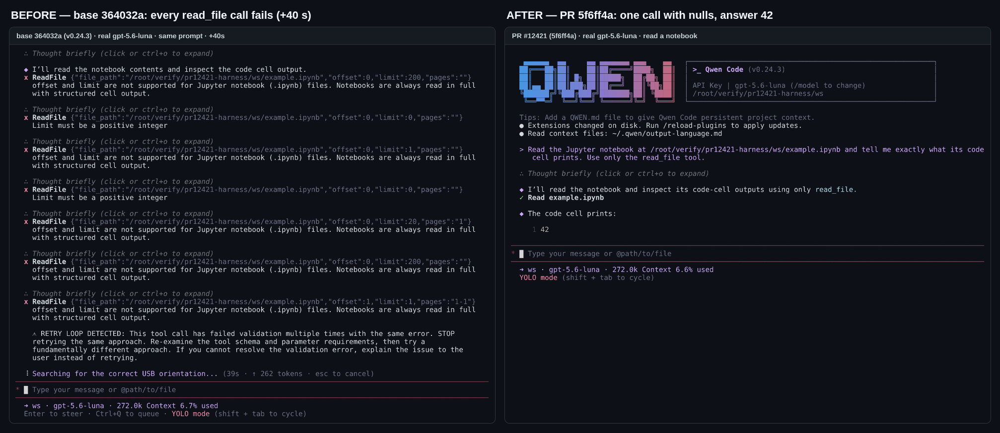
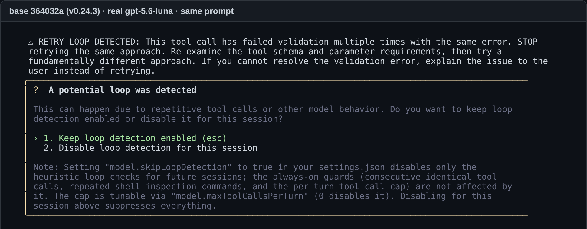

# PR #12421 — Maintainer verification — `5f6ff4a` on Linux, real CLI + real providers

**Verdict: ready to merge.** I built two bundles from the same tree: the PR head, and the same tree with only `packages/core/src/tools/read-file.ts` reverted to the merge base `364032a`. Every difference below therefore comes from that one file. This run is on Linux (Debian 13, Node 22.22.2), which the PR didn't cover. On top of the author's matrix, it answers the two questions the triage review left open: real providers accept the widened declaration, and a real model that could not read a notebook on base now reads it in one call. At least one real endpoint reproduces #12420 end to end. That endpoint is a GPT-5.6 model (`gpt-5.6-luna`) behind an OpenAI-compatible proxy, and it fills in every declared property. On base it can never leave `offset`/`limit` out, so every notebook read fails until loop detection stops the run.

### 1. Real model, real CLI: the #12420 loop, before and after

Same prompt ("Read the Jupyter notebook at … and tell me exactly what its code cell prints. Use only the read_file tool."), `gpt-5.6-luna`, headless `-p`, 3 runs per build and protocol:

| Build | Protocol | Runs that read the notebook | Failed `read_file` calls per run | How the run ended |
| --- | --- | :---: | :---: | --- |
| base | Chat Completions | 0/3 | 36 / 40 / 32 | loop detection (`consecutive_identical_tool_calls`), exit 1 |
| base | Responses | 0/3 | 13 / 9 / 16 | 1× loop detection; 2× the model gave up ("I couldn't read the notebook…") |
| PR | Chat Completions | **3/3** | 0 | first call `{"offset":null,"limit":null,"pages":null}` → answered `42` |
| PR | Responses | **3/3** | 0 | same |

The failing base calls follow exactly the pattern in #12420. All 146 of them carry all three fields, even `pages: ""`. `limit` cycles through 1, 5, 10, 20, 100, 200, 1000 and 2000, which get "offset and limit are not supported…", and 0 (8 calls), which gets "Limit must be a positive integer". The interactive TUI run with the same prompt ended in the loop-detection dialog after about four minutes (figure 2 at the end).

**Why it happens.** I sent the exact tool payload each build puts on the wire, taken from the CLI's own requests, straight to the endpoint, 5 samples per cell:

| Target | base declaration | PR declaration |
| --- | --- | --- |
| notebook, Chat Completions | `offset:0, limit:200, pages:""` ×5 | `offset:null, limit:null, pages:null` ×5 |
| notebook, Responses | `offset:0, limit:200, pages:""` ×5 | all-null ×5 |
| text file, Chat Completions | `offset:0, limit:2000` ×3 / `limit:200` ×2, `pages:""` | all-null ×5 |
| text file, Responses | `offset:0, limit:2000, pages:""` ×5 | all-null ×5 |

**Attribution (2×2, 4 samples each):** base schema with the PR's description text still produced numbers 4/4, while the PR schema with the base description text produced nulls 4/4. The schema widening is what fixes this endpoint. The new description sentence doesn't help on its own.

**Recovery through the new retry hint.** I used a prompt that forces the first call to be `offset: 0, limit: 0`:
- PR + gpt-5.6: 3/3 recovered on the next call by sending the `Retry with:` example verbatim.
- PR + qwen3.8-max: 3/3 recovered with one retry (2 sent the nulls, 1 left the fields out). Its first call carried `"0"` strings, and these now get the notebook message instead of the numeric-range error.
- For balance, base + qwen3.8-max also recovered 3/3 with one retry. Models that leave optional fields out were never stuck; the fix matters for endpoints that fill in every property.

### 2. Real providers accept the widened declaration

I sent the exact PR tool payload, with the base payload as a control, to every endpoint I have access to:
- **HTTP 200 and a valid `read_file` call with both payloads:** DashScope `qwen3.8-max` (Chat Completions and Responses), `qwen3.7-max`, DeepSeek `deepseek-v4-flash`, the GPT-5.6 proxy (Chat Completions and Responses), Kimi `kimi-k3` (Anthropic Messages), and a second Anthropic-compatible gateway.
- **Inconclusive:** two endpoints returned account errors (403 not purchased, 402 balance), identically with the base payload.

### 3. Deterministic A/B through the real CLI (scripted mock, three wire protocols)

A scripted endpoint issued the same tool calls to both builds over Chat Completions, Responses and Anthropic Messages: 31 steps, 24 CLI runs, all exit 0. The model-visible output of every step was identical across the three protocols (62/62). From base to PR, **13 steps flip from error to success, and every one of them involves a `null`; no step flips the other way.**
- **Notebook:** leaving the fields out, setting each field to `null`, setting all three to `null`, and `pages: "   "` all return the same two-cell output with stdout `42`. `offset:0,limit:0`, `offset:-1`, `limit:10`, `pages:"1"` and `pages:3` (coerced to a string) all get the single notebook message. The mock parsed `Retry with: {…}` out of that error and replayed it, and the read succeeded.
- **Text:**
  - A first read with all fields `null` returns the full content. A second all-null read and a later read with the fields left out both hit the "unchanged since last read" cache; on base the first two are validation errors.
  - `offset:1,limit:1,pages:null` → `second`; `offset:null,limit:1` → `first`; `offset:2,limit:null` → lines 3–4.
  - `limit:0` is still rejected, and numeric strings (`"1"`) are still coerced.
- **PDF with a real `pdftotext`** (the author's machine didn't have one): all-null and `pages:null` extract both pages, identical to leaving the fields out. `pages:"2"` with null numerics returns page 2 only, and `pages:"0"` / `"2-"` are still rejected.
- **`file_path: null`** is still rejected (`params/file_path must be string`).
- **Downstream consumers:** after an all-null notebook read, `notebook_edit` is allowed (`print(42)` → `print(43)`), and after an all-null text read, `edit` is allowed. On base both writes are refused as "not read".
- **`schemaCompliance: "openapi_30"`:** the wire carries `{"type":"integer","nullable":true}` with no type arrays, and a null read still succeeds.

### 4. In-process differential and test strength

- **Side-by-side differential.** I loaded base and PR `ReadFileTool` in one process and ran 3840 parameter combinations: notebook / text / 30-line text / PDF × 8 offsets × 6 limits × 10 pages values, with native PDF on and off and a real `pdftotext`. There were 0 crashes.
  - **1320 combinations contain a `null`.** In all 1320, the PR result is identical to the same call with the null keys removed: validation, model content, `getDescription()` and `toolLocations()`. Base rejects all 1320. On the PR, 626 now pass, and the rest are still rejected because of their non-null values (for example `limit: 0` or notebook pagination).
  - **2520 combinations contain no `null`.** None of them changes verdict compared with base. 894 differ only in message text: 534 are the notebook-guidance consolidation, and 360 are the Ajv wording change `must be integer` → `must be integer,null` for `offset: 1.5`.
  - **Cache.** I tested 49 pairs of full-read forms (fields left out, any mix of nulls, blank `pages`). In all 49, the second read hits the unchanged-file cache, the same as base with the nulls left out.
- **Unit tests.** The PR's 4 focused test files pass 346/346, matching the PR. Reverting only `read-file.ts` turns 17 of the 203 tests in `read-file.test.ts` + `responses-converter.test.ts` red.
- **Mutants.** 12 of 16 targeted mutants on the changed lines are killed: each normalization line, the check ordering, the retry-example content, the blank-`pages` trim order, and all three schema widenings. The 4 survivors:
  - The three `?? undefined` in `execute` / `getDescription` / `toolLocations` cannot be reached at runtime. `build()` runs `validateToolParams`, which normalizes first. The only other entry point, a PreToolUse hook's `updatedInput`, is rebuilt through `build()` in `setArgsInternal`.
  - The new notebook sentence in the tool description isn't pinned by any test. The 2×2 above suggests it isn't what fixes the behavior.
- **CI.** Green on `5f6ff4a`: Test, Lint & Static, no-AK integration, both Desktop Shell jobs, and the web-shell E2E smoke.

### Non-blocking notes

1. **This is the first JSON-Schema union in the default tool payload.** With no MCP servers or extensions configured, in the default headless set (14 tools) and the default interactive set (20 tools), base sends no `"type": [...]` and no `anyOf`. This PR sends three, all in `read_file`. `read_file` goes out with every request, so any OpenAI-compatible backend or gateway that parses `type` as a single string would start rejecting *all* requests, not only reads. Every provider that answered accepts the new payload. `schemaCompliance: "openapi_30"` is a working fallback (verified above). I'd add one line about it to the PR's Risk section or the docs for people on self-hosted backends. I did not test local runtimes such as Ollama or llama.cpp.
2. `docs/developers/tools/file-system.md` still doesn't mention `null` (already raised in triage). Fine as a follow-up.

Figure 2 — base: the interactive run ends in loop detection

Harness scripts are in `harness/` (private endpoints replaced by placeholders); per-step data is in `data/`.
