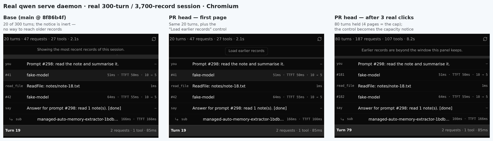
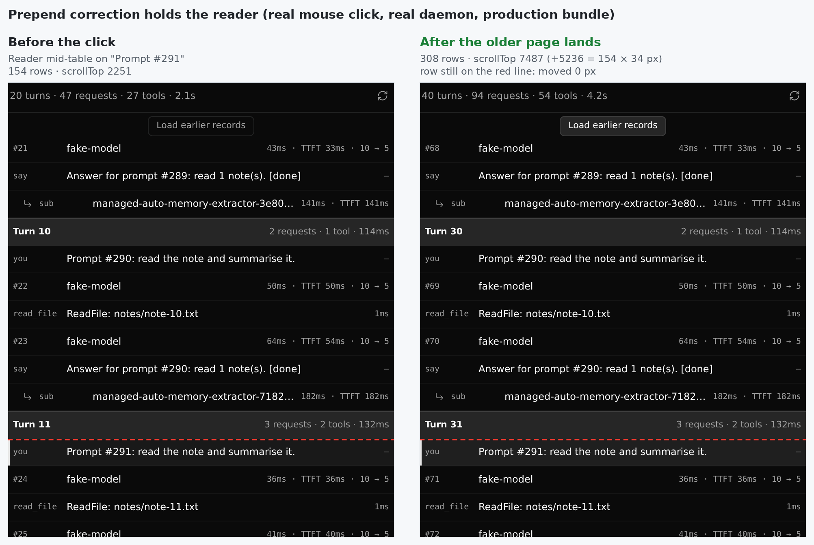
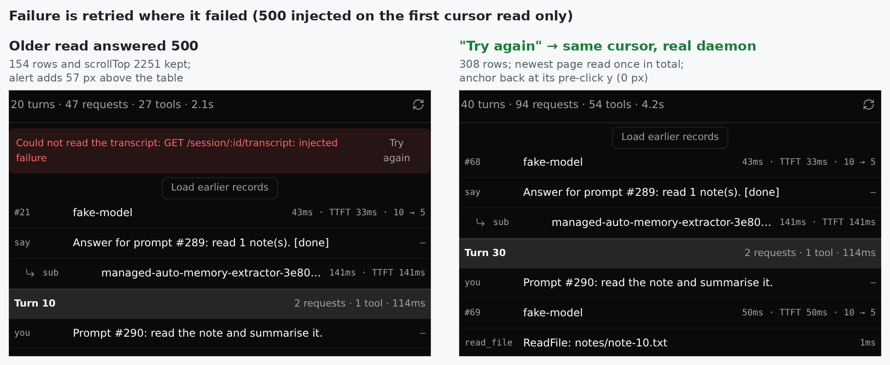
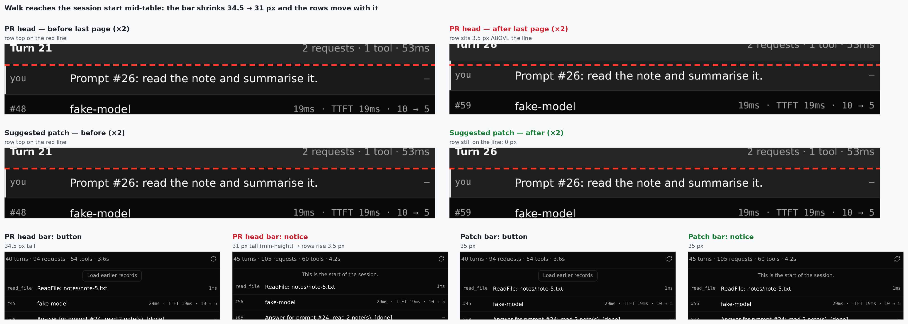

## 维护者验证——真实 daemon + 真实浏览器 · head `083b476`

**结论：在 Chromium 和 WebKit 里，对着真实的 `qwen serve` daemon，翻页端到端都能工作。建议改一行 CSS（发现 1）后合入。** 那条本应保持固定高度的 bar，在走到头时仍会变高度，于是读者所在的行在最后一页会跳 3.5 px。发现 2 是一个小的键盘/焦点问题，附了验证过的补丁。发现 3、4 是小问题。

`083b476` 相对 `ec6c05f` 只改了 `web-shell.trajectory.spec.ts`，生产代码逐字节相同，所以下面在 `ec6c05f` 构建的浏览器测试结果原样适用于当前 head。e2e spec 本身是在 `083b476` 上跑的。

### 测试方式

- **两个臂都从源码构建。** head 与 base（`8f86b4f`，merge base）都用 `pnpm install` 加完整 `build`/`bundle` 构建。
- **真实 daemon。** 用 head bundle 起的真实 `qwen serve`，隔离的 `QWEN_HOME`，接一个脚本化的 OpenAI 兼容模型。每个 prompt 都执行真实的 `read_file` 工具调用，所以面板折叠用的 request/tool 耗时遥测是真实 core 落盘的。
- **播种的会话。** 全部通过 daemon 自己的 HTTP API（`POST /session`、`/prompt`、SSE `turn_complete`）播种：
  - **300 轮 / 3,700 条记录**——15 页。
  - **45 轮 / 555 条记录**——3 页。
  - **一个含 100 次工具调用长轮次的会话**——页大小不均，60 / 505 / 35 个事件。
  - **另外两个 45 轮会话**，用于「翻页中追加」和 409 场景。

  浏览前重启了 daemon，走冷读取路径。
- **浏览器。** Playwright **Chromium 1228** 与 **WebKit 2311**，驱动 **daemon 自己提供的生产 bundle**。没有 mock daemon，也没有 `page.route`，唯一例外是重试场景里注入的那一次 500。base 臂是同一个 daemon 二进制，只把前端换成 base 构建。
- **判据。** 用真实鼠标点击控件。`requestAnimationFrame` 采样器在页落地之后**每一帧**记录锚定行被画在哪里，所以瞬时闪动也会被捕捉到，而不只是最终停留的位置。锚定分别取读者位于表格**顶部**、**中部**、**底部**三种位置。



### 结果

| 检查项 | 结果 |
| --- | --- |
| 协议（真实 daemon） | 面板第一次读 `direction=backward&limit=250`，之后读 `cursor=…&limit=250` 且**不带** `direction`，全部 200。用同样的读取走完 15 页：对照 JSONL 连续、**0 重叠**，300 个 prompt 全覆盖 |
| 锚定（非最后一页）——Chromium + WebKit，读者在顶部 / 中部 / 底部，前插 154 行与 204 行 | 每次都是 **0 px**。`scrollTop` 恰好移动 `新增行数 × 34`。**0 帧**画在错误位置 |
| 走查的最后一页（到会话开头*或*到容量上限），读者在表格中部 | 两个引擎都是 **−3.5 px** → 发现 1 |
| 容量上限 | 4 页后显示「Earlier records are beyond the window this panel keeps.」，保留 80 轮 |
| 走到会话开头 | 合计 `45 turns · 105 requests · 60 tools` 与 JSONL 真值一致：45 个 prompt；150 个 `api_response` − 45 个 memory-extractor = 105；60 个 `tool_call` |
| 第一次 cursor 读取返回 500 | 行与 `scrollTop` 都保留。「Try again」重读**同一个 cursor**，最新页全程只读一次。恢复后锚定行回到点击前的位置（0 px） |
| 翻页途中会话被追加（两次点击之间追加 6 轮） | cursor 仍有效，走查能走完；之后最新页在底部显示追加的轮次 |
| 翻页途中 JSONL 被轮转（409） | 出现 alert，行保留，「Try again」重复 409；头部刷新可恢复，翻页可继续。与作者已记录的限制一致，不算新发现 |
| 前插前后的选中状态 | 按 key 保留；`aria-activedescendant` 随重新编号正确跟随（`row-77` → `row-231`） |
| 双击控件 | 只发 1 次 transcript 读取（hook 的在途守卫有效） |
| base A/B（同一会话） | base 只显示 300 轮中的 20 轮和一句不可操作的提示；head 能走到 4 页上限，45 轮会话能完整走到开头 |
| PR 单测 | trajectory + panel **96/96**（base 82/82），`ArtifactPanel` 95/95，`App -t trajectory` 3/3 |
| PR e2e（`web-shell.trajectory.spec.ts` @ `083b476`，本地 Chromium） | **18/18**（6 个用例 × 重复 3 次）。同一 spec 跑 base 代码：4 个通过，**2 个新用例失败**（没有控件），说明它们有鉴别力 |





### 发现

**1. bar 并非固定高度，最后一页会让读者移动 3.5 px（建议修，一行）。**

这正是 `3ea33ee` 要保证的性质（「固定的 `min-height`」）。但在真实布局里，按钮比这个最小值更高：

- 两个引擎里 `.olderButton` 的计算高度都是 **24.5 px**：`line-height` 16.5 px（继承 1.5 × 11 px，与字体无关）+ 2 × 3 px padding + 2 × 1 px border。
- 加上 bar 的 4 + 6 px padding（border-box），bar 装着按钮时是 **34.5 px**，换成任一条提示后只有 **31 px**（即 `min-height`）。

走到会话开头、或容量提示替换按钮时，`.scroll`（`flex: 1`）长高 3.5 px。网格顶边从 135.5 移到 132，读者那一行上移 **3.5 px**，并且页落地后的每一帧都停在这个位置。前插修正本身是精确的（`scrollTop` +1258 = 37 × 34）。

在 Chromium 和 WebKit、生产 bundle 和 dev 模式、三个不同会话上都测到了。在表格底部，滚动钳制会把它掩盖掉（−0.5 px），所以 PR 里的测试都看不到：

- e2e 锚定在底部，而且是非最后一页；
- jsdom 不做布局。

建议修法（已验证）：

```css
.olderBar {
  /* … */
  height: 35px; /* 原为 min-height: 31px——按钮 24.5px + 10px padding */
}
```

改后 bar 在所有状态都是 35 px，到开头和到上限的切换都让行移动 **0 px**（Chromium），PR 单测 96/96 通过，两个翻页 e2e 用例也通过。用固定的 `height`，而不是调大 `min-height`，以后任一子元素改字号时也不会再破。



**2. 用键盘激活控件后，焦点掉到 `<body>`（可访问性，建议修）。**

按钮在加载期间是 `disabled`，而浏览器会让变为 disabled 的已聚焦元素失焦。所以按 Enter 后焦点落到 `<body>`，第二次 Enter 什么也不做，键盘用户每翻一页都要重新 Tab 回来。Chromium 和 WebKit 都测到了。hook 本身已经拒绝重入（`olderInFlightRef`），所以防止重复加载靠的并不是 DOM 上的 `disabled`。

建议补丁（已验证）：

```tsx
disabled={status === 'loading'}
aria-disabled={loadingOlder || undefined}
```

改后焦点留在按钮上，第二次 Enter 会加载下一页，双击仍只发一次读取，单测 96/96 通过。还剩一种情况：按钮在到开头或到上限时变成提示，焦点仍会丢失。把焦点交给网格可以作为一个小的后续改进。

**3. e2e 锚定用例看不到「过度修正」（小问题）。**

表格打开时位于底部，用例也在底部取锚，所以任何多出来的位移都会被滚动钳制吸收。我把修正**做两遍**：jsdom 用例会失败，但 `keeps the reader on the same row…` **仍然通过**。去掉修正则两者都能抓到。算术本身 jsdom 用例已经钉住了，浏览器用例存在的意义是抓浏览器侧的叠加效应（例如原生 scroll anchoring 再额外移一次），而那种失败恰好就是过度修正。点击前先把网格滚到顶部或中部，再加一个最后一页的用例，就能同时抓到发现 1 和这一条。

**4. 描述里对翻页后刷新的说法不准确（小问题）。**

Risk 一节说翻到更早历史后刷新会「回到末尾」。实测：刷新保留的是 `scrollTop` 的数值（会被钳制）。从走查的顶部刷新，读者落在重建后最新页的 `scrollTop 0`（300 轮里的 `Prompt #281`），而不是末尾，刚追加的轮次要往下滚才能看到。要么刷新时滚到末尾，要么改一下这句描述。

### 未验证

- 真实的 macOS/Safari 与 Windows。Linux 上的 WebKit 与 Safari 是同一引擎，而且发现 1 与字体无关。
- 页边界落在轮次中间（「(continued)」）的情况。这里真实 daemon 始终保持轮次完整：它会把页扩到 3 × limit，或宁可缩页（60 个事件）也不拆轮次。所以这条折叠路径只由单测覆盖。
- 作者的八处变异没有逐一重跑。我跑的是自己的变异：去掉修正、修正做两遍，以及修复臂。
- 4 页上限下、单条记录很大时的重折叠开销。
- `083b476` 上的 `web-shell E2E Smoke` 作业在撰写时仍在运行。

验证环境、harness 脚本、原始测量数据与日志：[`pr-12434/`](./)
