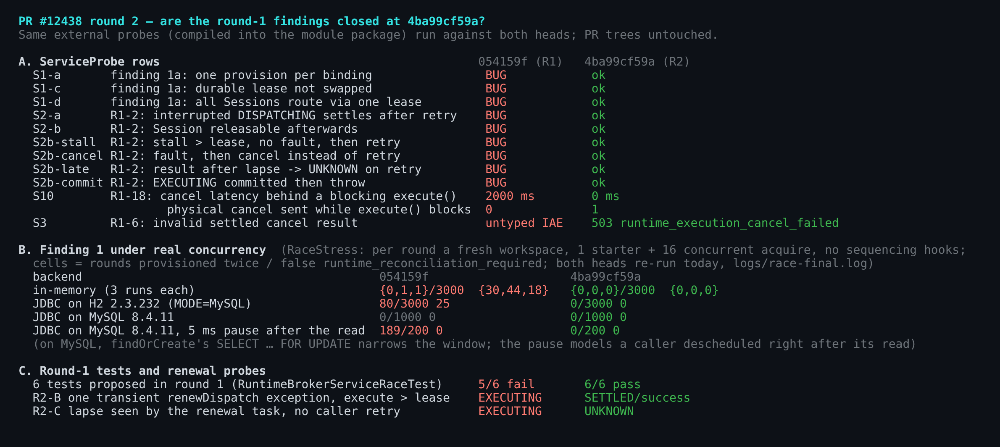
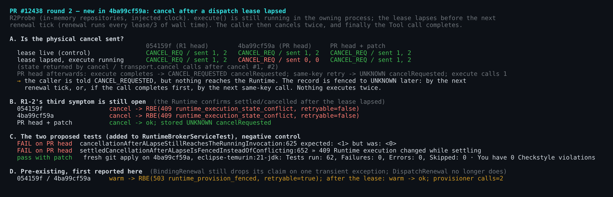
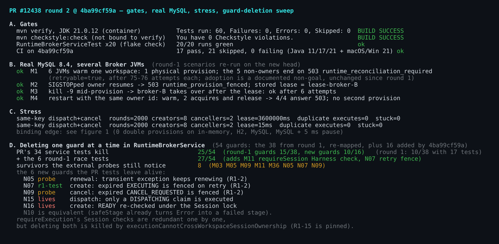

## Maintainer verification, round 2 — PR #12438 @ `4ba99cf59a` (delta over round 1)

[Round 1](https://github.com/QwenLM/qwen-code/pull/12438#issuecomment-5771333776) covered `054159f`. For this round I ran the same rig against `4ba99cf59a`: JDK 21, real MySQL 8.4, several Broker JVMs. I only report what changed:
- which round-1 items are now closed;
- what the fix commit itself introduces.

`ea39fc189b` is the round-1 commit rebased unchanged (`git range-diff` shows `=`). The real delta is therefore `4ba99cf59a`: +737/−80 across 6 files, mostly tests.

**Verdict:**
- Finding 1, the one I asked to fix before merge, is fixed exactly as proposed. It holds on in-memory, H2 and real MySQL, and the same rig still reproduces it on `054159f` today (negative control).
- Also fixed: R1-2's stuck-dispatch paths, R1-18, R1-8 and the error-channel items R1-3…R1-6. R1-7 is deferred.
- **From my side this is mergeable.**

Two narrow items remain in the cancel path:
- the fix commit adds a small regression for cancel after a dispatch lease lapses;
- R1-2's third symptom is still open.

A tested patch closes both: +18/−1 in production plus two tests. I'd take it before merge or right after, but I wouldn't block on it.



### What is closed (same probes, run on both heads)

- **Finding 1 (1a + 1b).** The S1 rows are clean. `RaceStress` (real threads, no sequencing hooks) goes to 0 on every backend. Both heads were re-run today:
  - H2: 80/3000 double-provisioned rounds → 0/3000.
  - MySQL with a 5 ms pause after the read: 189/200 → 0/200. Without the pause, MySQL is 0/1000 on both heads, because `SELECT … FOR UPDATE` narrows the window.
  - In-memory: up to 1/3000 double-provisioned rounds and 18–44 false `runtime_reconciliation_required` per run → 0.

  Your two new tests each kill the guard they are meant to pin.
- **R1-2 (first two symptoms) and the two extra paths from round 1.**
  - All six S2/S2b rows now end settled or `UNKNOWN`.
  - A single transient `renewDispatch` exception no longer loses the claim (R2-B).
  - The renewal task fences a lapsed claim by itself, without waiting for a caller retry (R2-C).
  - The 6 tests I proposed in round 1 fail 5/6 on `054159f` and pass 6/6 here.
- **R1-18.** A cancel behind a blocking `execute()` now returns in 0 ms and reaches the Runtime. On `054159f` it waited 2000 ms and was never sent.
- **R1-3…R1-6, R1-8.** The coded errors and the shutdown fencing behave as claimed, and each has a test that kills its guard.
- **R1-15.** Pinned. If I delete both of `requireExecution`'s Session checks (Harness and Runtime) together, `executionCannotCrossWorkspaceSessionOwnership` fails. Deleting only one of them is not caught, because each check backs up the other.
- **Same-key concurrency on the widened re-drive.** 2000 rounds, each with 8 concurrent `createExecution` and 2 `cancelExecution` calls on one key, run with a dispatch lease of 1 h and of 15 ms. Result: 0 duplicate physical executes and 0 records left unsettled.

### New in `4ba99cf59a`: cancel after a dispatch lease lapsed (non-blocking, narrow)



The new branch in [`cancelExecution`](https://github.com/QwenLM/qwen-code/blob/4ba99cf59a53289f341fb43f1caa20802edec69a/packages/sdk-java/runtime-broker/src/main/java/com/alibaba/qwen/code/runtimebroker/RuntimeBrokerService.java#L217-L229) sends an expired `CANCEL_REQUESTED` record to `beginDispatch`, so that `claimDispatch` can fence it. This goes wrong when the Tool call is still running in this process:
1. `dispatches` still holds the call, so `beginDispatch` returns without doing anything.
2. The caller gets `CANCEL_REQUESTED`, which reads as "accepted".
3. `transport.cancel` is never called, including on a repeated cancel.

On `054159f` the same call reached the Runtime.

Nothing executes twice, and the record still ends fenced to `UNKNOWN`: at the next renewal tick, or, if the call completes first, at the next same-key call. What is lost is the physical cancel for a call the Broker knows is still running.

The lease has to lapse while the owning process is alive. That needs a renewal delay close to the full lease. In this slice that means, for example, the single shared `qwen-runtime-broker-lease-renewal` thread being held up behind a slow JDBC `renewOperation` for a binding that is still provisioning. With a future persistent execution repository, a repository outage close to the lease would also do it.

The fix is one condition: fence only when no dispatch is in flight in this process (`&& !dispatches.containsKey(executionId)`); otherwise fall through to the physical cancel. Once the record is `UNKNOWN`, cancel returns early on both heads, because `UNKNOWN` waits for reconciliation by design. The patch does not change that.

### Still open: R1-2's third symptom

Suppose the Runtime answers `state: settled` after the claim lapsed. The cancel still fails with `409 runtime_execution_state_conflict` (`retryable=false`), and the record stays `CANCEL_REQUESTED` until a later call fences it. The reply on R1-2 describes the retry re-drive and fencing, which cover the first two symptoms only.

The patch follows R1-2's suggestion:
- When the conflict comes from a lapsed claim, `absorbCancellationStatus` fences through `claimDispatch` and the cancel returns `UNKNOWN`.
- Any other code, or a claim that is still live, is rethrown unchanged.

Please take both hunks together. The first hunk sends more post-lapse cancels to the Runtime, so it makes this path easier to reach.

Both new tests fail on `4ba99cf59a`, with `expected: <1> but was: <0>` and with the 409 respectively. Both pass with the patch. A fresh `git apply` on `4ba99cf59a` in `eclipse-temurin:21-jdk` gives 62/62 tests and 0 Checkstyle violations. All round-1 and round-2 probes stay green, except R2-E below, which the patch does not touch.

### Gates, real MySQL, guard-deletion sweep



- **Gates.**
  - `mvn verify` 60/60 and `mvn checkstyle:check` 0 violations in `eclipse-temurin:21-jdk` (21.0.12).
  - `RuntimeBrokerServiceTest` run 20 times in a loop: 20/20 green.
  - CI on `4ba99cf59a`: 17 pass, 0 failing, including Java 11/17/21.
  - I didn't re-run the root `pnpm` build and typecheck: the delta is Java and docs only, and CI's Linux test and lint jobs are green.
- **MySQL 8.4 with several Broker JVMs (M1–M4)** behaves exactly as in round 1:
  - one physical provision across 6 JVMs;
  - a `SIGSTOP`ped owner is fenced;
  - takeover after `kill -9`;
  - a same-owner restart fails closed.
- **Guard deletion, now 54 guards:** the 38 from round 1 plus 16 that the fix commit added. Your 34 tests kill 25. In round 1, 17 tests killed 10/38.

  Six of the new guards survive your tests:
  - N05 (a transient renewal exception keeps renewing) and N09 (cancel fences an expired `CANCEL_REQUESTED`): only my probes notice them.
  - N07 (retry fences an expired `EXECUTING`): killed by round 1's `resultAfterTheDispatchLeaseLapsedIsFencedAsUnknown`.
  - N15 (dispatch executes only a `DISPATCHING` claim) and N16 (`READY` re-checked under the Session lock): nothing notices them.
  - N10 is equivalent.

  M11 (`requireSession`'s Harness check, from round 1) is still unpinned. `anotherHarnessSessionCannotDriveARuntimeSession` from the round-1 patch kills it.

### Non-blocking, pre-existing (not introduced by `4ba99cf59a`)

- **First reported here:** `BindingRenewal` still treats one transient `renewOperation` exception as claim loss. The provision is fenced, then redone after the lease (R2-E: the provisioner is called twice). This is safe, since the provisioner must converge. It is now the opposite of the `DispatchRenewal` behaviour this commit adopted.
- Public-argument validation still bypasses the coded channel. `harnessSessionId=""`, `idempotencyKey=""` and `executionCallId=""` throw synchronously, and an invalid `turnKind` fails the returned stage. All of them surface an untyped `IllegalArgumentException` (triage item 4; S3 in round 1).
- Processes that don't own the binding keep answering `503 runtime_reconciliation_required` with `retryable=true`; in M1 each one gave up after 75–76 attempts (round 1's M1/M4 note).
- Deferring R1-7 (uncoded repository exceptions) to a focused PR is reasonable.

<details>
<summary>Suggested patch: production part (+18/−1). The 2 tests are in <code>suggested-fix-r2.patch</code>.</summary>

```diff
@@ -220,7 +220,11 @@ public final class RuntimeBrokerService implements AutoCloseable {
                                             == ToolExecutionRecord.State
                                                     .CANCEL_REQUESTED
                                     && !requested.hasLiveDispatchAt(
-                                            clock.instant()))) {
+                                            clock.instant())
+                                    && !dispatches.containsKey(executionId))) {
+                        // Fence only a claim nothing here is serving; an
+                        // invocation still running in this process gets the
+                        // physical cancel below.
                         beginDispatch(context, requested);
                         ToolExecutionRecord latest = executionRepository
                                 .findByExecutionCallId(executionId);
@@ -820,6 +824,19 @@ public final class RuntimeBrokerService implements AutoCloseable {
             throw unavailable("runtime_execution_cancel_failed",
                     "Runtime cancellation returned an invalid result",
                     exception);
+        } catch (RuntimeBrokerException exception) {
+            ToolExecutionRecord latest = executionRepository
+                    .findByExecutionCallId(requested.getExecutionCallId());
+            if (!"runtime_execution_state_conflict".equals(
+                    exception.getCode()) || latest == null
+                    || latest.hasLiveDispatchAt(clock.instant())) {
+                throw exception;
+            }
+            // The Runtime settled the call after this claim lapsed; fence it
+            // for reconciliation instead of reporting a state conflict.
+            executionRepository.claimDispatch(
+                    requested.getExecutionCallId(), brokerOwnerId,
+                    dispatchLeaseDuration);
         }
     }
 
```

The two tests are added to `RuntimeBrokerServiceTest`. Both are deterministic and use no sleeps:
- `cancellationAfterALapseStillReachesTheRunningInvocation`
- `settledCancellationAfterALapseIsFencedInsteadOfConflicting`

</details>

Evidence (figures, the R2 probes `R2Probe`/`ExecStress`, the re-mapped guard-deletion runner, all logs, `suggested-fix-r2.patch`): [`wenshao/qwen-code@asserts/pr-12438-round2`](https://github.com/wenshao/qwen-code/tree/asserts/pr-12438-round2).
