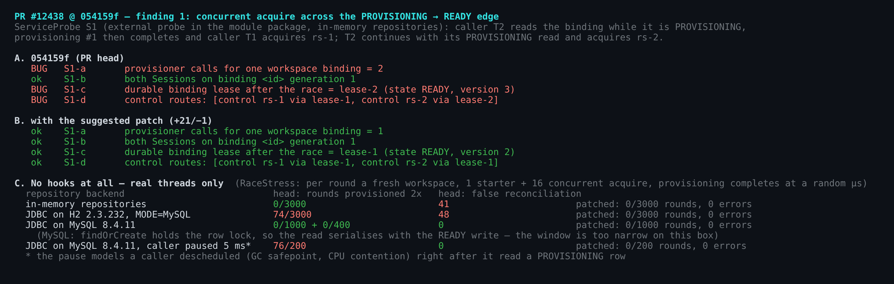
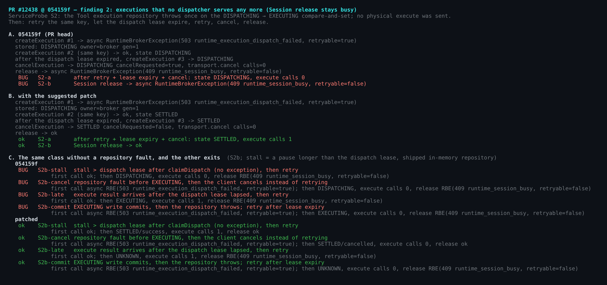
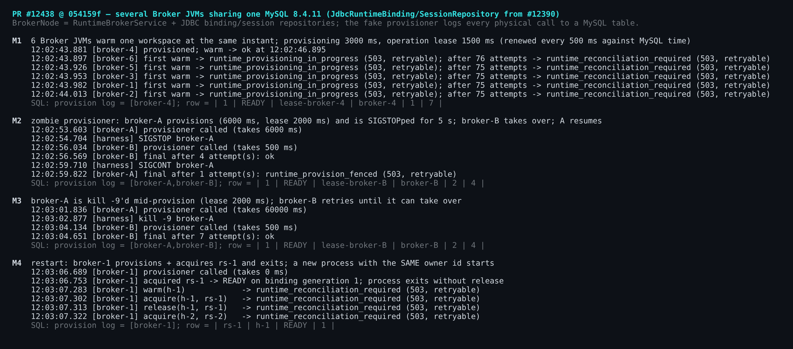
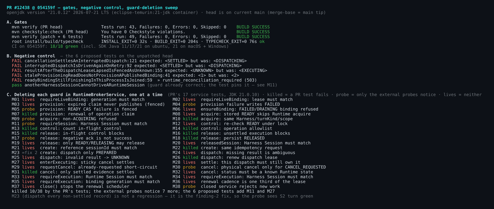
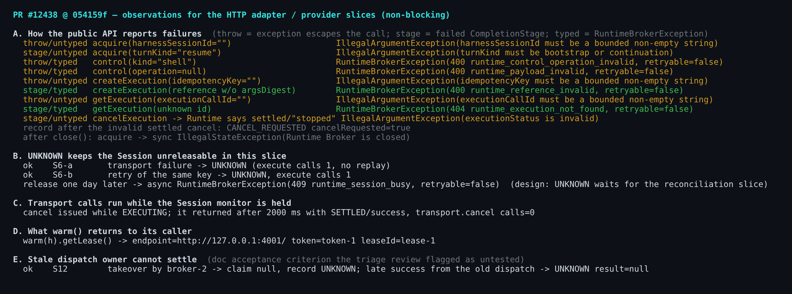

## 维护者验证 — PR #12438 @ `054159f`（JDK 21、真实 MySQL 8.4、多个 Broker JVM）

本评论是对 triage 评审和 04:30 那一轮 `/review`（R1-1…R1-24）的补充。我在 Linux 上接真实数据库，把两份评审的结论和我自己的探针都实际跑了一遍。下面只写两份评审都没覆盖的内容，以及它们的哪些条目被我执行复现了。

**结论：** 有一个两份评审都没提到的新缺陷（发现 1）：binding 路径上的并发 bug，建议合入前修复，改动是 16 行生产代码加两个确定性测试。R1-2 我给出了经过测试的补丁。其余都可以作为后续工作。

另一方面，设计所依赖的 fencing 在真实的多进程 MySQL 环境下成立：
- 过期的供应 owner 会被 fence；
- 崩溃的 owner 会被接管；
- 重启后 fail-closed。

环境与门禁（head 基于当前 `main`，merge-base 就是 main 最新提交）：

| | |
|---|---|
| 模块门禁 | `eclipse-temurin:21-jdk`（21.0.12）下 `mvn verify` **43/43**，`mvn checkstyle:check` **0 违规**。Checkstyle 没有绑定到 `verify`，所以单独运行了一次。 |
| 根目录门禁（PR 测试计划所列） | `pnpm install` 32 s、`npm run build` 204 s、`npm run typecheck` 76 s，均 exit 0 |
| `054159f` 的 CI | 18/18 全绿 |
| 真实数据库 | `mysql:8.4`（8.4.11）+ #12390 的 `JdbcRuntimeBinding/SessionRepository`，2–6 个 Broker JVM |
| 探针 | 外部探针编译进模块包；PR 源码树未改动 |

### 发现 1（新）— 跨 `PROVISIONING → READY` 边界的并发 acquire

R1-9 说 `putIfAbsent` 的单飞没有测试覆盖。我发现的是：*即使单飞还在*，这个边界照样会漏。问题出在 [`ensureBinding` / `provisionBinding`](https://github.com/QwenLM/qwen-code/blob/054159f8d8f5eee79d37d9d661fef1d1b19e749c/packages/sdk-java/runtime-broker/src/main/java/com/alibaba/qwen/code/runtimebroker/RuntimeBrokerService.java#L459-L534) 的两个缺口。

**1a — 已发布的 binding 被再次供应，lease 被替换。** 过程如下：
1. 调用方的 `findOrCreate` 返回 `PROVISIONING`。
2. 第一个供应操作结束，离开了 `bindingOperations`。
3. 该调用方这时才走到 `putIfAbsent`，于是再走一遍 `provisionBinding`。
4. `claimOperation` 对同一 owner 是可重入的，直接返回这一行，而它此时已是 `READY`。
5. `provisioner.provision()` 第二次执行，`compareAndSet(READY → READY, lease-2)` 成功。

结果：同一个 binding generation 被供应两次，持久化的 lease 被悄悄换掉。替换之前 acquire 的 Session 仍走 `lease-1`（它们的 `SessionContext` 持有它），之后的 Session 走 `lease-2`（S1-d）。

只有当 provisioner 返回相同的 `RuntimeLease`，或 Runtime 仍承认被替换的旧 lease 时，这才无害；而 `RuntimeProvisioner` 契约只承诺收敛到同一个活的*资源*。

还有一个跨进程变体：同样的过期读取如果发生在另一个 Broker 进程里，且该进程停顿超过 operation lease，它会在 `READY` 行上拿到新的 claim，覆盖原 owner 的 lease。

**1b — 拥有该 binding 的进程会把它报成未证明。** `READY` 先落库（[L521](https://github.com/QwenLM/qwen-code/blob/054159f8d8f5eee79d37d9d661fef1d1b19e749c/packages/sdk-java/runtime-broker/src/main/java/com/alibaba/qwen/code/runtimebroker/RuntimeBrokerService.java#L521-L531)），之后才执行 `liveBindings.put`。并发调用方如果恰好在这个间隙读到 `READY`，会从拥有该 binding 的同一个进程收到 `runtime_reconciliation_required`（可重试的 503）。

不加钩子的压力测试结果（仅真实线程）：

| 后端 | 1a：出现重复供应的轮数 | 1b：误报 `runtime_reconciliation_required` |
|---|---|---|
| 内存 | 0/3000 | 48,000 次 acquire 中 41 次 |
| H2 JDBC | 74/3000 | 48 次（部分来自 1a 的 lease 替换） |
| MySQL 8.4 | 0/1400 | 0 |

MySQL 上 `findOrCreate` 的 `SELECT … FOR UPDATE` 让读取和 `READY` 写入串行化，窗口因此变窄，但没有关闭：调用方读完后停顿 5 ms（模拟 GC safepoint 或被抢占），MySQL 上 200 轮里有 76 轮重复供应。

**修复：**
- `ensureBinding`：如果 `READY` 行对应的供应仍在本进程内收尾，就加入这个在途 future。
- `provisionBinding`：claim 到的记录若已不是 `PROVISIONING`，就返回 `requireLiveBinding(claimed)`，绝不再次供应。这也让跨进程变体走向 fail-closed。

两处都改后，上表各行全部归零。

### R1-2 已复现，另有一条路径，附已测试的补丁

R1-2 的前两个症状我都复现了，另外还找到两条能进入同样卡住状态的路径：
- **不需要任何故障。** 用自带的内存仓储，只要在 `claimDispatch` 和写入 `EXECUTING` 之间停顿超过 dispatch lease，所有 CAS（包括 `markUnknown` 那次）都会返回 `null`。`createExecution` 返回 **ok**，记录却停在 `DISPATCHING`，而实际从未发出任何调用。
- **用 cancel 代替重试。** 客户端改为 cancel 而不重试，同样会一直卡住，因为 cancel 只设置粘性标志。

下方补丁改两处：
- `createExecution` 驱动所有既未结算、也不是 `UNKNOWN` 的记录。`beginDispatch` 本身会跳过本进程内已在途的 dispatch；`claimDispatch` 会重新授予尚未发出的 `DISPATCHING` claim，或把过期的 `EXECUTING` claim fence 为 `UNKNOWN`。
- `cancelExecution` 驱动 `DISPATCHING` 状态的记录，让粘性 cancel 直接结算为 `cancelled`，不会调用 `execute`。

打补丁后，S2/S2b 的六行最终都是已结算或 `UNKNOWN`。补丁是在下一次调用时 fence，而不是在 `DispatchRenewal` 里；它**不**覆盖 R1-2 的第三个症状（lease 失效后收到 settled 的 cancel 确认 → 409）。

### 真实 MySQL 上成立的部分（两份评审都没有接数据库，也没有跑多进程）

- **M1：** 6 个 JVM 同时 warm 同一个 workspace，物理供应恰好 1 次，claim 按 MySQL 时间续租，撑过了 2 倍 lease。
- **M2：** 僵尸 provisioner。owner 被 `SIGSTOP` 超过 lease，另一个 broker 接管并发布；owner 恢复后得到 `runtime_provision_fenced`，它的 lease 从未被写入。
- **M3：** `kill -9` 之后，lease 到期即被接管。
- **M4：** 用*同一个* owner id 重启后，`warm`、`acquire`、`release` 全部 fail-closed，也不会发起任何供应。
- **S12：** 过期 dispatch owner 迟到的 `success` 无法结算记录，记录保持 `UNKNOWN`。

以上是 triage 评审第 2 条所说"未测试"的两条验收标准的实际执行证据。打补丁后，M1–M4 表现完全相同。

M1/M4 里还有一点两份评审都没提：非 owner 进程会无限期返回 `retryable=true` 的 `503 runtime_reconciliation_required`。M1 是 5 个 JVM × 75 次重试；M4 表明 owner 自己重启后也一样。adoption 本期明确不做，但在它落地之前，要么按 owner 亲和路由，要么不要把这个错误标为可重试。

### 门禁、反向对照、逐条删除守卫

**打补丁后的树**（在 head 树上全新 `git apply`）：
- 49/49 测试通过，Checkstyle 0。
- 与 head 相比，探针结果只有 S1、S2、S2b 不同。
- `RaceStress` 的 1b 误报降为 0。
- 反向对照：6 个建议测试中有 5 个在 head 上失败；第 6 个固定的是一个本来就正确的守卫。

**逐条删除守卫：** 在 `RuntimeBrokerService` 里逐条删除 38 个守卫，17 个服务测试只杀死 **10** 个，打补丁后的测试集杀死 12 个。这为 R1-9…R1-24 给出了量化数据。

R1 没有列出的一个存活者是 **M11**：`requireSession` 的 Harness 检查。删掉它后，Harness Session B 可以对 A 的 Runtime Session 执行 `control`、`createExecution`、`getExecution` 和 `cancelExecution`，而且这个 cancel 会真的发到 Runtime。R1-15 覆盖的是另一个守卫 `requireExecution`。

### 仅做执行复现（无新结论）

- **R1-18：** 探针里 cancel 在一个阻塞的 `execute` 后面等了 2000 ms，结束时看到的是 `SETTLED/success`，始终没有发出物理 cancel。同一个监视器还会阻塞该 Session 的 `release` 和 `acquire`。
- **R1-4…R1-7 与 triage 第 4 条：** 错误面汇总表见图 5。
- **R1-1 的补充：** 除了 token 会被持久化，`warm()` 还会通过 `getLease().getToken()` 把 token 返回给嵌入方调用者。HTTP adapter 不能序列化这个记录。

关于 triage 第 3 条：评审建议用 `volatile`，但它同时说兄弟类 `BindingRenewal` 已经避免了这个竞争，这并不成立。`BindingRenewal.start()` 同样是在监视器之外给 `task` 赋值的。改成在监视器内赋值，两个类都能覆盖。

建议补丁（生产代码部分 +32/−1；6 个测试见 <code>suggested-fix.patch</code>）

diff 见 REPORT.md 或 `suggested-fix.patch`。测试都在 `RuntimeBrokerServiceRaceTest` 中，均为确定性测试，不含 sleep：
- `staleProvisioningReadDoesNotProvisionAPublishedBinding`
- `readyBindingStillFinishingInThisProcessIsJoined`
- `interruptedDispatchIsDrivenAgainOnRetry`
- `cancellationSettlesAnInterruptedDispatch`
- `resultAfterTheDispatchLeaseLapsedIsFencedAsUnknown`
- `anotherHarnessSessionCannotDriveARuntimeSession`

证据（图、探针源码、MySQL 多 JVM 脚本、变异运行器、完整日志、`suggested-fix.patch`）：this directory。

Harness: `harness/` (probe sources in package `com.alibaba.qwen.code.runtimebroker`, `run-probe.sh`, `mjvm.sh`, `mutants/`, `figs/`); logs: `data/`.
