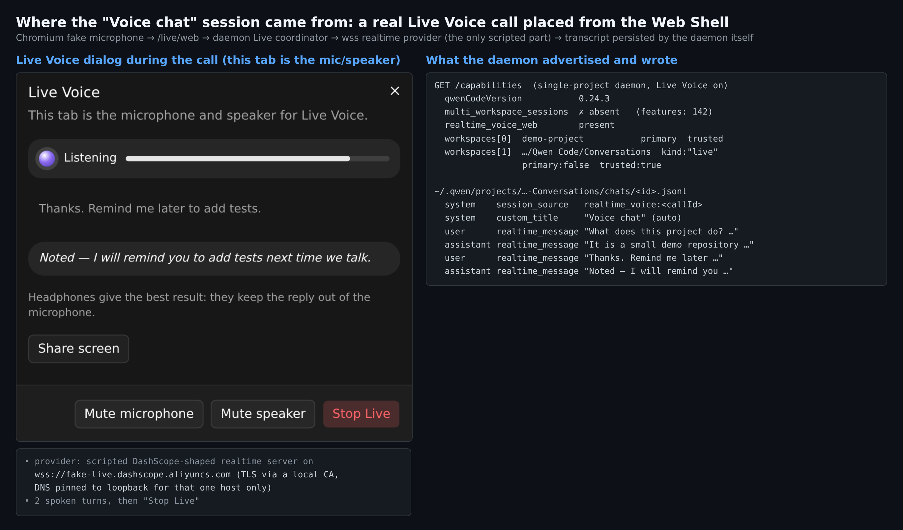
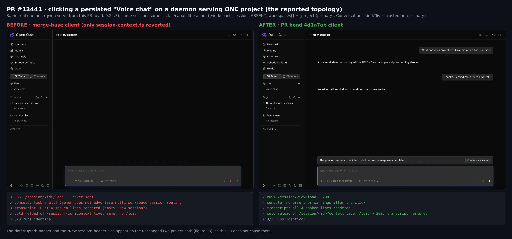
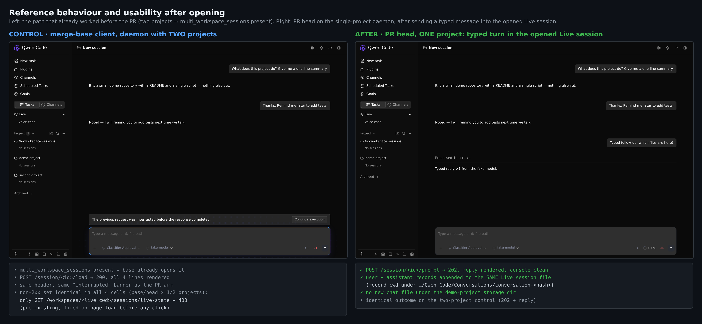
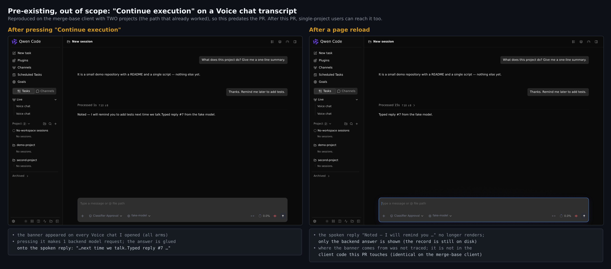

# PR #12441 维护者验证

## 维护者验证：真实浏览器 + 真实 daemon + 真实 `Voice chat` 会话

**结论：可以合并。** 在只挂一个项目的 daemon 上（即问题报告里的拓扑），merge-base 客户端打不开真实的 `Voice chat` 会话：不发 `/load`，控制台报出问题里的那条错误，页面一片空白。本 PR 的客户端能打开：`/load` → 200，完整转录，控制台无报错。每项结果 3 次运行 3 次一致，包括冷刷新会话 URL。PR 没有新增任何失败请求，两项目路径的行为也没有变化。打开后的会话还能接受文字输入，这一轮写入的是 Live 会话自己的转录。没有阻塞项。末尾列了两个 Live 会话的既有问题供后续跟进，都不是本 PR 引入的。

这一轮补上的是 PR 描述（"Not captured: a browser before/after screenshot"）和 triage 报告（"Not covered 1: a full end-to-end Live session open in a browser"）都留下的空白。triage 评论里已做过的单元级 A/B 和变异矩阵，我没有重复。

验证的 head 是 `4d1a7ab`（`e997170` 合入 main `5f713a2`）。相对 merge base，客户端的差异只有 `session-context.ts` 及其测试。

### 环境
- **Daemon。** 用 PR head 打包的 `qwen serve`（`qwenCodeVersion` 0.24.3），`HOME`/`QWEN_HOME` 隔离，开启 `experimental.liveVoice.enabled: true`，只挂一个工作区。PR 不改 daemon 代码，所以两臂共用这一个 daemon。
- **客户端两臂**，都由这个 daemon 提供：
  - PR head 的 Web Shell。重新 vite build 得到的 `index-DNf-0JQB.js` 与打包产物完全一致。
  - 同一棵树，只把 `session-context.ts` 恢复到 merge base（`index-CwnEx9lP.js`）。

  每次运行前都重启 daemon，并核对实际下发的资源哈希。
- **`Voice chat` 会话是真实生成的，不是手写 fixture。** 在 Chromium 里用假麦克风依次点 *Open Live Voice → Talk in this browser → New conversation*。音频经 `/live/web` 进入 daemon 的 Live coordinator，再到实时语音 provider 并返回；最后点 *Stop Live*。
  - 唯一脚本化的是 provider：一个 DashScope 形状的 `wss://` 服务，对收到的音频回两轮预设对话。daemon 通过本地 CA（`NODE_EXTRA_CA_CERTS`）信任它，且只把这一个主机名的 DNS 固定到 loopback。
  - 会话由 daemon 自己写盘：`session_source realtime_voice:<callId>`、`custom_title "Voice chat"`，以及四条 `realtime_message` 记录。
  - 文字输入走本地的 OpenAI 兼容桩。
- **该 daemon 的 `/capabilities`** 与 PR 描述里的形状完全一致：
  - 没有 `multi_workspace_sessions`（共 142 个 feature）；有 `realtime_voice_web`。
  - `workspaces[]` = 项目（primary）和 `…/Documents/Qwen Code/Conversations`（`kind:"live"`、`primary:false`、`trusted:true`）。

### 结果

| 场景 | merge-base 客户端 | PR 客户端 |
|---|---|---|
| 1 个项目，在侧栏点击 `Voice chat`（×3） | 不发 `POST /session/:id/load`；控制台 `Daemon does not advertise multi-workspace session routing`；渲染 0/4 行 | `/load` → 200；4/4 行；控制台无错误或警告 |
| 1 个项目，冷刷新 `/session/<id>?context=live`（×3） | 不发 `/load`；页面空白 | `/load` → 200；转录恢复 |
| 2 个项目（对照组：有 `multi_workspace_sessions`） | 能打开（`/load` 200，4/4） | 能打开，请求完全相同 |
| 关闭 Live Voice，用 `?context=live` 深链接 | 不发 `/load` | 不发 `/load`（仍然 fail closed） |
| 1 个项目，在打开的 Live 会话里发文字消息 | 不适用（打不开） | `POST /prompt` → 202，回复正常渲染。记录追加到同一个 Live 会话文件（cwd 在 `…/Conversations/conversation-<hash>` 下）；项目目录下没有任何写入 |

四个"打开"格子是两臂 × 一个或两个项目。四格中唯一的非 2xx 响应都是同一个既有的 `GET /workspaces/<live cwd>/sessions/live-state → 400`，在页面加载时发出。PR 没有新增失败请求。

### 关于讨论串里此前的几个说法
- **git 分支预取。** 作者预计它会拿 Live cwd 去请求并得到 400（`DaemonSessionProvider.tsx:2033-2036`）。在 PR 客户端抓取的 8 次打开里一次都没有触发（git 请求为 0），与 triage 的代码追踪一致。
- **`workspace_mismatch` 这个兄弟问题并不限于单项目。** 在两项目 daemon 上，`GET /workspaces/<live cwd>/sessions/live-state` 和不带参数的 `GET /workspaces/<live cwd>/sessions` 同样返回 400 `workspace_mismatch`（`workspaceCount: 2`）。
  - 侧栏之所以还能列出 Live 分组，是因为它请求时带了 `?sourceType=default`，这种写法返回 200 并带回会话。
  - 开启 Live 时，`live-state` 的 400 在每次页面加载都会出现（两臂皆然），并打印 `[session-live-state] request failed` 警告。

### 本 PR 让单项目用户也会遇到的既有问题（不阻塞）

1. **"Continue execution" 会替换掉语音回复。** 我打开过的每个 `Voice chat` 转录都显示 *"The previous request was interrupted before the response completed. [Continue execution]"*。
   - 点它会发一次后端模型请求，答案被直接拼在语音回复后面（"…next time we talk.Typed reply #7…"）。
   - 刷新后语音回复不再显示，只剩后端答案。记录仍在磁盘上。

   我用 merge-base 客户端在两项目 daemon 上复现了它，所以它早于本 PR。横幅从哪里产生我没有追踪。建议在 #12440 旁单独开 issue。
2. **标题栏。** 打开的 Live 会话标题栏显示 "New session" 而不是 "Voice chat"。两臂、两种拓扑下都一样。

### 门禁
- `session-context.test.ts` + `transcript-page-table.test.ts`：44 个通过。
- `tsc --noEmit`（web-shell）：通过。
- 两个改动文件跑 `eslint --max-warnings 0`：通过。
- `4d1a7ab` 上的 CI：11 通过、3 跳过。之前 corepack 导致的失败，在合入 main 带进 #12446 后已消失。

### 未覆盖
- macOS 和 Windows（只在 Linux 上跑过）。
- 真实的 DashScope provider。这里的 provider 是脚本化的，而被测的打开路径不调用 provider。
- macOS 原生 Live Host（`realtime_voice`、`/live/host`）。

证据（harness、每次运行的 JSON、`/capabilities` 载荷、daemon 写出的会话文件）：本目录（`harness/`、`data/`）。
