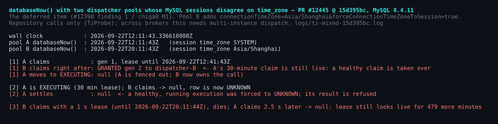
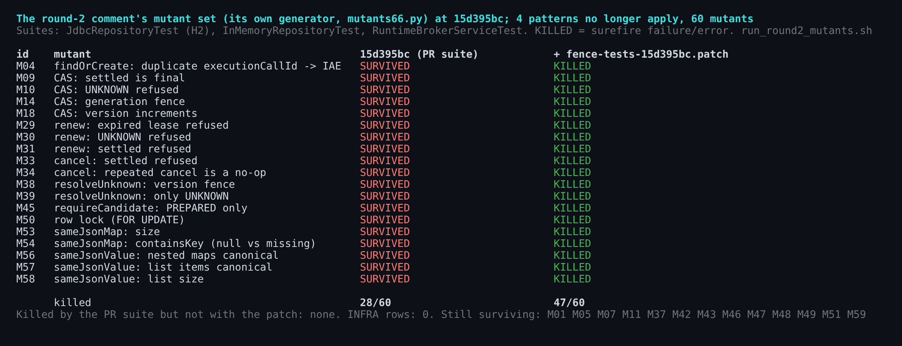
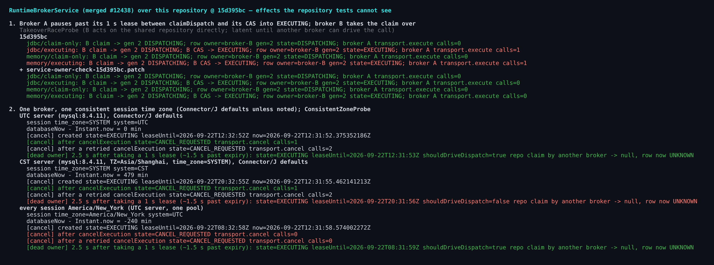

## Verification round 2 — addendum to [5775293028](https://github.com/QwenLM/qwen-code/pull/12445#issuecomment-5775293028) — PR #12445 @ `15d395bc`

`15d395bc` lands the codec fix from the round-2 comment above and adds a live-lease refusal check to the contract. Its float/double comparison takes a different route from that comment's patch (a JSON-token compare, `BrokerValues.jsonNumber`), which I checked only through the gate. I re-ran my probes at this head: gate 63/63, Checkstyle 0. This comment adds what neither the round-2 comment nor that commit covers:

- **Item 1:** the session time-zone clock, deferred earlier.
- **Item 2:** a double-execution path in the merged service.
- **Item 3:** tests for the survivors that remain.

Items 1 and 2 are about code outside this diff that this table now feeds, and nothing wires the service over this table yet, so they should not block this PR. Only item 1's first case needs no second broker: a single broker hits it as soon as the service runs over this table, so I'd fix it before wiring. The rest need multi-broker dispatch, so fix them before a second broker can drive the same call.

### 1. The deferred session time-zone item, measured at `15d395bc`

`databaseNow()` runs `SELECT CURRENT_TIMESTAMP` and reads the result with a UTC calendar, so the leases it stamps follow the MySQL session's `time_zone`. This is #12390 finding 1 and chiga0's M1 here, which the author deferred as a module-wide change.

`RuntimeBrokerService` compares those leases with its own `Clock.systemUTC()` (`:63`): `hasLiveDispatchAt(clock.instant())` at `:222-223` and `:994`. Only a session zone at UTC offset 0 keeps the service and the repository on the same lease clock, up to host/database clock skew. Measured on MySQL 8.4.11 (fig C, part 2; fig A):

- **Session zone behind UTC — needs only one broker.** With every session on `America/New_York`, the service reads a fresh lease as already expired. `cancelExecution` on a running call marks the row `CANCEL_REQUESTED` and then takes the re-drive branch (`:217-229`) instead of `transport.cancel` (`:234`). That branch returns at once, because the call's own dispatch is still in flight. Measured through the real service API: after a cancel and a retried cancel, `transport.cancel` has been called 0 times, against twice on the UTC control. The cancellation never reaches the runtime.
- **Session zone ahead of UTC (`TZ=Asia/Shanghai` server, Connector/J defaults).** A dead owner's `EXECUTING` row still looks live to the service 2.5 s after it took a 1-second lease, about 1.5 s past expiry (`shouldDriveDispatch=false`). The repository already treats that lease as expired: a claim there returns null and moves the row to `UNKNOWN`. The service will not re-drive the row for about 8 hours. This matters once another broker, or a restarted one, can drive the call.
- **Two pools whose zones disagree** (fig A: UTC default vs. `connectionTimeZone=Asia/Shanghai&forceConnectionTimeZoneToSession=true`), again once another broker can claim:
  - B's claim is granted over A's live 30-minute claim, and A is then fenced;
  - a live `EXECUTING` row turns `UNKNOWN`, and A's settlement is refused;
  - in the other direction, a dead 1-second lease blocks the call for about 8 hours (the probe measured 479 more minutes).

The author's round-1 disposition ([5772225768](https://github.com/QwenLM/qwen-code/pull/12445#issuecomment-5772225768)) names `UTC_TIMESTAMP()` for that change, together with an H2+MySQL cross-check. That check would fail at once, as the #12390 verification already showed: H2 2.3.232 in `MODE=MySQL` rejects the call with `Function "UTC_TIMESTAMP" not found`. The round-1 verification on #12390 posted a `UNIX_TIMESTAMP(CURRENT_TIMESTAMP(6))` variant that was verified on both MySQL and H2. On H2 it returns whole seconds.

### 2. A broker can execute a call that another broker already owns (merged #12438 code)

This is latent today. The service fails closed with `runtime_reconciliation_required` when a process meets a binding it did not provision (`RuntimeBrokerService.java:570-578`; adoption is a listed non-goal). So only one broker can drive a given call, and within a process `dispatches` coalesces a call's concurrent dispatches.

It becomes reachable with the multi-instance dispatch this table exists for ("add JDBC Tool execution persistence for multi-instance dispatch convergence", `managed-runtime-broker-service-core.md:97`).

The path: broker A claims, then pauses past its lease before its CAS into `EXECUTING`. Broker B claims and moves the row to `EXECUTING`. A's CAS then fails:

1. `enterExecuting` re-reads the row, sees another owner, and returns that row as it is (`:706-707`).
2. `dispatch()` checks only that the state is `EXECUTING` (`:664-669`).
3. `dispatch()` then calls `transport.execute` (`:680`).

B moved the row to `EXECUTING`, which a broker does right before it executes, so A's call is a second execution of the same tool call. A's own settlement is then refused, but the side effect has already happened twice.

Measured with the JDBC (H2) and in-memory repositories (fig C, part 1): A calls `transport.execute` once when B has entered `EXECUTING`, and 0 times when B has only claimed. In the probe, B acts on the shared repository directly.

**Fix:** one extra condition, `|| !ownsDispatch(executing, claimed)`, in `dispatch()` (+2/−1, [`service-owner-check-15d395bc.patch`](./service-owner-check-15d395bc.patch)). With it, A's count is 0 in all four arms, and the gate passes (Checkstyle 0, 63/63). The fix has no regression test yet; `TakeoverRaceProbe` is the shape one would take.

Once a second broker can drive the same call, a pause longer than the dispatch lease between A's claim and its CAS is enough. With item 1's mixed zones, no pause is needed, only an interleaving inside A's normal claim→CAS window when B's session zone is ahead of A's. I'd take it as a follow-up to #12438, before adoption lands.

### 3. Contract tests for the survivors at `15d395bc`

The round-2 comment says its lock-step fuzz catches 12 survivors besides M22, names M09, M18 and M38 among them, and says they are worth porting. `15d395bc` added the live-lease refusal check but not those tests, nor a concurrency test for the row lock.

[`fence-tests-15d395bc.patch`](./fence-tests-15d395bc.patch) adds two methods called from `verify` (+160 lines). The ids come from the same mutant set, built with that comment's own generator `mutants66.py` (fig B):

- **M50 (the row lock):** six rounds of 32 concurrent claims through two instances; each round must grant exactly one.
- **M04:** a reused `executionCallId` throws `IllegalArgumentException`.
- **M45:** a candidate that is not fresh throws, whether it has a non-zero version or a non-`PREPARED` state.
- **M18:** a CAS moves the version up by exactly one.
- **M09, M31, M33, M39:** once a row is settled:
  - the result is final, including for its own owner;
  - renewing it is refused;
  - cancelling it is refused;
  - `resolveUnknown` is refused.
- **M14:** the same owner id re-claims at generation 2. A generation-1 writer that re-read the fresh row is then refused.
- **M29:** renewing after expiry is refused.
- **M34:** a repeated cancel at the current version is a no-op.
- **M10, M30, M38:** when an owner parks its own call in `UNKNOWN`, the call can be neither CAS'd nor renewed. It can leave only through `resolveUnknown` at the current version.
- **M53, M54, M56, M57, M58:** payload comparison:
  - against a reloaded row, nested `Long`s and list items compare equal, while an extra key or a shorter list compares unequal;
  - between two candidates, a renamed null-valued key compares unequal.

At `15d395bc` the kills go from 28/60 to **47/60**, and no mutant killed before survives. The 13 that still survive need a forged snapshot, a tampered row, an argument only in-package code can pass, or are equivalent. With the patch the gate passes (Checkstyle 0, 63/63). The race is probabilistic. It killed M50 in this sweep, which runs six mutant suites in parallel. At `f724def`, the same race block killed the same transform in 18/18 runs under 6-way load (`logs/c18-under-load.log`, where it was called C18).

Evidence is in [`pr-12445-round2-delta/`](.). It holds the probes with their exact invocations (`harness/COMMANDS.md`), `run_round2_mutants.sh`, per-mutant results, the gate logs, both patches and the figures.

