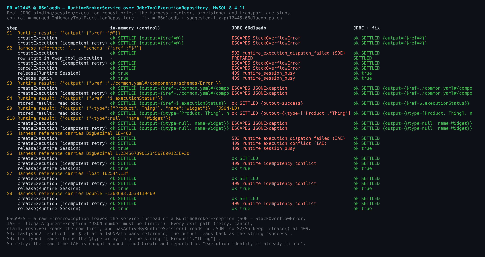
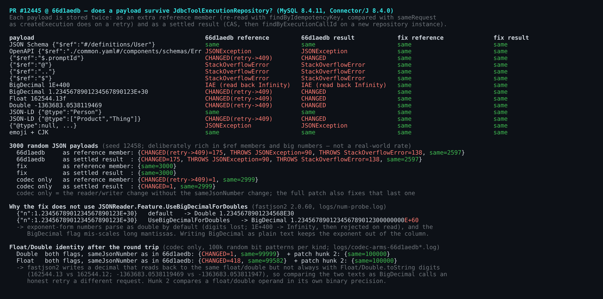
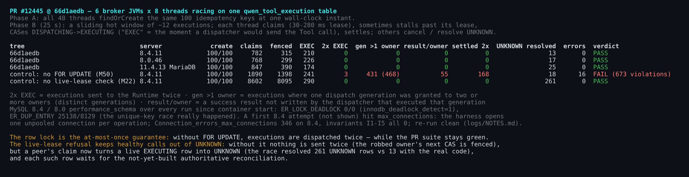
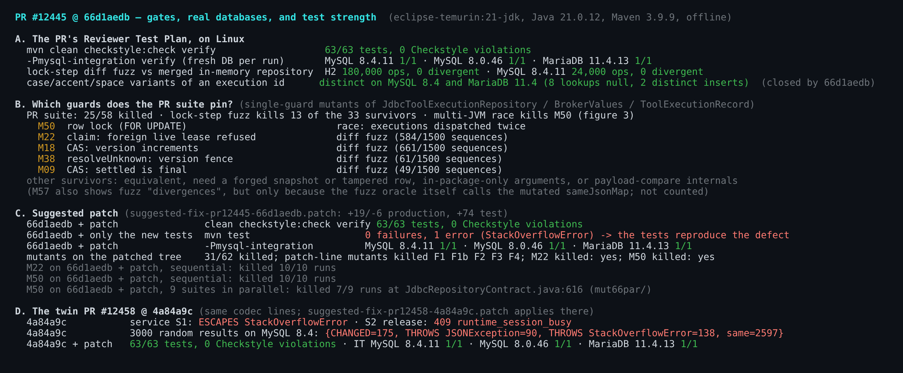

## Verification round 2 — PR #12445 @ `66d1aedb`

**Verdict: merge after one small codec fix.** The patch is below and I have verified it at this head.

Round 1 ([comment](https://github.com/QwenLM/qwen-code/pull/12445#issuecomment-5771498818), at `30cfe50`) found no correctness defect. Among the items it listed as not covered were "No fuzzing of nested/edge payloads", "Real MySQL 8" and "Higher concurrency … No soak or deadlock-detection run". The `/review` that followed raised R1-1, a type-fidelity problem in this same codec, and it was fixed in `f724def`. This round does the payload fuzz and the real-MySQL runs at `66d1aedb`. It covers the concurrency item only in part: 48 threads across 6 JVMs with deadlock detection on, but in 25-second runs, not a soak. The payload fuzz is where the defect turned up.

The repository logic holds:
- The `mysql-integration` contract passes on MySQL 8.4.11, MySQL 8.0.46 and MariaDB 11.4.13.
- Six broker JVMs racing on one table never dispatched an execution twice on any of the three engines. The two MySQL servers raised 0 `ER_LOCK_DEADLOCK` across all runs, with `innodb_deadlock_detect` on.
- A lock-step differential fuzz against the merged in-memory repository found no divergence. It ran 180,000 operations on H2 and 24,000 on MySQL 8.4.11; both counts include the lease-expiry steps.
- The case-sensitive execution-id key from `66d1aedb` closes the collation question raised in the round-1 `/review`. On MySQL 8.4 and MariaDB 11.4, `EXEC-A`, `exéc-a` and `exec-a ` now stay distinct from `exec-a`.

The defect is in the JSON codec. The read line has not changed since round 1, and the write line only gained `WriteNulls` for R1-1.
- **`$ref` resolution.** When fastjson2 reads `reference_json`/`result_json`, it resolves `$ref` members as its own back-references. In my runs this happened whenever `$ref` was an object's first member and its value started with `$`, `@` or `.`. The payload then reads back rewritten, or cannot be read at all. JSON Schema refs (`#/…`), absolute URLs and a `$ref` that is not the first member all survived.
- **`@type` handling.** The typed reader (`TypeReference<Map<String, Object>>`) also treats `@type` specially when a non-string `@type` is the first member of an object that is a direct value in the stored map, such as `output`:
  - arrays, booleans, numbers and objects come back as strings (a JSON-LD `"@type":["Product","Thing"]` reads back as the string `["Product","Thing"]`);
  - `null` makes the row unreadable (`JSONException`).

  String `@type` values, and objects nested deeper or inside lists, survived.
- **Exponent-form numbers.** fastjson2 reads a number written in exponent form back as a `double`.

A codec change fixes all three: read through the untyped reader with reference detection off, and write BigDecimals as plain text. A separate one-method change fixes a leftover float/double comparison issue from the R1-1 fix.

This also qualifies the PR summary's "JSON identity comparison preserves finite numeric values … across persistence". A finite `BigDecimal("1E+400")` passes the non-finite check on write and is stored as `1E+400`. It reads back as `Double` Infinity, and every later read rejects it.

I'd fix this before merge, even though the module is not wired yet:
- The fix is a few lines in code this PR introduces.
- The read-side change recovers `$ref`/`@type` rows after the fact, but the write-side flag is not retroactive: a row already written with an exponent keeps it. Fixing this before the first row exists costs nothing.

### 1. `$ref` and `@type` members are rewritten on read



I ran `RuntimeBrokerService` over the real JDBC binding, session and execution repositories on MySQL 8.4.11, with stub Harness resolver, provisioner and transport. The control arm used the merged in-memory repository.

| Payload | `66d1aedb` | In-memory, and with the fix |
| --- | --- | --- |
| Runtime result `output = {"$ref":"@"}` | `createExecution` and the retry I made both throw a raw `StackOverflowError`, not a `RuntimeBrokerException`. The row is SETTLED but unreadable. | ok |
| Harness reference with `"schema":{"$ref":"$"}` | `createExecution` returns 503 `runtime_execution_dispatch_failed` and the row stays **PREPARED**. The retry and `cancelExecution` throw `StackOverflowError`. Both `release()` calls return **409 `runtime_session_busy`**. `hasActiveByRuntimeSession` reads no JSON, so it keeps seeing the unsettled row, while every exit path reads the row first. | ok |
| Result embeds an OpenAPI `{"$ref":"./common.yaml#/components/schemas/Error"}` | Every read throws `JSONException`. | ok |
| Result `output = {"$ref":"$.executionStatus"}` | The output reads back as the string `"success"`. | ok |
| Result `output = {"@type":["Product","Thing"], …}` (JSON-LD) | `@type` reads back as the string `["Product","Thing"]`. | ok |
| Result `output = {"@type":null, …}` | Every read throws `JSONException`. | ok |

The stored text is intact; only the value read back changes. Once the table is wired, a single tool result can trigger this: for example, structured output from an MCP server, or an OpenAPI document whose first member is a relative external `$ref`. Depending on the member, the row then reads back rewritten or cannot be read at all. In the reference case, the Runtime Session also cannot be released.

**Fix (reader):** `JSON.parseObject(value, JSONReader.Feature.DisableReferenceDetect)`. The untyped reader returns a `JSONObject`, which is a `Map<String, Object>`, and it keeps `@type` as a plain member. The flag stops fastjson2 from resolving `$ref`. Keeping the `TypeReference` and only adding the flag fixes `$ref` but not `@type`.

### 2. Numbers that do not survive the round trip



Rows S5–S8 of figure 1 put each value in a Harness reference and go through the service:
- **BigDecimal `1E+400`:** `createExecution` returns 503. The retry returns 409 `runtime_execution_conflict`: the read-time `IllegalArgumentException` is caught around `findOrCreate` and reported as "execution identity is already in use". `release()` returns 409 `runtime_session_busy`, the same stuck session as the `$ref:$` case.
- **BigDecimal `1.2345678901234567890123E+30`, Float `162544.13f`, Double `-1363683.0538119469`:** an honest retry returns 409 `runtime_idempotency_conflict`.

There are two causes:
- **The writer flag, for positive-exponent BigDecimals.** fastjson2's writer emits a BigDecimal with a positive exponent in exponent form, and its reader parses exponent form as `double` by default. `JSONReader.Feature.UseBigDecimalForDoubles` does not help in 2.0.60: it reads `1.2345678901234567890123E+30` back as `…E+60`. The fix is `JSONWriter.Feature.WriteBigDecimalAsPlain`. The default writer already expands negative exponents: `1E-100000` is 100,008 characters at `66d1aedb`. The flag does the same for positive exponents: `1E+100000` goes from 15 to 100,007 characters. So a size bound on BigDecimals in `BrokerValues` is worth adding either way.
- **The comparison change, for floats and doubles.** The canonical comparison from R1-1 turns each number's text into a `BigDecimal`. fastjson2's text for a float or double reads back to the same binary value, but not always with `Float.toString`/`Double.toString` digits:
  - `162544.13f`: `Float.toString` gives `162544.12` (exact value 162544.125).
  - the double: `Double.toString` gives `-1363683.053811947`.

  Over 100,000 random bit patterns each, 418 floats and 1 double compare unequal after the round trip. This change is separable from the codec change: without it, only Float/Double values are affected (S7/S8). It compares at float/double precision whenever either operand is a Float or Double, so, for example, `Long` 2^53+1 equals `Double` 2^53. It also relies on the writer flag: without `WriteBigDecimalAsPlain`, it would hide the digit loss of exponent-form BigDecimals.

I also round-tripped 3,000 random JSON payloads through the real repository on MySQL 8.4. The generator deliberately over-represents `$ref` members and big numbers, and has no `@type` members; the failure rate is not a real-world rate.

| Tree | Payloads that fail |
| --- | --- |
| `66d1aedb` | 403 of 3,000: 175 changed, 90 `JSONException`, 138 `StackOverflowError` |
| Codec change only | 1 of 3,000 |
| Full patch | 0 of 3,000 |

### 3. The row lock and the live-lease refusal are not pinned by tests (tests in the patch)



I ran single-guard mutation testing at `66d1aedb`: the PR suite kills 25 of 58 mutants. The tests added since #12458's state (case-distinct ids, more non-finite cases) kill no additional mutant; the survivor set is the same 33. Two survivors matter most:
- **M50 (`FOR UPDATE` dropped).** The PR suite stays green, but in the 6-JVM race on MySQL 8.4:
  - 3 executions are dispatched twice;
  - in 431 executions, one dispatch generation is granted to two or more owners (468 generations in total).

  The row lock is what provides at-most-once dispatch across brokers.
- **M22 (the "foreign live lease → null" check dropped).** The suite stays green because the contract's live-lease assertion at `JdbcRepositoryContract.java:308` still passes through a fallback: B's claim flips the CANCEL_REQUESTED row to UNKNOWN and still returns `null`. In the race nothing is dispatched twice, because the robbed owner's next CAS is fenced. But a peer's claim now turns a live `EXECUTING` row into UNKNOWN: the race resolved 261 UNKNOWN rows, against 13 with the real code on the same server.

The patch adds three test blocks: the payload round trip for sections 1–2 (including a first-member `@type` array and a `null` `@type`), a live-`DISPATCHING` refusal that also asserts the row is unchanged, and four rounds of 32 concurrent `claimDispatch` calls on a fresh PREPARED row, each expecting exactly one winner.
- **At `66d1aedb` without the fix:** the new tests fail with `StackOverflowError`.
- **On the patched tree:** they kill M22 in 10/10 runs, and M50 in 10/10 sequential runs and 7/9 runs with 9 suites in parallel. The mutants of the patch's own lines are all killed, including a variant that keeps the `TypeReference` reader. The race test is probabilistic under heavy load.

Besides M22, the lock-step fuzz catches 12 more survivors, for example:
- M18: a CAS that does not bump the version;
- M38: the `resolveUnknown` version fence;
- M09: a settled row being final in CAS.

They are worth porting to `JdbcRepositoryContract`. The fuzz harness in the evidence directory reproduces a failing sequence for each. M57's fuzz "divergences" are not counted: they come from the fuzz oracle itself, which calls the mutated comparison. The remaining survivors are equivalent, need a forged snapshot, a tampered row or in-package-only arguments, or sit inside the payload comparison, where `requestDigest` is still compared exactly.



### Other notes
- **`databaseNow()` still depends on the session time zone.** This is finding 1 on #12390 and chiga0's M1 here, deferred as module-wide. It now also decides dispatch leases. I did not re-measure it in this round.
- **The IT needs a fresh database per run.** This predates this PR (#12390). Re-running it on the same schema at `66d1aedb` fails in `verifyBinding` with `expected: <[1]> but was: <[2]>`, so the "disposable database" in the test plan has to mean one per run.
- **My first 6-JVM race on MySQL 8.4 hit `max_connections`.** The harness opens one unpooled connection per operation. The server recorded 346 `Connection_errors_max_connections` and a peak of 152 connections; invariants I1–I5 were all 0. The re-run was clean, and both logs are in the evidence directory.
- **#12458 carries the same change at an older state (`4a84a9c`).** I measured the same defect there, and `suggested-fix-pr12458-4a84a9c.patch` applies to it. I'll leave a pointer there.
- **Other gates.** I ran the test plan's `mvn clean checkstyle:check verify` at `66d1aedb` and on the patched tree: 63/63 tests and 0 Checkstyle violations on both.

**Not covered:**
- Windows.
- The root `npm run build && npm run typecheck`: no TS/JS changed, and the author reports running it at this head, together with MySQL 26.7.0 ([comment](https://github.com/QwenLM/qwen-code/pull/12445#issuecomment-5774219602)).
- Anything that belongs to the later wiring PR, such as authoritative UNKNOWN resolution and migrations.

<details>
<summary>Suggested patch for <code>66d1aedb</code> (+19/−6 production, +74 test): the <code>BrokerValues</code> hunk is the comparison change; the <code>JdbcToolExecutionRepository</code> hunks are the codec change</summary>

```diff
diff --git a/packages/sdk-java/runtime-broker/src/main/java/com/alibaba/qwen/code/runtimebroker/BrokerValues.java b/packages/sdk-java/runtime-broker/src/main/java/com/alibaba/qwen/code/runtimebroker/BrokerValues.java
index 97c0410400..d128110052 100644
--- a/packages/sdk-java/runtime-broker/src/main/java/com/alibaba/qwen/code/runtimebroker/BrokerValues.java
+++ b/packages/sdk-java/runtime-broker/src/main/java/com/alibaba/qwen/code/runtimebroker/BrokerValues.java
@@ -141,6 +141,14 @@ final class BrokerValues {
         if (!isJsonFinite(first) || !isJsonFinite(second)) {
             return first.equals(second);
         }
+        // fastjson2's text for a float or double reads back to the same binary
+        // value but need not match Float/Double.toString digit for digit.
+        if (first instanceof Float || second instanceof Float) {
+            return first.floatValue() == second.floatValue();
+        }
+        if (first instanceof Double || second instanceof Double) {
+            return first.doubleValue() == second.doubleValue();
+        }
         return new BigDecimal(first.toString())
                 .compareTo(new BigDecimal(second.toString())) == 0;
     }
diff --git a/packages/sdk-java/runtime-broker/src/main/java/com/alibaba/qwen/code/runtimebroker/JdbcToolExecutionRepository.java b/packages/sdk-java/runtime-broker/src/main/java/com/alibaba/qwen/code/runtimebroker/JdbcToolExecutionRepository.java
index d51eb883fd..5d283ac41c 100644
--- a/packages/sdk-java/runtime-broker/src/main/java/com/alibaba/qwen/code/runtimebroker/JdbcToolExecutionRepository.java
+++ b/packages/sdk-java/runtime-broker/src/main/java/com/alibaba/qwen/code/runtimebroker/JdbcToolExecutionRepository.java
@@ -1,8 +1,8 @@
 package com.alibaba.qwen.code.runtimebroker;
 
 import com.alibaba.fastjson2.JSON;
+import com.alibaba.fastjson2.JSONReader;
 import com.alibaba.fastjson2.JSONWriter;
-import com.alibaba.fastjson2.TypeReference;
 import java.sql.Connection;
 import java.sql.PreparedStatement;
 import java.sql.ResultSet;
@@ -25,9 +25,6 @@ public final class JdbcToolExecutionRepository
             "last_sequence", "cancel_requested", "dispatch_owner",
             "dispatch_lease_until", "dispatch_generation", "record_version",
             "settled_at");
-    private static final TypeReference<Map<String, Object>> MAP_TYPE =
-            new TypeReference<>() {
-            };
 
     private final DataSource dataSource;
 
@@ -438,12 +435,20 @@ public final class JdbcToolExecutionRepository
     }
 
     private static String toJson(Map<String, Object> value) {
+        // Plain BigDecimal text keeps an exponent out of the column: the
+        // reader would otherwise parse it as a double (overflow, lost digits).
         return value == null ? null
-                : JSON.toJSONString(value, JSONWriter.Feature.WriteNulls);
+                : JSON.toJSONString(value, JSONWriter.Feature.WriteNulls,
+                        JSONWriter.Feature.WriteBigDecimalAsPlain);
     }
 
     private static Map<String, Object> fromJson(String value) {
-        return value == null ? null : JSON.parseObject(value, MAP_TYPE);
+        // Payloads are opaque Tool data: "$ref" (JSON Schema, OpenAPI) and
+        // "@type" (JSON-LD) members must stay data. The untyped reader keeps
+        // "@type" as a plain member; the flag keeps "$ref" from becoming a
+        // fastjson2 back-reference.
+        return value == null ? null : JSON.parseObject(value,
+                JSONReader.Feature.DisableReferenceDetect);
     }
 
     private static void requireCandidate(ToolExecutionRecord candidate) {
diff --git a/packages/sdk-java/runtime-broker/src/test/java/com/alibaba/qwen/code/runtimebroker/JdbcRepositoryContract.java b/packages/sdk-java/runtime-broker/src/test/java/com/alibaba/qwen/code/runtimebroker/JdbcRepositoryContract.java
index 333c73da30..969e56a5bb 100644
--- a/packages/sdk-java/runtime-broker/src/test/java/com/alibaba/qwen/code/runtimebroker/JdbcRepositoryContract.java
+++ b/packages/sdk-java/runtime-broker/src/test/java/com/alibaba/qwen/code/runtimebroker/JdbcRepositoryContract.java
@@ -7,6 +7,7 @@ import static org.junit.jupiter.api.Assertions.assertNull;
 import static org.junit.jupiter.api.Assertions.assertThrows;
 import static org.junit.jupiter.api.Assertions.assertTrue;
 
+import java.math.BigDecimal;
 import java.net.URI;
 import java.sql.Connection;
 import java.sql.PreparedStatement;
@@ -18,6 +19,7 @@ import java.util.ArrayList;
 import java.util.LinkedHashMap;
 import java.util.List;
 import java.util.Map;
+import java.util.Objects;
 import java.util.Set;
 import java.util.concurrent.Callable;
 import java.util.concurrent.ExecutorService;
@@ -265,6 +267,15 @@ final class JdbcRepositoryContract {
         assertEquals(ownerA.getDispatchGeneration(),
                 reclaimedA.getDispatchGeneration());
         assertEquals(ownerA.getVersion(), reclaimedA.getVersion());
+        // A live claim held by another dispatcher is refused without
+        // touching the row: no takeover and no early UNKNOWN.
+        assertNull(second.claimDispatch(executionId,
+                prefix + "-dispatcher-b", Duration.ofMinutes(30)));
+        ToolExecutionRecord stillOwnedByA = second.findByExecutionCallId(
+                executionId);
+        assertEquals(ToolExecutionRecord.State.DISPATCHING,
+                stillOwnedByA.getState());
+        assertEquals(ownerA.getVersion(), stillOwnedByA.getVersion());
         ToolExecutionRecord renewedA = first.renewDispatch(executionId,
                 prefix + "-dispatcher-a", ownerA.getDispatchGeneration(),
                 Duration.ofMinutes(30));
@@ -543,6 +554,69 @@ final class JdbcRepositoryContract {
                         prefix + "-dispatcher-a",
                         stickyForged.getDispatchGeneration()));
 
+        // Payloads are opaque Tool data: "$ref" members (JSON Schema, OpenAPI),
+        // exponent-form decimals and floats must read back unchanged.
+        String opaqueKey = prefix + "-opaque-idempotency";
+        Map<String, Object> opaqueReference = new LinkedHashMap<>();
+        opaqueReference.put("sessionId", prefix + "-opaque-runtime-session");
+        opaqueReference.put("promptId", prefix + "-opaque-turn");
+        opaqueReference.put("callId", prefix + "-opaque-tool");
+        opaqueReference.put("argsDigest", prefix + "-opaque-digest");
+        opaqueReference.put("schema", Map.of("$ref", "$"));
+        opaqueReference.put("scale",
+                new BigDecimal("1.2345678901234567890123E+30"));
+        opaqueReference.put("ratio", 162544.13f);
+        opaqueReference.put("weight", -1363683.0538119469d);
+        ToolExecutionRecord opaque = ToolExecutionRecord.prepared(
+                prefix + "-opaque-execution", opaqueKey,
+                prefix + "-opaque-binding", 1, prefix + "-opaque-harness",
+                prefix + "-opaque-runtime-session", prefix + "-opaque-turn",
+                prefix + "-opaque-tool", prefix + "-opaque-digest",
+                opaqueReference);
+        first.findOrCreate(opaque);
+        assertTrue(new JdbcToolExecutionRepository(dataSource)
+                .findByIdempotencyKey(opaqueKey).sameRequest(opaque));
+        ToolExecutionRecord opaqueClaim = first.claimDispatch(
+                opaque.getExecutionCallId(), prefix + "-dispatcher-a",
+                Duration.ofMinutes(30));
+        Map<String, Object> jsonLd = new LinkedHashMap<>();
+        jsonLd.put("@type", List.of("Product", "Thing"));
+        jsonLd.put("name", "widget");
+        Map<String, Object> untyped = new LinkedHashMap<>();
+        untyped.put("@type", null);
+        untyped.put("name", "widget");
+        Map<String, Object> opaqueResult = Map.of("executionStatus",
+                "success", "output", Map.of(
+                        "copied", Map.of("$ref", "$.executionStatus"),
+                        "external", Map.of("$ref",
+                                "./common.yaml#/components/schemas/Error")),
+                "jsonLd", jsonLd, "untyped", untyped,
+                "limit", new BigDecimal("1E+400"));
+        assertNotNull(first.compareAndSet(opaqueClaim,
+                opaqueClaim.withResult(opaqueResult, 1, START),
+                prefix + "-dispatcher-a",
+                opaqueClaim.getDispatchGeneration()));
+        assertTrue(BrokerValues.sameJsonMap(opaqueResult,
+                new JdbcToolExecutionRepository(dataSource)
+                        .findByExecutionCallId(opaque.getExecutionCallId())
+                        .getResult()));
+
+        // Concurrent dispatchers on one PREPARED execution: the row lock
+        // lets exactly one of them take generation 1.
+        for (int round = 0; round < 4; round++) {
+            ToolExecutionRecord race = first.findOrCreate(execution(
+                    prefix + "-race-execution-" + round,
+                    prefix + "-race" + round + "-idempotency",
+                    prefix + "-race-digest"));
+            List<ToolExecutionRecord> raceClaims = invokeConcurrently(32,
+                    index -> (index % 2 == 0 ? first : second)
+                            .claimDispatch(race.getExecutionCallId(),
+                                    prefix + "-racer-" + index,
+                                    Duration.ofMinutes(30)));
+            assertEquals(1, raceClaims.stream().filter(Objects::nonNull)
+                    .count());
+        }
+
         // Forge a session-key collision: the full-id comparison must still
         // exclude a row whose hash matches the queried session.
         try (Connection connection = dataSource.getConnection();
```

</details>

**Evidence** (figures, probe sources, race, fuzz and mutation scripts, all logs, both patches): this directory.

**Environment:**
- Maven, probes and fuzz: `eclipse-temurin:21-jdk` (Java 21.0.12), Maven 3.9.9 offline.
- Race JVMs: host Zulu OpenJDK 21.0.10.
- H2 2.3.232; MySQL 8.4.11, MySQL 8.0.46 and MariaDB 11.4.13 in Docker; Connector/J 8.4.0; fastjson2 2.0.60.
