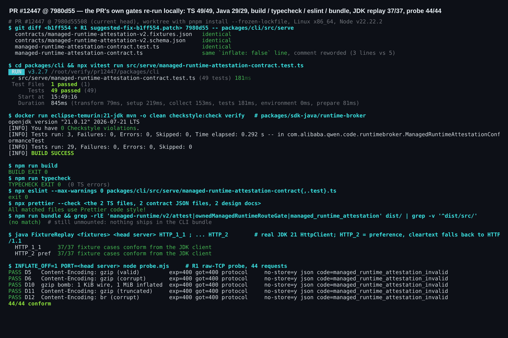
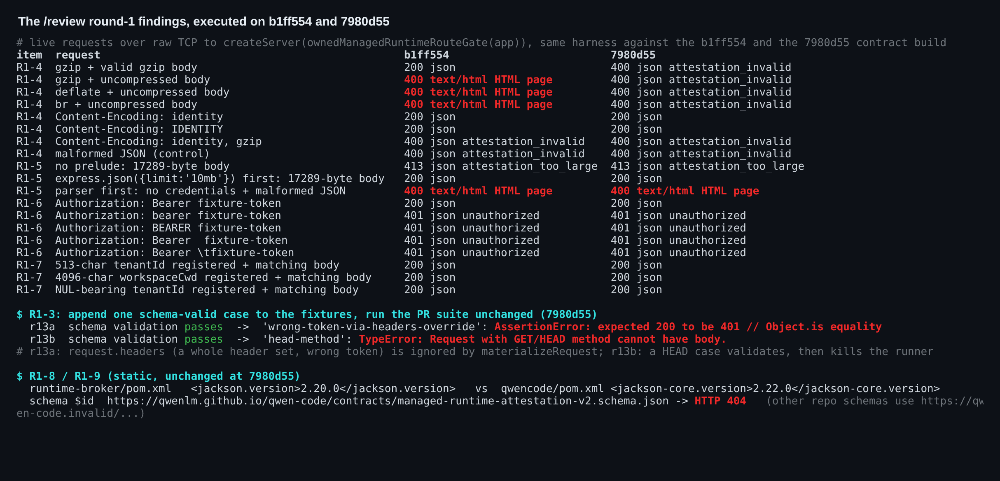
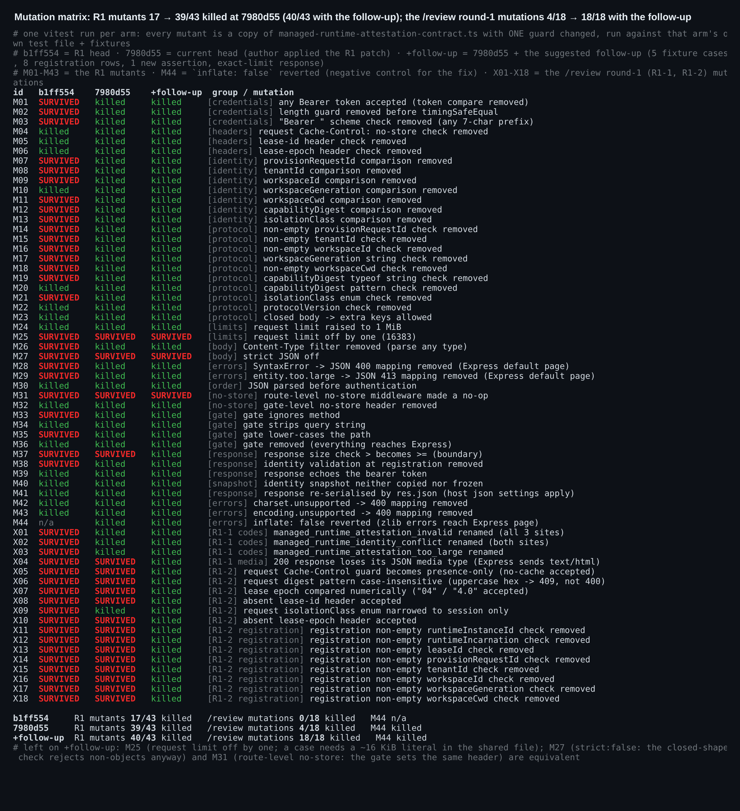

### 维护者验证第 2 轮：PR #12447 @ `7980d55`（在[第 1 轮](https://github.com/QwenLM/qwen-code/pull/12447#issuecomment-5772128515)基础上的增量）

**结论：我在这个 head 上执行的检查里，没有发现阻塞合入的问题。** `7980d55` 原样采纳了第 1 轮给出的补丁：fixtures、schema 和测试文件与 [`suggested-fix-b1ff554.patch`](https://github.com/wenshao/qwen-code/blob/b13440f08cee738da493998a7619a768abe01dc6/pr-12447/suggested-fix-b1ff554.patch) 逐字节一致。生产代码的改动也是同一行 `inflate: false`，只是注释换了措辞。我在这个 head 上把所有检查重跑了一遍，第 1 轮的两个发现都已关闭：

- **fixture 覆盖：** 现在的 fixtures 能杀死第 1 轮 43 个变异体中的 39 个（之前是 17 个）。
- **压缩 body：** 已经没有任何压缩 body 会落到 Express 的 HTML 错误页。

`/review` 在 `b1ff554` 上提了 9 条建议，我在这个 head 上逐条执行过。本次提交解决了 R1-4 的实质问题，也解决了 R1-1、R1-2 的一部分。其余几条不阻塞合入，每条在当前 head 上的实测状态见下表。

我另外写了一个可选的补充补丁，只改 fixtures 和测试。R1-1、R1-2 中我能表达出来的 18 个变异它全部能杀死，外加 M37。M25 我没有加。M31（R1-1 提到的路由级 `no-store`）是等价变异，因为 gate 会设置同一个头。triage 提出的方向问题仍由维护者决定：是否要在 #12380 定论前合入。

#### 在 `7980d55` 上重跑了什么

全部在 Linux x86_64、Node v22.22.2 上运行，使用第 1 轮的同一个 worktree（`pnpm install --frozen-lockfile`），harness 与第 1 轮相同、未改动。

| 检查 | `b1ff554`（第 1 轮） | `7980d55` |
| --- | --- | --- |
| 聚焦 TS 测试 | 24/24 | **49/49** |
| `runtime-broker` 下 `mvn clean checkstyle:check verify`，`eclipse-temurin:21-jdk` 21.0.12 | 29/29，0 违规 | **29/29，0 违规** |
| `npm run build` / `npm run typecheck` / 对两个 TS 文件跑 `eslint --max-warnings 0` | exit 0 | **exit 0**（0 个 TS 错误） |
| 对 2 个 TS 文件、2 个契约 JSON、2 份设计文档跑 `prettier --check` | 未运行 | **exit 0** |
| `npm run bundle` 后在 `dist/` 中 grep 路由、gate 名和错误码 | 无匹配 | **无匹配**：契约仍未生效（inert） |
| 黑盒原始 TCP 探针，44 个请求 | 41/44 | **44/44**（D5 合法 gzip、D10 gzip 炸弹的预期改为 400） |
| 真实 JDK 21 `HttpClient` 重放共享 fixtures，分别用 `HTTP_1_1` 和默认的 `HTTP_2` 偏好 | 各 17/17 | **各 37/37**。这里是明文连接，所以实际全部走的是 HTTP/1.1。 |
| 第 1 轮变异体 M01–M43，用 PR 自带的测试去跑 | 杀死 17 个 | **杀死 39 个** |
| M44：撤销 `inflate: false`（修复的反向对照） | 不适用 | **被杀死**：`gzip-content-encoding` 变红 |
| `7980d55` 的 CI | | 全部通过：23 项 pass、21 项 skipped，无失败 |

存活的 4 个变异体正是第 1 轮预测的那几个：

- **M25、M37：** 1 字节的上限边界。
- **M27，`strict: false`：** 等价变异，因为闭合形状检查本来就会拒绝非对象。
- **M31，路由级 `no-store`：** 等价变异，因为 gate 会设置同一个头。

中英文设计文档同步修改了相同的 3 处。UTF-8-only 和 h2c 两个问题推迟到 transport 那一片再定，我同意。

#### `/review` 第 1 轮建议在 `7980d55` 上的状态

作者只回复了 R1-4。所有需要实际请求的条目，我都用同一套 harness 在两个 head 上各跑了一遍（图 3）。R1-1、R1-2 中描述的变异，我写成了 X01–X18，分别用每个版本自己的测试去跑（图 2）。

| | 在 `7980d55` 上的状态 | 实测情况 |
| --- | --- | --- |
| **R1-1** 错误响应体和响应头不在契约里 | **部分解决** | 每个 400/401/409/413 用例现在都钉住 `expected.code`（schema enum），并断言 JSON content type。6 个 404 `incompatible` 用例没有 code，gate 的 404 也没有 body。401 之外的三个错误码，改名任何一个都会让 1–16 个测试失败（X01–X03）；在 `b1ff554` 上 24 个测试全绿。**仍未解决：** 200 响应的 media type 没有断言。去掉 `.type('application/json')` 后，成功响应会以 `text/html` 返回，49 个测试仍全绿（X04）。路由级 `no-store` 在 gate 后面观测不到（M31），在当前拓扑下这是等价的。 |
| **R1-2** 每个维度只有一个用例 | **部分解决** | **已钉住：** 凭据、全部 7 个身份比较、body 中的空值和类型错误字段、大小写变体路径、非 JSON `content-type`、`OPTIONS`、整个注册期 throw（M38）及其 13 个条件中的 5 个，以及 `workspace` 隔离类进入线路（X09 被杀死）。**仍未钉住**（每项都有一个存活的变异体）：存在但取值错误的 `Cache-Control`（X05）；请求中的大写十六进制 digest（X06）；非规范写法的 epoch，如 `"04"`（X07）；缺少 lease-id 或 lease-epoch 头（X08、X10）；注册期 8 个逐字段非空检查（X11–X18）；以及 1 字节的上限边界（M25、M37）。 |
| **R1-3** harness 不读 `request.headers` / `request.body` | **仍未解决，只影响测试** | 我追加了一个通过 schema 校验的用例，它的 `request.headers` 是一整套带错误 token 的请求头。runner 实际发出的是 canonical 请求，所以期望 401 却得到 200。一个通过 schema 校验的 `"method": "HEAD"` 用例会让 runner 抛出 `TypeError: Request with GET/HEAD method cannot have body`。对生产代码没有影响。要么在 `materializeRequest` 中真正使用这两个键，要么把它们从 schema 和类型中删掉。 |
| **R1-4** 解析错误映射靠手写清单 | **对端能发出的请求已全部覆盖** | 在 `inflate: false` 下，所有压缩请求现在都得到 JSON 400。在 `b1ff554` 上，合法 gzip 得到 200，gzip 炸弹得到 413，损坏的 gzip、deflate、br 以及截断的 gzip 得到 HTML 错误页。`identity, gzip` 在 `b1ff554` 上就已经是 JSON 400；`identity` 和 `IDENTITY` 仍得到 200。我读了 body-parser 2.3.0 与 raw-body 3.0.2 的源码，剩下的几种错误类型（`request.aborted`、`request.size.invalid`、`stream.encoding.set`、`stream.not.readable`）都需要客户端在发送 body 中途断开，或者前面有别的中间件先消费了请求流。对端在 body 中途半关闭时，拿到的是 Node 自己返回的空 400，这一点我实测过，不是 Express 的错误页。数据文件里有一行 `Content-Length: 999999999`，在两个 head 上都显示"无响应"。这不是逃逸：raw-body 会立刻报 413，但 body-parser 的 `dump()` 要先读完声明的长度才调用 `next`，而探针 3 秒后就放弃了。像 R1-4 建议的那样按 status 映射，仍能防住 body-parser 未来的变化，但目前没有这个必要。 |
| **R1-5** 前置的 JSON parser 会让上限和"先鉴权"失效 | **仍未解决，应在挂载路由的 PR 中处理** | 前面先挂 `express.json({limit:'10mb'})` 时，17,289 字节的 body 得到 200；无凭据加非法 body 时，返回的是宿主 parser 的 400 HTML 页，而不是 401。目前没有任何代码挂载这个路由。挂载它的 PR 应当保证 owned listener 上不装全局 body parser，这样两个问题都能解决；在 Integration Order 里写一句即可记录下来。在 raw gate 里检查 `Content-Length` 只能恢复"声明了长度的 body"的上限（chunked body 不行，见探针 F3）。R1-5 自己也实测过，这样做恢复不了"先鉴权"的顺序。 |
| **R1-6** `Bearer ` 大小写敏感 | **仍未解决，属于设计选择** | `bearer`、`BEARER`、两个空格、SP+HTAB 都返回 401，而 `serve/auth.ts` 会接受它们。唯一的预期对端是 Java transport，所以精确匹配也说得过去。但目前没有 fixture 钉住任何一种选择。加一个 `bearer <token>` 用例，就能防止 Java 侧做出不同的选择。 |
| **R1-7** 没有 512 字符 / NUL 上限 | **成立，但影响小** | 513 字符的 `tenantId`、4 KiB 的 `workspaceCwd`、含 NUL 的 `tenantId` 都能注册，并且 attest 返回 200。对这几类字段，Java 已经会拒绝超过 512 字符或含 NUL 的值：`RuntimeScope` 管 `tenantId`、`workspaceId`、`canonicalCwd`，`RuntimeLease` 管 `runtimeInstanceId`、`token`、`leaseId`（都经过 `BrokerValues.requireId`）。所以基于这个模型的 broker 造不出这样的值来下发。`provisionRequestId` 和 `runtimeIncarnation` 在 `runtime-broker` 中没有对应字段，两边都没有上限。反方向上，`RuntimeLease` 接受 epoch 0，而 TS 注册和 schema 都会拒绝它。钉死 `maxLength: 512`，还会迫使那两个约 16 KiB 的响应上限测试重写。 |
| **R1-8** Jackson 2.20.0 与 2.22.0 | 未改动 | `jackson.version` 为 2.20.0，仅用于测试作用域；兄弟模块的 `jackson-core.version` 是 2.22.0。 |
| **R1-9** schema 的 `$id` 无法解析 | 未改动 | 该 URL 仍返回 HTTP 404。仓库中另外两个 schema 使用 `https://qwen-code.invalid/…`。改一行即可。 |

triage bot 的沙箱验证是在第 1 轮进行期间发出的。它的 5 个发现在当前 head 上的状态：

- **F1，解码失败逃到 HTML：** 已解决（见 R1-4）。
- **F2，共享文件中没有错误响应体：** 错误码已经进入契约。`error` 文案和闭合的 `{code, error}` 形状还没有，因为 `toMatchObject({ code })` 允许多余字段。
- **F3，6 个身份比较没被钉住：** 已解决（M07–M13 被杀死）。
- **F4，接受的编码范围超出 schema：** `Content-Encoding` 这一半已解决，除 `identity` 外的编码一律拒绝。另一半未改动：`application/json; charset=utf-8` 得到 200，而 `$defs/headers` 把 `content-type` 钉成了恰好 `application/json`。这属于作者推迟的 UTF-8 问题。
- **F5，`incompatible` 的 404 没有响应体：** 未改动，属于设计选择。

#### 可选的补充补丁：只改 fixtures 和测试，+77/−2

[`followup-7980d55.patch`](./followup-7980d55.patch) 能干净地打在 `7980d55` 上，不改任何生产代码。它添加了：

- **5 个 fixture 用例：** `wrong-cache-control` → 400、`uppercase-capability-digest` → 400、`non-canonical-epoch` → 409、`missing-lease-id` → 409、`missing-lease-epoch` → 409。
- **8 行注册校验：** 注册期 `it.each` 还没覆盖的每个逐字段非空检查各一行。
- **一条 media type 断言：** 只要设置了 `expected.body`，就断言 JSON media type。
- **恰好到上限的响应：** exact-bytes 测试现在构造恰好 16 384 字节的响应，而不是 `limit - 32`，这样能杀死 M37。

结果：

- **测试：** 62/62，eslint 与 prettier 均无问题。
- **变异体：** `/review` 那组从 4/18 变为 18/18 被杀死。第 1 轮那组变为 40/43，只剩 M25 和两个等价变异 M27、M31 存活。
- **Java：** `ManagedRuntimeAttestationConformanceTest` 3/3 通过，整个模块 29/29，Checkstyle 0 违规。日志里记录了它所用的 42 个用例 fixtures 文件的 sha256。
- **JDK 重放：** 两种 HTTP 设置下均为 42/42。

有两处留给作者决定：

- **缺少 lease 头：** 这两个用例钉住的是当前的分类（409 identity）。如果缺少 lease 头应该算 400 协议错误，请把 fixtures 和代码一起改。
- **M25：** 用一个带约 16 KiB `workspaceCwd` 的 `replaceBody` 用例（期望 409）就能杀死它。我没有加，是不想在共享文件里放一段 16 KiB 的字面量。

**证据：** [`wenshao/qwen-code@asserts` → `pr-12447-round2/`](.) 包含：

- 三张图；
- `REPORT.md` 与 `REPORT.zh-CN.md`；
- `harness/`：`/review` 实时探针、第 2 轮变异体生成器（M01–M44 加 X01–X18）、R1-3 用例生成脚本和出图脚本；
- `data/`：原始日志（含 eslint、prettier）和各版本的变异汇总；
- 补充补丁。
