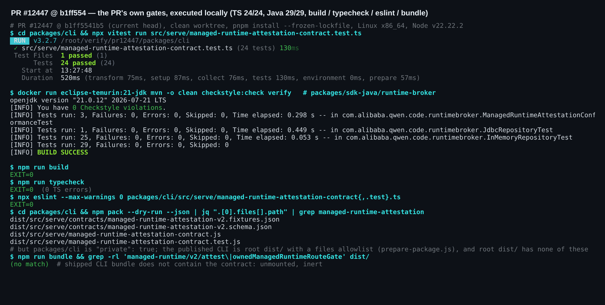
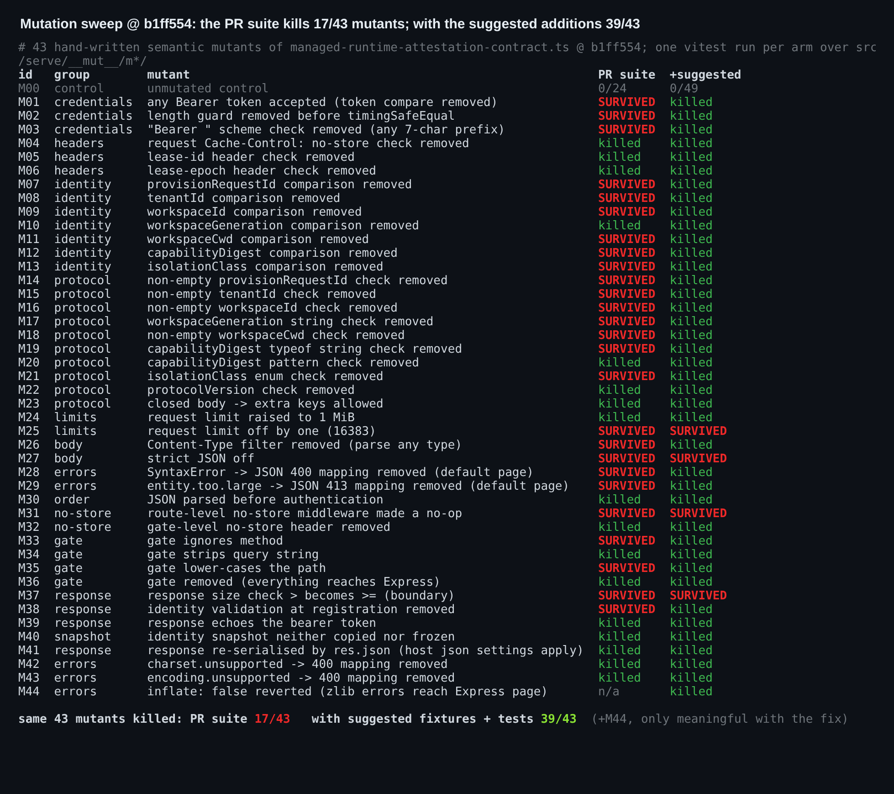
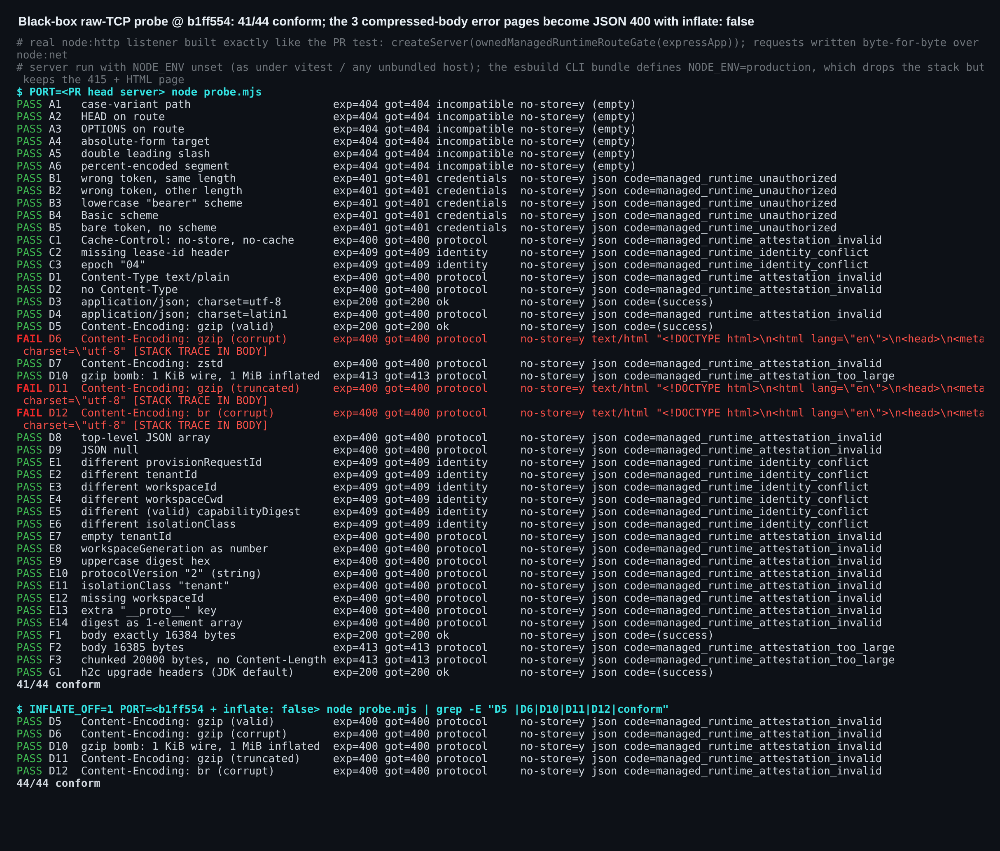
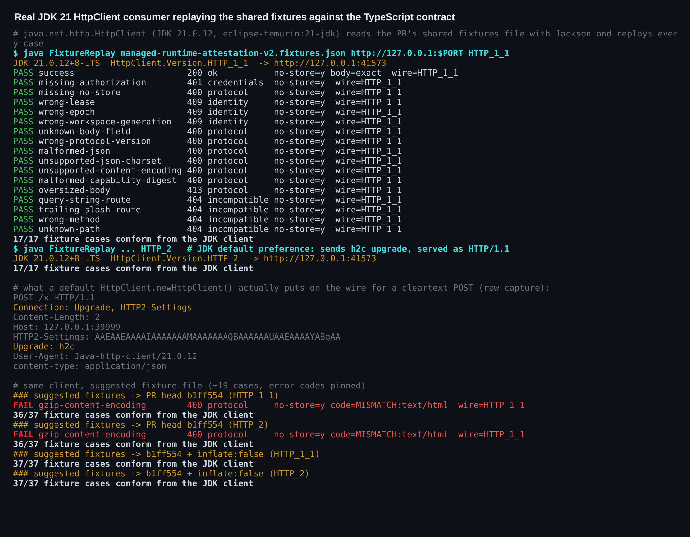
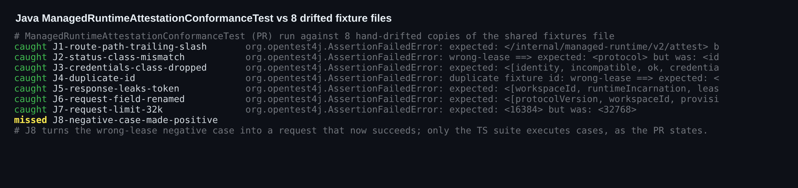

### 维护者验证：PR #12447 @ `b1ff554`（本地实际执行）

**结论：44 个黑盒探针中有 41 个的行为符合契约（其余 3 个见 §2），而且 CLI bundle 中完全没有它的痕迹。合入前我建议先扩充共享 fixtures。** 它们是这个 PR 交付的东西，但 PR 自带的 24 个测试只能杀死 43 个手写变异体中的 17 个：把 bearer token 比较删掉，所有测试仍然全绿。下面附一个现成补丁（+20 个 fixture 用例、钉住错误码、一行 `inflate: false`），已在两种语言下验证。triage 评审提出的方向问题（在 #12380 定论前落地）仍由维护者决定，本文不做评估。

本文是在上面 triage 评审基础上的增量，不重复它的发现。凡是我的执行结果与它不一致的地方，都会注明：

- 它认为测试已经很好地验证了契约逻辑（§1）；
- 它说 charset/encoding 映射堵住了逃到 Express 错误页的缺口（§2）；
- 它的发现 1，即 fixtures 会被发布到 npm（§3）。

验证过程中 PR head 从 `cbb829b` 变到了 `b1ff554`，所以全部检查都在 `b1ff554` 上重跑了一遍。

#### 我执行了什么

全部在 `b1ff554` 上运行：Linux x86_64，Node v22.22.2，干净 worktree，先执行 `pnpm install --frozen-lockfile`。

| 检查 | 结果 |
| --- | --- |
| 聚焦 TS 测试 | **24/24** |
| `runtime-broker` 下 `mvn clean checkstyle:check verify`，`eclipse-temurin:21-jdk` 21.0.12 | **29/29**，Checkstyle 0 违规 |
| `npm run build` / `npm run typecheck` / 对两个 TS 文件跑 `eslint --max-warnings 0` | exit 0 / exit 0（0 个 TS 错误）/ exit 0 |
| `npm run bundle` 后在 `dist/` 中 grep 路由、gate 名和错误码 | 无匹配：契约未生效（inert） |
| 黑盒探针：对 `createServer(ownedManagedRuntimeRouteGate(app))` 发 44 个原始 TCP 请求 | **41/44** 符合契约（§2） |
| 真实 JDK 客户端：`java.net.http.HttpClient` 用 Jackson 读共享 fixtures 并重放全部用例 | `HTTP_1_1` **17/17**，默认 `HTTP_2` 偏好 **17/17** |
| 针对契约模块手写 43 个变异体，用 PR 自带的 24 个测试去跑 | **杀死 17 个**（§1） |
| 用 `drift.py` 生成 8 种 fixtures 漂移，交给 `ManagedRuntimeAttestationConformanceTest` | **抓住 7 种**（§3） |

**CI：** `b1ff554` 上 `Test (ubuntu-latest, Node 22.x)` 第一次运行变红，但原因不在本 PR。那次运行中契约测试本身是通过的（`✓ src/serve/managed-runtime-attestation-contract.test.ts (24 tests)`）。3 个失败全部在 `scripts/tests/{package-scripts,release-versioning}.test.js`，报错都是 self-hosted runner `ecs-qwen-hk3-7` 上的 `Cannot find module …/corepack/v1/pnpm/11.24.0/bin/pnpm.mjs`。这两个文件在本地 `b1ff554` 上都能通过（49 passed，1 skipped），在 `ecs-qwen-hk2-10` 上的重跑也已通过。

下面这些声明在实际执行中都成立，其中有些是测试没有钉住的：

- **路由匹配：** 六种路由变体（大小写、`HEAD`、`OPTIONS`、absolute-form、`//`、`%61`）都返回 404，并带 `no-store`。
- **先鉴权后读 body：** 未鉴权请求拿到 401 的耗时，8 MiB（55 ms）与 64 MiB（59 ms）几乎相同。
- **16 KiB 限制：** 限制是精确的。16 384 字节的 body 返回 200，16 385 字节返回 413，20 000 字节的 chunked body 返回 413。
- **解压后计量：** 限制作用于解压后的字节。一个 1,211 字节、解压后 1 MiB 的 gzip body 返回 413。
- **身份与非法字段：** 我发送的六个不可变字段不匹配各自返回 409；我试过的每一种非法字段都返回 400。
- **h2c 头：** JDK 的 h2c upgrade 头按普通 HTTP/1.1 处理。

我在 `cbb829b` 上还发现：`charset=latin1` 和未知的 `Content-Encoding` 会得到 415 加 Express 的 HTML 错误页。这个状态码不在五类分类之内，两边的 `classify()` 都会拒绝它。`b1ff554` 已修复此问题，我实际运行确认了（探针 D4/D7 两行，变异体 M42/M43 被杀死）。

#### 1. PR 自带测试只杀死 43 个变异体中的 17 个，fixtures 既没钉住 token 检查，也没钉住 7 个不可变身份比较中的 6 个（建议在本 PR 内修）

每个变异体改动 `managed-runtime-attestation-contract.ts` 中的一个守卫，PR 的测试文件原样跑在它上面。值得关注的存活者：

- **M01：** 把 `!equalSecret(...)` 换成 `false`，任意 `Bearer <anything>` 都能通过鉴权，24 个测试仍全绿。fixtures 里只有 `missing-authorization`，没有错误 token 的用例。
- **M02：** 去掉 `timingSafeEqual` 之前的长度检查后，长度不同的 token 会在 `timingSafeEqual` 内部抛异常，返回 500。测试仍全绿。
- **M03：** 去掉 `Bearer ` 前缀检查后，`Digest fixture-token` 也能通过鉴权。测试仍全绿。
- **M07–M09、M11–M13：** 删掉 `provisionRequestId`、`tenantId`、`workspaceId`、`workspaceCwd`、`capabilityDigest` 或 `isolationClass` 任意一个比较后，针对别的 tenant 或 workspace 的请求会拿到 200，并带上本 runtime 的身份。测试仍全绿。只有 `workspaceGeneration` 有对应用例。
- **M14–M19、M21：** 以下输入都没有 fixture：空字符串、`workspaceGeneration` 传数字、digest 传数组、`isolationClass: "tenant"`。所以 400 与 409 之间的划分没有被测试。
- **M33（gate 的 method 检查）：** 去掉后，对该路由发 `OPTIONS` 会得到 **200**，带 `Allow: POST`、body 为 `POST`，会被分类为 `ok`。`GET`、`PUT` 则得到 Express 的 HTML 404。唯一的 method 用例是 `GET`，它分不清 gate 的空 404 和 Express 的 404。
- **M28 / M29（`SyntaxError` 的 JSON 400 映射、413 映射）：** Express 自己的错误页状态码相同，而没有 fixture 检查错误 `code` 或 content type。
- **M26 / M35 / M38（Content-Type 过滤、gate 的大小写折叠、注册时的身份校验）：** 没有非 JSON Content-Type 的用例，没有大小写变体路径的用例（设计文档声称两者都有），也没有测试注册非法 identity。

在未变异的 head 上，这些情况都处理得正确：

- **探针分组：** B 组覆盖凭据，E 组覆盖身份与 body 字段，D1/D2 覆盖 Content-Type，F2/F3 覆盖 413，A1 覆盖大小写变体，A3 覆盖 `OPTIONS`。
- **注册校验：** 下面补丁里的 5 个非法 identity 都会被拒绝。

缺口在契约产物本身。Java transport 将基于这些 fixtures 来构建，fixtures 没钉住的守卫，在任何一端回退时两条 CI 都会保持绿色。这也是我与 triage 所说"测试已经做得很好"不一致的地方。

我建议的补丁是 [`suggested-fix-b1ff554.patch`](./suggested-fix-b1ff554.patch)：+337/−13。生产代码中只改一行（`inflate: false`，见 §2），另加 5 行注释。它添加了：

- **20 个 fixture 用例：** 凭据 3 个、身份 6 个、协议 7 个，另外非 JSON Content-Type、损坏的 gzip body、大小写变体路由、`OPTIONS` 各 1 个。
  - 其中 gzip 用例是标成 `gzip` 的普通 JSON，在 §2 的两种修法下都能通过。
- **钉住错误码：** 在 fixtures 和 schema 中增加可选的 `expected.code`（四个错误码的 enum）。有这个字段时，TS 循环会断言响应是 JSON 且带该 code。
- **注册校验测试：** 一个 5 行的 `it.each`。

结果：

- **打补丁后：** 49/49 通过。同一批 43 个变异体的杀死数从 17 个变成 **39 个**。
- **剩余 4 个存活：** 两个是边界值（16 383 的限制 M25、响应的 `>=` M37）。另外两个在当前拓扑下等价：
  - `strict: false`：非对象 body 仍会在闭合形状检查处失败。
  - 路由级 `no-store`：gate 已经设置了这个头。
- **未打补丁的 head：** 20 个新增用例中有 19 个在 `b1ff554` 上本来就能通过（48/49）。唯一失败的是损坏的 gzip 用例（§2）。
- **Java：** `ManagedRuntimeAttestationConformanceTest` 在扩充后的文件上通过（29/29，Checkstyle 0 违规）。
- **JDK 重放：** 针对打补丁的代码，`HTTP_1_1` 和 `HTTP_2` 下都是 37/37；针对未打补丁的 head 是 36/37。

#### 2. 损坏或被截断的压缩 body 仍会得到 Express 的 HTML 错误页（问题小，修复只需一行）

`express.json` 默认会解压 gzip、deflate 和 br。解压失败时，body-parser 用 `createError(400, error)` 包装 zlib 错误，不带 `type`。于是它漏过了新增的 `charset.unsupported`/`encoding.unsupported` 映射，由 Express 默认 handler 返回 `400 text/html` 页面（探针 D6、D11、D12 三行）。所以 triage 所说"堵住逃到 Express 错误页的缺口"的那个映射，只堵住了 415 的情况。影响有多大：

- **影响有限：** 状态码仍归为协议错误，而且只会发生在 token、`no-store` 和 lease 检查都通过之后。
- **堆栈：** 在非 production 环境下（`NODE_ENV` 未设置，或在 vitest 下为 `test`），页面里带堆栈，只有 `node:internal` 帧。CLI bundle 内联了 `NODE_ENV=production`，页面只剩 "Bad Request"。
- **仅剩的 HTML：** 这是应用自身目前唯一还会发出的非 JSON 响应体。

我建议设置 `inflate: false`：

- **为什么安全：** 16 KiB 的私有请求用不上压缩。
- **会带来什么：** 此后 body-parser 会把所有非 identity 的 `Content-Encoding` 作为 `encoding.unsupported` 拒绝，由现有分支映射为 JSON 400；限制也变成对线路字节的限制。把 D5（合法 gzip）和 D10（gzip 炸弹）的预期改为 400 后，探针 44/44 通过。
- **行为变化：** 合法的 gzip 请求从 200 变为 400，gzip 炸弹从 413 变为 400。
- **若想保留 gzip：** 就把所有带 4xx `status` 的 body-parser 错误映射为 JSON 400。

#### 3. 备注（非阻塞）

- **triage 发现 1 不成立。** 在 `packages/cli` 下 `npm pack --dry-run` 确实会列出 `dist/src/serve/contracts/*.json`。但 `packages/cli/package.json` 是 `"private": true`。实际发布的 CLI 是根目录的 `dist/`（`run-release-step.sh` → `publish_package 'dist'`），`prepare-package.js` 为它设置了 `files` 白名单。根 `dist/` 中没有这些文件，所以它们不会进入 npm。
- **JSON charset。** body-parser 接受任意 `utf-*` charset。用 UTF-16LE 编码的 body 配 `charset=utf-16le` 会得到 200，`charset=utf-7` 也是，只有非 `utf-` 的 charset 才会失败。RFC 8259 §8.1 要求系统间交换的 JSON 使用 UTF-8。如果线路契约的本意是只允许 UTF-8，建议钉死并加一个 `utf-16le` 用例。
- **JDK 会发 h2c upgrade 头。** 默认的 JDK 21 `HttpClient` 在每个明文 POST 上都会发送 `Connection: Upgrade, HTTP2-Settings` 和 `Upgrade: h2c`（在线路上抓到，见 JDK 重放那张图）。这里的裸 listener 会忽略这个 upgrade、按 HTTP/1.1 应答。daemon 的 HTTP 服务器会销毁带 `Upgrade: h2c` 的明文请求（我在 #12409 的验证中报告过）。因此，要么未来的 owned listener 不能装这类 `upgrade` handler，要么 Java transport 像 `sdk-java` 的 `DaemonClient` 那样固定用 `HTTP_1_1`。
- **Java 测试能抓住 8 种漂移中的 7 种。** 8 种脚本生成的漂移中，7 种会让 `ManagedRuntimeAttestationConformanceTest` 失败：路由路径改动、status 与分类不一致、少一类分类、重复 id、响应里带 token、请求字段改名、限制改为 32 KiB。漏掉的那一种把 `wrong-lease` 改成了会成功的请求；正如设计文档所说，只有 TS 测试真正执行用例。`sdk-java.yml` 的路径过滤包含 `packages/cli/src/serve/**`，所以修改 fixtures 确实会触发 Java lane。

**证据：** [`wenshao/qwen-code@asserts` → `pr-12447/`](.) 包含全部图片、`REPORT.md` / `REPORT.zh-CN.md`、harness（`probe.mjs`、`server.mjs`、`FixtureReplay.java`、变异体生成器、`drift.py`）、`data/` 下的原始结果以及建议补丁。`cbb829b` 首轮的图在 `cbb829b/` 目录下。

🤖 Generated with [Claude Code](https://claude.com/claude-code) — Claude Opus 5 (1M context)
