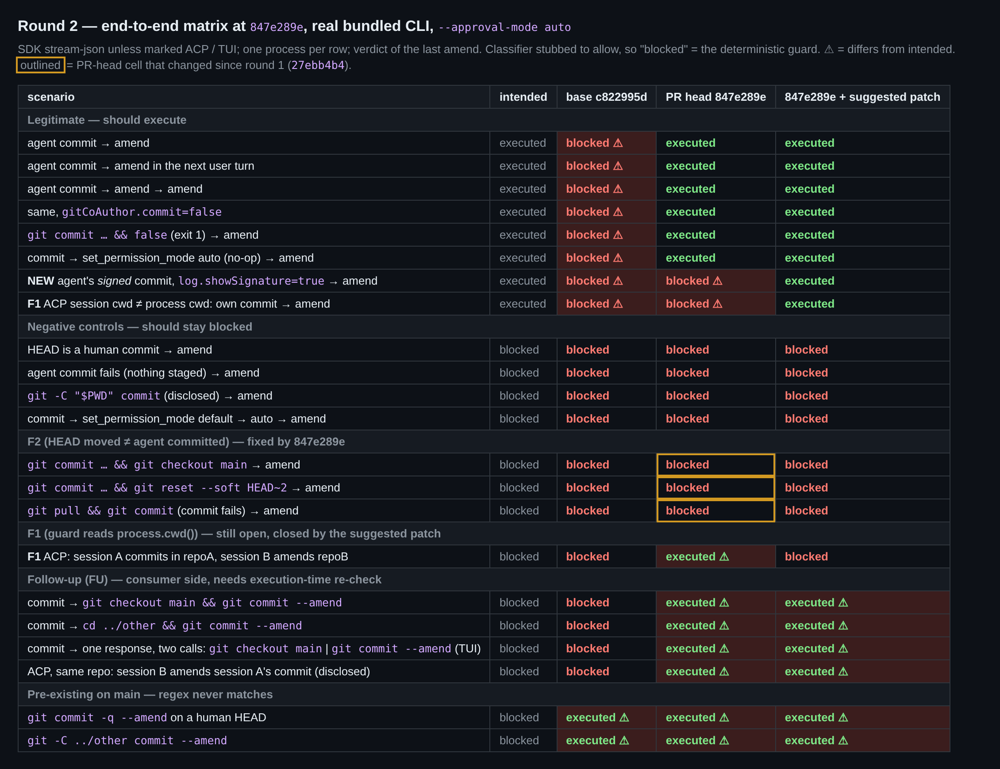

## Maintainer verification, round 2 (`847e289e`, delta only)

Round 1 is [#issuecomment-5776251029](https://github.com/QwenLM/qwen-code/pull/12463#issuecomment-5776251029).

**Verdict: F2 is fixed properly, thanks. One thing is still open (F1), and `847e289e` adds a small fail-closed regression for signed commits. Both are small, and the updated patch (+66/−2 on top of `847e289e`) fixes both; verification is below. With it I'd consider this mergeable. The consumer-side items stay a follow-up.**

I rebuilt the bundle at `847e289e` and re-ran the whole round-1 matrix on it, adding a signed-commit row. Same setup as round 1: the real bundled CLI in `--approval-mode auto`, driven through SDK stream-json, ACP and the TUI, against real git repos.



### F2: fixed ✅
This complements 5776726932, which replayed the criterion in a standalone driver. Here it runs through `ShellToolInvocation` in the real bundle, and I built and ran the suite itself.
- **E2E:** all three chains are now hard-blocked through the real CLI: `commit && checkout main`, `commit && reset --soft HEAD~2`, and `pull && <failing commit>`. Every legitimate row still executes.
- **Real classifier:** the round-1 probe (commit, `checkout main`, then "fold it into that WIP commit") is now blocked before the classifier is asked at all. A legitimate own-commit amend still goes through.
- **Static checks:** typecheck, eslint and prettier are clean. The targeted suites pass 1767/1767 across 7 files.
- **Mutation check** on the new criterion (witness file, 8 tests):

| mutant | result |
|---|---|
| N1: drop `createdByCommit` (back to "HEAD moved") | killed by the new pull test |
| N2: drop the `preHead` comparison | killed by test ② |
| N3: also accept `checkout` / `reset` reflog entries | **survives** |
| N4: reject only `pull` entries | **survives** |

The new test covers only the *leading*-move half. The trailing half that round 1 reported (`git commit … && git checkout main`, `… && git reset --soft HEAD~2`) isn't pinned. The patch adds one test that kills N3 and N4.

### New: signed commits lose the exemption under `log.showSignature=true` (fail-closed, small)
`getGitHeadOrigin` runs `git log -g -1 --format=%H%n%gs HEAD`. With `log.showSignature=true`, git prints the signature verdict *before* the format output. This is from the E2E repo:

```
Good "git" signature for user@example.com with ED25519 key SHA256:…
907a3d23ebcf04582b503a06f2a1b50ec637333f
commit: agent: add feature
```

So `sha` becomes the `Good "git" signature…` line, `subject` becomes the SHA, and `/^commit\b/` fails. The agent's own signed commit is never registered, and its amend is hard-blocked.
- **E2E (SSH signing):** blocked on `847e289e`, executed with the patch.
- **New in this commit:** the round-1 criterion used `git rev-parse HEAD`, which the setting doesn't affect.
- **Impact:** no safety impact, since it fails closed. But it hits exactly the users who sign commits.
- **Fix:** add `--no-show-signature` (already in the patch).

### F1: still open
`autoMode.ts` is unchanged, so at `847e289e` the guard still reads `process.cwd()` whenever the call has no `directory`. I re-measured in one `qwen --acp` process started in repoA:
- A session with `cwd` = repoB amends its own commit: **blocked**. The fix has no effect there.
- Session A commits in repoA, then session B amends repoB's **human** commit: **executed**.

The fix is the same one-liner as round 1: `input.ctx.cwd ?? input.config.getTargetDir?.()`. The patch's unit test fails when that line is reverted.

### Unchanged since round 1 (follow-up)
All of these reproduce identically at `847e289e`:
- the consumer-side TOCTOU: a checkout or `cd` inside the amend command, and two parallel calls
- the process-global registry in ACP
- `/clear` not clearing the registry
- the pre-existing regex gaps (`git commit -q --amend`, `git -C dir commit --amend`)

### Updated patch (on top of `847e289e`, +66/−2)
- **`autoMode.ts`:** the F1 cwd fallback.
- **`shell.ts`:** `--no-show-signature`.
- **Test file, +2 tests:** trailing checkout/reset (kills N3 and N4), and the target-dir test (fails when `autoMode.ts` is reverted).
- **Results:** the witness file passes 10/10, and 1852/1852 across `coreToolScheduler`, `autoMode`, `destructive-commands`, `shell`, `shell.backgroundStatus`, `config`, `speculationToolGate`, `InProcessBackend` and the witness file. `tsc --noEmit` exit 0, eslint 0.
- **E2E:** see the last matrix column. Every legitimate row executes, including the signed commit and the ACP session whose cwd differs. The negative controls and the F1/F2 rows are blocked.

<details>
<summary><code>suggested-fix.patch</code> (production hunks; the full patch with tests is in the evidence folder)</summary>

```diff
diff --git a/packages/core/src/permissions/autoMode.ts b/packages/core/src/permissions/autoMode.ts
index e8106e07d9..4789ee3e44 100644
--- a/packages/core/src/permissions/autoMode.ts
+++ b/packages/core/src/permissions/autoMode.ts
@@ -824,10 +824,15 @@ export async function evaluateAutoMode(
         ? normalizeMonitorCommand(input.ctx.command).safetyCommand
         : input.ctx.command;
     const userPrompt = extractLastUserPrompt(input.messages) ?? '';
+    // `ctx.cwd` is only set when the call passes `directory`; otherwise the
+    // shell runs in the session's target dir, which is also where
+    // ShellToolInvocation registers session commits. Falling back to
+    // `process.cwd()` would check a different repository whenever the two
+    // differ (ACP sessions, worktrees).
     const destructiveResult = isDestructiveCommand(
       command,
       userPrompt,
-      input.ctx.cwd,
+      input.ctx.cwd ?? input.config.getTargetDir?.(),
     );
     if (destructiveResult?.blocked) {
       return {
diff --git a/packages/core/src/tools/shell.ts b/packages/core/src/tools/shell.ts
index 0805712f21..96313be86e 100644
--- a/packages/core/src/tools/shell.ts
+++ b/packages/core/src/tools/shell.ts
@@ -4266,6 +4266,8 @@ export class ShellToolInvocation extends BaseToolInvocation<
   /**
    * Read HEAD together with the reflog action that last moved it, in a
    * single subprocess (`%H` and the reflog subject `%gs` on two lines).
+   * `--no-show-signature` keeps a `log.showSignature=true` config from
+   * printing signature verification lines ahead of that output.
    *
    * Returns `null` when git cannot answer — not a repository, no HEAD yet,
    * reflog disabled or expired, git missing — so every caller fails closed.
@@ -4276,7 +4278,7 @@ export class ShellToolInvocation extends BaseToolInvocation<
     return new Promise((resolve) => {
       const child = childProcess.execFile(
         'git',
-        ['log', '-g', '-1', '--format=%H%n%gs', 'HEAD'],
+        ['log', '-g', '-1', '--no-show-signature', '--format=%H%n%gs', 'HEAD'],
         { cwd, timeout: 2000, windowsHide: true },
         (error, stdout) => {
           if (error) {
```
</details>

Evidence (matrix data, raw E2E / ACP / TUI logs, mutation log, the signed-commit reflog output, full patch): [this folder](.)
