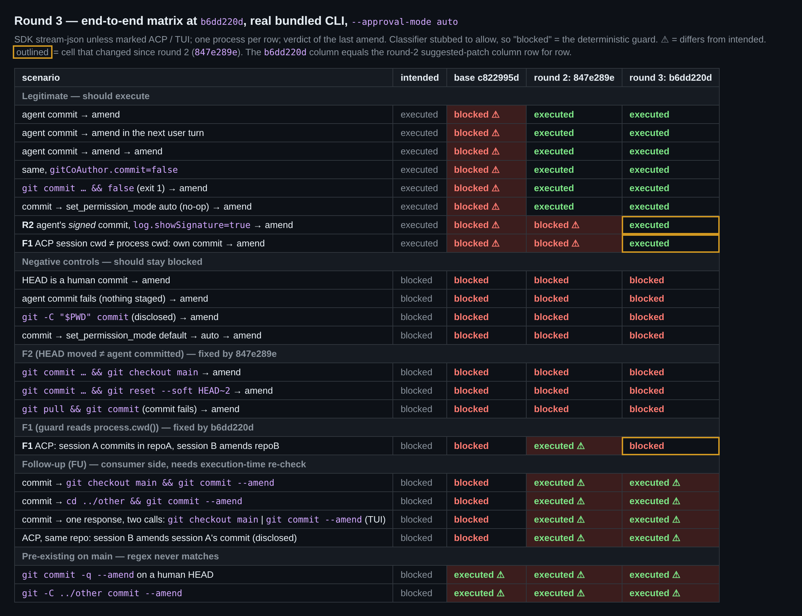

## 维护者验证第 3 轮（`b6dd220d`，仅列增量）

前两轮：[第 1 轮](https://github.com/QwenLM/qwen-code/pull/12463#issuecomment-5776251029)、[第 2 轮](https://github.com/QwenLM/qwen-code/pull/12463#issuecomment-5776795999)。

**结论：我这边认为可以合并。** 第 1、2 轮提出的所有阻塞项在 `b6dd220d` 上都已修复，并且每一项我都实际跑过验证：
- Windows 门控
- F1：cwd 解析
- F2："HEAD 动了 ≠ agent 提交的"
- `log.showSignature` 开启时的签名提交

剩下的就是作者列出的那三个 follow-up，适合另开 issue 跟踪。唯一还在跑的是 `Test (ubuntu-latest, Node 22.x)`，发评论时仍在进行中。

### 在 `b6dd220d` 上重跑的内容
- **构建、lint、测试：** 重建了 bundle。`tsc --noEmit` exit 0；三个改动文件的 eslint 和 prettier 都干净。9 个测试文件共 1853/1853 通过（`coreToolScheduler`、`autoMode`、`destructive-commands`、`shell`、`shell.backgroundStatus`、`config`、`speculationToolGate`、`InProcessBackend`，以及 11 条的见证测试文件）。CLI 的 `acp-integration/session/Session.test.ts` 1048/1048 通过。作者机器上失败的 `config.test.ts` lease 用例在这里是通过的，符合"只是本地环境问题"的判断。
- **生产代码：** 去掉注释后，`autoMode.ts` 和 `shell.ts` 都与第 2 轮的建议补丁完全一致。
- **变异测试：** 作者的变异表完全复现：

| 变异体 | 结果 |
|---|---|
| 去掉 `createdByCommit` | 3 条失败（pull、后置 checkout、后置 reset） |
| 去掉与 `preHead` 的比较 | 1 条失败 |
| N3：接受 `checkout`/`reset` | 2 条失败 |
| N4：只拒绝 `pull` | 2 条失败 |
| 回退 `autoMode.ts` 的 cwd 回退 | 1 条失败（target-dir 那条） |
| 去掉 `--no-show-signature` | *存活*：单测里没有签名提交，只有端到端那一行能覆盖（见 nit） |

- **端到端：** 用真实 bundle 版 CLI 重跑了完整矩阵。`b6dd220d` 这一列与第 2 轮建议补丁那一列逐行一致：
  - 签名提交重新得到豁免。
  - cwd 与进程 cwd 不同的 ACP 会话，可以 amend 自己的提交。
  - 跨仓库的 ACP amend 被拦截。
  - F2 的三条命令链仍被拦截。
  - 所有负对照仍被拦截。
- **真实分类器**（`qwen3.8-max-2026-09-02`）：合法的自身提交 amend 正常放行；第 1 轮的探针（`commit && checkout main`，再要求"并入那个 WIP 提交"）被确定性守卫拦下。

### 关于 `attachCommitAttribution` 的疑问：已实跑，无法复现
我给脚本化模型加了 `write_file` 调用，让会话里产生真实的逐文件 AI 署名记录，然后在 base 和 head 上用真实 CLI 跑了两种情形：

| 场景 | base | `b6dd220d` |
|---|---|---|
| 对照：AI 写 `ai.txt`，然后 `git add ai.txt && git commit` | note 挂在 agent 自己的提交上 | note 挂在 agent 自己的提交上 |
| AI 写 `ai.txt`；`git pull` 快进到 `upstream: human work [Upstream Author]`；随后 `git commit` 因没有暂存内容而失败 | **没有 note** | **没有 note** |

你读到的那条潜在路径，前半段确实成立：HEAD 动了，`commitCount` 也为 1。但 note 在后面还有两道过滤：
- `validateAgainst` 只保留"在该提交里、且提交内容与 AI 写入内容一致"的文件。
- 之后 `committedAbsolutePaths.size === 0` 会直接跳过写入。

绕开这两道过滤最直接的办法，也被 git 自己堵死了：只要快进 pull 会覆盖 AI 尚未提交的改动，即使内容逐字节相同，git 也会拒绝。我两种情况都实测过（`would be overwritten by merge`，pull 退出码 1，HEAD 不变）：
- 已跟踪但有本地修改的文件
- 与该提交新增文件同名的未跟踪文件

因此，要让 note 落到人类提交上，这个提交必须恰好包含 AI 写过、且已不在工作区里的逐字节相同内容；真到那一步，这条 note 大体上也算是准确的。我不建议为此单独开 issue。

### Follow-up
同意，把你列出的三项合成一个跟踪 issue 就好：
- 消费侧 TOCTOU：amend 命令内部带 `checkout` 或 `cd`，以及执行前就被一并评估的两个并行调用
- ACP 下进程级的全局注册表，以及 `/clear` 不会清空它
- 既有的 `GIT_AMEND_PATTERN` 漏配

这三项在 `b6dd220d` 上都原样复现（矩阵最下面几行）。

**可选小建议：** 加一条在 `log.showSignature=true` 下用 SSH 签名提交的见证测试，就能钉住 `--no-show-signature`。Linux 和 macOS runner 上都有 `ssh-keygen`，而这个测试套件在 Windows 上本来就会跳过。

**给合并的人：** 两条仍然挂着的 `CHANGES_REQUESTED` 针对的都是已修复的问题：
- `qwen-code-ci-bot` 在 `0cf69caf` 上的那条，针对的是 Windows 门控。
- `qqqys` 在 `27ebb4b4` 上的那条，是 pull 后 commit 失败的那个 Critical，该账号已在 5776726932 中确认修复。

证据（矩阵数据、原始 E2E / ACP 日志、变异日志、署名实测与 git 层面的检查）：[本目录](.)
