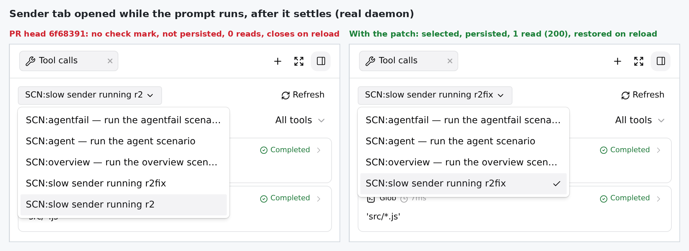
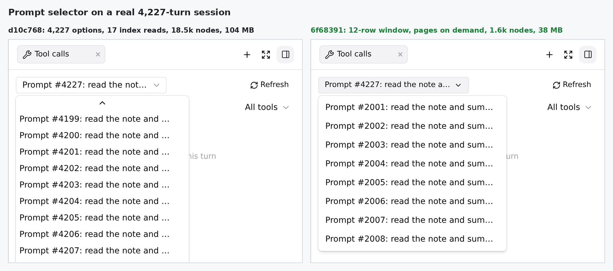
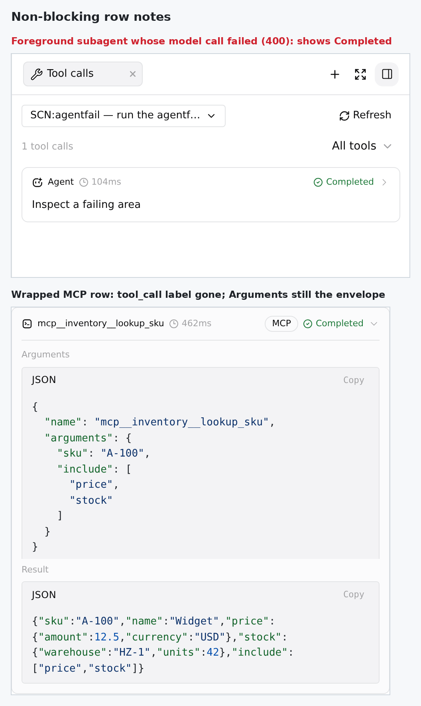

## Maintainer verification, round 2: real daemon, Linux (`6f68391`)

Follow-up to my [round 1 report](https://github.com/QwenLM/qwen-code/pull/12466#issuecomment-5776812203) at `d10c768`. Only the delta is covered here.

**Verdict: the same as round 1. I'd merge after one small client fix, or with it as an immediate follow-up.** The follow-up commits hold up against a real daemon. The server read is byte-identical to round 1 across 4,262 turns. The new prompt selector cuts the cost on a 4,227-turn session from 18.5k DOM nodes / 104 MB to 1.6k / 38 MB. Persisted dock state no longer carries prompt text. But the round-1 finding is only **half fixed**. The duplicate selector entry is gone, because entries are now keyed by ordinal. When the sender opens **View tool calls** on their own message, the tab still has no durable identity. It is never persisted, so a reload closes the panel. No history read happens after the turn settles. The selector shows no check mark. That finding wasn't in the author follow-up table (that table maps `/review` findings), so it may simply have been missed. Below is an 18-line fix against the new code, with three tests. I verified it in the same browser rig.

<details>
<summary>How I tested (environment)</summary>

- Linux x86_64, Node 22. The dependency lockfile is unchanged since `d10c768`, so I reused round 1's installed `node_modules` via hardlinks. Full `npm run build` and `npm run bundle` of **`6f68391`**: exit 0.
- Real `qwen serve` daemons serving their own bundled Web Shell (the production `dist/web-shell`), Chromium via Playwright, **no `page.route`, no mock daemon**. I used the same persisted sessions as round 1: the scripted OpenAI-compatible model and real tool execution (shell, file tools, two real stdio MCP servers, subagents, parallel batches of 10, loop cap, cancel, `kill -9`), plus the seeded 4,227-turn session.
- A/B arms: `d10c768` (round 1 head), `6f68391` (this head), and `6f68391` plus the patch below (only the SPA rebuilt).
</details>

### What I checked

| Area | Method | Result |
|---|---|---|
| **Server read unchanged** | `GET /tool-calls` for every turn of 5 sessions, `d10c768` vs `6f68391` daemons on the same data. | **4,262 turns / 5,432 events byte-identical.** Ground truth re-run on `6f68391`: every turn equals the raw JSONL (125/125, 241/241, 20/20, 12/12 calls; order equal, 0 missing / extra / dup). All 362 timed calls fall inside their fake-model wall-clock window and equal `ui_telemetry`. The legacy base-recorded session still has 0 fabricated `startedAt`. |
| **Unit tests (changed files)** | vitest. | web-shell 1,377/1,377 (TurnCallsPanel, App, MessageItem, buildTrajectory, transcriptToMessages); cli 34/34 (`session-tool-calls`, `ssh-workspace`); acp-bridge 138/138 (`transcript-replay`). |
| **Selector on 4,227 turns** (R1-9/36/42–45) | Open the selector, then Home, mid-list scroll, and choose. | See the table below. On-demand paging works: scrolling to turn ~2,000 loaded only pages `start=1800` and `start=2000`, rendered in 63 ms. Choosing by mouse at #2005 and by Home→Enter at #1 both retarget the panel and issue one `/tool-calls` read (200). |
| **Prompt text out of dock state** (R1-33) | `localStorage` after opening a tab. | Tabs carry `turnId` / `recordId` / `promptId` only: `promptLabel` is absent. |
| **Wrapped MCP row** (R1-3; my round-1 note 1) | Expand `mcp__inventory__lookup_sku` reached via `tool_search` → `tool_call`. | Fixed: the description no longer reads `tool_call`. Still open: Arguments show the `{name, arguments}` envelope (fig. 3). |
| **Failed agent diagnostics** (R1-2) | New scenario: a **foreground** subagent whose model call returns HTTP 400. | See note 1 below. |



### The remaining defect: the sender's tab has no identity

**Repro:** send a prompt from the composer, then click **View tool calls** on that message, either while it runs or after it finishes.

| | PR head `6f68391` | With the patch below |
|---|---|---|
| Opened **while running** (`SCN:slow`, 9 s) | not persisted, no check mark | persisted `{promptId}`, checked |
| After the turn settles | 0 `/tool-calls` reads (live rows only) | 1 read (200) |
| Page reload | **panel closed** | panel restored, 2 rows |
| Opened shortly after sending (`SCN:after`) | not persisted, 0 reads, closed on reload | persisted `{recordId}`, 1 read, restored |

**Why round 1's root cause still applies:** the sender's own user echo is suppressed, so that local block never gets `sourceRecordIds` or `promptId`. `App.openTurnCalls` therefore creates a tab with neither id. `serializeArtifactPanelTabs` drops it, the history effect is gated on `selectedRecordId || promptId`, and `TurnCallPromptSelect` receives `recordId`/`promptId` both undefined, so it never matches its `selected` row. The navigation store already knows this block's identity. While the turn runs, it is `provisionalTurns[].blockId → promptId`. After the turn settles, it is a live `locations` entry, `blockId → turnId`. The fix adopts that identity through the existing `onSelectPrompt`:

```diff
   const selectedPromptId = promptId ?? user?.promptId ?? indexedTurn?.promptId;
+  // The sender's own live user block never carries a record or prompt id: its
+  // daemon echo is suppressed. Adopt the identity navigation already tracks
+  // for that block so the tab can persist and read history once settled.
+  const adoptedPromptId =
+    recordId || promptId
+      ? undefined
+      : navigation.provisionalTurns.find((turn) => turn.blockId === turnId)
+          ?.promptId;
+  const adoptedRecordId =
+    recordId || promptId || adoptedPromptId
+      ? undefined
+      : [...navigation.locations.values()].find(
+          (location) => location.view === 'live' && location.blockId === turnId,
+        )?.turnId;
+  useEffect(() => {
+    if (adoptedPromptId || adoptedRecordId)
+      onSelectPrompt?.(turnId, adoptedRecordId, adoptedPromptId, promptLabel);
+  }, [adoptedPromptId, adoptedRecordId, onSelectPrompt, turnId, promptLabel]);
```

There are three tests: the running block adopts `promptId`, the settled block adopts `recordId`, and a tab that already has an identity is not retargeted. The test mock also gains `locations`. **On `6f68391` the first two fail. With the fix all pass. TurnCallsPanel + App: 1,107/1,107.** ESLint `--max-warnings 0`, Prettier, and web-shell `tsc --noEmit` are clean. Full patch: [`fix-sender-identity-r2.patch`](fix-sender-identity-r2.patch).

### Selector on the real 4,227-turn session

| | `d10c768` | `6f68391` |
|---|---|---|
| Options in the DOM on open | 4,227 | 10 (window of ≤ 12, `aria-setsize=4227`) |
| `/turn-index` requests on open | 17 | 0 |
| Page DOM nodes / JS heap | 18,536 / 104 MB | 1,642 / 38 MB |
| Open → stable | 1,304 ms | 306 ms |
| Home → first prompt rendered | (all options already in the DOM) | 20 ms |



### Non-blocking notes

1. **R1-2 doesn't reach the real failure path.** A real foreground subagent failure (the model returns 400) is recorded as a *successful* tool result carrying `resultDisplay.status: "failed"` and `terminateReason: "Failed to run subagent: 400 …"`. On the wire it is `tool_call_update` with `status: "completed"`, so the new `status === 'completed'` guard still strips its content. Both heads return identical bytes here. No diagnostic is lost: `terminateReason` survives in `rawOutput`. But the panel shows a green **Completed** with no reason (fig. 3). The chat transcript doesn't flag it either, so this is pre-existing ACP status behaviour. The new panel makes it look more authoritative, though. Reading `rawOutput.status === 'failed'` for `task_execution` rows would fix the badge.
2. The selector re-requests a page while it is still in flight. In 2/2 runs, the mid-list scroll fetched `start=2000` twice. `missingPages` goes from `"1800,2000"` to `"2000"` when the first page lands, the effect reruns, and `loadOrdinal` doesn't dedupe in-flight loads.
3. Keyboard focus doesn't follow wheel scrolling. After scrolling the list with the mouse, `aria-activedescendant` is null and PageDown→Enter re-selects the old off-screen item (#4227). Clicking works.
4. Still open from round 1 (the author deferred these as polish): the wrapped-MCP Arguments envelope and `1 tool calls`.



**Not covered:** the SSH-workspace GET allowlist (R1-1) and goal-runtime replay marking (R1-7) were checked by unit tests only, and so was the diff truncation (R1-51/52). Windows/macOS were not covered.


<details>
<summary>中文版</summary>

## 维护者验证第二轮：真实 daemon,Linux(`6f68391`)

这是对第一轮报告(`d10c768`,[评论](https://github.com/QwenLM/qwen-code/pull/12466#issuecomment-5776812203))的跟进，只覆盖增量部分。

**结论与第一轮相同：建议补上一个客户端小修复后合并，或者合并后立即跟进这个修复。** 在真实 daemon 上，这次的跟进提交都站得住。服务端读取结果在 4,262 轮上与第一轮逐字节一致。新的提示词选择器在 4,227 轮会话上把开销从 18.5k 个 DOM 节点、104 MB 降到 1.6k 个、38 MB。持久化的面板状态里也不再保存提示词原文。但第一轮报告的问题**只修了一半**。选择器里的重复条目已经没有了，因为条目现在按序号作键。发送端在自己的消息上打开"查看工具调用"时，这个 tab 仍然没有持久身份。它不会被持久化，刷新页面后面板就关闭了。这一轮结束后也不会读取历史，选择器里当前项也没有对勾。作者的跟进表对应的是 `/review` 的编号，没有包含这一条，可能只是漏看了。下面针对新代码给出一个 18 行的修复和 3 个测试，已在同一套浏览器环境里验证。

<details>
<summary>测试环境</summary>

- Linux x86_64,Node 22。`d10c768` 之后依赖锁文件没有变化，所以用硬链接复用了第一轮安装好的 `node_modules`。对 **`6f68391`** 完整执行 `npm run build` 和 `npm run bundle`,均为 exit 0。
- 真实 `qwen serve` daemon 提供自身打包的 Web Shell(生产版 `dist/web-shell`),浏览器是 Playwright 驱动的 Chromium。**没有 `page.route`,也没有 mock daemon。** 沿用第一轮持久化的会话：脚本化的 OpenAI 兼容模型驱动真实工具执行(shell、文件工具、两个真实 stdio MCP 服务器、子代理、10 个一批的并行调用、循环上限、取消、`kill -9`),另有预置的 4,227 轮会话。
- 对照组：`d10c768`(第一轮 head)、`6f68391`(当前 head),以及 `6f68391` 加下方补丁(只重建了 SPA)。
</details>

### 检查项

| 方面 | 方法 | 结果 |
|---|---|---|
| **服务端读取不变** | 在同一份数据上，分别用 `d10c768` 和 `6f68391` 的 daemon 对 5 个会话的每一轮调用 `GET /tool-calls`。 | **4,262 轮、5,432 个事件逐字节一致。** 在 `6f68391` 上重跑真值比对，每一轮都与原始 JSONL 一致(125/125、241/241、20/20、12/12 次调用;顺序一致，缺失、多余、重复均为 0)。362 个带计时的调用都落在假模型记录的真实时间窗口内，并且与 `ui_telemetry` 相等。base 录制的旧会话仍然没有伪造任何 `startedAt`。 |
| **单测(改动文件)** | vitest。 | web-shell 1,377/1,377;cli 34/34;acp-bridge 138/138。 |
| **4,227 轮上的选择器**(R1-9/36/42–45) | 打开选择器，再测试 Home 键、滚动到列表中部和选择操作。 | 见下表。按需分页有效：滚到第 ~2,000 轮时只加载了 `start=1800` 和 `start=2000` 两页,63 ms 渲染完成。用鼠标选 #2005、用 Home→Enter 选 #1,面板都会切换过去，并各读取一次 `/tool-calls`(200)。 |
| **面板状态不存提示词原文**(R1-33) | 打开 tab 后检查 `localStorage`。 | tab 只保存 `turnId`、`recordId`、`promptId`,没有 `promptLabel`。 |
| **包装的 MCP 行**(R1-3,即第一轮非阻塞项 1) | 展开经 `tool_search` → `tool_call` 调用的 `mcp__inventory__lookup_sku`。 | 描述行不再显示 `tool_call`,已修复。"参数"里仍是 `{name, arguments}` 外层信封(图 3),尚未解决。 |
| **失败 agent 的诊断信息**(R1-2) | 新增场景：一个**前台**子代理，它的模型调用返回 HTTP 400。 | 见下方非阻塞项 1。 |

### 遗留缺陷：发送端 tab 没有身份

**复现：** 在输入框发送一条提示词，然后在这条消息上点"查看工具调用"。运行中或结束后点都会出现问题。

| | PR head `6f68391` | 加补丁后 |
|---|---|---|
| **运行中**打开(`SCN:slow`,9 秒) | 未持久化，没有对勾 | 持久化了 `{promptId}`,有对勾 |
| 本轮结束后 | 读取 `/tool-calls` 0 次(只有实时行) | 读取 1 次(200) |
| 刷新页面 | **面板关闭** | 面板恢复，显示 2 行 |
| 发送约 1 秒后打开(`SCN:after`) | 未持久化，读取 0 次，刷新后关闭 | 持久化了 `{recordId}`,读取 1 次，刷新后恢复 |

**根因与第一轮相同：** 发送端自己的用户回显被压制，这个本地块永远拿不到 `sourceRecordIds` 或 `promptId`。因此 `App.openTurnCalls` 创建的 tab 两个 id 都没有。结果是 `serializeArtifactPanelTabs` 把它丢弃，历史读取的 effect 因为 `selectedRecordId || promptId` 都为空而不执行,`TurnCallPromptSelect` 收到的 `recordId` 和 `promptId` 都是 undefined,所以匹配不到当前选中项。其实导航 store 已经知道这个块的身份。运行中时，可以从 `provisionalTurns[].blockId` 找到 `promptId`。结束后，可以从 live 的 `locations` 条目里由 `blockId` 找到 `turnId`。补丁通过现有的 `onSelectPrompt` 把这个身份写回 tab,代码见英文部分。补丁附 3 个测试：运行中的块能拿到 `promptId`、已结束的块能拿到 `recordId`、已有身份的 tab 不会被改写。测试 mock 也补上了 `locations`。**在 `6f68391` 上前两个测试失败，加修复后全部通过。TurnCallsPanel + App 共 1,107/1,107。** ESLint、Prettier、web-shell `tsc --noEmit` 均无报错。

### 4,227 轮会话上的选择器

| | `d10c768` | `6f68391` |
|---|---|---|
| 打开时 DOM 中的选项数 | 4,227 | 10(窗口最多 12 个,`aria-setsize=4227`) |
| 打开时的 `/turn-index` 请求数 | 17 | 0 |
| 页面 DOM 节点数 / JS 堆 | 18,536 / 104 MB | 1,642 / 38 MB |
| 从打开到稳定 | 1,304 ms | 306 ms |
| 按 Home 到第一条提示词渲染出来 | (所有选项已在 DOM 中) | 20 ms |

### 非阻塞项

1. **R1-2 的修复碰不到真实的失败路径。** 真实的前台子代理失败(模型返回 400)被记录成一次*成功*的工具结果，其中带着 `resultDisplay.status: "failed"` 和 `terminateReason: "Failed to run subagent: 400 …"`。线上的 `tool_call_update` 是 `status: "completed"`,所以新加的 `status === 'completed'` 判断仍然会清空它的 content。两个 head 在这里返回的字节完全相同。诊断信息并没有丢，`terminateReason` 还保留在 `rawOutput` 里。但面板显示的是绿色 **Completed**,也不显示失败原因(图 3)。聊天记录里同样没有标出失败，所以这是 ACP 状态层早已存在的行为，只是新面板让它看起来更权威。对 `task_execution` 行读取 `rawOutput.status === 'failed'`,就能把这个徽标改对。
2. 选择器会对还在请求中的页面重复请求。两次运行里，滚到列表中部时 `start=2000` 都被请求了两次。原因是第一页返回后 `missingPages` 从 `"1800,2000"` 变成 `"2000"`,effect 重新执行，而 `loadOrdinal` 不会对进行中的请求去重。
3. 键盘焦点不跟随滚轮滚动。用鼠标滚动列表后,`aria-activedescendant` 为 null,按 PageDown→Enter 选中的仍是屏幕外的旧项(#4227)。鼠标点击则没有问题。
4. 第一轮遗留、作者作为细节打磨延后处理的两项：包装 MCP 行"参数"里的外层信封，以及英文单复数 `1 tool calls`。

**未覆盖：** SSH 工作区的 GET 放行(R1-1)、goal-runtime 回放标记(R1-7)、diff 截断(R1-51/52)只由单测覆盖。Windows 和 macOS 没有测试。


</details>


---
🤖 Generated with [Claude Code](https://claude.com/claude-code) — Claude Opus 5.5 (1M context)
