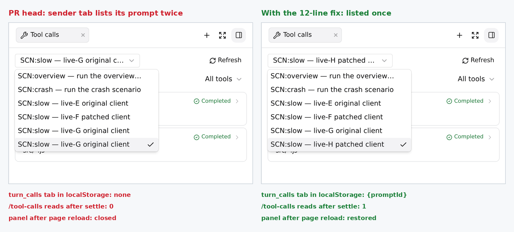

## Maintainer verification: real daemon, real tool execution, Linux (`d10c768`)

**Verdict: I'd merge after one small client fix, or with it as an immediate follow-up.** The new server read is correct end to end. Against a real `qwen serve` daemon, its results match the raw JSONL call-for-call across 217 real tool calls, including after a daemon restart. The recorded timings check out against wall-clock. The panel works in the production Web Shell build. I found **one defect**, on the path users hit most often: **the client that sent the prompt**. If you open Tool calls from your own message, the tab has no durable identity. That prompt appears twice in the prompt selector, the tab is never persisted, so a page reload closes the panel, and no history read happens after the turn settles. The root cause is below, along with a 12-line fix and two tests. I verified the fix in the same browser rig.

<details>
<summary>How I tested (environment)</summary>

- Linux x86_64, Node 22.22.2. `pnpm install --frozen-lockfile`, a full `npm run build` and `npm run bundle` for **head `d10c768`** and **base `c83265ff36`**.
- A real `qwen serve` daemon serving its own bundled Web Shell (the production `dist/web-shell`, not vite dev). Chromium 1228 via Playwright. **No `page.route`, no mock daemon.**
- A scripted OpenAI-compatible model that issues real tool calls, which the daemon executes: shell, read/edit/write, grep/glob, a failing read, a non-zero exit, parallel batches of 10, a subagent, and a duplicate provider id. Two real stdio MCP servers: one deferred (reached through `tool_search` → `tool_call`) and one with `alwaysLoadTools`.
- Approval ran through a real permission request. The daemon voted after a 1.5 s wait. Cancellation used `POST /session/:id/cancel`. For the crash case I sent `kill -9` to the daemon mid-call.
- The daemon was restarted between seeding and browsing, so reads take the cold path from disk.
</details>

### What holds (verified by execution)

| Area | Evidence | Result |
|---|---|---|
| **Completeness and ownership** | 9 turns, **217 calls**, compared against the raw `chats/<id>.jsonl`. Includes a 90-call turn and a **110-call turn stopped by the loop cap**, the "57 shown as 13" class. | Count, order and ids match exactly per turn. 0 missing, 0 extra, 0 duplicated. Identical after a daemon restart. `sessions/live-state` stays `[]`, so the read never attaches the session. |
| **Recorded timing** | Each fake-model response logs its send time and the arrival time of the next request. | Every one of the **206** timed calls has `[startedAt, startedAt+durationMs]` inside its real wall-clock window, and equals the raw `ui_telemetry` `started_at`/`duration_ms` (206/206). The tooltip is exact to the millisecond (`19:59:19.428` → `.452` for 24 ms). The approval wait is included (3548 ms for a 2 s command with a 1.5 s approval), as the design doc states. |
| **Legacy records** | A session recorded by the **base** daemon, read by head. | 11 durations and 0 `startedAt`. No tooltip or `aria-description`: nothing is fabricated. |
| **Statuses** | Tool error, non-zero exit, duplicate provider id, loop-cap rejection, cancel after 1.5 s, and `kill -9` of the daemon mid-call. | All show Failed with the right reason. Cancel shows `2s Cancelled`: the recorded cancel overrides the generic failed replay. After the crash and a restart, the dangling call becomes **Failed**: "Tool result missing from saved history…". |
| **Post-approval ACP frame** | SSE capture. | `tool_call_update(in_progress)` arrives 3 ms after `permission_resolved`, carrying `rawInput` and `startedAt`. |
| **Live prompt** | A real 8 s shell call sent from the composer. | The clock ticks 948 ms → 8 s with **0** `/tool-calls` reads while running. A mid-turn message injected at +5 s **does not split the turn**: both calls stay under the prompt, and there is no selector entry for the injection. |
| **Read economy** | `page.on('request')`. | Selecting a prompt = 1 GET. Refresh = 1 GET. Reload restore = 1 GET. Viewing an older prompt while another runs = 1 GET, with no repeats over 4 s of streaming. Switching back to the running prompt = 0 GETs while it runs and 1 at settle, and the rows don't flash. |
| **UI** | EN/zh-CN, light/dark. | Localized names. MCP badge and filter (the count stays 11). Shell Arguments = command, Result = output, Other collapsed. Edit shows the recorded diff. JSON is formatted. |
| **API contract** | curl. | 401 without a token or with a wrong one. 400 `invalid_turn_anchor` for a missing, blank, 201-char or repeated `turnId`, an unknown uuid, a non-prompt record, or another session's record. **404 when the session is read through a different registered workspace** (no cross-workspace read). The route is a 404 on base. |
| **Tests (Linux)** | Local vitest. | core 586, acp-bridge 136, cli 1231, **`server.test.ts` full file 1322/1322 on the first run** (it was flaky on macOS for the author), sdk 878, web-shell 1470 (10 touched files). All green. CI is green, including `Test`. |


### Defect: a tab opened from your own message has no durable identity

**Repro:** send a prompt from the composer, then click **View tool calls** on that message, either while it runs or after.

| | PR head | With the fix below |
|---|---|---|
| The prompt in the selector | **listed twice** | once |
| `turn_calls` tab in localStorage | **none** (dropped by `serializeArtifactPanelTabs`) | `{promptId}` |
| `/tool-calls` read after settle | **0** | 1 |
| Panel after a page reload | **closed** | restored, same prompt |

A second client watching the same session behaves correctly on head: it gets `promptId` from the bridge echo. So this only affects the sender, which is the common case.



**Root cause.** The sender's own user echo is suppressed (`suppressOwnUserEcho`). As `DaemonSessionProvider.tsx:362-364` notes, that local block never gets a `recordId`, and the tab that `App.openTurnCalls` builds from it ends up with neither `recordId` nor `promptId`. The persisted state proves this: `serializeArtifactPanelTabs` drops exactly such tabs. The backfill effect in `App.tsx` waits for `sourceRecordIds` that never arrive on this block. In `TurnCallsPanel`, the selector falls back to a synthetic `block:<turnId>` entry next to the provisional `prompt:<id>` one, and the history effect is gated on the `recordId`/`promptId` *props*. The provisional navigation turn already knows `blockId → promptId` (from `recordPromptAdmitted`), so the panel can adopt it.

<details>
<summary>Fix (12 lines) + 2 tests: RED on head, GREEN with the fix</summary>

```diff
--- a/packages/web-shell/client/components/artifacts/TurnCallsPanel.tsx
+++ b/packages/web-shell/client/components/artifacts/TurnCallsPanel.tsx
@@ -492,6 +492,18 @@ export function TurnCallsPanel({
   const idle = usePromptStatus() === 'idle';
   const navigation = useTurnNavigationState();
   const blocks = useTranscriptBlocks();
+  // The sender's own live user block never carries a record or prompt id: its
+  // daemon echo is suppressed. Adopt the prompt id from the provisional turn
+  // bound to this block so the tab can persist, resolve and dedupe.
+  const provisionalPromptId =
+    !recordId && !promptId
+      ? navigation.provisionalTurns.find((turn) => turn.blockId === turnId)
+          ?.promptId
+      : undefined;
+  useEffect(() => {
+    if (provisionalPromptId)
+      onSelectPrompt?.(turnId, undefined, provisionalPromptId, promptLabel);
+  }, [provisionalPromptId, onSelectPrompt, turnId, promptLabel]);
```

The tests are appended to `TurnCallsPanel.test.tsx`. One checks that a sender-local block with only a provisional turn adopts `prompt-live`. The other checks that a tab which already has a `promptId` is not retargeted. On head the first fails, and with the fix both pass. `TurnCallsPanel` + `App` + `loadTurnCalls` tests: 1104/1104. ESLint, Prettier and web-shell `tsc --noEmit` are clean. The full patch is [`fix-sender-identity.patch`](./fix-sender-identity.patch).
</details>

### Non-blocking notes

1. **The wrapped MCP call** (`tool_search` → `tool_call`): the row name resolves to `mcp__inventory__lookup_sku`, but the description line reads `tool_call` and Arguments show the `{name, arguments}` envelope. The design doc says wrappers resolve their actual name *and arguments*. See the right pane of figure 3.
2. English count grammar: `1 tool calls`.
3. The tooltip's "Start time" is when scheduling started, so it includes the approval wait (design-stated). On an approved call it reads earlier than the command actually began. A wording hint could help.
4. Test coverage of `session-tool-calls.ts`: 18 targeted mutants run against its own test file, 11 killed. The one real gap is "never finalize dangling calls of a settled turn". The unit tests don't pin it, but the real-daemon crash case above shows the behaviour is correct. The other survivors are defense in depth: the reader already rejects bad anchors (400 on the real daemon), ownership closes at the next navigation record anyway, and the pagination loop ends through another bound.
5. The triage bot left two questions for a maintainer. The `Test` result is now green, and `server.test.ts` passes locally as a full file. For the unvirtualized selector question, I measured a real long session: **on a 4,227-turn session, opening the selector issues 17 `turn-index` page reads and renders all 4,227 options: about 18.7k DOM nodes and a ~104 MB page heap, usable after ~1.3 s. So it is reachable and still tolerable at that size, but it grows linearly. The 25k ceiling would be about 6× this**.

**Not covered:** Windows/macOS, the agent detail tab contents, MCP auth, and an embedded host with `showToolCalls=false` restoring a persisted tab (triage finding 4).

Evidence (harness, raw ground-truth diffs, logs, figures): this directory (`harness/`, `data/`)

---
🤖 Generated with [Claude Code](https://claude.com/claude-code) — Claude Opus 5 (1M context)
