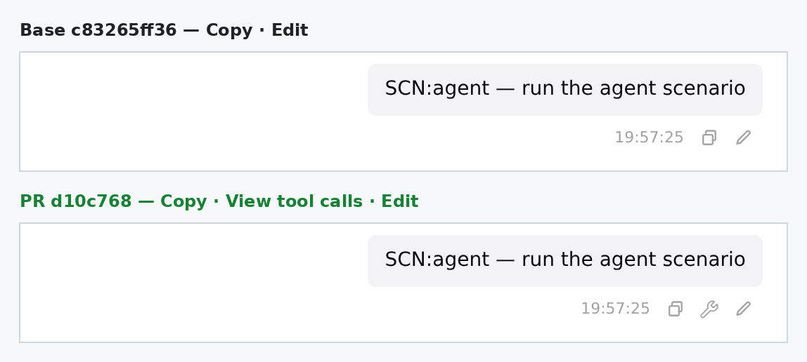
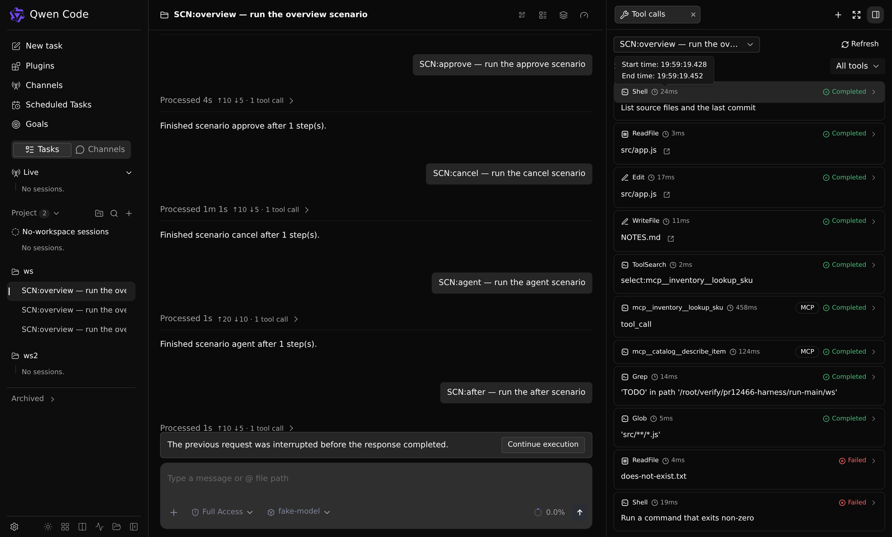
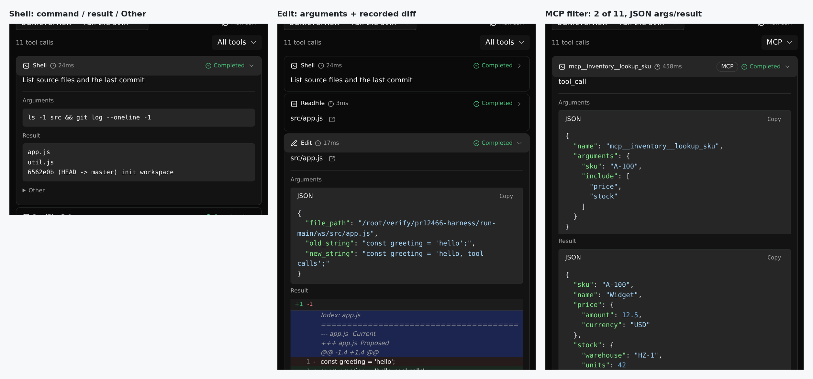
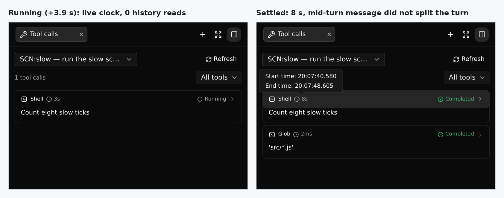
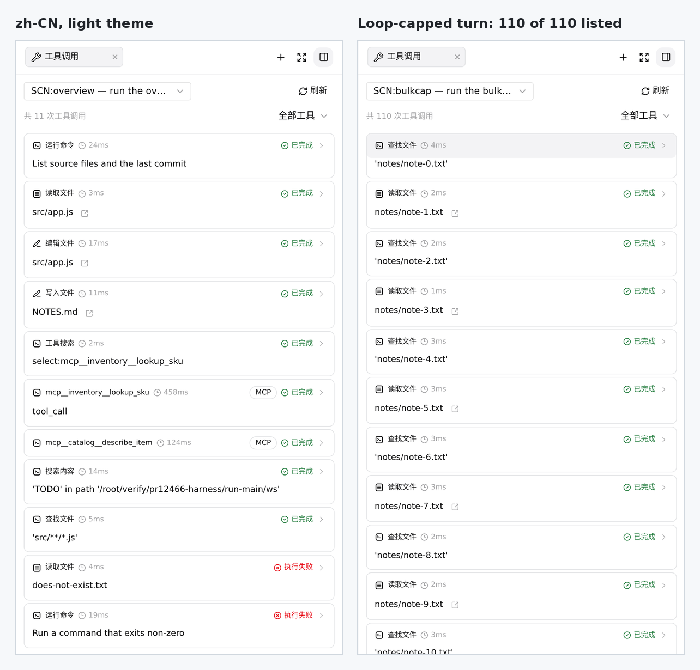

## 维护者验证：真实 daemon、真实工具执行、Linux（`d10c768`）

**结论：建议补上一处客户端小修复后合并，或合并后立即跟进。** 新的服务端读取接口端到端正确。在真实 `qwen serve` daemon 上，217 次真实工具调用的读取结果与原始 JSONL 逐条一致，daemon 重启后也一样。记录的耗时与墙钟时间吻合。面板在生产构建的 Web Shell 里工作正常。我发现了**一处缺陷**，出在用户最常走的路径上：**发送 prompt 的那个客户端**。在自己刚发的消息上打开“工具调用”时，tab 没有持久身份。该 prompt 在选择器里出现两次；tab 不会被持久化，刷新页面后面板关闭；该轮结束后也不会读取历史。下文给出根因、12 行修复和 2 个测试，修复已在同一套浏览器环境里验证。

测试方式（环境）

- Linux x86_64，Node 22.22.2。对 **head `d10c768`** 与 **base `c83265ff36`** 分别执行 `pnpm install --frozen-lockfile`、完整 `npm run build` 与 `npm run bundle`。
- 真实 `qwen serve` daemon 提供它自己打包的 Web Shell（生产 `dist/web-shell`，不是 vite dev）。浏览器为 Playwright 的 Chromium 1228。**没有 `page.route`，没有 mock daemon。**
- 脚本化的 OpenAI 兼容模型发出真实工具调用，由 daemon 实际执行：shell、读/编辑/写文件、grep/glob、失败的读取、非零退出码、10 个一批的并行调用、子代理、重复的 provider id。两个真实 stdio MCP 服务器：一个是延迟加载的（经 `tool_search` → `tool_call` 调用），一个配置了 `alwaysLoadTools`。
- 审批走真实的权限请求，daemon 在等待 1.5 秒后投票。取消通过 `POST /session/:id/cancel`。崩溃场景是在调用执行中对 daemon 发送 `kill -9`。
- 生成数据和浏览之间重启了 daemon，因此读取走的是从磁盘冷启动的路径。

### 已通过实际执行验证

| 方面 | 证据 | 结果 |
|---|---|---|
| **完整性与归属** | 9 轮、**217 次调用**，与原始 `chats/<id>.jsonl` 比对。包括一轮 90 次调用的，和一轮**被 loop cap 截停的 110 次调用**（即“57 次只显示 13 次”那一类）。 | 每轮的数量、顺序、id 完全一致。缺失 0，多余 0，重复 0。daemon 重启后结果相同。`sessions/live-state` 始终为 `[]`，说明读取不会挂载会话。 |
| **记录的耗时** | 假模型记录每次响应的发送时间和下一次请求的到达时间。 | **206** 次带计时的调用，每一次的 `[startedAt, startedAt+durationMs]` 都落在它的真实墙钟区间内，且与原始 `ui_telemetry` 的 `started_at`/`duration_ms` 一致（206/206）。tooltip 精确到毫秒（24ms：`19:59:19.428` → `.452`）。耗时包含审批等待（2 秒命令 + 1.5 秒审批 = 3548ms），与设计文档所述一致。 |
| **旧记录** | 由 **base** daemon 录制的会话，用 head 读取。 | 11 个耗时，0 个 `startedAt`。没有 tooltip，也没有 `aria-description`，没有伪造任何数据。 |
| **状态** | 工具报错、非零退出、重复 provider id、loop cap 拒绝、1.5 秒后取消、执行中 `kill -9` daemon。 | 都显示为失败，且原因正确。取消显示 `2s 已取消`：记录的取消状态覆盖了通用的失败回放。崩溃并重启后，悬空调用被收尾为**失败**：“Tool result missing from saved history…”。 |
| **审批后的 ACP 帧** | 抓取 SSE。 | `tool_call_update(in_progress)` 在 `permission_resolved` 之后 3ms 到达，带有 `rawInput` 与 `startedAt`。 |
| **运行中的 prompt** | 从输入框发出的一次真实 8 秒 shell 调用。 | 计时从 948ms 走到 8s，运行期间 `/tool-calls` 读取为 **0** 次。+5 秒时注入的 mid-turn 消息**没有把这一轮切开**：两次调用仍归在该 prompt 下，选择器里也没有为注入消息单列条目。 |
| **读取次数** | `page.on('request')`。 | 选中一个 prompt = 1 次 GET；Refresh = 1 次；刷新页面恢复 = 1 次。另一轮运行时查看旧 prompt = 1 次，在 4 秒的流式输出期间没有重复读取。切回运行中的 prompt：运行期间 0 次，结束时 1 次，列表不闪空。 |
| **界面** | 中英文，浅色/深色主题。 | 工具名已本地化。MCP 标签和筛选正常（总数保持 11）。Shell 的“参数”是命令、“结果”是输出、“其他”默认折叠。编辑显示记录的 diff。JSON 已格式化。 |
| **接口约定** | curl。 | 不带 token 或 token 错误都返回 401。`turnId` 缺失、空白、201 字符、重复传参、未知 uuid、非 prompt 记录、其他会话的记录，都返回 400 `invalid_turn_anchor`。**通过另一个已注册的工作区读取该会话返回 404**（不能跨工作区读取）。base 上该路由为 404。 |
| **测试（Linux）** | 本地 vitest。 | core 586、acp-bridge 136、cli 1231、**`server.test.ts` 整文件首次运行 1322/1322**（作者在 macOS 上该文件不稳定）、sdk 878、web-shell 1470（10 个相关文件），全部通过。CI 全绿，包括 `Test`。 |

### 缺陷：从自己发出的消息打开的 tab 没有持久身份

**复现：** 在输入框发送一个 prompt，然后在这条消息上点击**查看工具调用**（运行中或结束后都一样）。

| | PR head | 应用下方修复后 |
|---|---|---|
| 该 prompt 在选择器中 | **出现两次** | 一次 |
| localStorage 中的 `turn_calls` tab | **无**（被 `serializeArtifactPanelTabs` 丢弃） | `{promptId}` |
| 结束后的 `/tool-calls` 读取 | **0** 次 | 1 次 |
| 刷新页面后的面板 | **关闭** | 恢复，且选中同一 prompt |

在 head 上，同一会话的另一个旁观客户端表现正常（它从 bridge echo 拿到了 `promptId`）。所以问题只出在发送端，而这恰恰是最常见的情况。

**根因。** 发送端自己的用户回显被压制了（`suppressOwnUserEcho`）。正如 `DaemonSessionProvider.tsx:362-364` 的注释所说，这个本地块永远拿不到 `recordId`；`App.openTurnCalls` 据此创建的 tab 既没有 `recordId` 也没有 `promptId`。持久化状态可以证明这一点：`serializeArtifactPanelTabs` 丢弃的恰好就是这种 tab。`App.tsx` 里的回填 effect 在等 `sourceRecordIds`，而这个块永远不会有。在 `TurnCallsPanel` 中，选择器退回到一个合成的 `block:<turnId>` 条目，与临时条目 `prompt:<id>` 并列显示；历史读取的 effect 又以 *props* 上的 `recordId`/`promptId` 为前提。导航状态里的临时轮次已经知道 `blockId → promptId`（来自 `recordPromptAdmitted`），面板可以直接采用。

修复：`TurnCallsPanel.tsx` 增加 12 行（见 `fix-sender-identity.patch`），并在 `TurnCallsPanel.test.tsx` 追加 2 个测试。一个验证只有临时轮次的发送端本地块会采用 `prompt-live`；另一个验证已有 `promptId` 的 tab 不会被重定向。第一个测试在 head 上失败，修复后两个都通过。`TurnCallsPanel` + `App` + `loadTurnCalls` 测试 1104/1104。ESLint、Prettier、web-shell 的 `tsc --noEmit` 均无问题。

### 非阻塞问题

1. **经包装的 MCP 调用**（`tool_search` → `tool_call`）：行名称已解析为 `mcp__inventory__lookup_sku`，但描述行显示 `tool_call`，“参数”里是 `{name, arguments}` 外层信封。设计文档写的是包装调用会解析出实际名称*和参数*（见图 3 右栏）。
2. 英文计数的单复数：显示为 `1 tool calls`。
3. tooltip 的“开始时间”是调度开始的时间，包含审批等待（设计文档已说明）。对需要审批的调用，它会早于命令实际开始执行的时间，可以考虑在文案上提示。
4. `session-tool-calls.ts` 的测试覆盖：用它自己的测试文件跑 18 个定向变异，杀掉 11 个。唯一真实的缺口是“已结束轮次的悬空调用从不收尾”：单测没有钉住，但上面真实 daemon 的崩溃场景证明行为是正确的。其余存活的变异属于纵深防御：reader 本身会拒绝错误锚点（真实 daemon 上返回 400）；归属在下一个导航记录处本来就会关闭；分页循环也会被另一个边界终止。
5. Triage 机器人给维护者留了两个问题。`Test` 现在已经绿了，`server.test.ts` 在本地整文件通过。关于选择器不做虚拟化的问题，我在真实长会话上测了：**在 4,227 轮的会话上，打开选择器会发出 17 次 `turn-index` 分页读取，并渲染全部 4,227 个选项：页面约 1.87 万个 DOM 节点、JS 堆约 104 MB，约 1.3 秒后可用。所以这个规模是可达的，目前仍可接受，但开销线性增长，到 25k 上限时约为现在的 6 倍**。

**未覆盖：** Windows/macOS、子代理详情页内容、MCP 认证，以及 `showToolCalls=false` 的嵌入宿主恢复已持久化 tab 的情况（triage 的第 4 条）。

证据（harness、原始对账数据、日志、图片）：this directory (`harness/`, `data/`)

---
🤖 Generated with [Claude Code](https://claude.com/claude-code) — Claude Opus 5 (1M context)
