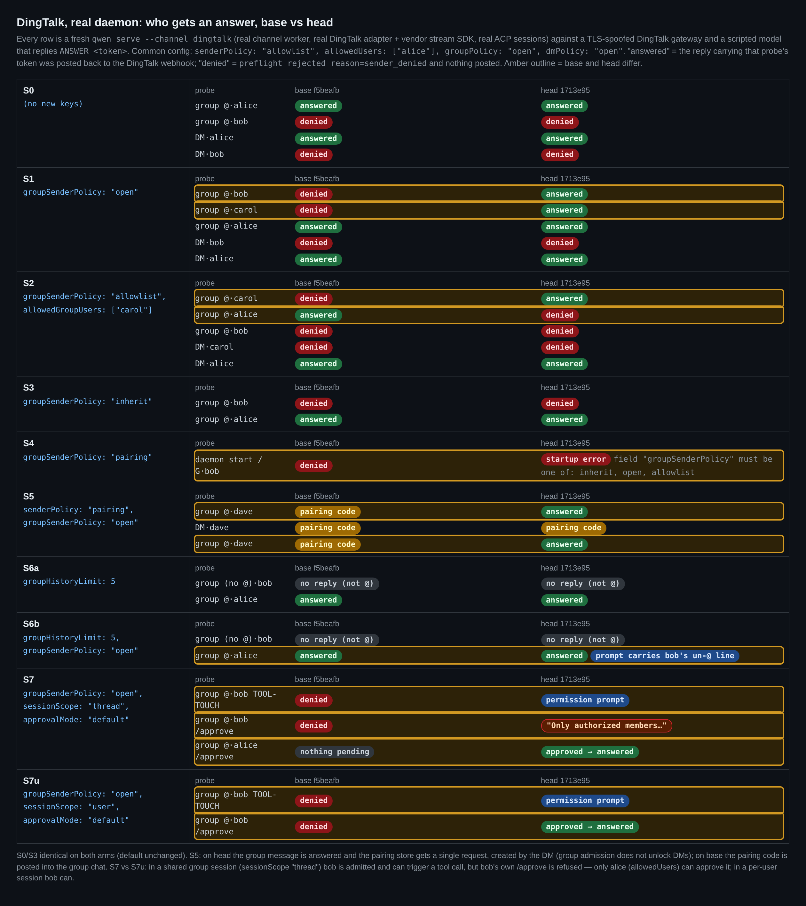
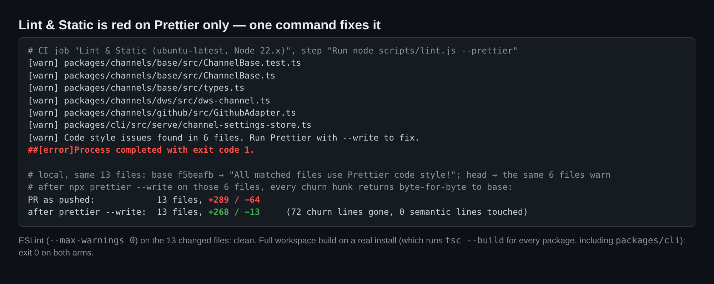
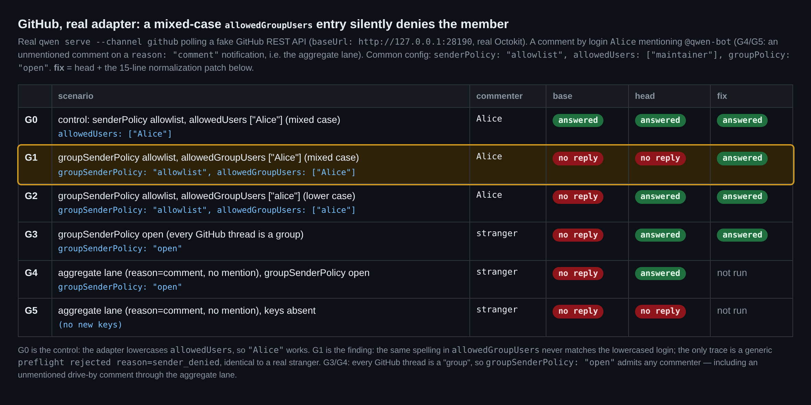
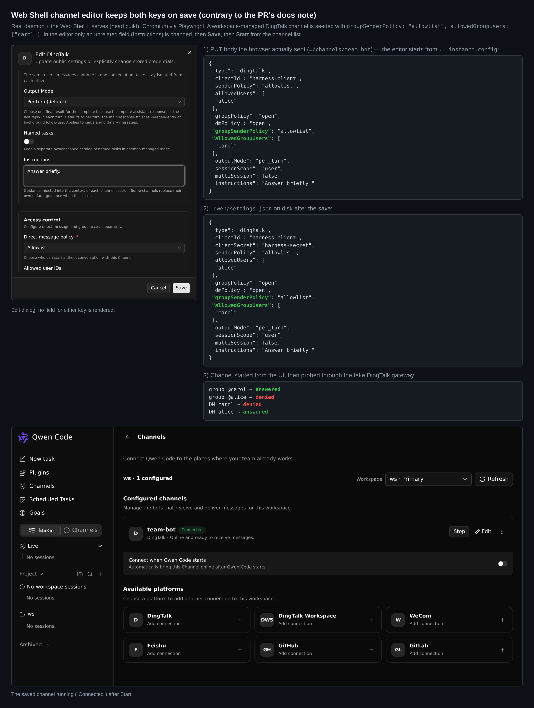
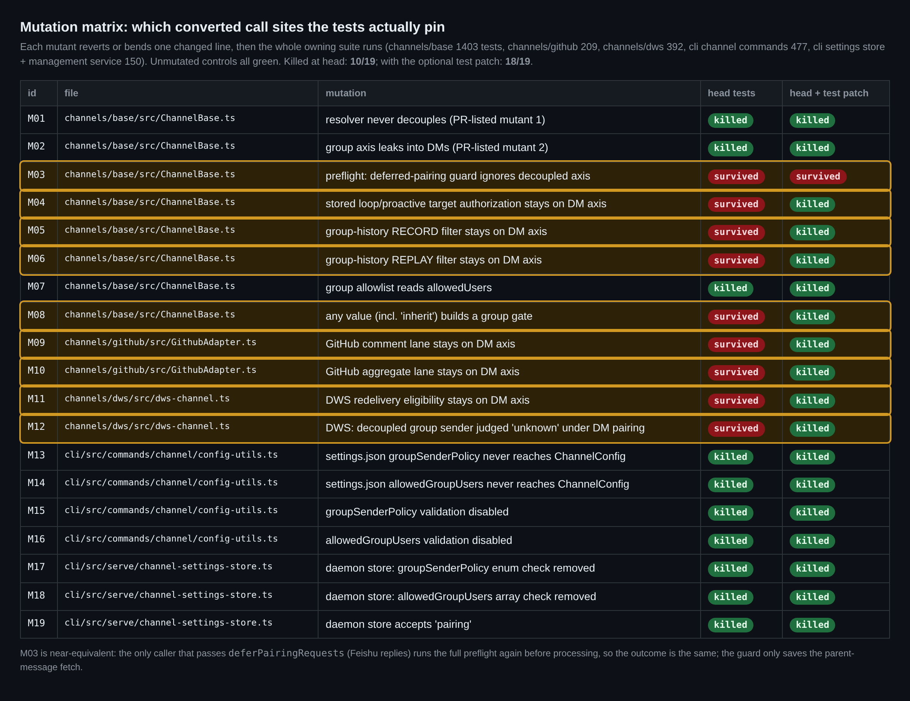

## 维护者验证：在 `1713e95` 上实跑钉钉、GitHub 与 Web Shell

**结论：按当前推送不建议合并；做完两处机械性修改后可以合并。** 在真实 daemon 上，设计本身站得住：新轴两个方向都解耦了，默认行为不变，非法值 fail-closed，群消息也不再能创建或满足私聊配对。两个阻塞项都是 Stage 2 已经提出的，我逐一实跑复现，并为第二项附上了验证过的补丁。另外，PR 文档里关于 Web Shell 编辑器的说明是错的：编辑器会保留这两个键。还有三个非阻塞项。

| | 在 `1713e95` 上 | 证据 |
| --- | --- | --- |
| **B1** `Lint & Static` 变红 | Prettier 在 6 个文件上失败。对这 6 个文件执行 `prettier --write`，所有格式化改动块都逐字节回到 base，diff 从 +289/−64 变为 +268/−13 | 图 5 |
| **B2** GitHub/GitLab 上大小写混合的 `allowedGroupUsers` | 在真实适配器上端到端复现。15 行补丁 RED→GREEN | 图 2 |
| **N1** 文档称"Web Shell 编辑器会重写配置" | 不成立。浏览器发出的 PUT 原样带回这两个键，`settings.json` 保留它们，运行中的频道也仍按它们判定 | 图 3 |
| **N2** 共享群会话 | 被放行的成员能触发工具调用，但不能 `/approve`。同一检查也拦住了 `/cancel`、`/clear` 和 loops | 图 1，S7 |
| **N3** GitHub/GitLab | 每个线程都算群，所以 `open` 会放行任何评论者，包括聚合通道上没有 @ 机器人的评论 | 图 2，G3/G4 |
| **N4** 测试覆盖 | 19 个变异中有 9 个存活。可选的测试补丁把存活数降到 1/19 | 图 4 |

### 验证方式

- **两个 arm，真实安装，完整构建。** base 为 `f5beafb`（merge base），head 为 `1713e95`。两边都执行完整的 `npm run build`（会对包括 `packages/cli` 在内的每个包执行 `tsc --build`），再执行 `npm run bundle`，均 exit 0。head 的 bundle 含有 `groupSenderGate`，base 的不含。第三个 arm **fix** = head + B2 中的补丁。
- **钉钉。** 我运行真实的 `qwen serve --channel dingtalk`：channel worker、钉钉适配器、厂商 stream SDK 和 ACP 会话都是真的。它连接的是一个 TLS 仿冒的钉钉 OpenAPI 与 stream 网关（仅环回地址，借助临时的 `/etc/hosts` 条目和私有 CA，事后均已删除）。模型是一个脚本化的 OpenAI 兼容服务，回复 `ANSWER <token>`。共 10 个场景 × 2 个 arm，每一行都启动全新的 daemon。只有携带该探针 token 的回复真正送达钉钉 webhook，才记为"answered"。
- **GitHub。** 真实的 `qwen serve --channel github` 和真实 Octokit，通过 `baseUrl` 指向一个假的 GitHub REST API。
- **Web Shell。** 真实 daemon 及其内置的 Web Shell，用 Playwright 驱动无头 Chromium，没有任何 mock。
- **head 上的单元测试。** `ChannelBase.test.ts` 712 个通过，`channels/dws` 392，`channels/github` 209，`config-utils` + `channel-settings-store` 193，与 PR 描述一致。`channels/base` 整包 1403/1403。对 13 个改动文件执行 `eslint --max-warnings 0`，无告警。

### 图 1：钉钉，base 对比 head



- **S0/S3**（不设新键，或显式设为 `inherit`）：两个 arm 完全一致。
- **S1/S2**：两条轴在两个方向上都分开了。bob 和 carol 在群里得到回复，私聊中仍被拒绝。在群 allowlist 下，只在私聊白名单里的 alice 在群里被拒绝。
- **S4**：`groupSenderPolicy: "pairing"` 时 head 拒绝启动：`Channel "dingtalk" field "groupSenderPolicy" must be one of: inherit, open, allowlist.` 因为我传了 `--channel dingtalk`，整个 `qwen serve` 启动失败。daemon API 也拒绝该值：`pairing` 返回 `400 channel_settings_invalid_config`，`open` 返回 `200`。
- **S5**（`senderPolicy: "pairing"` + `open`）：head 上 dave 在群里得到回复；私聊仍然收到配对码，配对存储里只有一条由私聊创建的请求，所以群内放行不会解锁私聊。base 上配对码会被直接发到群聊里。
- **S6**：群历史在新轴上记录和回放。只有 head + `open` 时，bob 未 @ 的那条消息才会进入下一次 prompt。

### B1：格式化改动（Stage 2 #1，确认）

CI 的 `Lint & Static` 作业在 `node scripts/lint.js --prettier` 这一步失败，失败文件正是 Stage 2 列出的 6 个。本地对同样 13 个文件检查：base 全部通过，head 同样是这 6 个失败。只需对这 6 个文件执行 `npx prettier --write`。我核对过，结果在每个格式化改动块上都与 base 逐字节一致，且不触碰任何语义行，PR 从 **+289/−64** 变为 **+268/−13**。



### B2：大小写混合的 `allowedGroupUsers`（Stage 2 #2，实跑复现）



在 G1 中，`allowedGroupUsers: ["Alice"]` 永远匹配不上被转成小写的登录名，于是 Alice 的 `@qwen-bot` 评论得不到回复。唯一的痕迹是一条通用的 `preflight rejected reason=sender_denied`，与真正的陌生人产生的日志一模一样。写成 `["alice"]`（G2）则正常。`allowedUsers: ["Alice"]`（G0）也正常，因为适配器已经对这个列表做了归一化。下面的补丁在两个适配器里照搬了现有的 `allowedUsers` 归一化逻辑。

<details>
<summary>补丁：在 GitHub/GitLab 的 <code>connect()</code> 中归一化 <code>allowedGroupUsers</code>（+15 行，已验证）</summary>

```diff
--- a/packages/channels/github/src/GithubAdapter.ts
+++ b/packages/channels/github/src/GithubAdapter.ts
@@ -618,6 +618,14 @@
       );
     }
     this.gate.replaceAllowedUsers(allowed);
+    // The decoupled group axis is matched against the same lowercased login.
+    if (this.config.allowedGroupUsers) {
+      const allowedGroup = this.config.allowedGroupUsers.map((u) =>
+        u.toLowerCase(),
+      );
+      this.config.allowedGroupUsers = allowedGroup;
+      this.groupSenderGate?.replaceAllowedUsers(allowedGroup);
+    }
     this.migrateLegacyPublicationState();
--- a/packages/channels/gitlab/src/GitlabAdapter.ts
+++ b/packages/channels/gitlab/src/GitlabAdapter.ts
@@ -99,6 +99,13 @@
     );
     this.config.allowedUsers = allowed;
     this.gate.replaceAllowedUsers(allowed);
+    if (this.config.allowedGroupUsers) {
+      const allowedGroup = this.config.allowedGroupUsers.map((u) =>
+        u.toLowerCase(),
+      );
+      this.config.allowedGroupUsers = allowedGroup;
+      this.groupSenderGate?.replaceAllowedUsers(allowedGroup);
+    }
 
     this.startPollLoop();
```

验证方式：我新增了两个测试，GitHub 的 `normalizes allowedGroupUsers to lowercase for the group sender gate` 和 GitLab 的 `normalizes allowedGroupUsers to lowercase`。在 head 的适配器上它们失败（`expected false to be true` 和 `expected [ 'Alice' ] to deeply equal [ 'alice' ]`），打上补丁后通过。整包测试也通过：github 212/212，gitlab 62/62。端到端看，G1 从无回复变为得到回复（图 2 的 **fix** 列）。补丁通过 Prettier 和 ESLint。测试位于产物中的 `patches/tests-group-axis.patch`。

</details>

### N1：Web Shell 编辑器会保留这两个键，文档说明应修改

新增到 `overview.md` 的那段话与实际不符，Risk & Scope 里的那条也一样。那段话说"在该界面保存通道时会按已渲染字段重写配置——在编辑器支持之前请把两个键写在 `settings.json` 里"。但 `buildChannelUpsertRequest`（`packages/web-shell/client/components/channels/channel-editor-state.ts`）是从 `...(instance?.config ?? {})` 开始构造的，而 daemon 的实例快照会透传所有非 secret 键。所以浏览器发出的 PUT 本身就带着 `groupSenderPolicy` 和 `allowedGroupUsers`。存储层确实会整体替换这个条目，Stage 2 说得没错，但用来替换的请求体里本来就有这两个键。



我只改了 Instructions，然后点 Save，再点 Start。PUT 请求体带着两个键，`settings.json` 保留了它们，运行中的频道在群里仍然回复 carol、拒绝 alice。我只测了修改无关字段这一种情况，没有测重命名。建议改为：*"The Web Shell channel editor does not show `groupSenderPolicy` or `allowedGroupUsers` yet. Set them in `settings.json`; saving the channel from the editor keeps them."*

### N2：共享群会话（补充 Stage 2 关于共享会话的说明）

对应图 1 的 S7 与 S7u。在 `sessionScope: "thread"`（共享群会话）下，bob 通过 `open` 被放行，并触发了一次工具调用。bob 发送 `/approve` 时得到的回复是 *"Only authorized members can answer permission requests in this shared session."*，只有在 `allowedUsers` 里的 alice 能批准。按用户划分会话时（S7u），bob 可以批准。同一个 `allowedUsers` 检查还覆盖 `/cancel`、`/clear`、`/who`、loops 和 `/btw`，并会把 steer 变成排队消息。这是安全的方向，我也倾向保留。但群成员自己的回合卡在一个他们无法给出的批准上，会让人意外，而且 GitHub 默认用的就是共享的 `chat_thread`。在 "Group Sender Policy" 一节加一句说明就够了。

### N3：在 GitHub/GitLab 上，群轴就是唯一的轴

每个 GitHub envelope 都是 `isGroup: true`，所以在 GitHub/GitLab 上 `groupSenderPolicy` 会替代 `senderPolicy` 管控所有流量。在 G3 和 G4 中，`open` 放行了被关注线程上的任何评论者。G4 是一条 `reason: "comment"` 通知上**没有 @ 机器人**的路过评论，它照样触发了一次模型回合和一条公开回复。在公开仓库上，这意味着 GitHub 上的任何人都行，而 GitHub descriptor 明确建议运维者在公开仓库上使用 Allowlist。我建议在 GitHub 和 GitLab 的文档里加一句，或者像现有的"allowlist 只含机器人账号"那样在 connect 时给出警告。这不阻塞合并，因为 `open` 是显式开启的。

### N4：测试覆盖



三个新增的 ChannelBase 测试钉住了解析方法本身，也能抓住 PR 描述里列出的两个变异。仍有 19 个中的 9 个存活：

- preflight 中的延迟配对守卫（M03，近似等价，见下文）
- 群历史的记录与回放过滤
- 已存储 loop 目标的授权
- GitHub 的两条通道
- DWS 重投递的两个分支
- 显式的 `inherit` 值

上面的端到端运行覆盖了群历史、GitHub 两条通道和 `inherit`，loops 和 DWS 没有任何覆盖。可选的 `tests-group-axis.patch` 新增 8 个测试：2 个用于 B2，6 个用于上述位置，能把存活变异降到 1/19。剩下的 M03 近似等价：唯一设置 `deferPairingRequests` 的调用方是飞书回复，它随后无论如何都会再跑一次完整 preflight。该补丁通过 Prettier 和 ESLint，整包测试保持全绿（base 1406、github 212、gitlab 62、dws 393）。

### 产物

图、harness（假钉钉网关、假 GitHub API、脚本化模型、场景驱动器、变异执行器、Playwright 编辑器脚本）、原始结果 JSON 和两份补丁都在 this directory (`harness/`, `data/`, `patches/`)。
