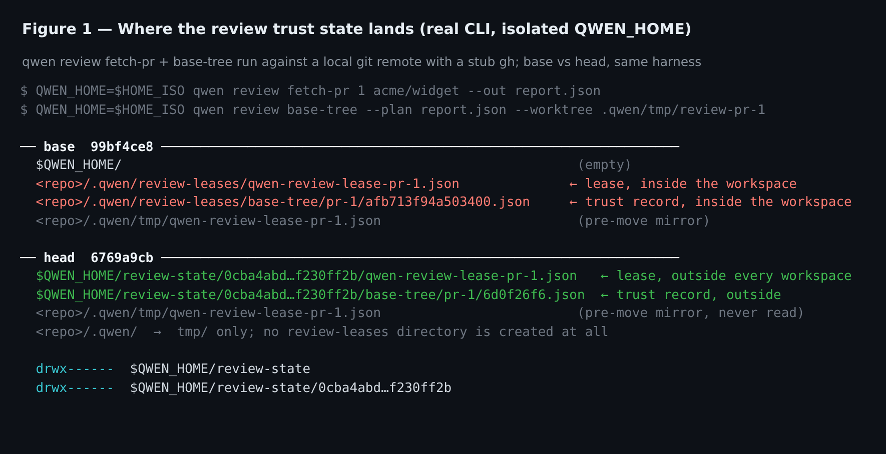
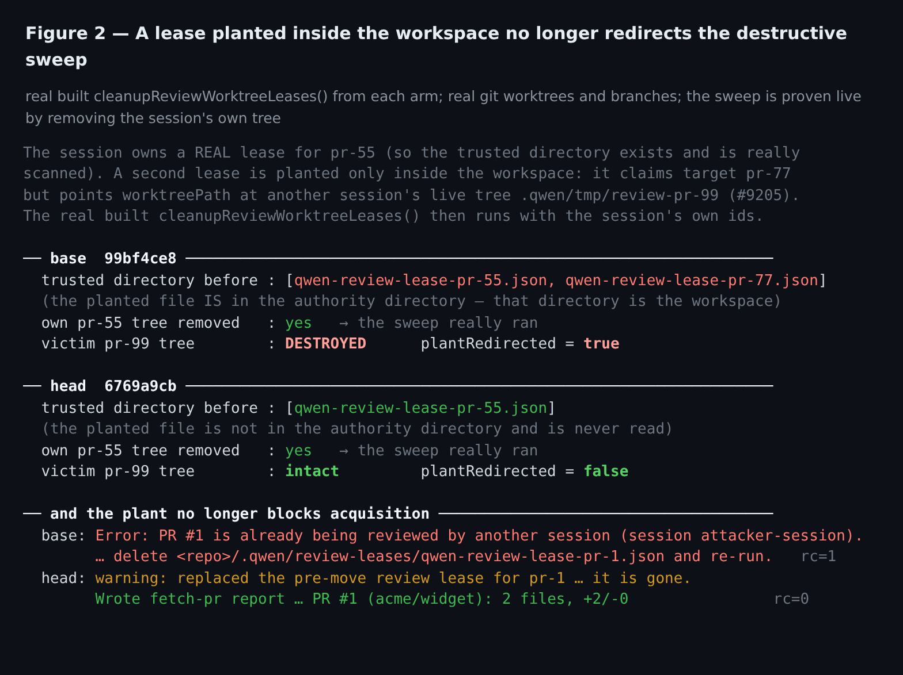
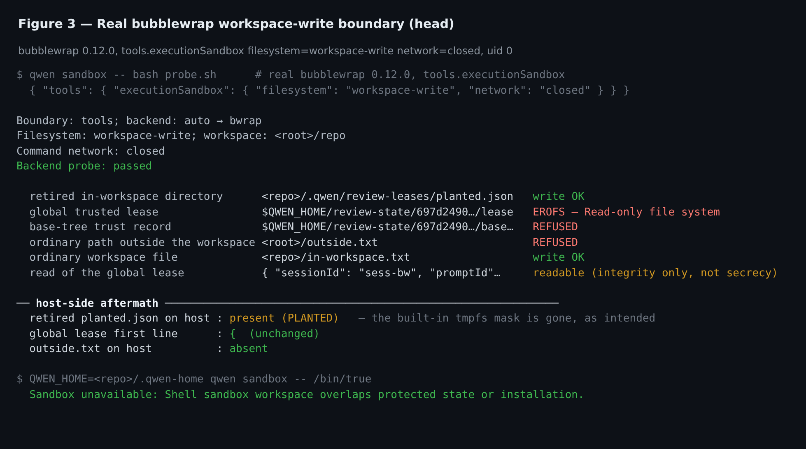
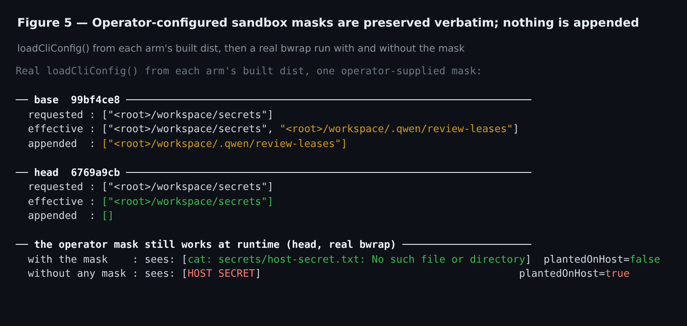
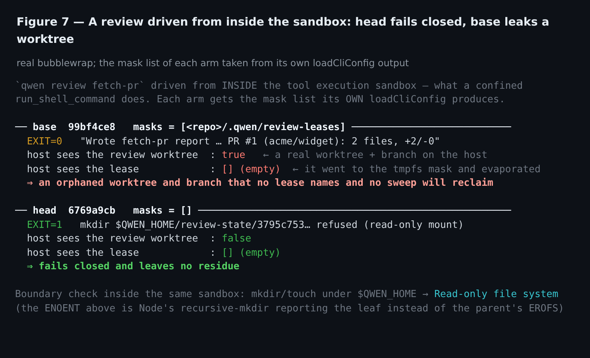
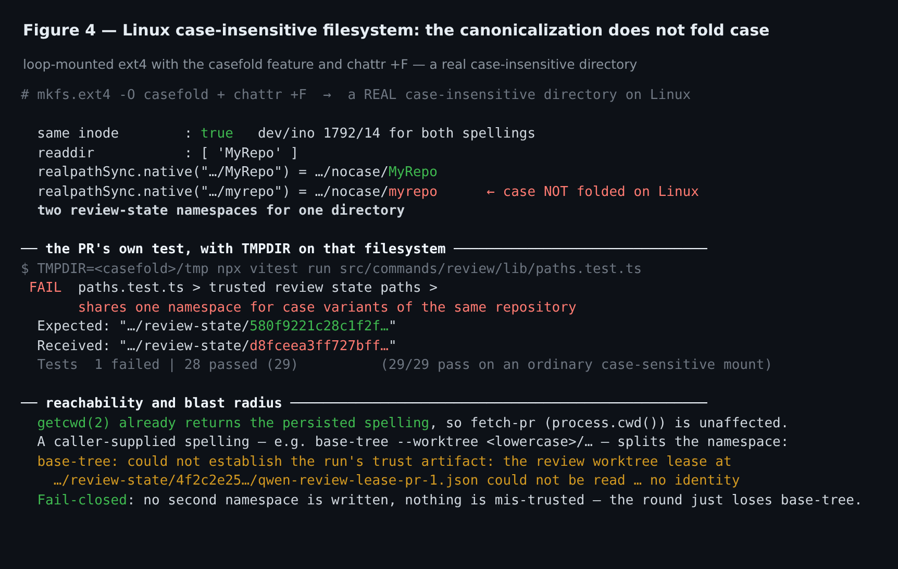
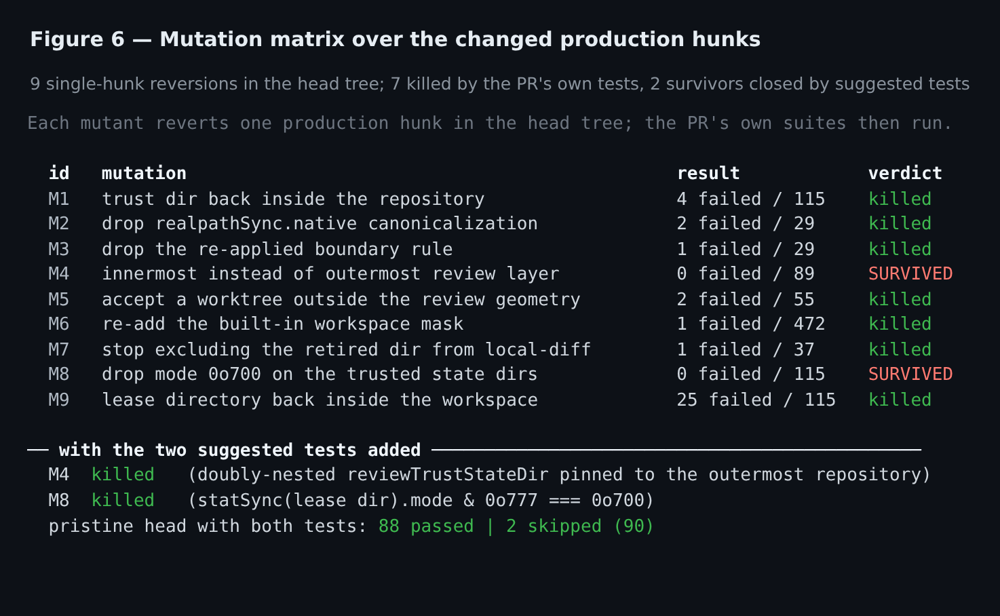

## Maintainer verification — local, real, two-arm

Verdict: **mergeable**. I rebuilt both arms from source and drove the real CLI against a real
repository, a real bubblewrap sandbox and a real case-insensitive filesystem. Every claim in the
Reviewer Test Plan reproduces on x86_64 Linux except one, which is platform-scoped and fails
closed. Both items the earlier review blocked on are closed at this head.

**Arms.** head `6769a9cb` vs merge base `99bf4ce8`, each `pnpm install --frozen-lockfile` +
`npm run build` + `npm run bundle` from scratch. Node 22.22.2, Linux 6.12.63 x86_64,
bubblewrap 0.12.0 (mounted into a private mount namespace; the host is untouched).
The repository under review is a throwaway git repo with a local bare remote and a stub `gh`, so
`qwen review fetch-pr` runs end to end with no network and no shared state.

### 1. Where the trust state lands

`qwen review fetch-pr 1 acme/widget` followed by `qwen review base-tree`, isolated `QWEN_HOME`:

On head the lease and the base-tree trust record are the only two files under `QWEN_HOME`, both
inside `review-state/<sha256 of the canonical repository root>`, and the repository never grows a
`.qwen/review-leases` directory at all. `review-state` and its per-repository child are `drwx------`.
A nested review launched from inside `.qwen/tmp/review-pr-1` lands in the **same** namespace
directory as the outer one (one lock scope); two distinct repositories sharing one `QWEN_HOME` each
acquire `pr-1` independently, in two different namespaces. `qwen review cleanup pr-1` reclaims both
files.

### 2. A lease planted inside the workspace

The sharp test is the destructive one: the session holds a real lease for `pr-55` (so the trusted
directory exists and is genuinely scanned), and a second lease is planted only inside the workspace
claiming target `pr-77` while pointing `worktreePath` at another session's live tree
`.qwen/tmp/review-pr-99`. The real built `cleanupReviewWorktreeLeases()` then runs.

Base honours the plant and destroys the other session's review worktree. Head removes only its own
`pr-55` tree and leaves the victim intact. Acquisition behaves the same way: a plant refuses
`fetch-pr` on base and is merely reported and replaced on head.

### 3. The bubblewrap boundary

Reviewed code can write the retired workspace path — and that write now reaches the host, which is
the intended consequence of dropping the built-in mask — while the global lease, the trust record
and any other path outside the workspace return `EROFS`. Run as uid 0, so the refusal comes from
the mount rather than from file permissions. The lease stays **readable** from inside the sandbox;
this PR buys integrity, not secrecy, and the design doc is right not to claim otherwise.
Pointing `QWEN_HOME` inside the repository is refused up front:
`Shell sandbox workspace overlaps protected state or installation.`

### 4. Operator-configured masks

Real `loadCliConfig()` from each arm's built dist, with one operator-supplied mask: base appends
`<workspace>/.qwen/review-leases`, head returns the operator's list verbatim. A real bwrap run
confirms an operator mask still hides the host path and discards writes to it.

### 5. A review driven from inside the sandbox

Worth recording because it is the combination the mask removal touches. Driving `fetch-pr` from
inside the tool sandbox, each arm given the mask list its own `loadCliConfig` produces:

Base reports success, creates a real worktree and branch on the host, and writes its lease into the
tmpfs mask, which evaporates — an orphan nothing will ever reclaim. Head refuses and leaves nothing
behind. This is a strict improvement, not a regression.

### 6. Case-insensitive filesystems — the one claim that does not hold on Linux

On a real case-insensitive directory (loop-mounted ext4 with `casefold` + `chattr +F`),
`realpathSync.native` returns the caller's spelling, not the persisted one: `realpath(3)` canonicalises
`.`, `..` and symlinks but keeps the case of every component. Two spellings of one directory —
same `dev`/`ino` — hash to two namespaces, and the PR's own test
`shares one namespace for case variants of the same repository` fails when `TMPDIR` is on that
filesystem (1 failed / 29; 29/29 on an ordinary mount). On a case-sensitive filesystem that test
`return`s before asserting, so it is green and silent everywhere CI runs.

Reachability is narrow and the failure mode is benign: `getcwd(2)` already returns the persisted
spelling, so `fetch-pr`, `cleanup` and the session-exit sweep — all of which key off `process.cwd()`
— are unaffected. Only a caller-supplied spelling splits the namespace, e.g.
`base-tree --worktree <lowercase>/...`, and it then **fails closed**:
`could not establish the run's trust artifact: the review worktree lease ... could not be read ... no identity`.
Nothing is mis-trusted and no second namespace is written; the round just loses its base tree.

Not a merge blocker. Either scope the Reviewer Test Plan sentence to macOS/Windows, where
`realpathSync.native` does fold case, or fold explicitly when the filesystem proves it folds — the
same rule `getProjectHash` already applies unconditionally on `win32`.

### 7. Mutation over the changed hunks

Nine single-hunk reversions in the head tree, judged by the PR's own suites. Seven killed, two
survived:

- **M8** — dropping `mode: 0o700` from both `mkdirSync` sites changes nothing any test can see.
  That mode is the only thing keeping another account on a shared runner out of the lease
  directory, and it should not be able to disappear silently.
- **M4** — swapping the outermost-layer rule for the innermost one survives. It only diverges at
  three levels of nesting, because `canonicalReviewRepositoryRoot` applies the rule twice and two
  passes collapse a doubly-nested path anyway; still, "the FIRST occurrence is the outermost layer"
  is the property the whole re-root exists for and nothing pins it.

Both survivors are closed by [`suggested-tests.diff`](./suggested-tests.diff) (+29 lines, two
files, no production change). Verified: green on the pristine head (88 passed | 2 skipped), M4 and
M8 both killed with it applied, Prettier and ESLint clean.

### 8. Smaller notes

- `nonInteractiveCli.ts` skips the review-lease sweep whenever the execution sandbox is on —
  `if (config.getShellExecutionSandbox?.()) return;` — under the comment *"Review leases live in the
  tool-writable workspace in this mode."* This PR makes that comment false, and the skip is pinned
  by `nonInteractiveCli.test.ts` ("scopes review lease cleanup to the ordinary runtime"). Left as
  is, a lease acquired on the host before a headless run with `tools.executionSandbox` enabled is
  never reclaimed at exit. Worth revisiting in the Landlock follow-up, if not here.
- The migration note says old workspace authority is never imported, which is true. It is worth
  adding that dropping the built-in mask also re-opens the *write* path to
  `<workspace>/.qwen/review-leases` for confined code — harmless for a new build, but an older build
  on the same machine still treats that directory as authority, and figure 2's base arm shows what
  it does with a plant there.
- When the namespace directory does not exist yet, the read-only refusal surfaces as
  `ENOENT ... mkdir '<QWEN_HOME>/review-state/<hash>'` rather than `EROFS` — a Node
  recursive-`mkdir` artifact (the same path reports `Read-only file system` from `mkdir(1)`).
  Slightly misleading in a log.
- `qwen review cleanup` reclaims the lease and the trust record but leaves
  `review-state/<hash>/` and `review-state/<hash>/base-tree/` behind empty — one pair per repository
  ever reviewed.

### 9. Gates

| gate | result |
| --- | --- |
| The 9 test files this PR touches | **1012 passed, 2 skipped** |
| `packages/cli` `src/commands/review` + `services/review-worktree-lease` + `config` | **7299 passed, 21 skipped (127 files)** |
| `scripts/tests/review-worktree-cleanup-workflow.test.js` | **23 passed (11 skipped)** — the earlier blocker is closed |
| `npm run test:scripts` | 2579 passed, 32 skipped, 5 failed — **the same 5 fail identically on the base arm** (they assert `chmod`-based refusals and I run as uid 0) |
| Prettier, ESLint `--max-warnings 0`, `tsc --noEmit` (core + cli) | **clean** |

Two environment notes so the numbers are not over-read: `base-tree.test.ts` ends every run with
`[vitest-worker]: Timeout calling "onTaskUpdate"` and a non-zero exit on **both** arms — a reporter
RPC timeout on a two-minute file, not a PR effect; and the PR's own case-variant test is vacuous on
every case-sensitive filesystem, including CI.

The duplicate hashing helper the earlier review flagged is gone — `getProjectHash` is imported from
core — and `scripts/tests/review-worktree-cleanup-workflow.test.js` imports
`RETIRED_REVIEW_LEASE_DIR` and passes. I did not re-run the author's aarch64 production-bundle
probe battery; the boundary checks above are my own, on x86_64.
