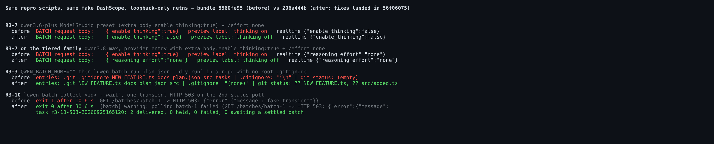
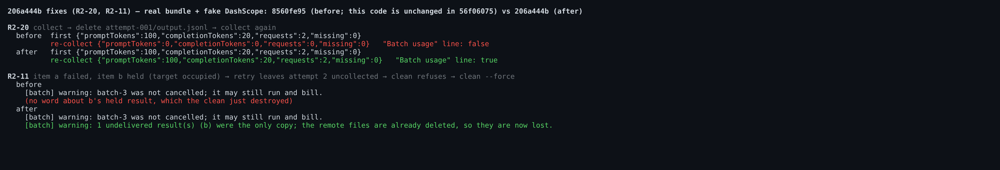
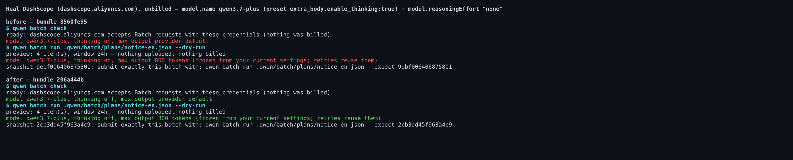
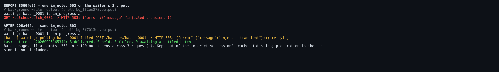
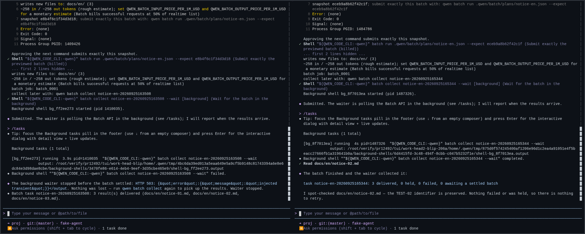

## Maintainer verification, round 2 (delta only): PR #12492 at `206a444b`

**Verdict: mergeable from my side.** Round 1 ([comment](https://github.com/QwenLM/qwen-code/pull/12492#issuecomment-5835289329), at `8560fe95`) named three fixes to make before merge. All three landed in `56f06075` and still hold at the current head `206a444b`, which also fixes the two open round-2 suggestions (R2-11, R2-20). Every "after" result below comes from `206a444b`: unit tests, the real bundle, the real TUI and the real DashScope endpoint (unbilled). The remaining round-1 findings are tracked in #12707. This round found two more narrow issues, listed in §3; neither blocks the merge.

Scope: two commits on top of `8560fe95`, same base `64c04538`.
- `56f06075` touches 6 files (+107/−6). Its production change is **line-for-line the patch verified in round 1**, and it adds 6 tests.
- `206a444b` touches 2 files (+81/−1) and adds 2 tests.

The environment is unchanged from round 1.

### 1. Re-verified at `206a444b`

| Check | Result |
| --- | --- |
| cli unit tests: batch suites + `startup-prefetch`, `cli.test`, `config.test` (9 files) | **761/761** (753 + 6 + 2 new) |
| `eslint --max-warnings 0` and `prettier --check` on the 6 changed files; `tsc --noEmit` for `packages/cli` | all exit 0 |
| `workflow-e2e.mjs` on the new bundle | **27/27** |
| Revert each fix alone and run its new test | Every fix is pinned: R3-7 (1 test red), R3-3 (1 red), R3-10 "no retry" (503/429/408, 3 red), R2-20 (1 red), R2-11 (1 red). Retrying a 401 too also turns the suite red, but by crashing: see §3.3. The working tree was clean afterwards. |
| Round-1 repro scripts on the new bundle (fake DashScope, loopback-only netns) | **R3-7**: Batch now sends `enable_thinking:false`, the same as realtime; both controls are unchanged. On `qwen3.8-max` with `extra_body.enable_thinking:true` + `/effort none`, Batch now sends `reasoning_effort:"none"`, again the same as realtime. **R3-3**: no `.gitignore` and no `tasks/` appear in the project, and `git status` still lists both untracked files. **R3-10**: after one 503 the waiter warns, retries and delivers, exiting 0. |
| **R2-20** probe: collect → delete `attempt-001/output.jsonl` → collect again | Before: usage was rewritten to `{"requests":0,…}` and the "Batch usage" line disappeared. After: `{"promptTokens":100,"completionTokens":20,"requests":2}` is kept and the line is printed. |
| **R2-11** probe: item a failed, item b held → `retry` leaves attempt 2 uncollected → `clean` refuses → `clean --force` | Before: only `batch-3 was not cancelled…` is printed. After: it also prints `1 undelivered result(s) (b) were the only copy; … now lost.` |
| Real DashScope, unbilled: `qwen3.7-plus` preset + `model.reasoningEffort: "none"` | `check` and `run --dry-run` now say `thinking off` (before: `thinking on`). The snapshot digest changes too (`9ebf0064…` → `2cb3dd45…`), so a preview taken on the old build cannot authorize the new frozen settings. I made no paid submission this round. |
| Real TUI regression on the new bundle | Same 6 approval prompts as before; `run --expect` still prompts. 3 files delivered and the agent was woken once. Startup auto-collect still works. A session in a project with no Batch tasks sent 0 Batch requests. |
| Real TUI A/B: one injected 503 on the background waiter's 2nd poll | Before: the waiter shell `failed` and the agent reported that it stopped. The session auto-collector delivered the batch about 26 s later. After: the waiter printed `warning: polling … failed …; retrying`, polled again 20 s later and delivered, and the agent was woken normally. |
| CI `Lint & Static` at `206a444b` | Red, in `.github/scripts` helper tests only. The failing test is `autofix-status-heartbeat › a planted FIFO … bounded write`, with `hookFailed ENOTEMPTY` in its temp-dir cleanup. This PR touches no `.github/` file, and the same file passes 30/30 three times locally at this head. It looks like a flake; a re-run of the failed job should clear it. `Test (ubuntu)` passed. |

### 2. Round-1 follow-ups

#12707 carries every non-blocking round-1 item: R3-2/4/8, R3-1, R3-9, R3-5/6, the `list()` warning, the thinking-free estimate, the `max output` label and the `check` wording. The threads deferred to it at this head match what I measured.

### 3. New this round (non-blocking; suggest adding to #12707)

1. **The `qwen3.8-max` family doesn't match realtime at the default effort.** It is the same at `8560fe95` and `206a444b`, so it is not introduced by these commits. With the ModelStudio preset entry, realtime sends the preset's `defaultEffort` as `reasoning_effort:"xhigh"`. Batch sends no effort, and the preview says `thinking: provider default`. When the entry also carries `extra_body.enable_thinking:true`, realtime drops that competing knob (`dropConflictingThinkingKnobs`), but Batch ships `enable_thinking:true` and no effort. No `[batch] note:` is printed in either case. So "like for like" holds for `/effort none` but not for the tiered family's default effort. Either freeze the effective tier or print the existing "reasoning effort is not reproduced" note.
2. **`waitForSettled` now retries the local route-guard refusal.** Any error without an HTTP status is treated as transient, and that includes `batchRequest`'s own `refusing a request outside the Batch API paths`. With a ledger batch id of `batch-1:x`, `collect --wait --timeout 25` used to exit 1 after 0.5 s. At this head it prints 2 retry warnings and exits at 25 s. `/batch-api` starts the waiter with no `--timeout`, so it would poll indefinitely. By code reading, the session collector would still report the task after 3 failed passes. This is unreachable with DashScope's `batch_<uuid>` ids; a non-conforming provider id or a hand-edited ledger triggers it. Fix: mark the guard error as definite and rethrow it.
3. **Test nit.** `stops waiting at once on a definite client error` relies on the code under test terminating. A mutant that also retries 401 loops under the mocked `sleep` until the vitest worker runs out of heap. The mutant is still caught, but by a crash rather than an assertion. Bounding the poll count in the mock would turn it into a normal failure.

Note: the `CHANGES_REQUESTED` review on this PR was posted against `8560fe95`. Of its items, the three I ruled blocking are fixed here and the rest are in #12707.

Evidence: (this directory)
- images;
- the new probe scripts `r3-07b-tiered-qwen38max.mjs`, `r2-01-guard-refusal-retried.mjs` and `r2-02-clean-force-and-usage.mjs`;
- raw logs.

中文版

## 维护者验证第 2 轮（仅增量）：PR #12492 @ `206a444b`

**结论：从我这边看可以合入。** 第 1 轮（[评论](https://github.com/QwenLM/qwen-code/pull/12492#issuecomment-5835289329)，针对 `8560fe95`）列出了合入前要修的三处，已在 `56f06075` 落地，并在当前 head `206a444b` 上依然成立。`206a444b` 还修掉了第 2 轮评审留下的两条建议（R2-11、R2-20）。下文所有“修复后”的结果均取自 `206a444b`，覆盖单测、真实 bundle、真实 TUI 和真实 DashScope 端点（不计费）。第 1 轮其余发现由 #12707 跟踪。本轮另发现两个触发面很窄的问题（见 §3），不影响合入。

范围：`8560fe95` 之上两个提交，base 不变（`64c04538`）。
- `56f06075`：改动 6 个文件（+107/−6），生产代码改动与第 1 轮验证过的补丁**逐行一致**，新增 6 个测试。
- `206a444b`：改动 2 个文件（+81/−1），新增 2 个测试。

验证环境同第 1 轮。

### 1. 在 `206a444b` 上复验

| 检查 | 结果 |
| --- | --- |
| cli 单测：batch 各套件 + `startup-prefetch`、`cli.test`、`config.test`（9 个文件） | **761/761**（753 + 新增 6 + 新增 2） |
| 6 个改动文件的 `eslint --max-warnings 0` 与 `prettier --check`；`packages/cli` 的 `tsc --noEmit` | 全部 exit 0 |
| 新 bundle 上跑 `workflow-e2e.mjs` | **27/27** |
| 逐个回退修复，跑对应的新测试 | 每处修复都被测试钉住：R3-7（1 红）、R3-3（1 红）、R3-10 去掉重试（503/429/408 共 3 红）、R2-20（1 红）、R2-11（1 红）。让 401 也重试时套件同样变红，但方式是崩溃（见 §3.3）。完成后工作区干净 |
| 用新 bundle 重跑第 1 轮复现脚本（假 DashScope，网络命名空间只有回环） | **R3-7**：Batch 改为发送 `enable_thinking:false`，与 realtime 一致，两个对照组不变。`qwen3.8-max` 在带 `extra_body.enable_thinking:true` 且 `/effort none` 时，Batch 改为发送 `reasoning_effort:"none"`，同样与 realtime 一致。**R3-3**：项目里不再出现 `.gitignore` 和 `tasks/`，`git status` 仍能列出两个未跟踪文件。**R3-10**：遇到一次 503 后打印警告并重试，最终交付，exit 0 |
| **R2-20** 探针：collect → 删除 `attempt-001/output.jsonl` → 再次 collect | 修复前：用量被改写为 `{"requests":0,…}`，“Batch usage” 行也消失了。修复后：保留 `{"promptTokens":100,"completionTokens":20,"requests":2}`，并照常打印该行 |
| **R2-11** 探针：条目 a 失败、条目 b 处于 held → `retry` 留下未收取的 attempt 2 → `clean` 拒绝 → `clean --force` | 修复前：只打印 `batch-3 was not cancelled…`。修复后：还会打印 `1 undelivered result(s) (b) were the only copy; … now lost.` |
| 真实 DashScope（不计费）：`qwen3.7-plus` 预设 + `model.reasoningEffort: "none"` | `check` 与 `run --dry-run` 从 `thinking on` 变为 `thinking off`。快照摘要随之变化（`9ebf0064…` → `2cb3dd45…`），所以在旧构建上做的预览授权不了新的冻结设置。本轮没有做付费提交 |
| 新 bundle 上的真实 TUI 回归 | 审批点仍是同样 6 个，`run --expect` 仍然弹框；交付 3 个文件，agent 被唤醒一次；启动时自动收取正常；在没有 Batch 任务的项目里开会话，Batch 请求 0 次 |
| 真实 TUI A/B：后台 waiter 第 2 次轮询时注入一次 503 | 修复前：waiter shell `failed`，agent 汇报 waiter 已停止；约 26 s 后由会话自动收取器补交付。修复后：waiter 打印 `warning: polling … failed …; retrying`，20 s 后再次轮询并交付，agent 正常被唤醒 |
| `206a444b` 上的 CI `Lint & Static` | 红，失败只出现在 `.github/scripts` 的 helper 测试：`autofix-status-heartbeat › a planted FIFO … bounded write` 在清理临时目录时报 `hookFailed ENOTEMPTY`。本 PR 没有改动任何 `.github/` 文件，同一测试文件在本地这个 head 上连跑 3 次都是 30/30 通过。看起来是偶发失败，重跑失败的 job 应该就能过。`Test (ubuntu)` 已通过 |

### 2. 第 1 轮的后续项

#12707 已承接第 1 轮全部非阻塞项：R3-2/4/8、R3-1、R3-9、R3-5/6、`list()` 警告、估算不含 thinking、`max output` 文案、`check` 措辞。本 head 上推迟到该 issue 的各线程与我的实测一致。

### 3. 本轮新发现（不阻塞，建议补进 #12707）

1. **`qwen3.8-max` 系列在默认强度下与 realtime 不一致。** `8560fe95` 与 `206a444b` 上表现相同，不是这两个提交引入的。使用 ModelStudio 预设条目时，realtime 会发送预设的 `defaultEffort`，即 `reasoning_effort:"xhigh"`；Batch 不带强度，预览显示 `thinking: provider default`。条目里如果还带 `extra_body.enable_thinking:true`，realtime 会丢弃这个竞争开关（`dropConflictingThinkingKnobs`），Batch 却发送 `enable_thinking:true` 且不带强度。两种情况都不打印 `[batch] note:`。也就是说，“与 realtime 同条件”在 `/effort none` 下成立，在分档模型的默认强度下不成立。建议二选一：冻结实际生效的强度档位，或者打印已有的 “reasoning effort is not reproduced” 提示。
2. **`waitForSettled` 现在会重试本地路由守卫的拒绝。** 所有不带 HTTP 状态码的错误都被当作瞬时错误，其中也包括 `batchRequest` 自己抛出的 `refusing a request outside the Batch API paths`。账本里的 batch id 为 `batch-1:x` 时，`collect --wait --timeout 25` 以前 0.5 s 就 exit 1；现在打印 2 次重试警告，拖到 25 s 超时才退出。而 `/batch-api` 启动 waiter 时不带 `--timeout`，会无限轮询。按代码阅读，会话收取器在连续 3 次失败后仍会提示用户。DashScope 的 id 形如 `batch_<uuid>`，触发不到；不规范的 provider id 或手改过的账本会触发。修法：把守卫错误标记为确定性错误，直接抛出。
3. **测试小问题。** `stops waiting at once on a definite client error` 依赖被测代码自己终止。如果变异体把 401 也当作可重试，它会在 mock 的 `sleep` 下死循环，直到 vitest worker 堆内存耗尽。变异体仍然被检出，但靠的是崩溃而不是断言。在 mock 里限制轮询次数，就能变成正常的断言失败。

注：本 PR 上的 `CHANGES_REQUESTED` 评审针对的是 `8560fe95`。其中我判定为阻塞的三项已在本 head 修复，其余已转入 #12707。

证据：(this directory)
- 截图；
- 新增探测脚本 `r3-07b-tiered-qwen38max.mjs`、`r2-01-guard-refusal-retried.mjs`、`r2-02-clean-force-and-usage.mjs`；
- 原始日志。

_— verified with Claude Code (Claude Opus 5.5)_
