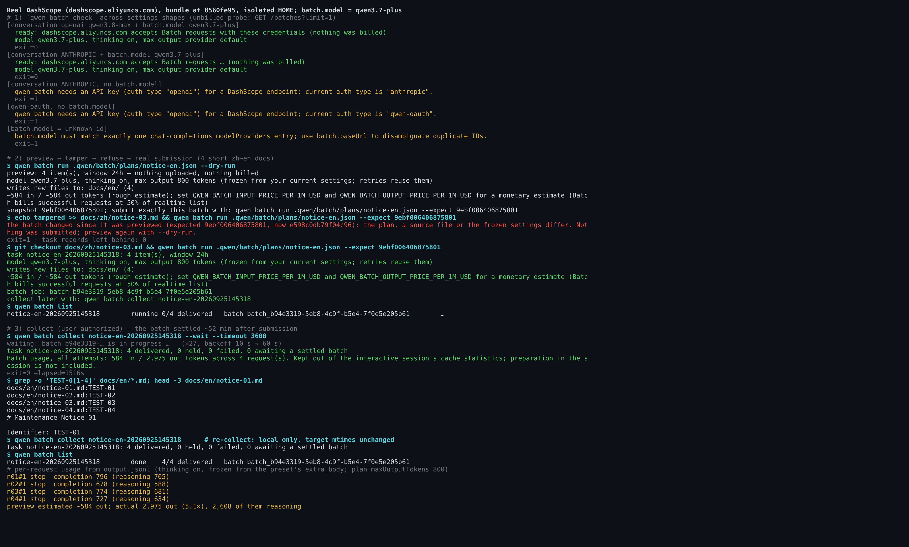
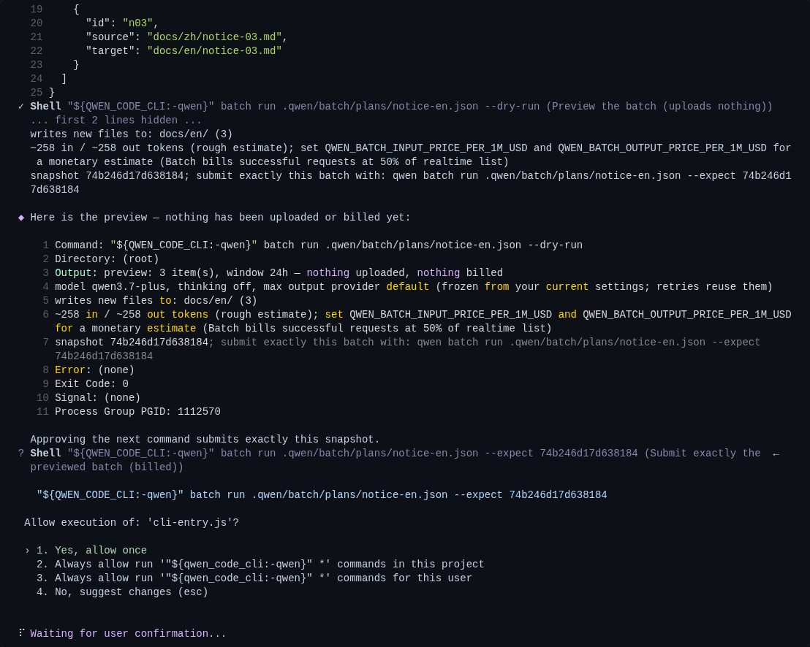
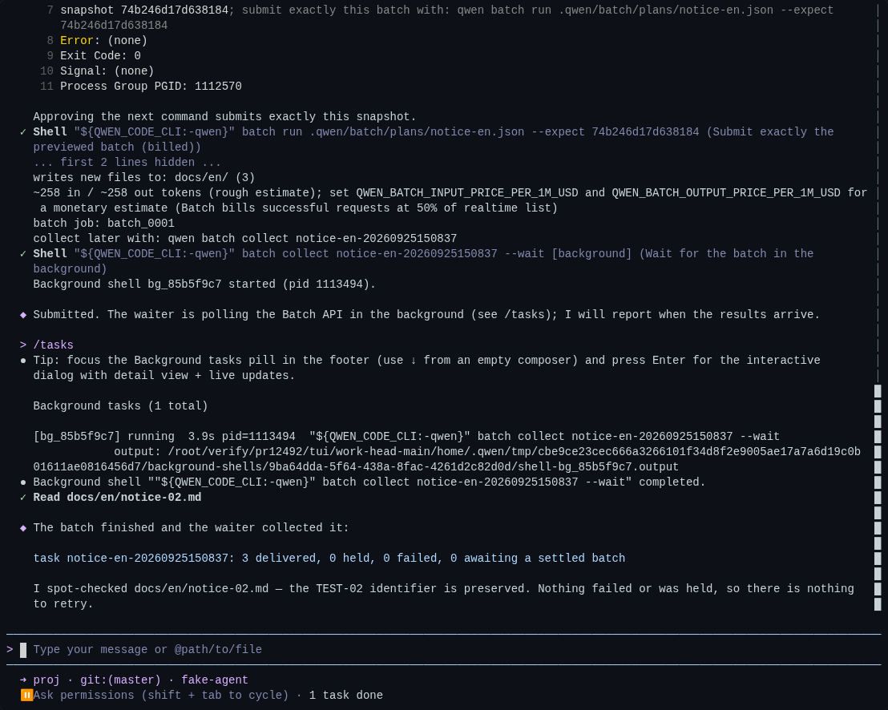
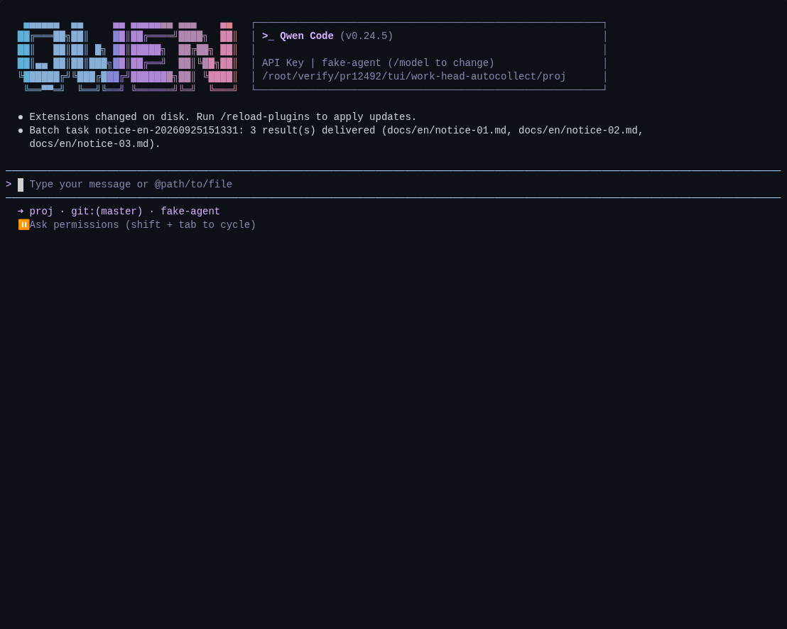
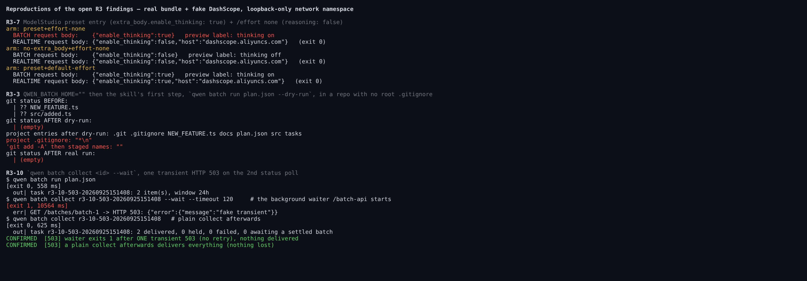

## Maintainer verification — PR #12492 at `8560fe95` (real build, real TUI, real DashScope)

**Verdict: mergeable after three small fixes (R3-7, R3-3, R3-10; +30/−6, patch below, proven RED→GREEN).** The workflow works end to end at this head: I ran a real DashScope `check`, a preview, a tamper refusal, and a real paid submission that was delivered; a real TUI `/batch-api` run from plan to automatic wake-up; startup auto-collect; and the PR's 27-check E2E. The money-safety core held under every probe. The paid submit always gets its own approval prompt in default mode, even with broad allow rules, and a stale preview digest refuses to submit. Of the automated reviewer's 10 open Criticals I reproduced all 10, plus pomelo-nwu's `list()` point. Three are worth fixing before merge. The rest are real but narrow, and I suggest one follow-up issue for them.

Environment: Linux x86_64, Node 22.22.2. The worktree is at `8560fe95`, base `64c04538`. `pnpm install --frozen-lockfile` took 1m07s, `npm run build` 3m30s, then `npm run bundle`. Every run used an isolated `HOME`/`QWEN_HOME`.

### 1. What works (measured at this head)

| Check | Result |
| --- | --- |
| Unit tests: batch suites, `startup-prefetch`, `cli.test`, `config.test` (9 files) | **753/753** |
| Core `src/skills` + `batch-api/SKILL.test.ts` | 751/752. The one failure (`skill-curator › reports skippedErrors when rename fails transiently`) also fails on base `64c04538`, because it runs as root. Unrelated. |
| `docs/verification/batch-api/workflow-e2e.mjs` on the bundle | **27/27**, the first E2E run at this exact head. The `8560fe95` follow-up note lists focused tests, lint, build and typecheck only. The approving review's "22/22" is the old count. |
| Real `qwen batch check` against `dashscope.aliyuncs.com` | See the matrix in the figure below. Anthropic chat + `batch.model: qwen3.7-plus` → `ready`, 0.66 s, unbilled. Anthropic or Qwen OAuth without `batch.model` → a clear refusal. An unknown `batch.model` → a clear refusal. |
| Real preview → tamper → refuse | After a source edit, `--expect 9ebf0064…` was refused with `the batch changed since it was previewed`. Nothing was uploaded and no task record was left behind. |
| Real paid submission (4 short zh→en docs, `qwen3.7-plus`) | `batch job: batch_b94e3319-…`, task recorded as `running 0/4`. |
| Real `collect --wait` on that batch | It settled about 52 min after submission, after 27 polls with a 10 s → 60 s backoff. Result: **4 delivered, 0 held, 0 failed**, all four `TEST-0x` identifiers kept, usage `584 in / 2,975 out`. The ledger ended at `done` / `collected: true`, with dirs `0700` and files `0600`. A second `collect` stayed local and left the targets' mtimes unchanged; `list` shows `done 4/4`. |
| Real TUI `/batch-api`: scripted agent model + fake DashScope, bundle launched via `scripts/cli-entry.js` | Full SKILL flow. Prompts appeared for `batch --help`, `batch check`, write plan, `run --dry-run`, `run --expect` (**paid**, with the preview on screen) and the `collect --wait` background shell. The composer freed up and `/tasks` listed the waiter. The waiter polled with a 10 s → 20 s backoff, downloaded 1 file, deleted 2, and the agent was woken once. 3 files were delivered. |
| `QWEN_CODE_CLI` | The shell ran the session's own build (`Allow execution of: 'cli-entry.js'`), even though an older `/usr/bin/qwen` is on `PATH`. |
| Model can't invoke it | The first model request lists 15 skills and `batch-api` is not among them. `/batch` carries the new "you may suggest `/batch-api`" sentence. |
| Paid submit can't be pre-approved in default mode | Choosing "Always allow" at the harmless `batch --help` prompt saves `Bash("${qwen_code_cli:-qwen}" *)`, lowercased, and every later command still prompted. Preseeding the correct-case `Bash("${QWEN_CODE_CLI:-qwen}" *)` or `… batch *)` still prompted for the paid `run --expect`. A preseeded `Write` rule removed the plan-write prompt, which is the positive control. |
| Session in a project with no Batch tasks, 70 s | 0 Batch requests. `~/.qwen/batch` was never created. |
| Startup auto-collect | I submitted via the CLI and let the batch settle with no session open, then started a new TUI. Within about 1 s of launch it had run GET → download → 2 × DELETE and posted one notice naming the 3 delivered files. This is the positive path the round-3 sandbox verify listed as not covered. |









### 2. The open R3 Criticals, reproduced by execution

Each one was run through the real bundle against a fake DashScope, inside a loopback-only network namespace. I re-ran R3-3, R3-7 and R3-10 myself.

| ID | Reproduced | What happens | Realistic trigger | Merge? |
| --- | --- | --- | --- | --- |
| **R3-7** | yes | ModelStudio preset entry (`extra_body.enable_thinking: true`) + `/effort none`: **realtime sends `enable_thinking:false`, Batch sends `true`**, and the preview says `thinking on`. Realtime applies `reasoning === false` after the merge (`pipeline.ts:1163-1199`). `freezeRequest` skips the disable whenever the field is already present (`batch-docs.ts:128-131`). This breaks the PR's "like for like" claim and bills thinking tokens the user turned off. | Common: default preset + `/effort none` | **fix before merge** (2 lines) |
| **R3-3** | yes | With `QWEN_BATCH_HOME=""`, even the skill's first `run --dry-run` writes `.gitignore` = `*` into the project root. `git status` goes from 2 untracked files to empty and `git add -A` stages nothing. If a root `.gitignore` already exists, the task records (full source copies) show up as committable files instead. | Rare: an empty export in an env file | **fix before merge** (1 line; silent loss from commits) |
| **R3-10** | yes | One transient 503 or 429 on a status poll ends `collect --wait` with exit 1 after about 10 s. A plain `collect` afterwards delivers everything, so nothing is lost, but the background waiter the skill relies on dies on the first blip of an hours-long wait. | Likely over hours | **fix before merge** (cheap) |
| R3-2 / R3-4 / R3-8 | yes | One root cause, `attempt.collected` meaning both "harvested" and "remote cleanup done", with no terminal exit for unusable provider data. A malformed or unmappable result line, a DELETE that always fails, or a result file that 404s leaves the task wedged. `retry` says "may still be running", `cancel` says "already settled", and only `clean --force` exits. | Uncommon (needs a provider anomaly or a restricted key) | follow-up issue |
| R3-1 | yes | With `max_completion_tokens`, `check` prints `provider default` while `run --dry-run` prints the real 1024 cap. The uploaded bodies are correct. | Rare on DashScope | follow-up |
| R3-9 | yes | A `QWEN_BATCH_HOME` set only through `.env` or settings `env` is used by run/collect but not by `list`/`clean`. | Low | follow-up |
| R3-5 / R3-6 | yes, low impact | After a 4xx on a retry's create, the next collect restores the old failure reason, and a source-changed item flips back to `held`. Later retries still work. No billing or delivery impact. | Rare | follow-up |
| pomelo-nwu `list()` | yes | With 1 healthy, 1 corrupt-JSON and 1 `schemaVersion: 2` task, `list` shows only the healthy one and prints nothing on stderr. The auto-collector also skips the hidden ones. | Very rare (writes are atomic) | follow-up (one warning line) |



<details>
<summary>Suggested patch for R3-7 / R3-3 / R3-10 (+30/−6). New tests: 4/5 red on the head sources, 5/5 green with the patch; the existing 168 batch tests pass before and after.</summary>

```diff
--- a/packages/cli/src/commands/batch-docs.ts
+++ b/packages/cli/src/commands/batch-docs.ts
@@ -125,11 +125,12 @@
   })) {
     if (value !== undefined && value !== null) params[key] = value;
   }
+  // Realtime applies `reasoning: false` after merging extra_body (pipeline
+  // disable path), so a preset's `extra_body.enable_thinking: true` does not
+  // keep thinking on there; it must not here either.
   if (
     config?.reasoning === false &&
     !config.thinkingMandatory &&
-    params['enable_thinking'] === undefined &&
-    params['reasoning_effort'] === undefined &&
     !setThinking(params, model, false)
   ) {
     notes.push(
--- a/packages/cli/src/commands/batch-task.ts
+++ b/packages/cli/src/commands/batch-task.ts
@@ -264,9 +264,12 @@
 export function batchHomeDir(
   env: Record<string, string | undefined> = process.env,
 ): string {
-  return (
-    env['QWEN_BATCH_HOME'] ?? path.join(Storage.getGlobalQwenDir(), 'batch')
-  );
+  // An empty value (`QWEN_BATCH_HOME=` in an env file) means unset, not
+  // "the current directory".
+  const configured = env['QWEN_BATCH_HOME']?.trim();
+  return configured
+    ? path.resolve(configured)
+    : path.join(Storage.getGlobalQwenDir(), 'batch');
 }
 
 /** Task records hold full copies of the sources and the generated outputs. */
--- a/packages/cli/src/commands/batch-workflow.ts
+++ b/packages/cli/src/commands/batch-workflow.ts
@@ -653,7 +653,27 @@
   const sleep = deps.sleep ?? realSleep;
   let delay = 10_000;
   for (;;) {
-    const job = await api.getBatch(deps.ep, batchId);
+    let job: BatchJob;
+    try {
+      job = await api.getBatch(deps.ep, batchId);
+    } catch (error) {
+      // Hours of polling will meet a 429/5xx or a dropped connection; only a
+      // definite client error (bad key, unknown batch) ends the wait early.
+      const status = (error as BatchApiError | undefined)?.status;
+      const definite =
+        typeof status === 'number' &&
+        status >= 400 &&
+        status < 500 &&
+        status !== 408 &&
+        status !== 429;
+      if (definite || Date.now() >= deadline) throw error;
+      deps.err(
+        `[batch] warning: polling ${batchId} failed (${error instanceof Error ? error.message : String(error)}); retrying`,
+      );
+      await sleep(Math.min(delay, deadline - Date.now()));
+      delay = Math.min(delay * 2, 60_000);
+      continue;
+    }
     if (SETTLED_STATUSES.has(job.status)) return job;
     if (Date.now() >= deadline) {
       throw new Error(
```

The tests are in `harness/r3-repro/fix/batch-r3-fixes.test.ts` in the evidence directory. The patched bundle was also run end to end: Batch now sends `enable_thinking:false`, and both controls are unchanged. The waiter prints `warning: polling … failed (…503…); retrying` and exits 0 with 2 delivered. With an empty `QWEN_BATCH_HOME`, the project gets no `.gitignore` or `tasks/`, and the record goes to the default home.
</details>

### 3. Smaller notes (non-blocking)

- **The token estimate leaves out thinking, and the preview doesn't say so.** The real batch ran with thinking on, frozen from the preset's `extra_body`, the default for the ModelStudio `qwen3.x` entries. The preview estimated `~584 out`; the actual was 2,975 (5.1×), of which 2,608 were reasoning. `completion_tokens` (reasoning included) reached 796 of the plan's 800 cap. So on thinking-on models `maxOutputTokens` mostly goes to reasoning, and a `maxCostUsd` gate built on this estimate can pass a batch that costs several times as much. The code comment in `assembleAttempt` says thinking is excluded; the user-facing line should say so too.
- When the plan sets `maxOutputTokens`, `run --dry-run` prints `max output 800 tokens (frozen from your current settings; …)`. The 800 comes from the plan, not the settings.
- `check` proves the `/batches` route, not that the model is Batch-capable. A private gateway endpoint also answered `ready` for its chat model. The wording "the Batch route works" is accurate; "ready to run this model" would not be.
- Pre-existing, not this PR: for any `"${QWEN_CODE_CLI:-qwen}" …` command, the "Always allow" options save a lowercased rule that never matches. `/review` is affected too. Here that is harmless, since the paid prompt can't be skipped, but it deserves its own issue.

### 4. Not covered

Windows (lock file, `wx` delivery), `auto`/`yolo` approval modes (in `yolo` no prompt exists by definition), a real-model interactive run at this head (the author's is at `fe9efcaf`; my TUI run used a scripted agent model against a fake DashScope), and the stage-B cost comparison.

Evidence (screenshots, harnesses, raw logs, patch and tests): (this directory)

<details>
<summary>中文版</summary>

## 维护者验证 — PR #12492 @ `8560fe95`（真实构建、真实 TUI、真实 DashScope）

**结论：修三处小问题（R3-7、R3-3、R3-10；补丁 +30/−6 见下，已 RED→GREEN）后可合入。** 在这个 head 上工作流端到端可用，我实际跑过的有：
- 真实 DashScope 上的 `check`、预览、篡改后拒绝，以及一次真实付费提交（已交付）；
- 真实 TUI 中的 `/batch-api`，从写计划一直到自动唤醒汇报；
- 启动时自动收取；
- PR 自带的 27 项 E2E。

所有探测下，金钱安全核心都成立：默认审批模式下，付费提交始终单独弹审批（有宽泛 allow 规则也一样）；预览摘要过期就拒绝提交。

自动评审挂着的 10 条 Critical 我全部复现了，另外也复现了 pomelo-nwu 提的 `list()` 问题。其中 3 条值得合入前修；其余属实但触发面窄，建议合并成一个后续 issue。

环境：Linux x86_64，Node 22.22.2。worktree 在 `8560fe95`，base 为 `64c04538`。`pnpm install --frozen-lockfile` 用时 1m07s，`npm run build` 3m30s，随后 `npm run bundle`。所有运行都使用隔离的 `HOME`/`QWEN_HOME`。

### 1. 可用性（均在本 head 实测）

| 检查 | 结果 |
| --- | --- |
| 单测：batch 各套件 + `startup-prefetch` + `cli.test` + `config.test`（9 个文件） | **753/753** |
| core `src/skills` + `batch-api/SKILL.test.ts` | 751/752。唯一失败的 `skill-curator › reports skippedErrors when rename fails transiently` 在 base `64c04538` 上同样失败，原因是以 root 身份运行，与本 PR 无关 |
| 在 bundle 上跑 `docs/verification/batch-api/workflow-e2e.mjs` | **27/27**，这是该 E2E 首次在这个确切 head 上运行：作者对 `8560fe95` 只跑了单测、lint、构建和类型检查；批准评审里写的 "22/22" 是旧的检查项数 |
| 对 `dashscope.aliyuncs.com` 真实执行 `qwen batch check` | 配置矩阵见下图。会话用 Anthropic 且设了 `batch.model: qwen3.7-plus` → `ready`，0.66 s，不计费；Anthropic 或 Qwen OAuth 未设 `batch.model` → 明确拒绝；`batch.model` 写了不存在的 id → 明确拒绝 |
| 真实预览 → 篡改 → 拒绝 | 改动源文件后，`--expect 9ebf0064…` 以 `the batch changed since it was previewed` 拒绝；零上传，也不留任务记录 |
| 真实付费提交（4 篇短文档中译英，`qwen3.7-plus`） | 输出 `batch job: batch_b94e3319-…`，任务记录为 `running 0/4` |
| 对该 batch 真实执行 `collect --wait` | 提交后约 52 分钟结束，期间轮询 27 次，退避 10 s → 60 s。结果：**4 个交付，0 held，0 failed**，4 个 `TEST-0x` 标识全部保留，用量 `584 in / 2,975 out`。账本最终为 `done` / `collected: true`，目录 0700、文件 0600。再执行一次 `collect` 只读本地，目标文件 mtime 不变；`list` 显示 `done 4/4` |
| 真实 TUI `/batch-api`：脚本化 agent 模型 + 假 DashScope，经 `scripts/cli-entry.js` 启动 bundle | 走完整个 SKILL 流程。以下步骤各弹一次审批：`batch --help`、`batch check`、写计划、`run --dry-run`、`run --expect`（**付费**，弹框时预览就在屏上）、`collect --wait` 后台 shell。随后输入框恢复可用，`/tasks` 里能看到 waiter。waiter 按 10 s → 20 s 退避轮询，下载 1 个文件、删除 2 个，agent 被唤醒一次，交付 3 个文件 |
| `QWEN_CODE_CLI` | PATH 上装着旧版 `/usr/bin/qwen`，但 shell 执行的是本会话自己的构建（审批框显示 `Allow execution of: 'cli-entry.js'`） |
| 模型无法调用 | 首个模型请求列出的 15 个 skill 里没有 `batch-api`；`/batch` 描述里带上了新增的“可以建议用户输入 `/batch-api`”一句 |
| 默认模式下付费提交无法被预授权 | 在无害的 `batch --help` 审批上选 "Always allow"，保存下来的规则是小写化的 `Bash("${qwen_code_cli:-qwen}" *)`，此后每条命令仍然弹框。预置大小写正确的 `Bash("${QWEN_CODE_CLI:-qwen}" *)` 或 `… batch *)`，付费的 `run --expect` 照样弹框。正对照：预置 `Write` 规则后，写计划那一步不再弹框 |
| 在没有 Batch 任务的项目里开会话 70 s | Batch 请求 0 次，`~/.qwen/batch` 始终没有创建 |
| 启动时自动收取 | 先用 CLI 提交，在没有会话的情况下等 batch 结束，再启动新 TUI。启动后约 1 s 内完成 GET → 下载 → 2 次 DELETE，并发出一条列出 3 个已交付文件的通知。第 3 轮沙箱验证把这条正向路径列为“未覆盖” |


### 2. 未关闭的 R3 Critical：逐条执行复现

均用真实 bundle 对假 DashScope 执行，网络命名空间只有回环。R3-3、R3-7、R3-10 我本人又重跑了一遍。

| 编号 | 复现 | 现象 | 现实触发 | 合入？ |
| --- | --- | --- | --- | --- |
| **R3-7** | 是 | ModelStudio 预设条目（`extra_body.enable_thinking: true`）加 `/effort none`：**realtime 发 `enable_thinking:false`，Batch 发 `true`**，预览显示 `thinking on`。原因：realtime 在合并参数**之后**才应用 `reasoning === false`（`pipeline.ts:1163-1199`），而 `freezeRequest` 只要看到该字段已存在就跳过关闭逻辑（`batch-docs.ts:128-131`）。这违背了 PR “与 realtime 同条件”的说法，也会为用户已关闭的思考 token 计费 | 常见：默认预设 + `/effort none` | **合入前修**（2 行） |
| **R3-3** | 是 | `QWEN_BATCH_HOME=""` 时，连 skill 的第一步 `run --dry-run` 都会往项目根写一个内容为 `*` 的 `.gitignore`：`git status` 从 2 个未跟踪文件变为空，`git add -A` 什么都暂存不了。如果项目根已有 `.gitignore`，则任务记录（含源文件全文副本）会作为可提交文件出现 | 少见：env 文件里一行空赋值 | **合入前修**（1 行；后果是文件静默漏提交） |
| **R3-10** | 是 | 状态轮询遇到一次瞬时 503 或 429，`collect --wait` 在约 10 s 后以 exit 1 退出。随后执行普通 `collect` 能全部交付，不丢数据；但 skill 依赖的后台 waiter 在长达数小时的等待里会因第一次抖动就退出 | 数小时轮询中很可能发生 | **合入前修**（成本低） |
| R3-2 / R3-4 / R3-8 | 是 | 同一根因：`attempt.collected` 同时表示“已收取”和“远端已清理”，而遇到不可用的服务端数据时没有终止出口。结果行畸形或无法映射、DELETE 恒失败、结果文件 404，这三种情况都会让任务卡死：`retry` 说 “may still be running”，`cancel` 说 “already settled”，只能 `clean --force` 退出 | 不常见（需服务端异常或权限受限的 key） | 后续 issue |
| R3-1 | 是 | 设了 `max_completion_tokens` 时，`check` 显示 `provider default`，而 `run --dry-run` 显示真实的 1024 上限；上传的请求体是正确的 | DashScope 下少见 | 后续 |
| R3-9 | 是 | 只通过 `.env` 或 settings `env` 设置的 `QWEN_BATCH_HOME`，run/collect 会用，`list`/`clean` 不会 | 低 | 后续 |
| R3-5 / R3-6 | 是，影响小 | retry 的 create 被 4xx 拒绝后，下一次 collect 会把失败原因恢复成旧值，源文件已变的条目会翻回 `held`；之后仍能正常 retry。不影响计费或交付 | 少见 | 后续 |
| pomelo-nwu `list()` | 是 | 磁盘上 1 个正常、1 个 JSON 损坏、1 个 `schemaVersion: 2` 的任务：`list` 只显示正常的那个，stderr 为空；自动收取器同样跳过被隐藏的任务 | 极少（写入是原子的） | 后续（加一行警告即可） |


R3-7 / R3-3 / R3-10 的补丁（+30/−6）见上方英文部分的折叠块。新增测试在 head 源码上 4/5 失败，打补丁后 5/5 通过；原有 168 个 batch 用例在打补丁前后都通过。打过补丁的 bundle 也做了端到端验证：Batch 改为发送 `enable_thinking:false`，两个对照组不变；waiter 打印 `warning: polling … failed (…503…); retrying` 后以 exit 0 交付 2 个文件；`QWEN_BATCH_HOME` 为空时项目里不再出现 `.gitignore` 或 `tasks/`，记录落到默认目录。

### 3. 次要说明（不阻塞）

- **token 估算不含 thinking，预览却没有说明。** 这次真实 batch 按预设 `extra_body` 冻结为 thinking 开启（ModelStudio `qwen3.x` 条目的默认值）。预览估算 `~584 out`，实际为 2,975（5.1 倍），其中 2,608 是推理 token。`completion_tokens`（含推理）最高到 796，接近计划设定的 800 上限。也就是说，在开启 thinking 的模型上，`maxOutputTokens` 大部分被推理消耗；基于这个估算的 `maxCostUsd` 门禁可能放行实际花费高出数倍的 batch。`assembleAttempt` 的代码注释写明了不含 thinking，面向用户的那一行也应该写明。
- 计划里设了 `maxOutputTokens` 时，`run --dry-run` 显示 `max output 800 tokens (frozen from your current settings; …)`，但 800 来自计划，不是设置。
- `check` 证明的是 `/batches` 路由可用，而不是该模型支持 Batch：某私有网关端点对其聊天模型也返回了 `ready`。说“Batch 路由可用”是准确的，说“可以用这个模型跑”就不准确了。
- 既有问题，非本 PR 引入：对任何 `"${QWEN_CODE_CLI:-qwen}" …` 命令，"Always allow" 选项保存的都是小写化、永远匹配不上的规则，`/review` 同样受影响。在本 PR 场景下这无害（付费审批本来就无法跳过），但值得单独开一个 issue。

### 4. 未覆盖

Windows（锁文件、`wx` 交付）；`auto`/`yolo` 审批模式（`yolo` 按定义不弹框）；在本 head 上用真实模型做交互运行（作者的真实运行在 `fe9efcaf`；我的 TUI 运行用的是脚本化 agent 模型 + 假 DashScope）；stage-B 成本对比。

证据（截图、harness、原始日志、补丁与测试）：(this directory)

</details>

_— verified with Claude Code (Claude Opus 5.5)_
