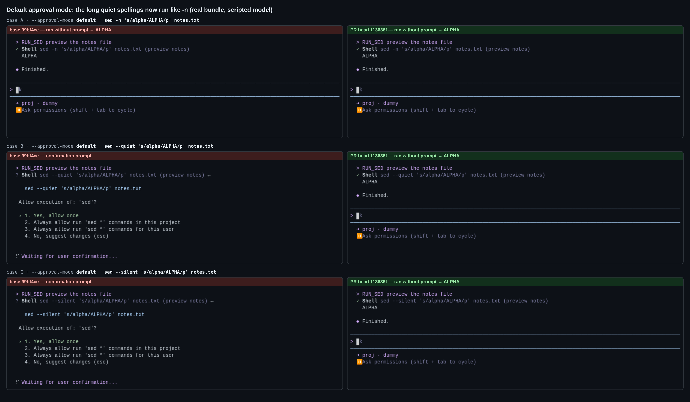
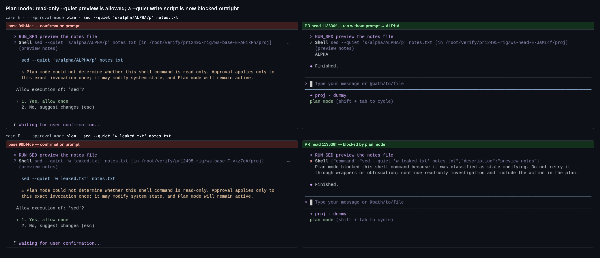
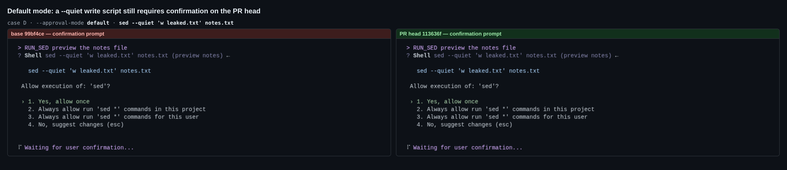
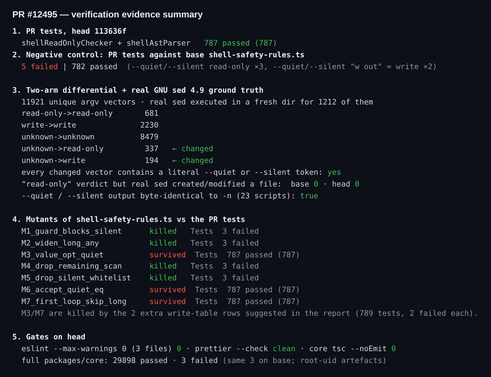

## Maintainer verification — PR #12495 @ `113636f`

**Verdict: ready to merge.** I found no defects. The production change deletes 2 lines and does exactly what the PR says: `--quiet` and `--silent` now classify the same as `-n`. Nothing that real GNU sed treats as a write gains auto-approval. There are two optional follow-ups below; neither blocks the merge.

### What I ran

Every check compares two arms that are identical apart from this PR:

- **head** — `113636f`, the PR as submitted.
- **base** — the merge-base `99bf4ce`: head's worktree with `shell-safety-rules.ts` and the two test files swapped back.

I built the real CLI bundle for each arm and confirmed the swap by grepping the bundle. The deleted guard regex `/^--(?!line-length(?:=|$))/` is present in base's `dist/chunks/*.js` and absent from head's.

#### 1. Real TUI, end to end

Setup:
- The real `dist/cli.js` from each arm, running under node-pty and xterm.js.
- A scripted fake OpenAI model that issues exactly one `run_shell_command` call.
- A throwaway `HOME`.
- A project containing only `notes.txt`.

| case | mode | command | base | head |
|---|---|---|---|---|
| A (control) | default | `sed -n 's/alpha/ALPHA/p' notes.txt` | runs → `ALPHA` | runs → `ALPHA` |
| B | default | `sed --quiet 's/alpha/ALPHA/p' notes.txt` | **confirmation prompt** | runs → `ALPHA` |
| C | default | `sed --silent 's/alpha/ALPHA/p' notes.txt` | **confirmation prompt** | runs → `ALPHA` |
| D | default | `sed --quiet 'w leaked.txt' notes.txt` | prompt | prompt (still) |
| E | plan | `sed --quiet 's/alpha/ALPHA/p' notes.txt` | prompt ("could not determine…") | runs → `ALPHA` |
| F | plan | `sed --quiet 'w leaked.txt' notes.txt` | approvable prompt | **blocked**: "classified as state-modifying" |

The model received the `tool` result that the table shows in every case. `leaked.txt` was never created and `notes.txt` never changed.

Case F is the one user-visible change beyond the prompt that the PR removes. In plan mode, a `--quiet` write script used to get a one-time approvable prompt; it is now rejected outright. This is the stricter and correct direction, and it is the `unknown → write` move that /review R1-1 flagged, now observed in the real UI.





#### 2. Differential fuzz against real GNU sed 4.9

I took 11,921 unique argument vectors (an exhaustive option×script grid plus seeded random compositions) and classified each one with both arms' `classifySedCommandSafety`. For the 1,212 vectors where either arm said `read-only` or the verdicts differed, I also ran real `sed` in a fresh directory and hashed every file before and after.

| transition | count |
|---|---|
| `read-only → read-only` | 681 |
| `write → write` | 2230 |
| `unknown → unknown` | 8479 |
| `unknown → read-only` | 337 |
| `unknown → write` | 194 |

- **Every changed vector contains a literal `--quiet` or `--silent` token.** No other option changes classification.
- **No vector gets a `read-only` verdict while real sed created or modified a file, on either arm: 0 on base and 0 on head.** The vectors included `e` commands, `s///e`, `w`/`W`, `w` inside `{}`, and newline-separated scripts.
- Of the 194 `unknown → write` vectors, real sed actually wrote a file in 183. Of the other 11, 9 are `w /dev/stdout`, which the classifier conservatively calls a write, and 2 are runs where sed exited on an argument error before writing. `write` is never auto-approved, so this is only the tighter verdict.
- For all 23 non-writing scripts I tried, real `sed --quiet` and `sed --silent` produced output byte-identical to `-n`. This confirms the alias the whitelist assumes.
- These stay `unknown` on both arms, which is the conservative outcome: the GNU abbreviations `--qui` and `--sil`, `--quiet=x` (real sed rejects it), `--QUIET`, `---quiet`, and `--quiet` combined with `--posix`, `--sandbox` or `--debug`.

#### 3. Unit tests, negative control, gates

- **Unit tests:** `shellReadOnlyChecker` + `shellAstParser` on head → **787/787**.
- **Negative control:** the PR's tests run against base's `shell-safety-rules.ts` → **5 failed / 782 passed**. The failures are exactly the new rows: the three `--quiet`/`--silent` read-only checks and the two `'w out' = write` pins.
- **Lint and types:** `eslint --max-warnings 0` on the 3 files → 0. `prettier --check` → clean. `tsc --noEmit` in `packages/core` → 0.
- **Full `packages/core` suite:** 29,898 passed, 3 failed. All 3 fail the same way on base. They are artefacts of running as root: `skill-curator` rename, `session-writer-lease` unreadable lock, and the `git-branches` wedged index.
- **CI:** when I wrote this, `Test (ubuntu-latest)` and `Lint & Static` on `113636f` were still pending.



#### 4. Mutants

I ran 7 mutants of `shell-safety-rules.ts` against the PR's tests. 4 were killed: re-adding the guard for `--silent` only, widening `SAFE_SED_OPTION` to any `--[a-z-]+`, dropping `--silent` from the whitelist, and dropping the residual-argument scan.

3 survived, and none of them can produce a false `read-only`:
- **M3** adds `--quiet` to `SED_VALUE_OPTIONS`. **M7** makes the in-place loop skip the argument after `--q*`/`--s*`. Both make `sed --quiet -i 's/a/b/' file` fall from `write` to `unknown`. That fails closed, but it would quietly turn plan mode's hard block into an approvable prompt. This is the gap /review round 4 deferred.
- **M6** accepts `--quiet=x`. Real sed rejects that option ("doesn't allow an argument"), so the mutant is harmless.

### Optional follow-ups (non-blocking)

1. **Two more rows in the tri-state write table** would kill M3 and M7. With them the suite is 789 tests, and each of those two mutants fails 2. The patch is in `harness/suggested-test.patch`, and `git apply --check` succeeds on head:
   ```diff
        "sed --silent 'w out' file",
   +    "sed --quiet -i 's/a/b/' file",
   +    "sed --silent --in-place 's/a/b/' file",
   ```
2. **This problem predates the PR and is out of scope:** a separate `-e SCRIPT FILE` still prompts on both arms. `sed -e 's/a/b/' file`, `sed -n -e 's/a/b/p' file` and `sed --quiet -e … file` all classify `unknown` end to end, and so does `sed --expression='s/a/b/' file`. At the `classifySedCommandSafety` level, `['-e','s/a/b/','file']` is `unknown` but `['-e','s/a/b/']` is `read-only`.

   Cause: the residual-argument scan joins the arguments that are left over, and that includes the `-e` token itself. The joined text becomes `-e file`, which matches `/(?:^|[^\\])[ewr]\s/`. The fix belongs in a follow-up issue. Probe output is in `data/e-probe.txt`.

Harness: `harness/` (`fuzz.mjs`, `e2e.mts`, compositors). Raw data: `data/` (fuzz report, E2E results, per-case screen text).
