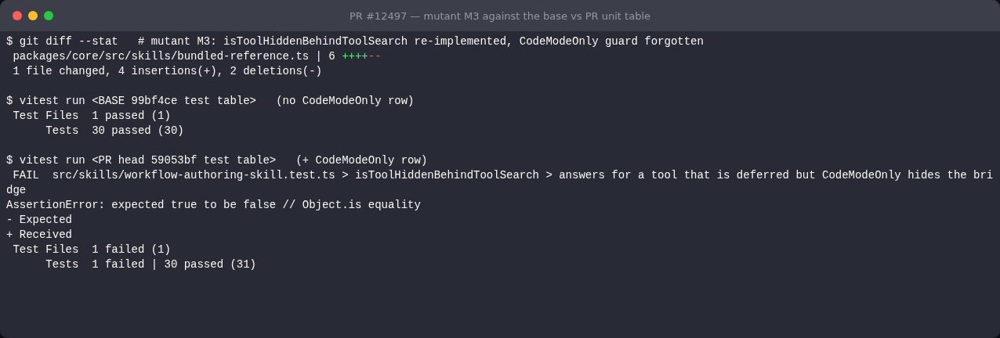
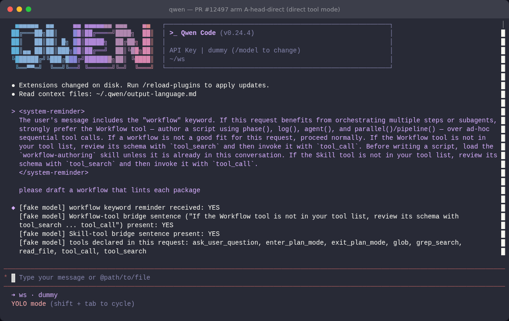
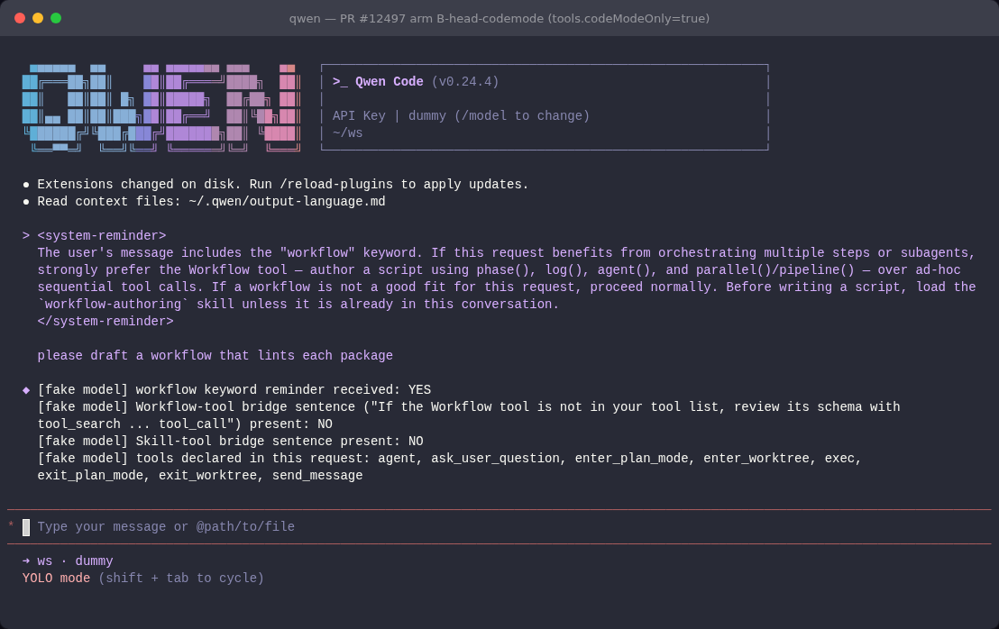
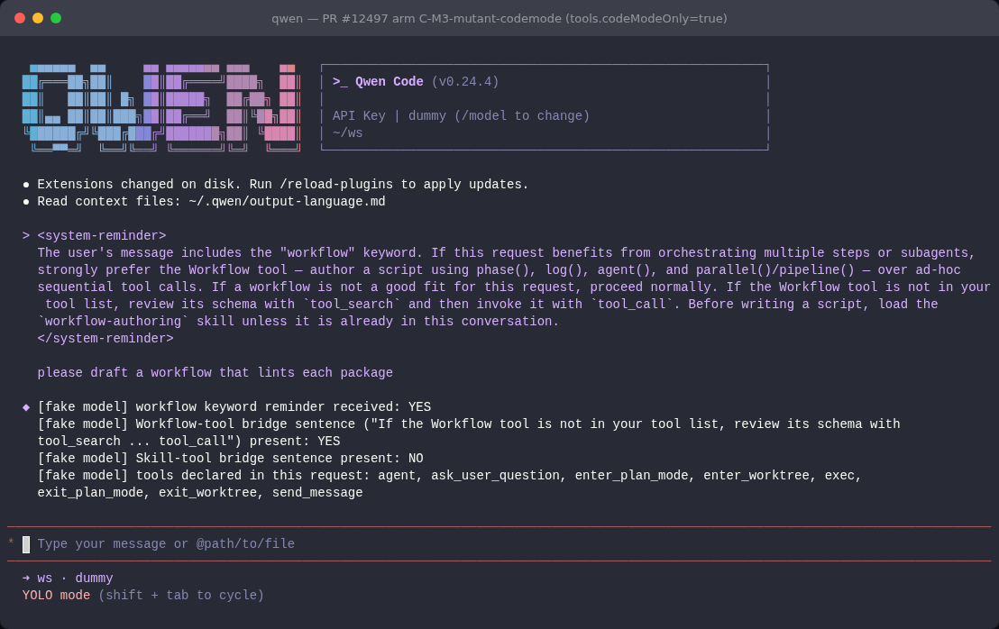

## 维护者验证：双臂变异对照 + 真实 TUI（head `59053bf`）

**结论：可以合入。** 这是一个 8 行的纯测试改动，新增的这一行确实有用。`isToolHiddenBehindToolSearch` 有两种现实的重构写法，`main` 的 core 单元表放行，这一行能抓住。其中一种放进真实 TUI 会重现 #12425 的症状：在 `tools.codeModeOnly` 下，提醒让模型去用 `tool_search`/`tool_call`，而这次请求里根本没有声明这两个工具。不过，`main` 上 cli 的 `workflow-keyword.test.ts` 已经能抓住同样的重构，所以本 PR 并没有填补仓库整体的覆盖缺口，带来的是定位能力：失败时直接指名这个函数。这和 PR 描述的说法一致。没有阻塞项。

### 环境

- 在 head `59053bf` 上建了一个 worktree。它的 merge base 就是当前 `main` @ `99bf4ce`，无需 rebase。依次跑了 `pnpm install --frozen-lockfile`、全量 `npm run build` 和 `npm run bundle`，全部 exit 0。
- **base 臂**：PR diff 只改了 `workflow-authoring-skill.test.ts`。所以我把 `main` 版本的这个文件放在 PR 版本旁边，两份针对同一份（变异后的）源码一起跑。这样拿到的就是精确的 base 测试面，其他条件完全相同。
- **真实 TUI**：打包后的 `dist/cli.js` 在 node-pty 下运行，终端是 headless Chromium 里的 xterm.js（用仓库自带的 `integration-tests/terminal-capture`），模型端接仓库自带的脚本化假 OpenAI 服务。`HOME` 做了隔离。设置为 `tools.workflowsEnabled: true` 和 `tools.eager: ["read_file"]`（这会让 `workflow` 和 `skill` 都被延迟加载），标注的臂另外打开 `tools.codeModeOnly`。输入的提示是 `please draft a workflow that lints each package`。假模型会**原样回报它收到的内容**：有没有 workflow 关键词提醒、两句桥接语各自在不在、请求声明了哪些工具。原始请求体保存在 `data/` 下。

### 复核 PR 的说法

| 说法 | 实测 |
|---|---|
| `workflow-authoring-skill` + `bundled-reference` → 35 passed | 31 + 4 = **35 passed** ✅ |
| cli `workflow-keyword` → 29 passed | **29 passed** ✅ |
| 注释掉 guard → `3 failed \| 28 passed` | 即下表 M1：**3 failed / 31** ✅（包含新增行） |
| eslint `--max-warnings 0`、`tsc --noEmit` | 均 exit 0；`prettier --check` 也干净 ✅ |

`/review` 报的 `src/skills/workflow-authoring-skill.test.ts — no such file or directory`，原因是机器人运行时的工作目录不对：这个路径是相对 `packages/core` 的。PR 本身没有问题。

### 双臂变异矩阵（`packages/core/src/skills/bundled-reference.ts`）

| # | 变异 | core 表 **base** | core 表 **PR** | `bundled-reference.test` | cli `workflow-keyword.test` |
|---|---|---|---|---|---|
| M0 | 对照（未变异） | 30 通过 | 31 通过 | 4 通过 | 29 通过 |
| M1 | 删掉共享 helper 里的 CodeModeOnly guard（即 PR 自己的 RED 检查） | 失败 2 | 失败 3 | 通过 | 失败 1 |
| **M2** | 把 guard 从共享 helper 挪到 Skill 路由调用点 | **通过** | **失败 1** | 通过 | 失败 1 |
| **M3** | 不经 helper 重写 `isToolHiddenBehindToolSearch`，漏掉 guard | **通过** | **失败 1** | 通过 | 失败 1 |
| M4 | guard 只留在 `isToolHiddenBehindToolSearch`，Skill 路由失去 guard | 失败 2 | 失败 2 | 通过 | 通过 |
| M5 | guard 只在 ToolSearch 揭示之后才生效 | 失败 2 | 失败 3 | 通过 | 失败 1 |
| B1 | 等价改写：guard 挪到 `isPermissionDeferred` 判断之后 | 通过 | 通过 | 通过 | 通过 |
| B2 | 等价改写：guard 在 `isToolHiddenBehindToolSearch` 里重复一份 | 通过 | 通过 | 通过 | 通过 |
| B3 | 在真实 `Config` 上等价：guard 改写成 `config.getCodeModeOnly?.()` | 失败 2 | 失败 3 | 通过 | 失败 1 |

新增行只在「base 通过、PR 失败」的地方有价值，也就是 **M2 和 M3**。两者都是把 helper 的两个调用方拆开的重构。`main` 的 core 表放行它们，是因为它的 `resolveWorkflowAuthoringSurface` CodeModeOnly 行只走 Skill 路由。M2 和 M3 在 `main` 上也会被 cli 套件抓住，这就是上面说的定位价值。没有任何等价改写只被新增行单独判红，所以这一行不脆。B3 见备注 1。

### 真实 TUI：模型实际收到了什么

| 臂 | 构建 | 工具模式 | 提醒里有没有 Workflow 桥接语 | 是否声明 `tool_search` / `tool_call` |
|---|---|---|---|---|
| A | PR head | direct | **有** | 有 |
| B | PR head | `codeModeOnly` | **无** | 无（只有 `exec`、`agent` 等） |
| C | PR head + **变异 M3** | `codeModeOnly` | **有**：是死路 | **无** |
| B′ | PR head，源码还原并重新构建后 | `codeModeOnly` | 无 | 无 |

C 臂就是这一行现在能在单元层面抓住的回归。它能通过 `main` 的 core 表（30/30），放进真实 CLI 后却让模型去调两个请求里没有声明的工具。B′ 臂确认写报告之前树已经还原（`git status` 干净）。

**A：direct 模式。** 桥接语在这里是对的，因为 `tool_search`/`tool_call` 已声明。

**B：PR head 下的 CodeModeOnly。** 没有桥接语。

**C：CodeModeOnly + 变异 M3。** 死路桥接语又出现了。

### 备注（非阻塞）

1. **桩的保真度（本 PR 之前就有）。** core 和 cli 的 `stubConfig` 两个桩都只模拟了 `getToolMode()`。假如有人把 guard 改写成 `config.getCodeModeOnly?.()`（即 B3），在真实 `Config` 上语义完全相同，却会让两臂的 core 表和 cli 套件都失败。这是误报：桩上没有 `getCodeModeOnly`，guard 永远不会触发。新增行和其他所有 CodeModeOnly 行一样继承了这个问题。如果愿意，可以在两个桩里补上 `getCodeModeOnly: () => toolMode === ToolMode.CodeModeOnly` 来消除它，这是可选的。
2. **超出本 PR 范围，`main` 上也一样。** 从 TUI 截图可以看到，workflow 关键词的 `<system-reminder>` 出现在用户自己的历史消息里。`AppContainer.tsx` 把前缀拼到了 `submittedValue` 上（约第 3204 行），历史条目渲染的正是这个字符串。它和本次改动无关，因为上面每张截图里都看得到，所以在这里记一笔。

