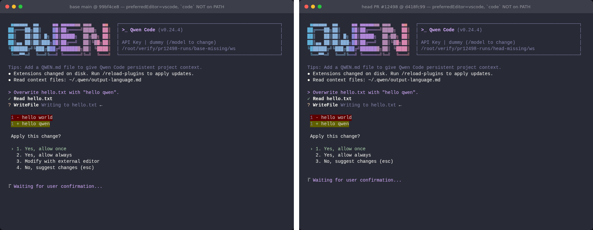
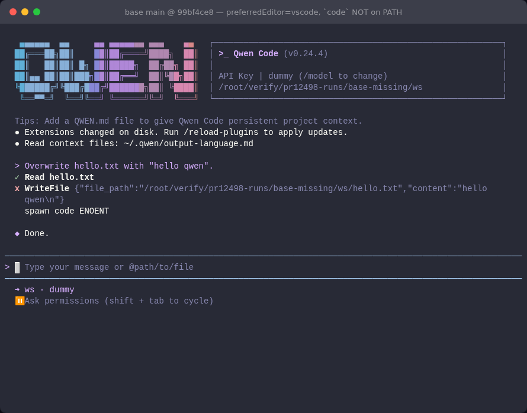
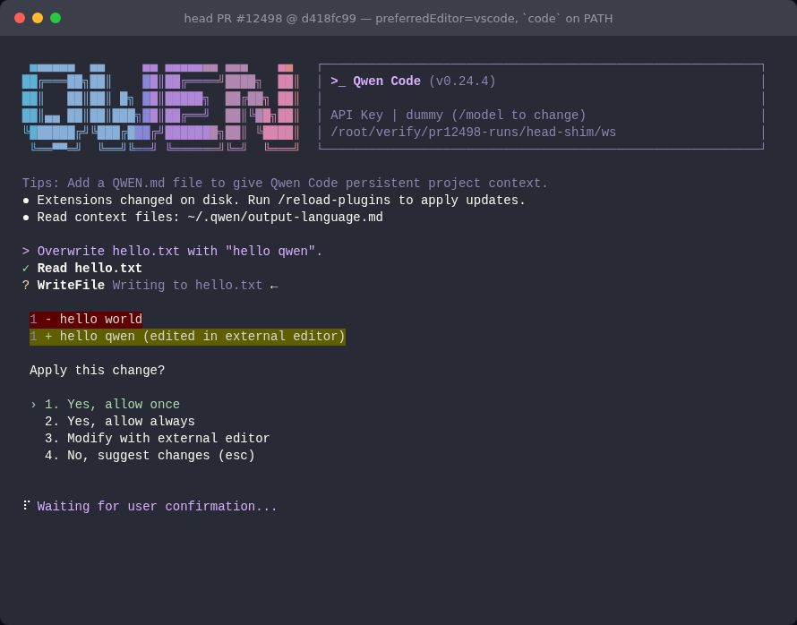
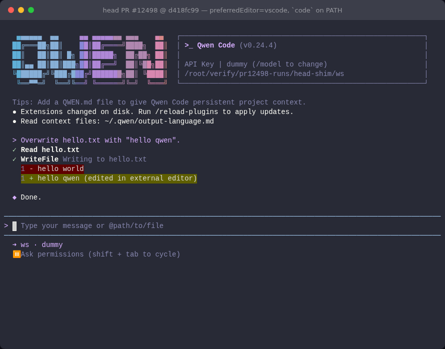
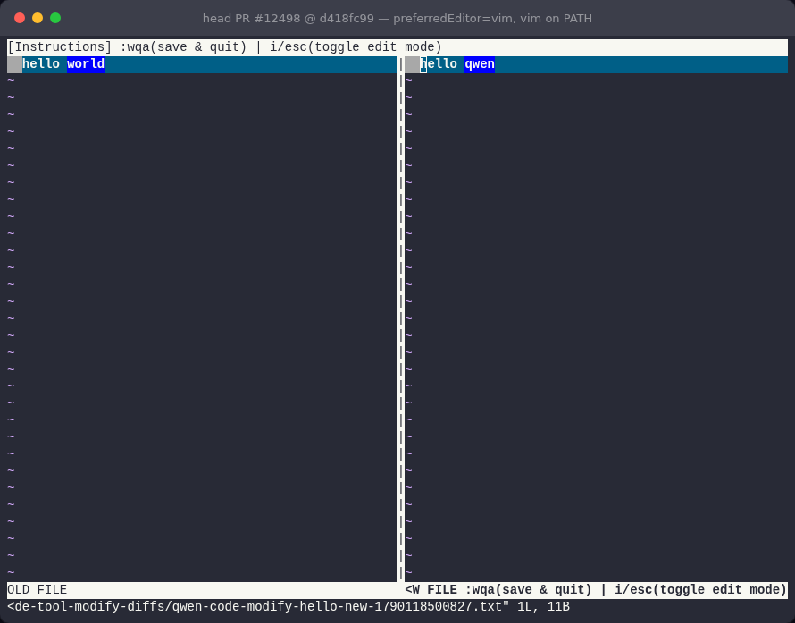

## Maintainer verification — real TUI, `main` vs this PR (head `d418fc99`)

**Verdict: ready to merge.** I rebuilt both arms locally and drove the real Ink TUI. With an editor that isn't installed, `main` offers "Modify with external editor" and choosing it fails the write with `spawn code ENOENT`. This PR hides the option in that case and keeps it, working end to end, when the editor exists. I found no blocking issues. The notes at the end are non-blocking.

### Setup

- Two worktrees: **base** = `main` @ `99bf4ce8` (the PR's merge base) and **head** = `d418fc99`. Each ran `npm run build && npm run bundle` (exit 0), then `node dist/cli.js`. The unbundled `ToolConfirmationMessage.js` contains `isEditorAvailable` in head (3 hits) and not in base (0), so the two arms really differ.
- The TUI ran under node-pty inside headless-Chromium xterm.js (the repo's `integration-tests/terminal-capture`). The model was the repo's scripted fake OpenAI server: `read_file hello.txt`, then `write_file hello.txt → "hello qwen"`. `tools.approvalMode: default`, the folder was trusted, and `HOME` was isolated.
- Each run had a controlled `PATH=<run>/bin:/usr/bin:/bin`. `code` is absent from this host. For the "editor present" cases, `<run>/bin/code` is a stub. It records its argv and, like a user, writes `hello qwen (edited in external editor)` into the right-hand (proposed) file of `code --wait --diff <old> <new>`.

### End-to-end matrix (same fake model, same keystrokes; only the build differs)

| Configuration | base (`main`) options | head (PR) options | What happens |
|---|---|---|---|
| `preferredEditor: vscode`, `code` **not** on PATH | 4, incl. **Modify with external editor** | **3** (Modify hidden) | base: choosing it fails the tool call with `spawn code ENOENT` |
| `preferredEditor: vscode`, `code` on PATH (stub) | 4 | 4 | both: stub invoked once with `--wait --diff`; dialog returns with the edited diff; accept → file = `hello qwen (edited in external editor)` |
| `preferredEditor: vim` (on PATH) | – | 4 | head: choosing Modify opens the real `vim -d` OLD/NEW split |
| `preferredEditor: vscode`, `code` on PATH, `SANDBOX` set | 4 (stub launched) | **3** | intended change; see note 1 |
| `preferredEditor` unset | 3 | 3 | unchanged |
| hot-swap `vscode`(missing) → `vim` in `settings.json` while dialog open | 4 → 4 | 3 → 3 in the open dialog; **4 in the next dialog** | see note 2 |

**Missing editor: base (left) vs head (right)**

**base: choosing "Modify with external editor" with no `code` binary**

**head: the feature still works when the editor exists** (stub `code` edited the proposal; accepting writes it)

**head: `preferredEditor: vim` still offers Modify and opens the real vim diff**

**`SANDBOX` set with a GUI editor: base (left) offers it; head (right) hides it**

### Probe cost (strace on the real process)

I ran `strace -f -e execve` over the whole session in the missing-editor configuration. The dialog was opened, then the cursor was moved 12 times to force re-renders.

| Phase | base `command -v` execs | head `command -v` execs |
|---|---|---|
| startup (already on `main`: all 10 editor candidates) | 10 | 10 |
| prompt → dialog on screen | 0 | **1** (`code`) |
| 12 cursor moves with the dialog open | 0 | **0** |
| dismiss | 0 | 0 |

That is exactly one probe per dialog, and the memo holds across re-renders. On this host one `command -v` averages **1.2 ms** (50 runs), so the synchronous probe on the render path is negligible on Linux. I did not measure `where.exe` on Windows.

### Unit tests and mutation check

- `ToolConfirmationMessage.test.tsx` on head: **50/50**. Neighbouring suites (`ui/components/messages/` + `EditorSettingsDialog`): **402 passed, 1 skipped**. CI: 14 pass, the rest skipped.
- Base source + the PR's tests: **3 failed / 47 passed**. The new tests don't pass without the fix.
- Hand mutants on the new gate, each run against the PR's test file. **8 of 9 killed**:

| Mutant | Result |
|---|---|
| M1 gate back to `preferredEditor` | killed (`should NOT show … unavailable`) |
| M2 drop `useMemo` | killed (`probes … once for the dialog lifetime`) |
| M3 drop `!compactMode` | killed (`should NOT probe … compactMode`) |
| M4 drop `type === 'edit'` guard | killed (`should NOT probe … non-edit confirmation`) |
| M5 drop `!hideModify` guard | killed (`… hideModify is true`) |
| M7 drop `preferredEditor !== undefined` | killed (`… preferredEditor is not set`) |
| M8 `getEditorExecutable` instead of `isEditorAvailable` (skip the sandbox rule) | killed (2 tests) |
| M6 empty memo deps `[]` | **survives**: not observable in the TUI, see note 2 |

### Notes (non-blocking)

1. **Sandbox is a deliberate behavior change.** With `SANDBOX` set and a GUI editor configured, the option disappears, even though `main` would have launched a `code` found on PATH. This matches every other editor surface: `usePreferredEditor`, `useEditorSettings`, `EditorSettingsDialog` and the OpenTUI editor dialog all apply `allowEditorTypeInSandbox`. The PR's Risk section already says this. I simulated the sandbox with the env var only, not a real container.
2. **An open dialog doesn't react to a settings hot reload, on either arm.** `SettingsWatcher` does reload `settings.json`, because the *next* dialog shows the new editor. The open dialog keeps its option list, even after cursor moves, because those re-render only `RadioButtonSelect` and not `ToolConfirmationMessage`. `main` behaves the same way, so this is not a regression. It also explains why M6 (empty deps) is unobservable. A future refactor that re-renders the parent on settings change would be pinned only by the existing deps array.
3. Not verified here: macOS (Zed app-bundle fallback), Windows (`code.cmd`/`where.exe` latency), a real Docker/seatbelt sandbox, and the IDE-mode diffing path, which is unchanged because the gate only replaces the last conjunct.

Evidence (screenshots, per-run `result.json`/screen text, strace extracts, harness, mutants): this directory

中文版

## 维护者验证：真实 TUI，`main` 与本 PR（head `d418fc99`）对比

**结论：可以合并。** 我在本地重建了两个构建，并驱动真实的 Ink TUI 验证。配置的编辑器未安装时，`main` 仍提供 "Modify with external editor"，选中后写入以 `spawn code ENOENT` 失败。本 PR 在这种情况下隐藏该选项；编辑器存在时，该选项保留，整条流程也能跑通。未发现阻塞问题，文末各条均不阻塞合并。

### 环境

- 两个 worktree：**base** = `main` @ `99bf4ce8`（PR 的合并基），**head** = `d418fc99`。各自执行 `npm run build && npm run bundle`（exit 0），再运行 `node dist/cli.js`。未打包的 `ToolConfirmationMessage.js` 中，head 含 `isEditorAvailable`（3 处），base 不含（0 处），确认两个构建确实不同。
- TUI 由仓库自带的 `integration-tests/terminal-capture` 驱动（node-pty + 无头 Chromium xterm.js）。模型使用仓库的脚本化假 OpenAI 服务：先 `read_file hello.txt`，再 `write_file hello.txt → "hello qwen"`。`tools.approvalMode: default`，目录已信任，`HOME` 隔离。
- 每次运行都使用受控 `PATH=<run>/bin:/usr/bin:/bin`。本机没有 `code`。"编辑器存在"的场景里，`<run>/bin/code` 是一个桩：它记录 argv，并像用户一样把 `hello qwen (edited in external editor)` 写入 `code --wait --diff <old> <new>` 的右侧（提议）文件。

### 端到端矩阵（假模型与按键完全相同，只换构建）

| 配置 | base（`main`）选项 | head（PR）选项 | 现象 |
|---|---|---|---|
| `preferredEditor: vscode`，PATH 上**没有** `code` | 4 项，含 **Modify with external editor** | **3 项**（Modify 被隐藏） | base：选中后工具调用以 `spawn code ENOENT` 失败 |
| `preferredEditor: vscode`，PATH 上有 `code`（桩） | 4 | 4 | 两边都以 `--wait --diff` 调用桩一次，弹窗带着编辑后的 diff 回来；接受后文件内容为 `hello qwen (edited in external editor)` |
| `preferredEditor: vim`（PATH 上有） | – | 4 | head：选中 Modify 打开真实的 `vim -d` 左右分屏 |
| `preferredEditor: vscode`，PATH 上有 `code`，设置了 `SANDBOX` | 4（桩被启动） | **3** | 有意为之，见说明 1 |
| 未设置 `preferredEditor` | 3 | 3 | 无变化 |
| 弹窗打开时在 `settings.json` 中把 `vscode`（缺失）热切换为 `vim` | 4 → 4 | 已打开的弹窗 3 → 3；**下一个弹窗 4 项** | 见说明 2 |

截图见英文部分（依次为：缺失编辑器 base/head 对比、base 选中后 ENOENT、head 桩编辑与接受、head vim diff、SANDBOX 对比）。

### 探测开销（对真实进程做 strace）

在缺失编辑器的配置下，对整个会话执行 `strace -f -e execve`。弹窗打开后，移动光标 12 次以强制重渲染。

| 阶段 | base `command -v` 次数 | head `command -v` 次数 |
|---|---|---|
| 启动（`main` 已有：10 个编辑器候选） | 10 | 10 |
| 发出提示 → 弹窗上屏 | 0 | **1**（`code`） |
| 弹窗打开期间移动光标 12 次 | 0 | **0** |
| 关闭 | 0 | 0 |

即每个弹窗恰好探测一次，memo 在重渲染中保持有效。本机单次 `command -v` 平均 **1.2 ms**（50 次），Linux 上渲染路径中的同步探测可以忽略。Windows 的 `where.exe` 耗时未测。

### 单测与变异

- head 上 `ToolConfirmationMessage.test.tsx` **50/50**。相邻套件（`ui/components/messages/` + `EditorSettingsDialog`）**402 通过，1 跳过**。CI：14 项通过，其余跳过。
- base 源码配本 PR 的测试：**3 失败 / 47 通过**。没有修复时新测试不会通过。
- 针对新判定的手工变异，逐个配本 PR 的测试文件运行，**9 个中杀死 8 个**：M1 判定条件回退为 `preferredEditor`、M2 去掉 `useMemo`、M3 去掉 `!compactMode`、M4 去掉 `type === 'edit'`、M5 去掉 `!hideModify`、M7 去掉 `!== undefined`、M8 用 `getEditorExecutable` 绕过 sandbox 规则，全部被杀。**M6（memo 依赖数组置空）存活**，但在 TUI 中无法观察到，见说明 2。

### 说明（均不阻塞）

1. **Sandbox 下的行为变化是有意的。** 设置了 `SANDBOX` 且配置的是 GUI 编辑器时，该选项会消失，即使 `main` 会启动 PATH 上找到的 `code`。这与其他所有编辑器入口一致：`usePreferredEditor`、`useEditorSettings`、`EditorSettingsDialog` 和 OpenTUI 编辑器弹窗都应用了 `allowEditorTypeInSandbox`。PR 的 Risk 部分已写明这一点。本次仅用环境变量模拟 sandbox，没有在真实容器中验证。
2. **已打开的弹窗不响应 settings 热重载，两个构建都是如此。** `SettingsWatcher` 确实会重新加载 `settings.json`，因为*下一个*弹窗显示了新的编辑器。但已打开的弹窗即使移动光标，选项列表也保持不变，因为光标移动只重渲染 `RadioButtonSelect`，不重渲染 `ToolConfirmationMessage`。`main` 表现相同，所以不是回归，这也解释了 M6 为何无法观察到。如果将来重构为 settings 变化时重渲染父组件，只有现有的依赖数组能保证正确性。
3. 本次未验证：macOS（Zed app bundle 回退）、Windows（`code.cmd`/`where.exe` 延迟）、真实 Docker/seatbelt sandbox、IDE 模式 diff 路径。IDE 路径不受影响，因为本 PR 只替换了最后一个合取条件。

证据（截图、每次运行的 `result.json` 与屏幕文本、strace 摘录、测试脚本、变异体）：this directory

