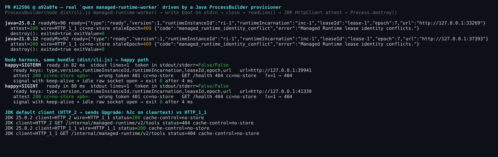
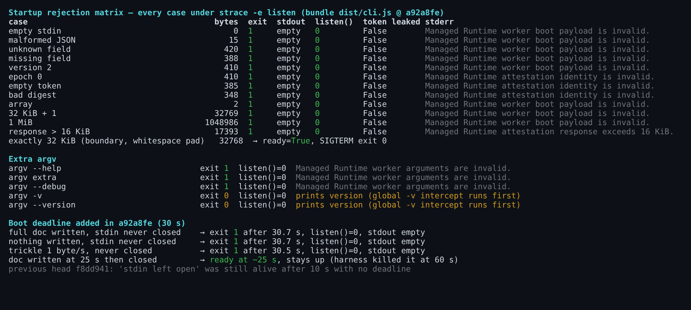
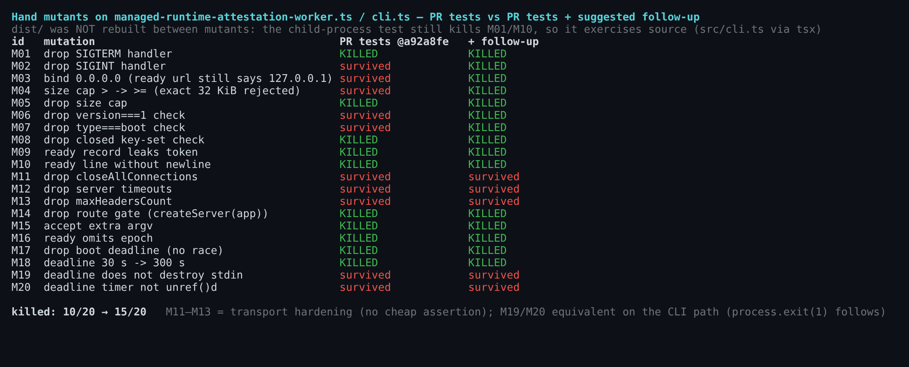
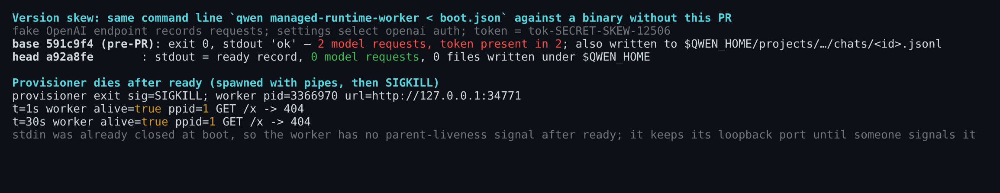

## Maintainer verification — PR #12506 @ `a92a8fe` (real process, Linux x86_64)

**Verdict: mergeable. No blockers.** Every behaviour the PR claims holds on the shipped bundle (`dist/cli.js`), on the package entry (`packages/cli/dist/index.js`), and under a Java `ProcessBuilder` provisioner on JDK 21 and JDK 25. The boot deadline added in `a92a8fe` works as described. Below: one optional test patch, and three protocol points worth settling in this PR or the Java client PR before the boot protocol is frozen.

The head moved from `f8dd941` to `a92a8fe` while I was verifying (`range-diff`: the first commit is `=`, and the second adds only the deadline). I rebuilt and re-ran everything on `a92a8fe`. Where a number comes from `f8dd941`, it says so.

### What was run

| Check | Result |
|---|---|
| Install, then `npm run build && npm run bundle` | exit 0 (3m45s) |
| Focused suites: worker, contract, `cli.test.ts` | **136/136** (author: 136) |
| `tsc --noEmit` (cli) / eslint `--max-warnings 0` / prettier on changed files | 0 / 0 / clean |
| Real-process E2E through the bundle: 21 cases (fig 1, fig 2) | all as claimed |
| Same 21 cases through `packages/cli/dist/index.js` | identical to the bundle |
| Same 21 cases on the old head `f8dd941` | identical (the harness's 10 s stall probe is shorter than the new 30 s deadline; the deadline is measured separately below) |
| Java `ProcessBuilder` provisioner, JDK 25.0.2 and Temurin 21.0.12 | ready ~90 ms → attest 200 → stale epoch 409 → `destroy()` exit 0 |
| Ordinary CLI A/B against base `591c9f4` (`--help`, `-v`, `mcp --help`, `serve --help`, `channel --help`) | byte-identical; the hidden command is not listed |
| Hand mutants (20) | 10/20 killed → 15/20 with the optional patch (fig 3) |

- The ready record is exactly `type, version, runtimeInstanceId, runtimeIncarnation, leaseId, epoch, url`. It is one line on stdout, and the token does not appear on stdout or stderr in any case.
- Attestation returns 200 with `Cache-Control: no-store`, and there is no `X-Powered-By`. A wrong token gets 401. `GET /health` and `?x=1` get 404 with `no-store`. JDK `GET …/v2/tools` gets 404 (JDK probe run on `f8dd941`).
- The JDK default client (HTTP_2) sends `Upgrade: h2c` on cleartext. The worker answers over HTTP/1.1 with 200, so the Java client needs no version pin (probe on `f8dd941`; the `a92a8fe` provisioner run also used the default client and got `wire=HTTP_1_1`, 200).
- `SIGTERM` or `SIGINT` with a keep-alive connection and an idle raw socket open exits with code 0 within 4 ms. `closeAllConnections()` does its job.
- Footprint at `a92a8fe`: the worker opens 19 bundle JS files, 1.82 MB of the 54.7 MB `chunks/` set. The largest is the express/body-parser/iconv-lite chunk. It contains no `GeminiClient`, `ToolRegistry` or `class Config`. RSS is ~72.8 MB, and it writes **0 files** under `$QWEN_HOME`. The claim "does not load the ordinary CLI stack" holds.

- Each of the 12 bad-boot cases exits 1 with empty stdout. `strace -e listen` shows **zero `listen()` syscalls**, so "fails before a usable listener is published" holds at the syscall level, not just at the API.
- A body of exactly 32 768 bytes (whitespace-padded) is accepted, and 32 769 bytes is rejected. An identity whose response would exceed 16 KiB also fails before listen.
- **`a92a8fe` deadline:** I tried three stall shapes: document written but stdin never closed, nothing written, and a 1 byte/s trickle. Each exits 1 at 30.5–30.7 s with no `listen()`. A document closed at 25 s still becomes ready. On `f8dd941` the same stall was still alive after 10 s. The triage's finding 2 is closed.
- **Triage finding 1 does not hold, which confirms the author's reply.** I mutated the source without rebuilding `dist/`. The child-process test still killed **M01** (SIGTERM handler removed) and **M10** (no trailing newline on the ready line). That test therefore runs `src/cli.ts` through tsx, not `dist`.

### Optional: test-only patch (+76/−33, one file)

The most important survivor is **M03**: `listen(0, '0.0.0.0')` passes every test, because the ready URL is a hard-coded `127.0.0.1` string, not derived from `server.address()`. "Binds only to loopback" is the security property of this slice, and nothing pins it. The patch adds four things:

- a probe to `127.0.0.2:<port>` that must not connect (skipped on darwin, where 127.0.0.2 is not configured by default);
- `it.each` over SIGTERM/SIGINT for the child-process test;
- an exact-32 KiB acceptance case;
- wrong `version` and wrong `type` boot cases.

With the patch: 13/13 tests, stable 3×, eslint clean, and 15/20 mutants killed. The survivors are M11–M13 (connection and timeout hardening, with no cheap assertion) and M19/M20. M19/M20 are equivalent on the CLI path, because `handleCriticalError` calls `process.exit(1)`.

followup-tests-a92a.patch

See [`pr-12506/followup-tests-a92a.patch`](followup-tests-a92a.patch). It applies on `a92a8fe`.

### Protocol points for the Java provisioner (non-blocking, better decided before the protocol freezes)

1. **Version skew sends the token to the model provider.** I ran the identical command line `qwen managed-runtime-worker < boot.json` against a binary without this PR (base `591c9f4`). It treats `managed-runtime-worker` plus stdin as a prompt. It made **2 requests to the configured OpenAI-compatible endpoint, with the bearer token in the user message**, wrote the token into `$QWEN_HOME/projects/…/chats/<id>.jsonl`, printed `ok`, and exited 0. Any `qwen` build without this command behaves the same way (tested: base `591c9f4`). The provisioner therefore has to confirm the binary speaks this protocol *before* writing the credential. Two options: a pinned version check, or having the worker print a token-free `{"type":"hello",…}` line before it reads stdin, so the Broker only writes the boot document after seeing it.
2. **No parent-liveness signal after ready.** I spawned the worker with pipes and then SIGKILLed the provisioner. The worker was re-parented to PID 1 and was still serving its loopback port 30 s later. The boot protocol consumes stdin to EOF, so stdin cannot serve as a lifeline. One option is a newline-framed boot document with stdin kept open afterwards, where EOF means the parent is gone and the worker shuts down (this also works on Windows). The other is to make reaping an explicit Broker responsibility in the design doc. The triage raised the pre-ready half of this, and `a92a8fe` fixed that half. The post-ready half remains.
3. **Small points.**
   - `managed-runtime-worker -v` and `--version` print the version and exit 0, because the global version intercept runs first. That contradicts "any extra CLI argument fails", but it is harmless if the Java side rejects any first stdout line that is not a `ready` record.
   - Every startup failure is exit 1 with the generic `An unexpected critical error occurred:` and a stack trace. The Broker cannot tell protocol errors from identity errors except by parsing stderr. That is fine for now, but worth a distinct exit code if the Broker is to classify failures.

### CI

`Test (ubuntu-latest, Node 22.x)` is red on `a92a8fe`, and `Lint & Static` was red on `f8dd941`. Both failures are runner infrastructure (`ecs-qwen-hk4-19`, `fatal: detected dubious ownership`, inside the "Verify checkout includes expected head commit" step). No test ran. They need a re-run, not a code change. The local run above covers the same suites.

Evidence (figures, harness, raw JSONL, mutant summaries, patch): [`wenshao/qwen-code@asserts:pr-12506/`](.)
