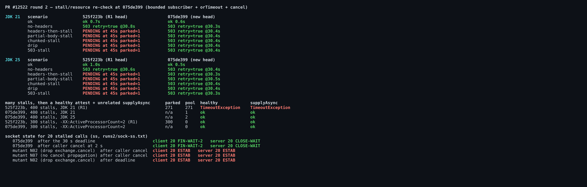
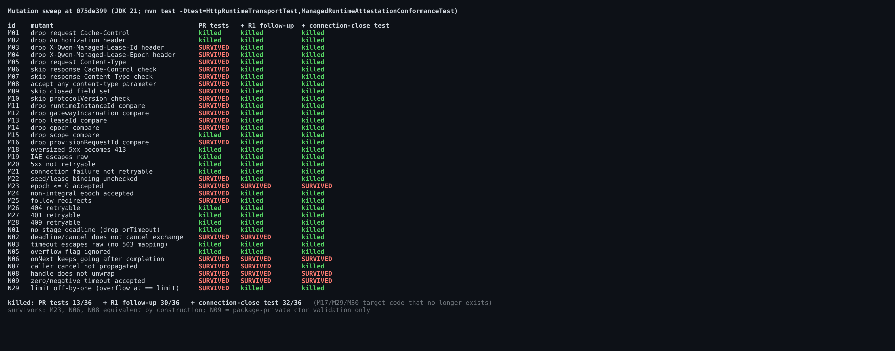

## Maintainer verification, round 2 (delta) — PR #12522 @ `075de399`

**Verdict: B1 is fixed and I measured it. Mergeable from my side.** One non-blocking recommendation, before or right after merge: none of the exchange-cancel lines has a test that would fail if it were removed, and the R1 test gaps are still open. A test-only patch below closes both.

This round covers only what changed since [round 1](https://github.com/QwenLM/qwen-code/pull/12522#issuecomment-5791002379) at `525f223b`. The two new commits touch only `HttpRuntimeTransport.java` and its test. The worker, fixtures and docs are unchanged, so the round-1 bundle is still the right worker to test against.

### B1 (stalled body) — fixed

- **Every stall now fails the same way.** I re-ran the same raw-socket probe on JDK 21 and 25. All 6 stall scenarios end with a retryable `503 managed_runtime_unavailable` at 30.3–30.5 s: no headers, headers only, partial body, partial chunked body, drip, and a truncated 503. The healthy control still succeeds in 0.5–0.6 s. At `525f223b` five of the six were still pending at 45 s.
- **The common pool is unaffected.** After 400 stalls, the common pool stays at 1 thread on JDK 21 and 2 on JDK 25; at R1 it was 271. A healthy attest and an unrelated `supplyAsync` both complete afterwards. With `-XX:ActiveProcessorCount=2`, 300 stalls leave the pool at 0 threads and both follow-up calls succeed; at R1 that setting leaked 300 threads.
- **The connection really closes.** 20 stalled calls after the deadline, and 20 calls cancelled by the caller at 2 s, both end with client `FIN-WAIT-2` and server `CLOSE-WAIT`. So yiliang114's P3 (caller cancel) is fixed as well.
- **Real worker E2E is unchanged.** The worker from the bundle against the new classes passes 15/15 on JDK 21 and 25. Keep-alive reuse at 0–1500 ms gaps is 70/70 OK.
- **Module tests and CI pass.** `mvn test checkstyle:check` passes 74/74 on JDK 21 and on JDK 25, with Checkstyle clean. Every CI job that has run passed; `review-pr` was still pending when I checked.

The implementation matches the shape I suggested in R1: a bounded push subscriber, a deadline mapped to the existing retryable 503, and `exchange.cancel(true)`. It is also better on one point: `orTimeout` removes its timer when the stage completes, so no delayed task is left behind.

### Recommendation — the exchange-cancel lines are not tested

Two mutants keep the PR's suite green:
- **N02** deletes `exchange.cancel(true)`, the exchange cancel that both fix commits rely on. All 20 connections then stay `ESTAB`, both after the deadline and after a caller cancel.
- **N07** undoes exactly what `075de399` added, the caller-cancel propagation. All 20 connections then stay `ESTAB` after a caller cancel.

See the last rows of the first figure. The PR's stall test only asserts `pending.cancel(true)` and `pending.isCancelled()`. Both hold for any `CompletableFuture` that is still pending, whether or not the cancel is propagated.

**The R1 gaps are also still open.** At this head the PR's tests kill 13 of the 36 mutants that still apply. The survivors include:
- M03/M04: dropping the lease headers makes the real worker return 409 on every otherwise-valid call.
- M11/M12: dropping the two client-only identity checks lets the real worker's proof for another runtime or incarnation be accepted.
- The response strictness checks and the exact-16 KiB boundary (N29).

**Patch:** [`followup-tests-075de399.patch`](patches/followup-tests-075de399.patch). It is test-only, +245/−1, and `git apply` applies it cleanly at `075de399`.
- It contains the 8 R1 follow-up tests unchanged; they pass as-is at this head.
- It adds one new test, `closesTheConnectionOnTheDeadlineAndOnCallerCancel`. The server drips one byte every 25 ms and records when a write fails. The test asserts that the client closes the connection within 2 s, once after a 300 ms deadline and once after a caller cancel.
- Results: 83/83, Checkstyle clean, 5/5 repeated runs green, and the sweep goes from **13/36 to 32/36**, with N02 and N07 killed.
- The 4 survivors:
  - M23 (epoch 0) is equivalent, because the `RuntimeAttestation` constructor also rejects it.
  - N06 is equivalent: without the `body.isDone()` guard, a late `onNext` copies 0 bytes, and the second `complete` does nothing.
  - N08 is equivalent: `handle` runs directly on `result`, so the error it receives is never a `CompletionException`.
  - N09 only affects validation in the package-private constructor.

### Nit
- The Javadoc on `BoundedBodySubscriber` says it completes the body future "so the request timeout still covers the exchange". That is misleading. `HttpRequest.timeout` still stops at the response headers; what bounds the body is `orTimeout` on the stage. Evidence at this head:
  - Deleting `orTimeout` (N01) makes the PR's own stall test fail.
  - Every body-stall failure in the probe has cause `TimeoutException`, which comes from `orTimeout`. The only `HttpTimeoutException` is the no-headers case.
  - @chiga0's approval repeats the same statement ("REQUEST_TIMEOUT covers the full exchange including body reception"). The fix is correct; only that explanation is off.

  Suggested wording: "…so the stage deadline (`orTimeout`), not the request timeout, bounds the body."

Evidence (probe logs, `ss` output, mutation results, patch): this directory
