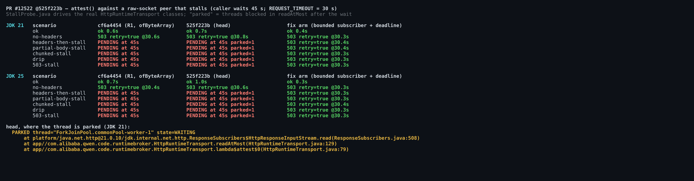
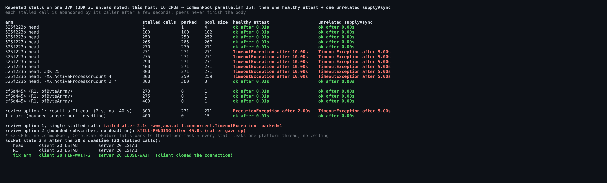
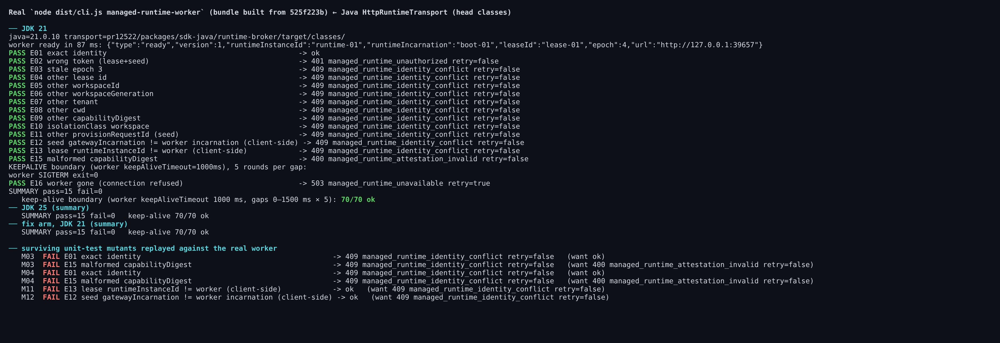
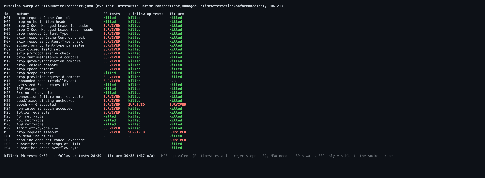

## Maintainer verification — PR #12522 @ `525f223b` (local build, real worker, JDK 21/25)

**Verdict: not mergeable as is. One blocker, confirmed by execution.** A stalled response body leaves `attest()` pending forever. At this head, each stall also parks a `ForkJoinPool.commonPool` thread for as long as the peer holds the connection open. On this 16-CPU host, 271 such stalls starve the JVM-wide common pool. I have a verified patch (+75/−28 production). Everything else holds up against the real worker.

The stall was raised from reading the code in triage Stage 2/3 and in @chiga0's R1-1. Neither review measured it. This comment is the measurement. It corrects two parts of that analysis: the regression claim, and the idea that either proposed fix is enough on its own.

### What I ran

| Gate | Result |
|---|---|
| `mvn test checkstyle:check` in `runtime-broker`, JDK 21 | 73/73, Checkstyle clean |
| Full `pnpm install` + `npm run build` + `npm run bundle` at the head | exit 0 |
| Real `node dist/cli.js managed-runtime-worker` ← the Java client (head classes), JDK 21 and 25 | **15/15** cases; 70/70 keep-alive boundary calls |
| Raw-socket stall probe: 7 scenarios × {R1 `cf6a4454`, head, fix arm} × JDK {21, 25} | figure below |
| Mutation sweep on `HttpRuntimeTransport.java` (30 mutants) | PR tests **9/30** → with my follow-up tests **28/30** |

### B1 — a stalled body is never bounded, and at this head it pins a common-pool thread (blocker)

- **Every body stall stays pending on both JDKs.** Five scenarios send headers and then stop: headers only, partial `Content-Length` body, partial chunked body, a 1 B/2 s drip, and a 503 with a truncated HTML body. In all five the returned stage is still pending at 45 s, with `REQUEST_TIMEOUT` = 30 s. The only case that fails cleanly is a peer that never sends headers: it gets a retryable 503 at about 30.5 s. `HttpRequest.timeout` stops at the response headers.
- **Correction to triage: the stall is not a regression.** The R1 commit `cf6a4454`, with `ofByteArray()`, hangs the same way in all five scenarios. The old code did not produce "a classified retryable 503 at 30 s" on a stalled body.
- **What this head adds is where the wait happens.** The `whenComplete` callback runs on `ForkJoinPool.commonPool`, so `readAtMost` parks a common-pool worker inside `HttpResponseInputStream.read` (stack in the figure). The caller giving up does not release it. Only the peer closing the socket does.

- **The common pool starves at (CPUs − 1) + 256 stalls.** The pool compensates for blocked workers up to parallelism + 256 spare threads.
  - On this 16-CPU host that is 271. With 270 stalled calls a healthy attest still works. With 271 or more, a healthy attest on the same transport did not complete within 10 s, and an unrelated `CompletableFuture.supplyAsync(() -> 42)` did not complete within 5 s. The JVM's default async executor is exhausted.
  - JDK 25 behaves the same (300 stalls → 271 parked, starved).
  - With `-XX:ActiveProcessorCount=4` the limit is 259.
  - With `-XX:ActiveProcessorCount=2` there is no common pool: `CompletableFuture` falls back to thread-per-task. Nothing starves, but every stall leaks one platform thread with no ceiling (300 → 300 parked).
  - R1 at 400 stalls parks nothing, and its pool stays at size 1.
  - This is realistic for the reconcile consumer. It will retry a recovered worker that accepts TCP and stalls, and every retry parks another thread for as long as that worker keeps the socket open.
- **Connections stay open.** After the deadline, head and R1 keep all 20 stalled connections `ESTAB`.
- **Either suggested fix alone closes only half the problem.** Triage offered "a bounded subscriber or an explicit deadline on the stage" as alternatives. R1-1 offered them as minimal vs complete. I measured each on its own:
  - *Deadline only: `result.orTimeout(...)`, the R1-1 minimal line.* I ran it with 2 s instead of 40 s to keep the probe short. The stage fails with a raw `java.util.concurrent.TimeoutException`, with no status, no `code` and no `retryable`, unlike every other failure path of this class. The thread stays parked after the timeout (`parked=1`), not only "during the window", and at 300 stalls the pool is starved as before.
  - *Bounded subscriber only.* This is my fix arm with the deadline removed, mutant F01. It parks no thread, but it is **still pending at 45 s**. As the R1 arm already shows, the request timeout does not cover the body, so "the request timeout still covers the exchange" does not hold.
- **The fix needs both parts.** I used a bounded non-blocking `BodySubscriber` that cancels at 16 KiB + 1. I added an explicit deadline that completes the stage with the existing retryable `503 managed_runtime_unavailable` (cause `HttpTimeoutException`) **and** calls `exchange.cancel(true)`. The results:
  - Every stall scenario now fails at 30.3–30.4 s on JDK 21 and 25.
  - After 400 stalls, 0 threads are parked and the pool size is 15. Healthy calls still work.
  - The client actually closes the connection: client sockets move to `FIN-WAIT-2` and server sockets to `CLOSE-WAIT`.
  - The real-worker E2E stays 15/15, and the module suite is 82/82 with Checkstyle clean.
  - The patch adds `failsAStalledBodyAsRetryableWithinTheDeadline`, which uses a new package-private `Duration` constructor. The test fails when the deadline is removed (mutant F01: `TimeoutException` from `awaitFailure`).
  - Patch: [`fix-stall-deadline-525f223b.patch`](patches/fix-stall-deadline-525f223b.patch). It applies cleanly with `git apply` and also contains the follow-up tests below.

### Real worker E2E (cross-language, not run in CI yet)

The worker process was launched from the bundle built at this head, booted over stdin, and ready in about 90 ms. Results:
- Exact identity → proof accepted.
- Wrong token → `401`, not retryable.
- Stale epoch, other lease, workspace, generation, tenant, cwd, digest, isolation class, or provision request → `409`, not retryable.
- Malformed digest → `400`.
- Worker gone after SIGTERM (exit 0) → `503`, retryable.
- The two checks only the client can make hold against the real process: a seed `gatewayIncarnation` ≠ the worker's incarnation (E12), and a lease `runtimeInstanceId` ≠ the worker's (E13).
- The worker's `keepAliveTimeout` is 1000 ms. Reusing the pooled connection at gaps of 0–1500 ms, including 990–1010 ms, gave 70/70 OK, so the Java client did not hit the stale-keep-alive race.

### Test gaps (non-blocking, but they matter for the next slice)

The PR's tests kill 9 of 30 mutants. Among the survivors:
- **M03/M04: dropping `X-Qwen-Managed-Lease-Id` or `-Epoch` keeps the suite green.** Against the real worker, every otherwise-valid attest then fails with `409`. The design doc limits the request check to path, Authorization, `no-store` and body. The fixture's `request.headers` block, which carries the lease id and epoch, is never compared. M05 (request `Content-Type`) survives for the same reason.
- **M11–M14 and M16: 5 of the 6 identity comparisons are unpinned.** Only the scope compare is pinned. M11 (`runtimeInstanceId`) and M12 (`gatewayIncarnation`) drop the two checks the worker cannot make for you. Against the real worker, M11 **accepts** a lease for another runtime (E13 → `ok`), and M12 **accepts** a proof from another incarnation (E12 → `ok`).
- **M17: blocker 1 of the previous round is not pinned.** Replacing `readAtMost` with `readAllBytes()` passes every test, because the oversized case sends exactly 16 KiB + 1 and closes. This contradicts "each now has a test that fails without it" for the bounded read.
- M06–M10 and M24 (response `Cache-Control`, `Content-Type`/charset, closed field set, `protocolVersion`, non-integral epoch), M21 (connection failure retryable), M22 (seed must bind the lease), M25 (no redirects) and M29 (exact-limit boundary) also survive.

The follow-up tests are test-only, +179/−1: [`followup-tests-525f223b.patch`](patches/followup-tests-525f223b.patch). They add 8 tests: every fixture request header, four identity fields plus epoch, 7 malformed-success responses, an exact 16384-byte body, a 1 GiB declared body that must stop at the limit, a redirect to a path that would succeed, an unreachable runtime, and a seed that does not bind its lease. With them the sweep kills **28/30**. The two survivors:
- M23 is equivalent, because the `RuntimeAttestation` constructor also rejects epoch 0.
- M30 (drop `REQUEST_TIMEOUT`) needs a 30 s wait. With the fix it is covered by the deadline anyway.

On the fix arm: 30/33 (M17 does not apply). F02, where the deadline does not cancel the exchange, is visible only to the socket probe.

### Minor notes (no action needed for this slice)
- `requireProtocol` accepts `2.0`, and `requiredPositiveLong` accepts `4.0`. The worker always emits integers, so this does not matter in practice.
- `RuntimeLease` only takes a bare origin (`endpoint must be an HTTP(S) origin`), so `resolve(PATH)` dropping a path prefix cannot happen.
- In the fix, each call leaves a delayed task that holds `result` and `exchange` for 30 s. That is harmless, and a `result.whenComplete` hook could drop it if you prefer. The task runs on the common pool through `delayedExecutor`.

Evidence (harness sources, raw run logs including the `ss` socket counts, patches, figures): this directory
