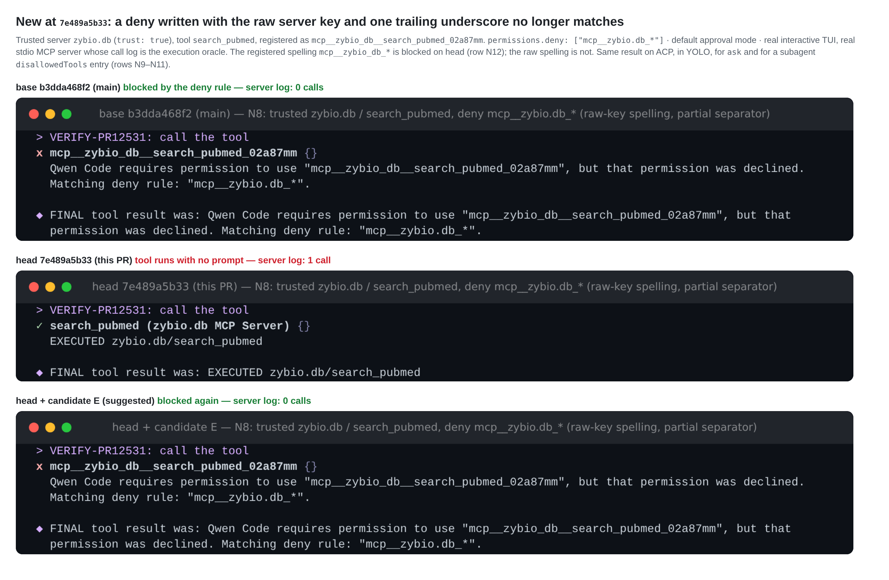
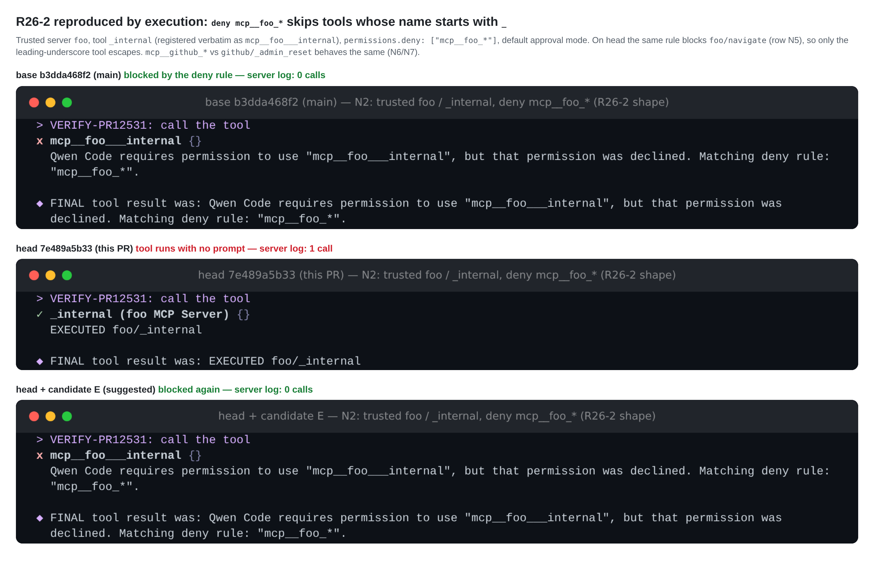
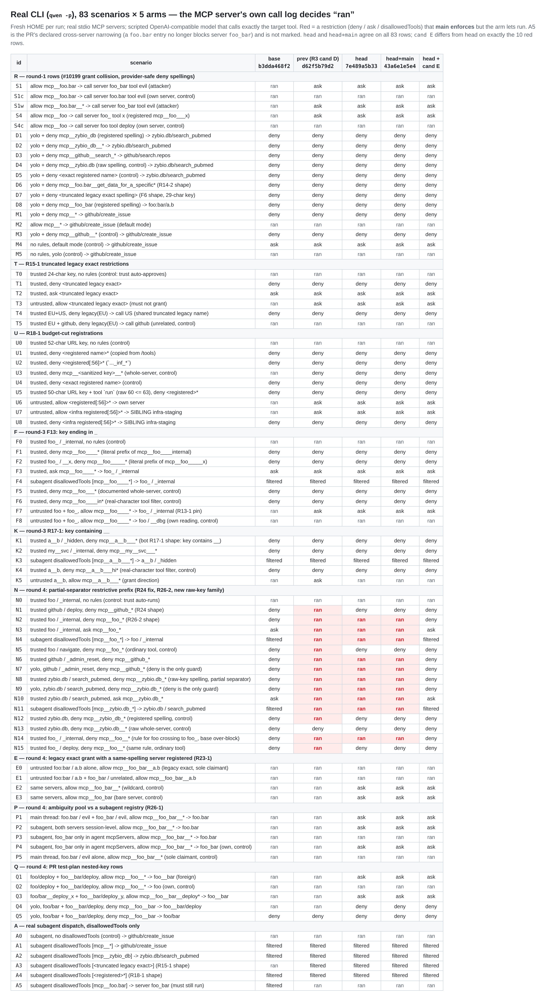

## Maintainer verification, round 4 (real local environment) — PR #12531 @ `7e489a5b33`

**Verdict: not mergeable as-is. One fail-open family against `main` is still open, and a small restrictive-only patch (candidate E) closes all of it without changing any grant.** I measured it exhaustively this round rather than case by case.

The other two open bot Criticals, R23-1 and R26-1, are real. Neither is a regression against `main`: in both, the new grant guard misses a case, so `main`'s behaviour stays in place. Tracking them in #13412 is reasonable.

| # | Item | Status at `7e489a5b33` | Against `main` | Blocks merge? |
| --- | --- | --- | --- | --- |
| 1 | Partial-separator restrictions `mcp__<key>_*`: **A** (bot R26-2) and **B** (new this round) | fail-open, 152 of 16,502 rule×tool rows | **regression**: main blocks every row | **yes**, fixed by candidate E |
| 2 | R23-1: a legacy exact `allow` with a same-spelling server registered | grants (E1) | same as main | no; doc mismatch |
| 3 | R26-1: the ambiguity pool is the session registry, not the subagent's | blind to agent-local competitors (P3); refuses an agent-local owner (P4) | P3 same as main; P4 fail-closed | no |
| 4 | Everything rounds 1–3 measured, plus the PR's nested-key test plan | holds | — | — |

### Correction to round 3

In round 3 I wrote that after candidate D "I have no blockers". That was wrong.

My round-3 sweep only took literal prefixes of the registered name at the key's own boundary. It never generated prefixes that stop inside the separator, or coarse legacy prefixes. Measured with this round's differential, candidate D (which landed as `d62f5b79d2`) still lost **569** restrictions against `main`. The author's R23/R24 rounds fixed **417** of them, and the remaining **152** are item 1.

The three test rows that candidate E flips also come from me: my round-2 candidate C added them ("uncut registrations must not enter the fallback") to keep the R17-2 decision. Once R24 made the same fallback restrict ordinary tools, those rows only pin the asymmetry.

### Environment

- **Arms.** Each was built from git with `pnpm install --frozen-lockfile`, `npm run build` and `npm run bundle`, all exit 0:
  - **base** `b3dda468f2`, the merge-base;
  - **prev** `d62f5b79d2`, my round-3 candidate D as landed;
  - **head** `7e489a5b33`;
  - **merge**: head merged into current `main` `43a6e1e5e4`, no conflicts;
  - **cand E**: head + the patch in §1.
- **Harness.** Same as rounds 2–3:
  - real stdio MCP servers, whose own call log is the execution oracle;
  - a scripted OpenAI-compatible model that calls exactly the target tool;
  - a fresh `HOME` per run.
- **New scenario groups:**
  - **N**: partial separator;
  - **E**: R23-1;
  - **P**: R26-1, with agent-frontmatter `mcpServers`;
  - **Q**: the PR's own nested-key test plan.
- **Runs:**
  - headless `qwen -p`: 83 scenarios × 5 arms = 415 runs;
  - `qwen --acp`: 9 scenarios × 3 arms;
  - real interactive TUI: N8 and N2 × 3 arms.
- **Module differential, new this round.** For 18 server keys × 14 tool names, I took every rule that is literally an exact name or a `<prefix>*` of the tool's **own** raw, registered or legacy spelling, plus bare-server forms. That is 16,502 rule×tool rows. Each arm's built modules were called the way production calls them:
  - L4 `PermissionManager.evaluate` for deny and for ask, with the invocation's aliases and `mcpIdentity`;
  - L1 scheduler `isToolEnabled`;
  - the subagent `disallowedTools` predicate that arm actually uses.

  A **loss** is a row that `main` restricts and the arm does not. No registry competitor is involved, because restrictive matching never reads the registry.
- Linux x86_64, Node 22.22.2. Round 3 ran on macOS arm64.

### 1. Open: partial-separator restrictions fail open (bot R26-2 + a new raw-key family)



All 152 remaining losses have the same shape: a restrictive wildcard `mcp__<key spelling>_*` that stops one underscore into the key's own separator. This is the coarse "everything from this server" spelling that R24 restored for `mcp__github_*` (row N1). `matchesRestrictiveMcpName` (`rule-parser.ts:1912`) accepts it only in two cases:

- the rule is a literal prefix of the **registered** name;
- and the tool segment does **not** start with `_` (`:1936-1937`).

That leaves two holes.

| family | rule shape | rows | real-CLI witness (base → head) |
| --- | --- | --- | --- |
| **A** (bot R26-2) | registered spelling, tool name starts with `_`: `mcp__foo_*` → `foo/_internal`, `mcp__github_*` → `github/_admin_reset`, `mcp__foo__*` → `foo_/_internal` | 64 | N2 deny, N3 ask, N4 subagent, N6, N7 (YOLO), N14: blocked/ask/filtered → **ran** |
| **B** (new) | raw or legacy spelling of a key with characters outside `[A-Za-z0-9_-]`, **every** tool of the key: `mcp__zybio.db_*`, `mcp__foo:bar_*`, `mcp__com.example.enterprise-search_*`, URL keys | 88 | N8 deny, N9 (YOLO), N10 ask, N11 subagent: blocked/ask/filtered → **ran** |

- **Same on ACP.** N2, N3, N7, N8, N9, N10 and N14 run on head. Base and cand E report `Tool "…" is disabled.` or send `session/request_permission`.
- **The contract is inconsistent at head.** The registered spelling `mcp__zybio_db_*` blocks (N12), and so do `mcp__zybio.db__*` (N13) and `mcp__zybio.db` (D4); only the one-underscore raw form misses. Likewise `deny mcp__foo__*` blocks `foo_/deploy` (N15) but not `foo_/_internal` (N14).
- **Family A is documented** (design doc `:38`: "underscore-leading registered tool segments retain the boundary refusal"). In the restrictive direction, though, that refusal has only one effect: the deny does not fire. The doc's own Asymmetry bullet names exactly that failure. The grant-side R17-2 refusal is separate, and candidate E keeps it.
- **Exposure.** It needs a restrictive entry written as `mcp__<key>_*`. For A, the tool name must also start with `_`. For B, the key must contain `.`, `:` or `/`, which is common for `zybio.db`-style and URL keys. On a trusted server, or in YOLO, the tool then runs with no prompt, while `main` blocks it.



**Candidate E.** This is restrictive-only. `matchesRestrictiveMcpName` is reached only from deny, ask and `disallowedTools`, and from `matchesToolPattern`, whose production callers are all restrictive. The rule it applies: a prefix that stops at or inside the key's own separator, in any of the key's three spellings, names that key.

<details><summary>patch: <code>rule-parser.ts</code> +8/−5, test rows, two doc sentences — 4 files, +55/−13 (<a href="patch/candidate-E.patch">full patch</a>)</summary>

```diff
@@ -1930,11 +1930,14 @@ function matchesRestrictiveMcpName(
   const prefix = pattern.slice(0, -1);
   const registeredServerPrefix = `mcp__${identity.serverName.replace(/[^A-Za-z0-9_-]/g, '_')}__`;
   return (
-    toolName.startsWith(prefix) &&
-    (!toolName.startsWith(registeredServerPrefix) ||
-      prefix.startsWith(registeredServerPrefix) ||
-      (registeredServerPrefix.startsWith(prefix) &&
-        !toolName.slice(registeredServerPrefix.length).startsWith('_')))
+    (toolName.startsWith(prefix) &&
+      (!toolName.startsWith(registeredServerPrefix) ||
+        prefix.startsWith(registeredServerPrefix))) ||
+    // A prefix that stops at or inside this key's own separator names the
+    // key in that spelling, whatever the tool segment starts with.
+    mcpSegmentSpellings(identity.serverName).some((server) =>
+      `mcp__${server}__`.startsWith(prefix),
+    )
   );
 }
```

Test changes in `mcp-server-rule-collision.test.ts`:

- The three-row `an uncut registration never enters the fallback` block at `:1494-1516` becomes eight rows:
  - the three original shapes, now expecting a restriction;
  - `github/_admin_reset`;
  - the raw-key shapes `zybio.db`, `foo:bar` and `foo.bar`;
  - `foo_` under `mcp__foo__*`.
- Each row checks `matchesToolPattern`, deny `evaluate`, `isToolEnabled`, ask `evaluate` and `matchesAgentToolBlocklist`. It also asserts that **`allow` stays `default`**, which keeps the R17-2 grant pin.
- A new control checks that key `foobar` is not restricted by `mcp__foo_*`.
- Docs: the sentence at `:38` of both design docs is updated to match.

</details>

| check | result |
| --- | --- |
| Real CLI, 83 scenarios | Exactly the 10 fail-open rows (N2–N4, N6–N11, N14) return to base. The other **73 are identical to head**, including every allow, ask and grant-guard row (S, U6/U7, F7/F8, K5, E, P, Q). |
| ACP (7 fail-open rows) | All are blocked or ask again. |
| Differential, 16,502 rows | Losses against main: head **152** → cand E **0**, on all four gates. Cand E adds 17 own-key restrictions that main lacks: the raw/legacy partial-separator rule for the 52-char URL key, which main misses because its truncated legacy alias drops the separator. These are fail-closed and touch no other key. Head and cand E differ on 169 rows = 152 + 17. |
| Red-first | The 8 new rows on head: **8 fail**. Cand E: 101/101 in the collision suite. |
| Mutants, **5/5 killed** | Each made at least one of the four PR permission suites (708 tests) fail: drop the new disjunct (10 failures); restore the `_` carve-out (6); registered spelling only, dropping raw and legacy (3); accept any key-head prefix without the separator (1); let the fallback grant (14). |
| Gates | Targeted core (35 files, 7 skipped) cand E **2854/2854**, head 2848/2848. CLI `Session.test.ts` 1114/1114. Full core suite 34076 passed, 6 failed; the same 6 fail identically on base and head (root-uid and local git-environment tests, none in permissions). eslint `--max-warnings 0`, `tsc --noEmit` and prettier are clean. The patch applies cleanly to head and to head+main. |

### 2. R23-1: a legacy exact allow still grants with a same-spelling server registered (not a regression)

| id | servers | rule | base | head |
| --- | --- | --- | --- | --- |
| E0 | `foo:bar/a.b` only | `allow mcp__foo_bar__a.b` | ran | ran (sole claimant, compatible) |
| **E1** | + `foo_bar/unrelated` | `allow mcp__foo_bar__a.b` | ran | **ran**, also on ACP |
| E2 / E3 | same | `mcp__foo_bar__*` / `mcp__foo_bar` | ran | ask |

E1 is what `main` does, so this is not a regression. But design doc `:36` says "a legacy exact entry cannot grant to `foo:bar` while `foo_bar` is also registered", and the code does not do that. Either narrow that sentence now or keep the case in #13412. I would not block on it.

### 3. R26-1: the ambiguity pool is the session registry (reproduced in both directions)

`isMcpAllowAmbiguous` reads `this.config.getToolRegistry()` (`permission-manager.ts:452`). A subagent with frontmatter `mcpServers` runs on its own rebuilt registry but keeps the session's PermissionManager.

| id | setup (`allow: ["agent", "mcp__foo_bar__*"]`) | base | head |
| --- | --- | --- | --- |
| P1 | main thread, `foo.bar` + `foo_bar` both session-level → `foo.bar/evil` | ran | ask (fixed) |
| P2 | same, called from a subagent | ran | ask (fixed) |
| **P3** | `foo_bar` only in the agent's `mcpServers` → `foo.bar/evil` | ran | **ran**: the foreign tool is still auto-approved, same as main |
| **P4** | same → the agent-local **owner** `foo_bar/evil` | ran | **ask**: the rightful owner loses its grant (fail-closed, new) |

P3 matches `main`. P4 is a fail-closed UX regression, limited to agent-local MCP servers whose spelling collides with a session-level server. Neither should block; both belong to the #13412 decision about which registry owns the ambiguity check.

### 4. What still holds at head

- **Earlier rows.** All 48 rows of round 3's candidate-D run give the same verdict at head, and prev on Linux reproduces that macOS run cell for cell (groups R, T, U, F, K, A in Fig 3). One grant row changed on purpose: K5 went from ask at prev to ran at head, because R24 now grants the sole `__`-key claimant. Since prev, R24 also fixed N1, N5, N12 and N15.
- **The PR's nested-key test plan** (Q1–Q5) behaves as described: the foreign `foo__bar` asks under `mcp__foo__*`; two boundary claimants both ask; bare `mcp__foo__bar` restricts both.
- **Pomelo-nwu's R4-1** (legacy spelling for restrictive prefixes):
  - satisfied at head for every legacy prefix shape, including the 252 coarse legacy prefixes on long URL keys that were still lost at prev;
  - the only legacy rows still lost are 4 family-B partial-separator rows, which candidate E closes.
- **Head + current main.** Identical to head on all 83 real-CLI rows and all 16,502 differential rows.



### 5. Gates and coverage

| gate | result |
| --- | --- |
| CI at `7e489a5b33` | 25 success, 22 skipped. The only cancelled runs are `route` jobs superseded by later dispatches. `review-pr` completed (the source of R26-1 and R26-2). |
| Unit, head | Targeted core (35 files, 7 skipped) 2848/2848. CLI `Session.test.ts` 1114/1114. |
| Review state | `chiga0` APPROVED at this head. `pomelo-nwu` still holds `CHANGES_REQUESTED` from `952e3ef668`, so `reviewDecision` is `CHANGES_REQUESTED`. |

**Not covered:**

- Windows and macOS (Linux x86_64 only this round).
- App-only RPC/UI.
- External providers; the model is a loopback fixture.
- The `tool_search` bridge.
- The interactive TUI for rows other than N2 and N8.

### Recommendation

1. Fold in candidate E, or an equivalent restrictive-only fix for both families. After that I have no blockers.
2. R23-1 (doc vs code) and R26-1 (P3/P4) do not block. Narrow the doc sentence or track both in #13412.
3. Pomelo-nwu's re-review is still required to clear the standing CR.

Evidence is in [wenshao/qwen-code `asserts`/pr-12531-r4](.): harness, per-run rows (headless, ACP, cand E), the differential JSON, unit logs and the candidate E patch.
