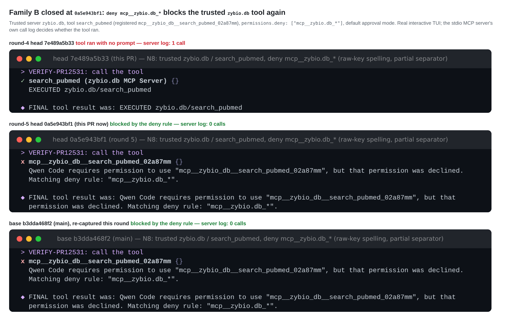
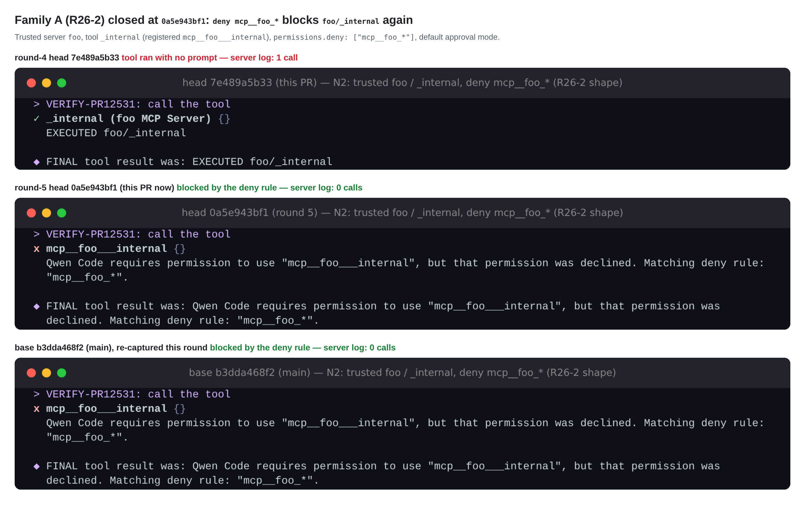
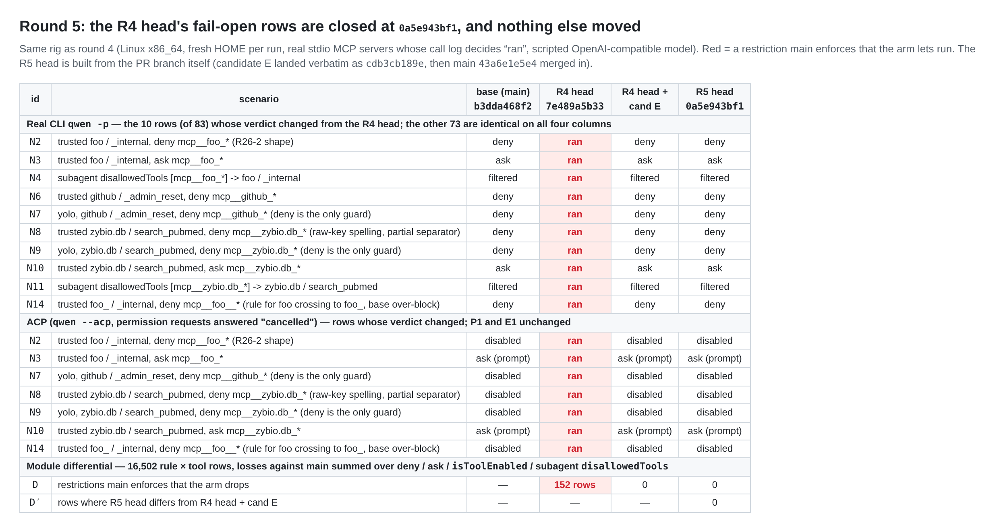

## 维护者验证 第 5 轮（增量）— PR #12531 @ `0a5e943bf1`

**结论：我这边可以合入。第 4 轮的阻塞项已关闭，我这边没有剩余阻塞项。** 所有检查都在真实 PR head 上重跑（全新 `pnpm install --frozen-lockfile`、`npm run build`、`npm run bundle`，没有本地补丁）。剩下的只是下面列出的人工评审门禁。

本轮是相对[第 4 轮](https://github.com/QwenLM/qwen-code/pull/12531#issuecomment-6011313566)的增量；第 4 轮测过、这里没列出的内容均未变化。

### 与第 4 轮相比的变化

- `cdb3cb189e` 与候选 E 逐字节相同。4 个文件我都逐一和第 4 轮的 cand E 工作树做了 diff。
- `0a5e943bf1` 合入了 `main` `43a6e1e5e4`，正是第 4 轮 `merge` 臂所用的同一个 `main`。它的树等于该臂（`7e489a5b33` + `43a6e1e5e4`）加候选 E，别无其他：两者之间的 `git diff --stat` 只有这 4 个文件，+55/−13。

### `0a5e943bf1` 上的结果

| 检查 | 结果 |
| --- | --- |
| 真实 CLI `qwen -p`，83 个场景 | 83 行与第 4 轮 head + cand E 完全一致。相对第 4 轮 head，恰好是那 10 个漏拦行发生了变化（N2–N4、N6–N11、N14），全部回到 `main` 的判定。 |
| ACP `qwen --acp`，9 个场景 | N2、N7、N8、N9、N14 返回 `Tool "…" is disabled.`；N3、N10 发起权限请求，均与 `main` 一致。P1、E1 与第 4 轮相同。 |
| 真实交互 TUI，N8 与 N2 | 均被拦截，显示 `Matching deny rule`，MCP server 记录 0 次调用（图 1、图 2）。 |
| 模块差分，16,502 个"规则 × 工具"组合 | 在 deny、ask、`isToolEnabled` 和子代理 `disallowedTools` 上相对 `main` 漏拦为 0（第 4 轮 head 为 152）；与第 4 轮 cand E 相差 0 行。 |
| 与 `main` 对比，全部 83 行 | 只有一行是 `main` 拦截而这里放行：A5，即 PR 声明的有意收窄（`foo.bar` 条目不再拦截 server `foo_bar`）。17 行在 `main` 上会执行，现在改为询问或拦截：#10199 的修复，加上下面的 P4。与第 4 轮是同一组。 |
| 单测 | core 定向套件：2924 通过、7 跳过（35 个文件；比 2854 多，是因为合入的 `main` 新增了测试）。冲突套件 101/101。CLI ACP `Session.test.ts` 1152/1152。代码逐字节相同，所以第 4 轮的红灯先行和变异结果直接沿用（`7e489a5b33` 上 8/8 新行失败，5/5 变异被杀）；作者报告的红灯先行计数（8 失败、93 通过）与之一致。 |
| `0a5e943bf1` 的 CI | Test（ubuntu-latest）、Lint & Static、Integration（no-AK）、Desktop Shell、TUI parity 全部通过。macOS 和 Windows 的 Test 按路由规则跳过。两次 `review-pr`（以及对应的 `fallback-comment`）都在开始评审前失败：bot token 返回 `HTTP 403: Sorry. Your account was suspended`。这是基础设施问题，与本 PR 无关。发评论时 `web-shell E2E Smoke` 仍在运行。 |
| 当前 `main`（`481b4837aa`，领先 2 个提交） | `git merge-tree` 无冲突。这两个提交改的是 XML 工具调用回退和 memory dream，不涉及权限或 MCP 命名代码，所以没有单独构建一个臂。 |

### 仍未解决、但不阻塞（与第 4 轮相同）

- **R23-1。** E1（注册了同拼写 server 时，旧写法的精确 `allow`）仍然放行，这与 `main` 一致；设计文档 `:36` 那句话仍然承诺会拒绝。
- **R26-1。** P3（子代理自带的竞争者）与 `main` 一致。P4（子代理自带 server 的合法工具现在会弹确认）是偏保守的体验回退。
- 正如 bot 在两个 thread 上指出的，#13412 目前还没有列出这些行。合入时应把 E1 和 P3/P4 补进 #13412，后续跟踪才算真正落地。

### 合入门禁

- `pomelo-nwu` 在 `952e3ef668` 上的 `CHANGES_REQUESTED`（2026-09-25）仍在，所以 `reviewDecision` 是 `CHANGES_REQUESTED`。
- `chiga0` 在 `7e489a5b33` 上的批准已被新的推送 dismiss，需要在 `0a5e943bf1` 上重新批准。

**未覆盖：** Windows 与 macOS（只跑了 Linux x86_64）、App-only 的 RPC/UI、外部模型提供方、`tool_search` 桥接。与第 4 轮相同。
