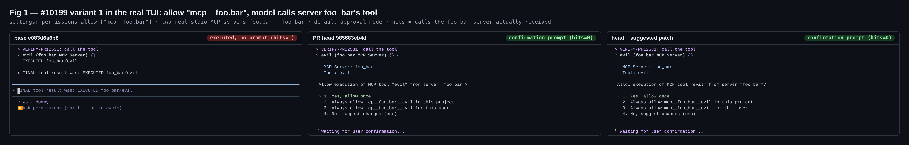
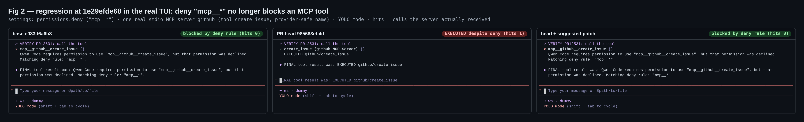
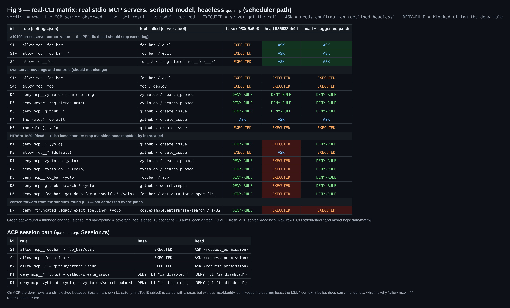

## Maintainer verification (real local environment) — PR #12531 @ `985683eb4d`

**Verdict: not mergeable as-is.** I found one new fail-open regression. It was introduced by today's `1e29efde68`, and a verified fix (+78/−18) is below.

The #10199 fix itself holds end-to-end: real MCP servers, real TUI, headless and ACP. The problem starts once `1e29efde68` threads `mcpIdentity` into the scheduler's gates. From then on, the identity arms of `matchesMcpPattern` compare a wildcard or whole-server rule **only** against the raw `mcp__<serverName>__<serverToolName>` spelling. Every other spelling the matcher honours stops matching on the real execution path:

- the registered name that the model and the UI show,
- the legacy character set,
- even the documented `mcp__*`.

So `permissions.deny: ["mcp__*"]` no longer blocks an ordinary `github` / `create_issue` call.

Prior rounds: this PR has no earlier maintainer verification. The 2026-09-30 sandbox round verified `1fe811c3e5` at unit level. It listed *no real MCP transport* and *no live ACP session* as not covered. This round fills those two gaps and covers the commits since then (`2da7c3f80f`, `1e29efde68`, merges); it does not repeat the sandbox census.

### Environment

- **Arms:**
  - **base** `e083d6a6b8` (merge-base with `main`)
  - **head** `985683eb4d`
  - **head + suggested patch** (a third worktree)

  Each arm ran `pnpm install --frozen-lockfile` → `npm run build` → `npm run bundle`, all exit 0. I checked each bundle was the build it claims: `mcpIdentity` appears in 3 head chunks and 0 base chunks; `identitySpellings` appears only in the patched bundle.
- **Per scenario:** a fresh `HOME` with `settings.json` (`mcpServers` + `permissions`) and **real stdio MCP servers** (`@modelcontextprotocol/sdk` `Server`). Every `tools/call` a server receives is appended to `hits.jsonl`, and that file is the execution oracle. A scripted OpenAI-compatible model calls the target tool by its registered name.
- **Drivers:** the **real interactive TUI** (node-pty + xterm.js), **headless `qwen -p`** (scheduler path), and **`qwen --acp`** over JSON-RPC (`Session.ts` path). Linux, Node v22.22.2.

### 1. The #10199 fix holds end-to-end



Setup: `permissions.allow: ["mcp__foo.bar"]`, with two real servers `foo.bar` and `foo_bar`.

- **base:** the model's call to **`foo_bar`**'s `evil` runs with no prompt, and the `foo_bar` server logs the call.
- **head:** the TUI asks *Allow execution of MCP tool "evil" from server "foo_bar"?* and the server logs nothing.

The same flip holds for:

- `mcp__foo.bar__*` (S1w);
- R13-1's `allow mcp__foo` → server `foo_`'s `mcp__foo___x` (S4), which `1e29efde68` closes.

Own-server controls (S1c, S4c) still auto-approve. On ACP, S1 and S4 also flip: base executes, head sends `session/request_permission`.

### 2. New regression at `1e29efde68`: restrictive rules stop matching (fail-open)



These runs use the real CLI in YOLO mode, so the deny rule is the only guard; the server log is the oracle.

| id  | `permissions.deny`                                              | tool called                                         | base                 | head         |
| --- | --------------------------------------------------------------- | --------------------------------------------------- | -------------------- | ------------ |
| M1  | `mcp__*`                                                        | `github` / `create_issue`                           | blocked by deny rule | **executed** |
| D1  | `mcp__zybio_db`                                                 | `zybio.db` / `search_pubmed`                        | blocked              | **executed** |
| D2  | `mcp__zybio_db__*`                                              | `zybio.db` / `search_pubmed`                        | blocked              | **executed** |
| D8  | `mcp__foo_bar`                                                  | `foo:bar` / `a.b`                                   | blocked              | **executed** |
| D3  | `mcp__github__search_*`                                         | `github` / `search.repos`                           | blocked              | **executed** |
| D6  | `mcp__foo.bar__get_data_for_a_specific*` (R14-2's own shape)    | `foo.bar` / `get+data_for_a_specific_location_…`    | blocked              | **executed** |

On the allow side, M2 `allow: ["mcp__*"]` (default mode) auto-approves on base. On head every call prompts, and headless declines it.

These controls behave the same on both arms:

- the raw spelling `mcp__zybio.db` (D4),
- the exact registered name (D5),
- `mcp__github__*` (M3),
- no rules (M4, M5).

The full 18-scenario × 3-arm table, plus the ACP runs:



**Mechanism.** Whenever `mcpIdentity !== undefined`, the identity branches take over: `rule-parser.ts:1782-1801` (wildcard) and `:1819-1823` (server-level). They compare only against `mcp__${serverName}__` and `serverToolName`. Two consequences:

- `mcp__*` is neither equal to `mcp__github__` nor prefixed by it, so it returns `false` for every MCP tool.
- A provider-safe or legacy spelling of a server or tool is not the raw one, so it also returns `false`.

The spelling path below (`matchesPrefixLiterally`) still handles all of these, but the identity branch returns before reaching it.

Production supplies the identity on the scheduler path:

- `permissionFlow.ts:82` (`invocation.mcpIdentity`);
- `coreToolScheduler.ts:3130-3141` (`isToolEnabled` and `findMatchingDenyRule`).

I also ran a matcher-level probe with the real `DiscoveredMCPTool` producer and `PermissionManager.evaluate` ([`data/probe-matcher.txt`](./data/probe-matcher.txt)). Every rule above evaluates to `deny`/`allow` on base **and on head without the identity**, and to `default` on head with it. So the cause is exactly the identity arms.

The same predicate feeds the agent blocklists (`agent-core.ts` declaration and invocation checks, `matchesAgentToolBlocklist`, the fork inheritance filter in `agent.ts:1800`). For example, `matchesToolPattern('mcp__*', 'mcp__github__create_issue', aliases, identity)` is `true` on base and `false` on head ([`data/probe-blocklist.txt`](./data/probe-blocklist.txt)). So a subagent's `disallowedTools: ["mcp__*"]` stops excluding MCP tools too. I checked that at matcher level only, not with a real subagent dispatch.

**Why I read this as unintended rather than a design choice:**

- The design doc on this branch says:
  - *"`mcp__*` and `mcp__server__*` keep their documented meanings"* (`docs/design/mcp-tool-name-provider-compatibility.md:36`);
  - patterns are compared *"against the registered name and the raw identity, plus the gated legacy reduction"* (`:32`);
  - writing a restrictive rule *"in the registered spelling"* is the mitigation (`:37`).
- The PR body keeps the provider-safe residual precisely because closing it *"would break deny rules copied from the registered names the model and UI actually show."*
- The commit message says *"without it the existing spelling logic is unchanged"*. That is true, but production no longer runs without the identity.
- None of the 7 new identity tests, and no existing row, evaluates a provider-safe or legacy spelling or `mcp__*` **with** an identity. That is why every suite stays green.

**ACP note.** `Session.ts:13860` calls its L1 `pm.isToolEnabled(...)` with aliases but **without** `mcpIdentity`. Two effects:

- On ACP the deny rows (M1, D1) are still blocked at that gate (`Tool "…" is disabled.`).
- The L3/L4 context `Session.ts` builds does carry the identity, so `allow mcp__*` (M2) regresses on ACP too.

The missing argument also means R13-1's `deny mcp__foo` still over-blocks `foo_`'s tools at ACP L1. That is fail-closed and low priority, but the threading is less uniform than the commit message states.

### 3. Suggested fix (verified)

Keep the producer boundary, but enumerate the spellings the tool already answers to:

- the raw spelling;
- the registered name, when its server prefix survived the 63-char budget;
- the legacy character set, only while the producer advertises the reduction (the same R12-1 gate).

Split each at the identity's boundary. In the wildcard arm, a prefix that ends inside the server name (`mcp__*`, `mcp__git*`) is a server-name wildcard; a prefix that reaches the separator must name the whole server. The identity arms then consult no spelling that the spelling path would not; only the boundary changes.

<details>
<summary>patch: <code>rule-parser.ts</code> (+78/−18) — tests: 13 rows in <code>mcp-server-rule-collision.test.ts</code></summary>

```diff
diff --git a/packages/core/src/permissions/rule-parser.ts b/packages/core/src/permissions/rule-parser.ts
index c97853b8c5..14e267d49d 100644
--- a/packages/core/src/permissions/rule-parser.ts
+++ b/packages/core/src/permissions/rule-parser.ts
@@ -1783,21 +1783,29 @@ export function matchesMcpPattern(
       // The boundary comes from the producer, not from a flattened spelling:
       // `mcp__foo_` + `__*` (server `foo_`) and `mcp__foo` + `__*` (server
       // `foo`) are the same string family under startsWith, and a tool whose
-      // name starts with '_' reads as separator continuation there.
-      const serverPrefix = `mcp__${mcpIdentity.serverName}__`;
-      if (prefix === serverPrefix) {
-        return true;
-      }
-      if (!prefix.startsWith(serverPrefix)) {
-        return false;
-      }
-      const toolPrefix = prefix.slice(serverPrefix.length);
-      // A prefix of pure underscores is separator continuation, not a tool
-      // filter — otherwise a sibling server's whole-server spelling leaks in.
-      if (!/[^_]/.test(toolPrefix)) {
-        return false;
-      }
-      return mcpIdentity.serverToolName.startsWith(toolPrefix);
+      // name starts with '_' reads as separator continuation there. Every
+      // spelling the tool answers to is still consulted — raw, registered
+      // and legacy — each split at the producer's boundary.
+      return identitySpellings(
+        mcpIdentity,
+        toolName,
+        legacySpelling !== undefined,
+      ).some(({ serverPrefix, tool }) => {
+        if (prefix === serverPrefix) {
+          return true;
+        }
+        if (!prefix.startsWith(serverPrefix)) {
+          // A prefix that ends inside the server name (`mcp__*`,
+          // `mcp__git*`) is a server-name wildcard; one that reaches the
+          // separator must name the whole server.
+          return serverPrefix.slice(0, -2).startsWith(prefix);
+        }
+        const toolPrefix = prefix.slice(serverPrefix.length);
+        // A prefix of pure underscores is separator continuation, not a
+        // tool filter — otherwise a sibling server's whole-server spelling
+        // leaks in.
+        return /[^_]/.test(toolPrefix) && tool.startsWith(toolPrefix);
+      });
     }
     return matchesPrefixLiterally(prefix);
   }
@@ -1817,9 +1825,15 @@ export function matchesMcpPattern(
   const patternParts = pattern.split('__');
   if (patternParts.length === 2 && patternParts[0] === 'mcp') {
     if (mcpIdentity !== undefined) {
-      // Exact producer compare: no split of the tool side, so a rule for
-      // server `foo` can never reach server `foo_`'s tools and vice versa.
-      return patternParts[1] === mcpIdentity.serverName;
+      // Producer compare: no split of the tool side, so a rule for server
+      // `foo` can never reach server `foo_`'s tools and vice versa — but the
+      // server is still named by any of its spellings.
+      const serverPrefix = `mcp__${patternParts[1]}__`;
+      return identitySpellings(
+        mcpIdentity,
+        toolName,
+        legacySpelling !== undefined,
+      ).some((spelling) => spelling.serverPrefix === serverPrefix);
     }
     // A server name containing '__' makes this split unreliable, but that is
     // the accepted provider-safe-name residual (see mcp-tool.ts). The tool
@@ -1839,6 +1853,52 @@ export function matchesMcpPattern(
   return false;
 }
 
+/**
+ * The spellings an MCP tool answers to when the producer supplied its
+ * identity, each split at the producer's server boundary instead of by
+ * re-splitting a flattened name: the raw `mcp__<server>__<tool>` spelling,
+ * the registered provider-safe rendering (what the model and the UI show),
+ * and the legacy character set pre-normalization entries were persisted in.
+ * Splitting at the producer's boundary is the only change from the spelling
+ * path: the identity arm consults no spelling the spelling path would not.
+ */
+function identitySpellings(
+  identity: McpToolIdentity,
+  toolName: string,
+  includeLegacy: boolean,
+): Array<{ serverPrefix: string; tool: string }> {
+  const spellings: Array<{ serverPrefix: string; tool: string }> = [];
+  const add = (serverPrefix: string, tool: string): void => {
+    if (
+      !spellings.some(
+        (spelling) =>
+          spelling.serverPrefix === serverPrefix && spelling.tool === tool,
+      )
+    ) {
+      spellings.push({ serverPrefix, tool });
+    }
+  };
+  add(`mcp__${identity.serverName}__`, identity.serverToolName);
+  // The registered name substitutes characters one for one, so its server
+  // prefix is known; it is only usable while the 63-character budget left
+  // that prefix intact.
+  const registeredServerPrefix = `mcp__${identity.serverName.replace(/[^A-Za-z0-9_-]/g, '_')}__`;
+  if (toolName.startsWith(registeredServerPrefix)) {
+    add(registeredServerPrefix, toolName.slice(registeredServerPrefix.length));
+  }
+  // The legacy character set, only while the producer still advertises the
+  // reduction — the same provenance gate the spelling path applies (R12-1).
+  if (includeLegacy) {
+    const legacy = (segment: string): string =>
+      segment.replace(/[^A-Za-z0-9_.-]/g, '_');
+    add(
+      `mcp__${legacy(identity.serverName)}__`,
+      legacy(identity.serverToolName),
+    );
+  }
+  return spellings;
+}
+
 /**
  * Pick the advertised alias that serves as the tool's raw identity for
  * matching, or `undefined` when no alias can vouch for it.
```

Test rows: [`patch/suggested-tests.patch`](./patch/suggested-tests.patch) (both files together: [`patch/suggested-fix.patch`](./patch/suggested-fix.patch)).

</details>

Results with the patch (third arm, same harness):

- **Real CLI.** All 7 regressed cells return to base behaviour (Fig 3, right column). **S1, S1w and S4 stay closed**, and every control is unchanged. In the TUI, M1 is blocked again (Fig 2, right pane).
- **Red-first.** On unpatched head, the 13 new rows give **8 failed / 5 passed**. The 5 that pass are the cross-server negatives, which head already gets right. With the patch the collision file passes **71/71**.
- **Mutants on the patch** (three permission suites):

  | mutant | result |
  | --- | --- |
  | drop the server-name-wildcard clause | 3 rows red |
  | drop the registered-name spelling | 3 rows red |
  | never add the legacy spelling | 1 row red (the R14-2 row) |
  | remove the legacy provenance gate | survives |

  The survivor is expected: with the identity, the boundary is already fixed, so that gate only bounds the arm to be no wider than the spelling path. I would keep it, but it is not load-bearing.
- **Gates.** `packages/core` targeted set (permissions, tool-registry, mcp-tool, agents/runtime, coreToolScheduler, memory shims, tools/workflow, tools/agent): head 3939/3939, patch 3952/3952 (+13 new). cli `Session.test.ts`: 1111/1111 on both. `tsc --noEmit`, eslint and prettier are clean on the patched files.

### 4. Carried forward (not new)

- **F6 reproduces end-to-end at this head.** D7 uses a `deny` in the truncated legacy exact spelling for a 29-char key (`com.example.enterprise-search`, tool `a×32`). It blocks on base and executes on head. The patch does not touch this (it sits in the exact arm / publication gate). It is still the open product decision from the sandbox round, now with a real-CLI witness.
- The Reviewer Test Plan's step-4 count is stale: at this head it is **786 passed** (the description says 676).

### 5. Gates at head

| gate                                                            | result                                                                                                                                                                                                                                                                                            |
| --------------------------------------------------------------- | ------------------------------------------------------------------------------------------------------------------------------------------------------------------------------------------------------------------------------------------------------------------------------------------------- |
| CI at `985683eb4d`                                              | every non-skipped check green                                                                                                                                                                                                                                                                     |
| PR test plan step 4 (4 files, from `packages/core`)             | 786/786, exit 0                                                                                                                                                                                                                                                                                   |
| full `packages/core` vitest, base vs head (sequential, as root) | base: 33794 tests, 5 failed. head: 33858 tests, 6 failed. The 5 shared failures are root-environment ones (unreadable lock, transient rename, wedged git index). The head-only failure (`recall-scan-latency`) passes 3/3 in isolation, and the PR does not touch `src/memory/recall*`. |
| targeted core set / cli `Session.test.ts`                       | 3939/3939 / 1111/1111                                                                                                                                                                                                                                                                             |
| eslint `--max-warnings 0` + prettier on all changed files       | clean                                                                                                                                                                                                                                                                                             |

**Not covered:**

- Windows and macOS (CI is green there).
- The subagent `disallowedTools` and fork-inheritance paths: checked at matcher level only, not with a real subagent dispatch.
- The `tool_search` bridge: the model calls the deferred MCP tool directly by name instead.

Evidence: harness, raw per-run rows (settings, CLI stdout, model log, server hits) and the patch are in [wenshao/qwen-code `asserts`/pr-12531](.).
