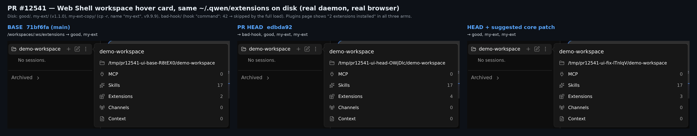
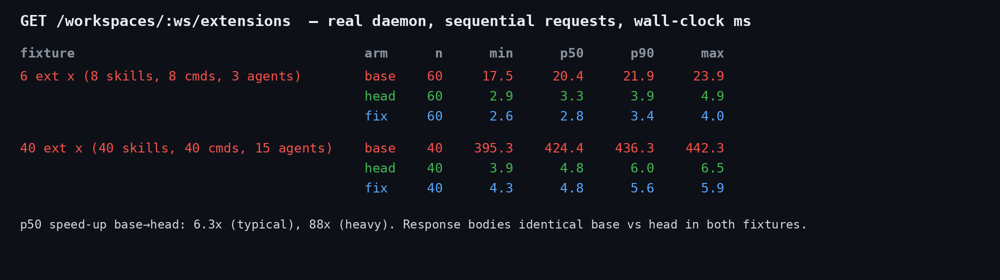
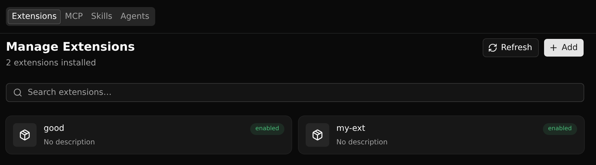

## 维护者验证 —— PR #12541 @ `edbda92`（真实 daemon + 真实 Web Shell，Linux）

**结论：可合入。** 性能收益现在有了实测数字；激活语义在真实 daemon 上与 base 逐字节一致。条目集合有两处变化，都来自 catalog 加载器（#12153），不是本路由新写出来的：一处（R1-1）需要维护者拍板，另一处（N1，本轮新发现）已有验证过的 17 行 core 修复。都不阻塞合入。

### 做了什么

- 三臂：**base** = `71bf6fa`（merge-base，本 PR 在其上仅一个提交）、**head** = `edbda92`、**fix** = head + 下方 core 补丁。每臂都是真实 `pnpm install` + `npm run build` + `npm run bundle`，再用 `dist/cli.js serve` 启动，`QWEN_HOME` 隔离，三个工作区：主（受信）、次（受信）、第三（`DO_NOT_TRUST`，并开启 `security.folderTrust.enabled: true`）。第三个工作区里预埋了禁用全部扩展的 `.qwen/settings.json`：路由一旦读了它，结果里就能看出来。
- 场景（每个响应体都存进证据目录）：普通 + link 安装与工作区覆盖；同名 manifest；畸形 manifest；6 个 / 40 个"重"扩展测延迟。
- Web Shell：各臂用同一份磁盘状态，由 daemon 托管的 UI 跑在 headless Chromium 里。

### 结果

| 检查 | 结果 |
| --- | --- |
| 响应等价（普通 + **link** 安装；次工作区与主工作区各一条 `disabled` 覆盖；不受信的第三工作区） | 3 个工作区上 **base 与 head 完全相同**：行、版本、`default/workspace/effective/activationSource`、`trusted`、desired/applied generation。不受信工作区仍可读（200，`trusted:false`），不读预埋的工作区设置，也不回退到主工作区的覆盖。 |
| 延迟：6 个扩展 ×（8 skills、8 cmds、3 agents），n=60 | p50 **20.4 → 3.3 ms**（6.3×） |
| 延迟：40 个扩展 ×（40 skills、40 cmds、15 agents），n=40 | p50 **424.4 → 4.8 ms**（88×），p90 436 → 6.0 ms |
| PR 测试文件 `workspace-qualified-extensions.test.ts` | 55/55，跑 3 次；PR 描述里提到的偶发 404 在 Linux 上一次也没出现 |
| 反向对照（base 路由 + PR 测试） | 2 个失败：无 mock fixture 测试（调用了 `refreshCacheWithSnapshot`）、不受信投影测试（未调用身份解析器）。新测试确实钉住了这次替换。 |
| 构建 | Linux x64 / Node 22 全量构建 + bundle 通过 |

（延迟图见英文部分。）

### 发现 N1（新）：畸形 manifest 会变成一条"enabled"的幽灵行，且无法对它操作

`refreshCatalogSnapshot` 的文档注释和 `loadExtension` 里 `manifestOnly` 分支的注释都说"head 与完整加载的 catch 拒绝同一批 manifest"，这一说法不成立。完整加载在 head **之后**还有两个仅由 manifest 决定、可能抛错的步骤：

- `substituteHookVariables`：`command` 不是字符串（如 `"command": 42`）时，`hook.command.replace` 抛错；
- `getContextFileNames`：`contextFileName` 不是字符串时，`path.join(path, 5)` 抛错。

完整加载的 `catch` 会跳过这类扩展，运行时会话和 `GET /workspace/extensions` 都看不到它；manifest head 却接受它。真实 daemon 上的表现：base 只返回 `good`；head 返回 `bad-ctx`、`bad-hook`、`good`（全部 `enabled`），对多出来的两行 `PUT …/activation`，操作结果为 **failed：`Extension "<id>" not found`**；fix 臂只返回 `good`。`GET /extensions` 自 #12153 起就有同样的幽灵行，fix 臂在那里也一并消除。core 测试 `extensionManager.test.ts:3000` 自己写明了意图："otherwise the catalog advertises an id that detail/enable/update routes reject as nonexistent"，这里发生的正是这种情况。只有畸形 manifest 会触发，因此不阻塞本 PR。修复补丁的验证情况：`extensionManager.test.ts` RED 2/176 → GREEN 176/176；eslint `--max-warnings 0` 与 core `tsc --noEmit` 均通过；重新打包的 daemon 上幽灵行消失；其他场景与延迟均不变。补丁见英文部分和证据目录中的 `catalog-parity.patch`。本 PR 有意不改 core，所以放到后续 PR 也可以。

### R1-1（同名 manifest）端到端复现，并且在 UI 上可见

fixture：`my-ext/`（v1.1.0）+ `my-ext-copy/`（`cp -r` 的情形，同名，v9.9.9，无 sidecar）+ `other/`。base 返回 2 行；head 返回 3 行，其中包括 `my-ext@1.1.0`，这个版本完整加载（以及写操作路由）从不保留。两条 `my-ext` 共用同一个 `extensionId`。在同一份磁盘、真实 daemon、真实 Web Shell 下：head 的工作区悬停卡片（经 `summarizeExtensions` 由本路由供数）显示 **Extensions 4**，Plugins 页（与完整状态 join）显示 **"2 extensions installed"**。上面的 core 补丁能去掉幽灵行那一半（4 → 3）；同名那一半仍需要 triage 和 /review 已经提过的那个明确的"要/不要"。如果选择"每个 name 一行"，R1-1 给出的 `byName` 后写覆盖映射是正确的：下表的变异 M2 正是这个映射，而且整套测试全部通过，所以需要为它单独补一个固定行数的测试。

### 变异矩阵（改动的路由行，`workspace-qualified-extensions.test.ts`）

M1 删除读取后的 `runtime.generationGuard?.assertOpen()`：**存活**（这一行 base 就有，属于既有缺口）；M2 按 name 合并（即 R1-1 的方案）：存活（正如 R1-1 所说，没有测试固定行数）；M3 返回 0 行：被杀（2 个失败）；M4 丢弃 store 中没有 policy 的行：存活；M5 身份 `name` 置空：被杀（2）；M6 不传 `runtime.workspaceCwd`、改用 manager 默认 cwd 解析：被杀（1）；M7 只返回第一行：被杀（1）。

关于 R1-2：它对三个协调测试的担忧成立（它们分不出 `[extension]` 和 `[]`）。但它点名的那个回归（"本路由返回零个扩展"）在整套测试层面**是**能被抓住的：M3 会让新增的无 mock fixture 测试（`toHaveLength(2)`）和不受信投影测试失败。所以它建议的重构属于测试整洁度问题，不是覆盖漏洞。

### 未验证

- macOS、Windows（只测了 Linux x64）。
- Agent Plugins v1：我想证明 base 的 GET 会为 stdio MCP 创建数据目录而 head 不会，但在我的 fixture 里两臂都没有创建，所以这一点不做任何结论。
- CLI `--extensions` 覆盖（`cli_override` 来源）没有在 daemon 上实测；这部分逻辑在未改动的身份解析器内部。

证据（harness、各臂每个响应的 JSON、图片、补丁）：见英文部分链接。

图片：  
