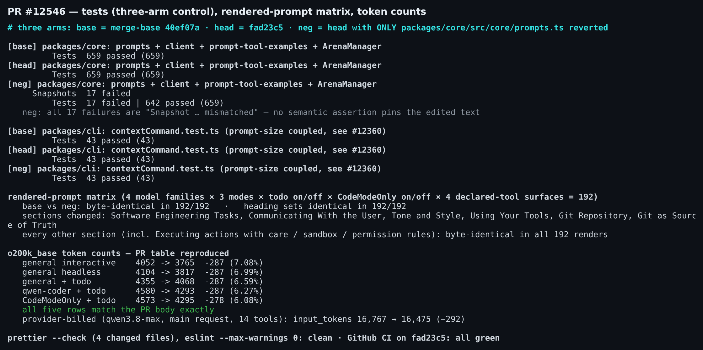
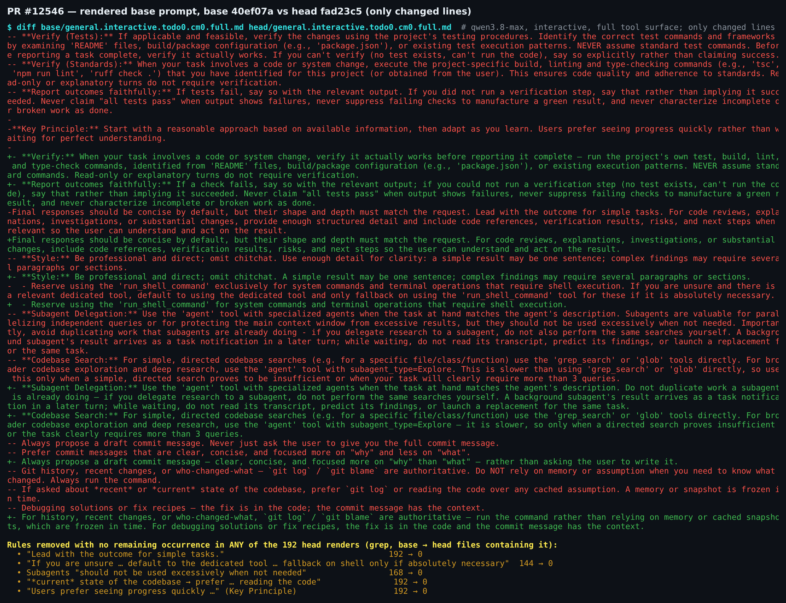
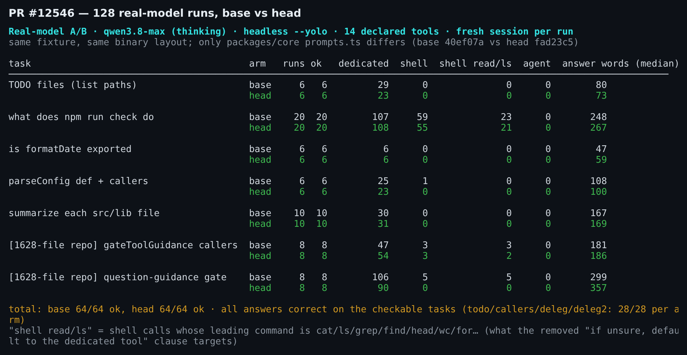
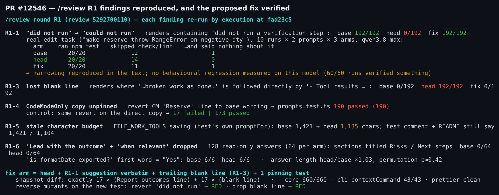

## 维护者验证 — PR #12546 @ `fad23c5`（本地真实模型环境）

**结论：打一个小的提示词补丁后可合入。补丁见下文，我已验证。** 188 次真实模型运行中没有测到行为退化。token 表逐行精确复现，安全小节逐字节不变。`/review` 那一轮（review 5292700110）里有两项仍建议合入前修掉。一项是 R1-1：一条安全锚点条款从 "did not run" 收窄成了 "could not run"。另一项是 R1-3：丢了一个空行，导致两条全局规则被并进工作流列表。两项都只涉及提示词文本，下面这一个补丁同时修好。R1 其余各项属于文档和注释的准确性问题。

另外，triage 拦下的模板项还要补上：`## Linked Issues` 和 `中文说明` 区块。

环境：三臂，每臂都用 pnpm 真实安装并完整构建。**base** = 合并基点 `40ef07a`，**head** = `fad23c5`，**neg** = head 只回退 `packages/core/src/core/prompts.ts`。模型用 qwen3.8-max（thinking），经一个记录请求的反向代理调用。`--yolo` 无头会话声明 14 个工具，包括 `run_shell_command`、`grep_search`、`glob`、`agent`。我在线上请求体里确认过：base 发的是旧文本，head 发的是新文本。

### 1. PR 自述内容：全部复现



- **token 表：5 行全部精确一致**（o200k_base：−287 / −287 / −287 / −287 / −278）。作为交叉核对，provider 实际计费的主请求 input tokens 从 16,767 降到 16,475（−292）。
- **影响范围：** 我渲染了 192 个提示词：4 个模型族 × 3 种模式 × todo 开/关 × CodeModeOnly 开/关 × 4 种声明工具面。
  - 只有 6 个小节有变化：Software Engineering Tasks、Communicating、Tone、Using Your Tools、Git Repository、Git as Source of Truth。
  - 标题集合完全相同，其余小节逐字节一致，包括 Executing actions with care、沙箱和权限规则。
  - base 与 neg 的渲染结果在 192/192 中逐字节相同。唯一的生产代码改动就是 `prompts.ts`。
- **声明工具门控：** `TOOL_GUIDANCE_LINE_GATES` 的各前缀都还在。在门控面上（headless 默认、无 shell、仅 shell），diff 只落在预期的行上。
- **测试：**
  - core `prompts + client + prompt-tool-examples + ArenaManager`：base 659/659，head 659/659。
  - **neg：17 个失败，全部是 `Snapshot … mismatched`**。也就是说，没有任何语义断言钉住被改的文字，见第 4 节。
  - cli `contextCommand.test.ts`（#12360 那次被提示词长度耦合搞挂的测试）：三臂都是 43/43。
  - 变更文件的 Prettier、ESLint 都干净，CI 全绿。



### 2. 针对被整条删掉的规则做真实模型 A/B

有 5 条规则在全部 192 个 head 渲染中彻底消失，不只是去重：
- "Lead with the outcome for simple tasks."
- shell 平手规则 "if you are unsure … default to the dedicated tool"
- 子代理 "should not be used excessively"
- "current state → reading the code"
- Key Principle 里 "progress quickly" 那句

PR 正文称这些是冗余。我直接测了它们约束的行为：每次运行都是新会话，两臂用同一个 fixture。只读任务共 128 次，每臂 64 次，128 次全部成功：



- **shell 与专用工具**（被删的平手规则针对的就是这个）：没有漂移。
  - n=6 时，`check` 任务里 head 用 shell `ls`/`cat` 的次数一度是 base 的两倍。我把这个任务加跑到 n=20，差距消失：shell 读/列调用 23 次 vs 21 次，出现在 18/20 vs 19/20 次运行中。
  - 诱导 `cat` 的任务"逐个总结 src/lib 文件"，两臂的 shell 调用都是 0。
- **子代理过度使用：** 我在 1,628 个文件的 `packages/core/src` 副本里做定向搜索。32 次运行两臂都是 0 次 `agent` 调用，直接用 `grep_search`。答案每臂 16/16 正确。
- **回答形态（R1-6 的担心）：** "X 是否导出？"两臂都是 6/6 以 "Yes" 开头。两臂都没有任何回答多出"风险/后续步骤"小节（0/64 vs 0/64）。head 回答长度是 base 的 ×1.03，置换检验 p≈0.42。
- **正确性：** 有标准答案的任务，每臂 28/28 正确。

以上只覆盖一个模型族的无头 `--yolo` 模式。它是"没有退化"的证据，不能证明完全没有退化。

### 3. `/review` R1 逐条执行复现



| 编号 | `fad23c5` 上的状态 | 我的判断 |
| --- | --- | --- |
| **R1-1** "did not run" → "could not run" | 复现。该条款在 base 渲染中出现 192/192，head 中 0/192。 | 我跑了 60 次真实编辑任务（"让 `reserve` 抛 RangeError"；普通和"快点改"两种提示；每种 10 次 × 3 臂）。每次都跑了 `npm test`，head 没有一次在跳过 check/lint 后不说明（0/14，base 为 1/12）。所以在这个模型上没有退化。但文本确实收窄了，而 `docs/plans/…token-governance.md` 把这一条列为安全锚点。修复只需约 8 个 token，所以**建议合入前修复**。 |
| **R1-2** "No bullet label … removed" | 复现。`Verify (Tests)`、`Verify (Standards)`、`Key Principle` 都已不在。中英两版设计文档里都有这句不成立的话。 | 只涉及文档。删掉这句或加限定语。 |
| **R1-3** 丢了结尾空行 | 复现。在 192/192 个 head 渲染中，`<system-reminder>` / `<persisted-output>` 两条规则变成了"按迭代步骤执行"列表的第 6、7 项。 | **建议合入前修复**，用同一个补丁。 |
| **R1-4** CodeModeOnly 副本无快照保护 | 复现。把 CM 的 `Reserve` 行改回 base 文案，测试仍 190/190 全绿。对直连副本做同样改动，17 个失败。 | 既有缺口，不阻塞。既然这次两份都在改，值得补一个测试。 |
| **R1-5** 1,421 / 1,104 字符数过期 | 复现。按测试自己的 `promptFor(FILE_WORK_TOOLS)` 计算，现在节省的是 **1,135**。 | 更新测试名和注释，以及 verification README。 |
| **R1-6** 删除 "Lead with the outcome" / "when relevant" | 文本复现。没有测到行为影响（见第 2 节）。 | 在设计文档里把这两处写成有意删除，而不是称其冗余；或者恢复它们。两种我都可以接受。 |

### 4. 已验证的 R1-1 + R1-3 补丁

补丁原样采用 R1-1 的 suggestion，为 R1-3 加回结尾空行，并加一个钉住测试。这个测试顺带覆盖了 Reviewer Test Plan 里合并后 Verify 的两个锚点句，这两句目前只有快照在保护：

```diff
-- **Report outcomes faithfully:** If a check fails, say so with the relevant output; if you could not run a verification step (no test exists, can't run the code), say that rather than implying it succeeded. Never claim …
+- **Report outcomes faithfully:** If a check fails, say so with the relevant output; if you did not run a verification step — including when you could not (no test exists, can't run the code) — say that rather than implying it succeeded. Never claim …
+
 `;
```

```ts
  it('keeps the merged verification and faithful-reporting rules', () => {
    vi.stubEnv('SANDBOX', undefined);
    const prompt = getCoreSystemPrompt();
    expect(prompt).toContain('NEVER assume standard commands.');
    expect(prompt).toContain(
      'Read-only or explanatory turns do not require verification.',
    );
    expect(prompt).toContain('did not run a verification step');
    expect(prompt).toContain(
      'or broken work as done.\n\n- Tool results and user messages',
    );
  });
```

`-u` 后的结果：
- 快照 diff 恰好是 17 × Report-outcomes 那一行，加 17 × 一个空行。
- core 套件 660/660 通过，cli `contextCommand` 43/43 通过。
- Prettier 干净。
- 对新测试做反向变异：改回 "could not run" 变红，删掉空行变红。单独删掉任一 Verify 锚点句也会变红（在 head 上验证过）。

证据在 [`wenshao/qwen-code@asserts/pr-12546`](.)：
- 全部四张图
- `harness/`：渲染器、分段对比脚本、记录请求的代理、A/B 运行器、任务提示词
- `data/runs.json`：全部 188 次真实模型运行，含工具调用和最终回答
- `data/fix.patch`
- 三臂测试日志
