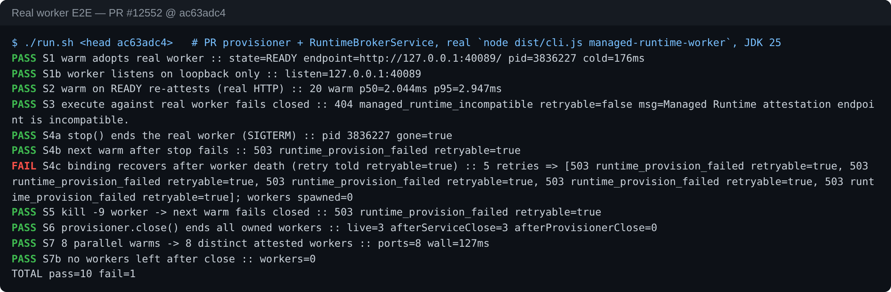
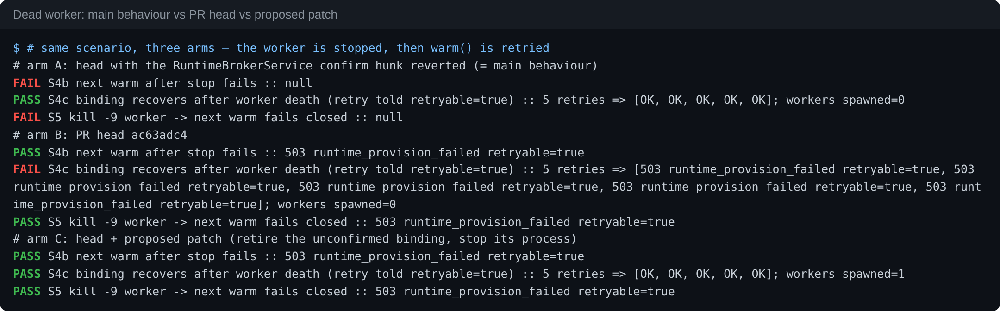
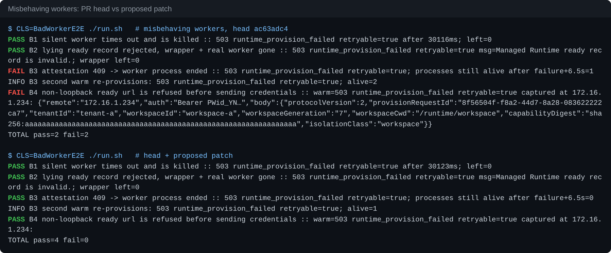
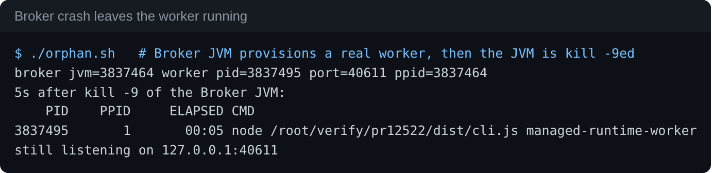
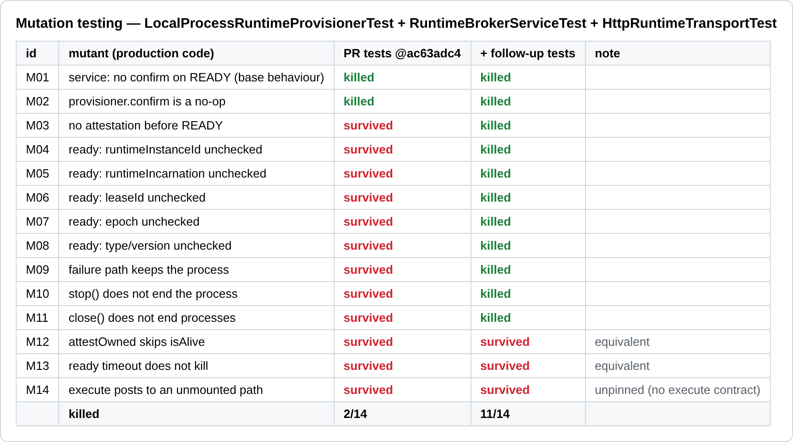

## Local verification against the real worker — head `ac63adc4`

**Verdict: mergeable as a library slice, with one issue to fix before anything constructs `LocalProcessRuntimeProvisioner` in production.** The headline claim holds against the real `qwen managed-runtime-worker` binary, not only against the Node double. The worker spawns, attests and reaches READY. Reusing the in-memory lease re-attests. A stopped or `kill -9`ed worker is refused. On `main` the same scenario hands back the dead lease every time.

The gap is recovery. Once a worker dies, its binding stays READY for the rest of the Broker's life. Every retry gets `503 retryable=true` and no new worker is ever started. I have a patch for that (+61/−8, verified) and a test patch (+87/−6) that raises mutation kills from 2/14 to 11/14.

qqqys's blocking item is fixed. The `.mjs` passes eslint `--max-warnings 0` and Prettier at head, and `a20ea29` still reproduces the 9 `no-undef` errors locally. That `CHANGES_REQUESTED` review needs a re-review or a dismissal.

### Environment

- The real worker came from an already-built bundle (`node dist/cli.js managed-runtime-worker`). Its sources are byte-identical to this head: `git diff --quiet 075de399 ac63adc4 -- managed-runtime-attestation-worker.ts managed-runtime-attestation-contract.ts cli.ts`.
- The PR's own `LocalProcessRuntimeProvisioner` + `RuntimeBrokerService` + `HttpRuntimeTransport` were driven by a Java harness, not mocks.
- JDK 25 (host) and JDK 21.0.12 (temurin container, the module's `release`), Node 22.
- Module suite: **76/76, 0 skipped** on both JDKs. `checkstyle:check` is clean.

### What holds up (real worker)



| # | Scenario | Result |
|---|---|---|
| S1 | `warm()` spawns the worker, writes the boot doc, reads ready, attests | READY in ~180 ms. Listens on `127.0.0.1` only. |
| S2 | 20× `warm()` on a READY binding | Each one re-attests over HTTP: p50 **2.0 ms** vs 0.005 ms without `confirm`. This runs per warm/new-session acquire, not per tool call. |
| S3 | `HttpRuntimeTransport.execute` against the real worker | `404 managed_runtime_incompatible`, `retryable=false`, fails closed as described |
| S4a/b | `stop(lease)` → next `warm()` | Worker exits on SIGTERM. warm → `503 runtime_provision_failed` |
| S5 | external `kill -9` of the worker → next `warm()` | `503`, fails closed |
| S6 | `provisioner.close()` | Ends all owned workers. `service.close()` alone does not, so the owner has to close both. |
| S7 | 8 workspaces warmed in parallel | 8 distinct attested workers in 127 ms, none left after close |
| B1 | Worker that never prints ready | Refused at 30.1 s, process gone, and the next warm re-provisions |
| B2 | Real worker behind a ready record with a foreign `leaseId` | `ready record is invalid`, wrapper + worker gone |

The same checks on JDK 21 give identical results. The Java↔TS boot/ready contract matches field for field against the real binary, which settles the "double could drift" gap from triage.

### Findings

**F1 — A dead worker bricks its binding for the Broker's lifetime, while the error says retryable (fix before wiring; not a regression).**
`confirm` failure leaves the record READY and `liveBindings` populated. `ensureBinding` only provisions from PROVISIONING, so nothing ever replaces the dead worker. Three arms, same scenario:



- **Arm A: `main` behaviour** (head with the `RuntimeBrokerService` hunk reverted). After the worker is gone, `warm()` returns the READY lease 5/5 times, pointing at a dead port. This is the bug the PR fixes.
- **Arm B: head.** It is refused correctly, but 5/5 retries give `503 runtime_provision_failed retryable=true` and 0 workers are spawned. Until a restart or reconcile, the caller is told to retry something that cannot succeed.
- **Arm C: head + patch.** The first retry provisions a new generation, and the next 5 warms are OK.

The patch has two parts:
- On `confirm` failure the service claims the operation, CASes READY→FAILED and drops `liveBindings`.
- The provisioner stops the process it failed to confirm.

The extended PR test is RED on head (`Managed Runtime process is not alive.` on the recovery step) and GREEN with the patch. With the patch plus the follow-up tests the full suite is 83/83 and checkstyle is clean. Two caveats:
- Recovery was exercised with the in-memory repository only.
- A transient attest failure now retires a healthy worker instead of sticking. I think that trade is right for a fail-closed gate, but it is the owner's call.

<details><summary>Patch (production part, +51/−7)</summary>

```diff
--- a/.../RuntimeBrokerService.java
+++ b/.../RuntimeBrokerService.java
@@ ensureBinding
             BindingContext live = requireLiveBinding(record);
             return safeStage(() -> provisioner.confirm(request, live.lease()))
-                    .thenApply(ignored -> live);
+                    .handle((ignored, error) -> {
+                        if (error == null) {
+                            return live;
+                        }
+                        retireUnconfirmedBinding(record);
+                        throw new CompletionException(unwrap(error));
+                    });
@@
+    /**
+     * A READY binding whose Runtime no longer attests cannot recover in
+     * place. Retire it so the next ensureBinding provisions a new generation.
+     */
+    private void retireUnconfirmedBinding(RuntimeBindingRecord record) {
+        RuntimeBindingRecord claimed = bindingRepository.claimOperation(
+                record.getBindingId(), brokerOwnerId, operationLeaseDuration);
+        if (claimed == null
+                || claimed.getState() != RuntimeBindingRecord.State.READY
+                || claimed.getGeneration() != record.getGeneration()) {
+            return;
+        }
+        if (bindingRepository.compareAndSet(claimed, claimed.withState(
+                RuntimeBindingRecord.State.FAILED, null, clock.instant()))
+                != null) {
+            liveBindings.remove(record.getBindingId());
+        }
+    }
--- a/.../LocalProcessRuntimeProvisioner.java
+++ b/.../LocalProcessRuntimeProvisioner.java
+    private static final Duration STOP_GRACE = Duration.ofSeconds(5);
@@ stop()
-            process.process.destroy();
+            terminate(process.process);
+    private static void terminate(Process process) {
+        process.destroy();
+        process.onExit().orTimeout(STOP_GRACE.toMillis(),
+                TimeUnit.MILLISECONDS).exceptionally(ignored -> {
+                    process.destroyForcibly();
+                    return null;
+                });
+    }
@@ start()
+            URI endpoint = URI.create(String.valueOf(ready.get("url")));
+            if (!"127.0.0.1".equals(endpoint.getHost())) {
+                throw failed("Managed Runtime ready record is invalid.");
+            }
             RuntimeLease lease = new RuntimeLease(runtimeInstanceId,
-                    URI.create(String.valueOf(ready.get("url"))), token,
-                    leaseId, 1);
+                    endpoint, token, leaseId, 1);
@@ both catch blocks
-                ownedProcess.process.destroy();
+                terminate(ownedProcess.process);
@@ attestOwned()
         if (process == null || !process.process.isAlive()) {
+            stop(lease);
             throw failed("Managed Runtime process is not alive.");
         }
-        attest(request, process.seed, lease);
+        try {
+            attest(request, process.seed, lease);
+        } catch (RuntimeException exception) {
+            stop(lease);
+            throw exception;
+        }
```
Full patch: [`patches/fix-ac63adc4.patch`](./patches/fix-ac63adc4.patch). Combined with the tests: [`fix-plus-tests-ac63adc4.patch`](./patches/fix-plus-tests-ac63adc4.patch).
</details>

**F2 — Failure paths only send SIGTERM (hardening).** A worker that refuses attestation and ignores SIGTERM is still alive 6.5 s after the failure. Each retry adds another one: 2 alive after the second warm. The merged worker does exit on SIGTERM, so this only bites a hung worker. The patch above adds a 5 s grace and then `destroyForcibly()` (B3 → 0 alive).

**F3 — A non-loopback `url` in the ready record receives the bearer token and identity (hardening; confirms triage's question).** A double that reports `http://172.16.1.234:<port>` got `Authorization: Bearer …` plus tenant/workspace/cwd/capability digest. The patch pins the host to `127.0.0.1`, which is the only address the worker binds, and the credentials are then never sent (B4).



**F4 — A Broker crash orphans the worker (follow-up, worker side).** I `kill -9`ed a JVM that had provisioned a real worker. 5 s later the worker had been re-parented to PID 1 and was still listening with a live token. stdin is closed right after the boot doc, so the worker has no lifeline, and Java cannot clean up after its own crash. That needs a worker-side parent watch or a held pipe. It was already visible in #12506 and now has an owner that can die.



**F5 — The `execute` half: I confirm triage's facts. Keeping it here or not is the maintainers' scope call.**
- The erasure clash is real. Making `HttpRuntimeTransport implements RuntimeTransport` fails `javac` with `return type CompletionStage<Void> is not compatible with CompletionStage<Map<String,Object>>`.
- The real-worker 404 is reported as `Managed Runtime attestation endpoint is incompatible.`, which is misleading for a tool call.
- Mutant M14, which sends execute to a different unmounted path, survives every test, because nothing pins the execute wire shape.

I'd drop it from this slice, or rename it, and land it with the tool-execution contract.

### Test strength (mutation)



The PR's tests kill **2/14**. Only the re-attest path is pinned. "No attestation before READY" (M03), every ready-record identity check (M04–M08), and all teardown paths (M09–M11) survive.

The follow-up tests ([`followup-tests-ac63adc4.patch`](./patches/followup-tests-ac63adc4.patch), +87/−6) add these to the fake worker:
- a `mode` argument (`wrong-type|wrong-instance|wrong-incarnation|wrong-lease|wrong-epoch|no-attest`)
- a pid file, so each refusal also asserts the process exited, and so do `stop()` and `close()`

That brings kills to **11/14**. M12 and M13 are equivalent, and M14 is the unpinned execute route from F5. The fixture stays eslint/Prettier clean.

### CI

The two red lanes are infra, not this diff:
- `Integration Tests (no-AK)` failed in `Verify checkout includes expected head commit` before any test ran.
- `web-shell E2E Smoke` was cancelled at 20 min with the web server refusing on :4170.

All Java lanes (11/17/21, macOS, Windows, MariaDB) and `Lint & Static` are green at `ac63adc4`.

Evidence (harness sources, raw logs, patches, mutant driver): [`wenshao/qwen-code@asserts/pr-12552`](./)

<details>
<summary>中文版</summary>

## 基于真实 worker 的本地验证 —— head `ac63adc4`

**结论：作为库切片可以合入。但在任何生产代码构造 `LocalProcessRuntimeProvisioner` 之前，有一个问题应先修。**

PR 的核心主张在真实的 `qwen managed-runtime-worker` 二进制上成立，不只是在 Node 替身上成立：
- worker 能被拉起、完成证明、进入 READY；
- 复用内存 lease 时会重新证明；
- 被 stop 或被 `kill -9` 的 worker 会被拒绝。

同一场景在 `main` 上每次都会把死掉的 lease 交回去。

缺口在恢复。worker 死后，它的 binding 在 Broker 整个生命周期内一直是 READY。每次重试都返回 `503 retryable=true`，而且永远不会再拉起新 worker。我准备了修复补丁（+61/−8，已验证），以及测试补丁（+87/−6，变异杀伤从 2/14 提到 11/14）。

qqqys 的阻塞项已修复：head 的 `.mjs` 通过 eslint `--max-warnings 0` 和 Prettier；本地用 `a20ea29` 仍能复现那 9 个 `no-undef` 错误。那条 `CHANGES_REQUESTED` 需要重新评审或 dismiss。

### 环境

- 真实 worker 取自已构建的 bundle（`node dist/cli.js managed-runtime-worker`）。worker、契约和 `cli.ts` 源码与本 head 逐字节一致（`git diff --quiet` 已确认）。
- 用 Java harness 直接驱动 PR 自己的 `LocalProcessRuntimeProvisioner` + `RuntimeBrokerService` + `HttpRuntimeTransport`，没有用 mock。
- JDK 25（宿主）和 JDK 21.0.12（temurin 容器，即模块的 `release`），Node 22。
- 模块测试两个 JDK 下都是 **76/76、0 跳过**，checkstyle 干净。

### 成立的部分（真实 worker）

| # | 场景 | 结果 |
|---|---|---|
| S1 | warm 拉起 worker、写 boot、读 ready、完成证明 | 约 180 ms 进入 READY，只监听 `127.0.0.1` |
| S2 | 对 READY binding 连续 warm 20 次 | 每次都走 HTTP 重新证明：p50 **2.0 ms**，去掉 `confirm` 时为 0.005 ms。开销按 warm / 新会话计，不按工具调用计 |
| S3 | 对真实 worker 调 execute | `404 managed_runtime_incompatible`、不可重试，与描述一致 |
| S4/S5 | stop 或外部 `kill -9` 后再 warm | `503`，失败关闭；worker 收到 SIGTERM 会退出 |
| S6 | `provisioner.close()` | 结束全部 worker。只调 `service.close()` 不会结束，属主需要两个都关 |
| S7 | 8 个工作区并行 warm | 127 ms 内得到 8 个独立且已证明的 worker，关闭后无残留 |
| B1 | worker 始终不输出 ready | 30.1 s 被拒并被杀，下一次 warm 会重新 provision |
| B2 | 真实 worker 套上带假 `leaseId` 的 ready 记录 | 被拒，包装进程和 worker 都已退出 |

JDK 21 下结果相同。Java↔TS 的 boot/ready 契约在真实二进制上逐字段对上，triage 担心的"替身可能漂移"这一点得到了验证。

### 发现

**F1：worker 死后 binding 在 Broker 生命周期内永久不可用，报错却标为可重试。** 应在接线前修复；不是回归。

原因是 `confirm` 失败后记录仍为 READY，`liveBindings` 也还在，而 `ensureBinding` 只会从 PROVISIONING 状态发起 provision，所以死掉的 worker 永远没有东西来替换。三臂对照：

- **A：`main` 行为**（回退 service 那段改动）：worker 死后 warm 5/5 次都返回指向死端口的 READY lease。这正是本 PR 修掉的问题。
- **B：head**：能正确拒绝，但 5/5 次重试都是 `503 retryable=true`，新拉起的 worker 为 0。
- **C：head + 补丁**：第一次重试就拉起新一代，之后 5 次 warm 全部成功。

补丁分两部分：
- `confirm` 失败时，service 先 claim operation，再用 CAS 把 READY 改为 FAILED，并移除 `liveBindings`；
- provisioner 停掉证明失败的那个进程。

扩展后的测试在 head 上是红的（恢复那一步报 `Managed Runtime process is not alive.`），打上补丁后是绿的。修复加测试后全量 83/83，checkstyle 干净。两点说明：
- 恢复路径只在内存 repository 上验证过；
- 一次瞬时证明失败现在会让健康的 worker 退役，而不是卡住。对失败关闭的闸门来说我认为这个取舍合理，但由负责人决定。

**F2：失败路径只发 SIGTERM（加固）。** 一个拒绝证明、同时无视 SIGTERM 的 worker，在失败 6.5 s 后仍然存活，而且每次重试再多一个（第二次 warm 后存活 2 个）。已合入的 worker 会响应 SIGTERM，所以只有挂死的 worker 才会触发。补丁改为给 5 s 宽限，之后 `destroyForcibly()`，B3 存活数变为 0。

**F3：ready 记录里的非 loopback `url` 会收到 bearer token 和身份信息（加固，印证 triage 的疑问）。** 上报 `http://172.16.1.234:<port>` 的替身收到了 `Authorization: Bearer …`，以及租户、工作区、cwd 和 capability digest。补丁把 host 固定为 `127.0.0.1`（worker 唯一会绑定的地址），之后凭据不会再发出（B4）。

**F4：Broker 崩溃会让 worker 成为孤儿（后续项，worker 侧）。** `kill -9` 掉已经拉起真实 worker 的 JVM，5 s 后 worker 已被 PID 1 收养，仍在监听，token 仍然有效。boot 写完后 stdin 就关闭了，worker 没有生命线；Java 也无法在自己崩溃后做清理。这需要 worker 侧监视父进程，或保持一根管道。该问题在 #12506 就已存在，现在它有了一个可能会死掉的属主。

**F5：`execute` 那一半。** triage 说的事实我都复核成立，是否留在本切片由维护者定：
- 擦除冲突属实：让 `HttpRuntimeTransport implements RuntimeTransport`，javac 报返回类型不兼容；
- 真实 worker 返回的 404 被报成 "attestation endpoint is incompatible"，对工具调用来说有误导；
- 变异 M14（把 execute 发到另一个未挂载路径）在所有测试下都存活，因为 execute 的线上格式没有被任何东西约束。

我倾向于从本切片移除或改名，随工具执行契约一起落地。

### 测试强度（变异）

PR 自带测试只杀死 **2/14**，只钉住了重新证明那条路径。以下变异全部存活：
- M03：READY 之前不做证明；
- M04–M08：ready 记录的全部身份校验；
- M09–M11：所有进程清理路径。

跟进测试（+87/−6）给 fake worker 增加了：
- `mode` 参数（`wrong-type|wrong-instance|wrong-incarnation|wrong-lease|wrong-epoch|no-attest`）；
- pid 文件，用来断言每种拒绝之后进程都已退出，`stop()` 和 `close()` 之后也一样。

杀伤率提到 **11/14**。M12、M13 是等价变异，M14 就是 F5 里没被钉住的 execute 路由。fixture 仍然通过 eslint 和 Prettier。

### CI

两条红 lane 都是基础设施问题，与本 diff 无关：
- `Integration Tests (no-AK)` 在任何测试开始前就失败于 checkout 未包含 head；
- `web-shell E2E Smoke` 在 20 分钟时被取消，web server 在 :4170 拒绝连接。

`ac63adc4` 上全部 Java lane（11/17/21、macOS、Windows、MariaDB）和 `Lint & Static` 均为绿。

证据（harness 源码、原始日志、补丁、变异驱动）：[`wenshao/qwen-code@asserts/pr-12552`](./)

</details>

---
🤖 Generated with [Claude Code](https://claude.com/claude-code) — Claude Opus 5.5 (1M context)
