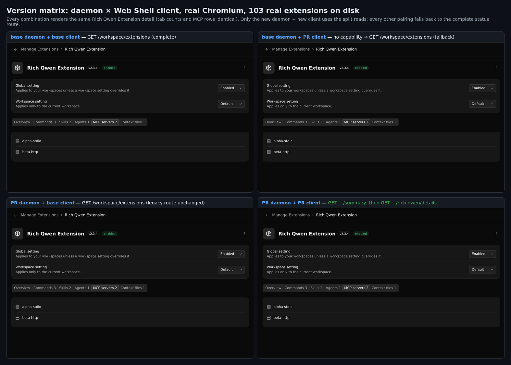
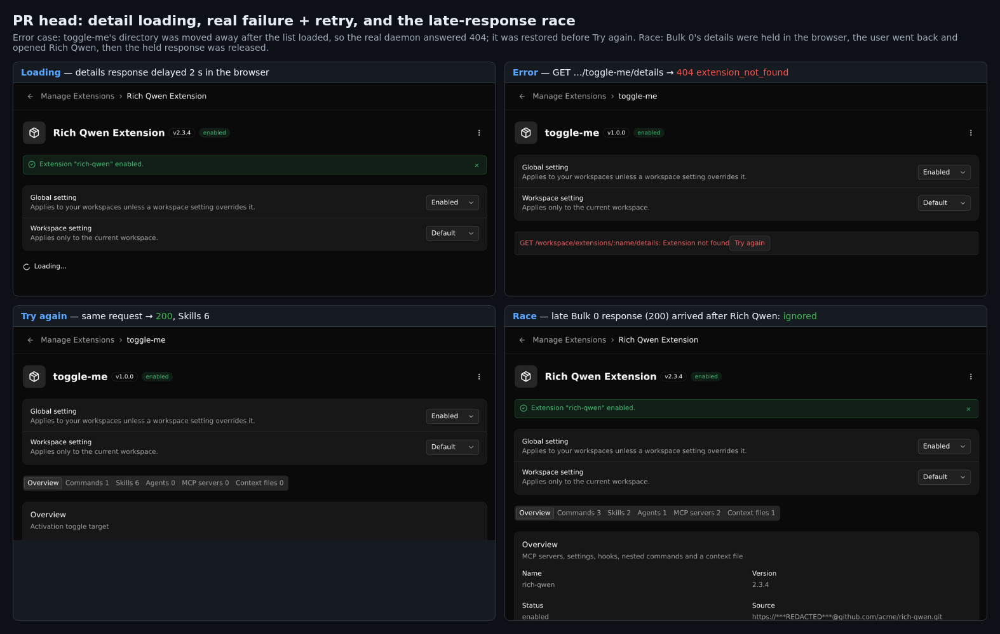
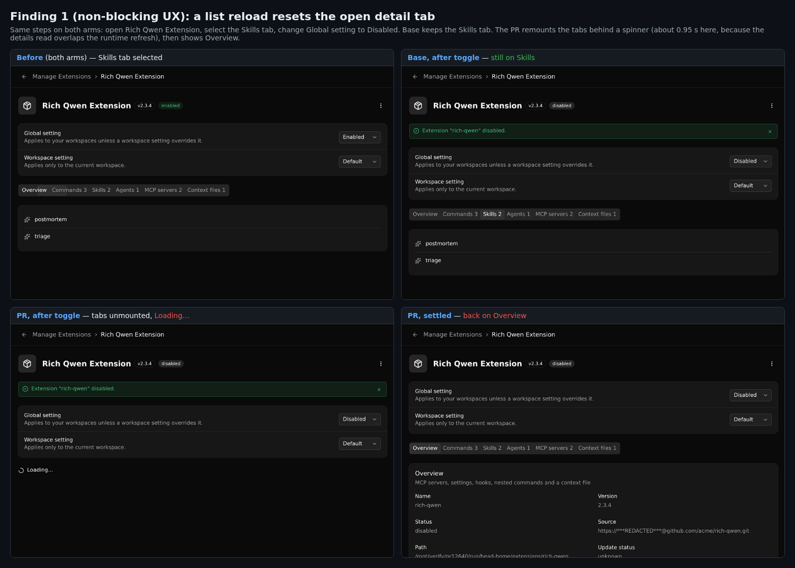

## Maintainer verification: real daemon + real browser, head `1994f1c4ab`

**Verdict: OK to merge.** I found no blockers. The split works end to end on a real daemon with real extensions on disk. The legacy route is unchanged, and every daemon/client version pairing falls back correctly. With 103 installed extensions, opening the list is about 6× faster in the browser and about 110× faster on the wire. I have two non-blocking follow-ups (below). The bigger one is a UX change: a list reload now resets the open detail tab.

### Setup

- **Two arms built from source** on Linux x86_64 (Node 22.22.2): the PR head `1994f1c4ab`, and the base `6a2b3a38ac`. The base is the `main` commit merged into the branch, so the diff between the arms is exactly the PR's 21 files. Each arm ran `pnpm install --frozen-lockfile`, `npm run build` and `npm run bundle`, all exit 0. The head also merges cleanly with today's `main` (`5130c1a734`).
- **Real `qwen serve` daemons** with an isolated `QWEN_HOME` and **103 real extensions on disk**:
  - 100 bulk extensions in the author's benchmark shape (40 skills, 10 commands, 5 agents and a `QWEN.md` each)
  - a rich Qwen extension: 2 MCP servers, settings, hooks, nested `ops:*` commands, a context file, and git install metadata with credentials, a query and a fragment in the source URL
  - an Agent Plugins v1 package (`plugin.json` + `mcp.json` with stdio and streamable-http servers, plus skills)
  - a small toggle target
- **Real Chromium** (headless shell 1228) drove the Web Shell that each daemon serves. Nothing is mocked. `page.route` was used only to delay or hold a real daemon response, and only in the two places noted.

### Results

| Check | Result |
| --- | --- |
| HTTP parity, head (103 extensions) | **10/10**. The summary envelope equals the complete envelope. All 103 summary entries deep-equal the complete entries minus `capabilities`/`details`, in the same order. All 103 `/:name/details` responses deep-equal their complete-status entry, including the Agent Plugins MCP servers. A missing extension returns `404 extension_not_found`. `RICH-QWEN` resolves to the same entry. The source is redacted (`https://***REDACTED***@github.com/acme/rich-qwen.git`). The legacy status is unchanged after the new reads. |
| Legacy `GET /workspace/extensions`, base vs head | **Identical**: 103 entries, compared after normalising the home path. The base arm returns 404 for both new routes. |
| Edge sets, real daemon | Case-only name collision (`CaseExt`/`caseext`): complete, summary and details all fail the same way (`500 extension_conflict`). Exact duplicate name in two directories: all three routes pick the same (last) directory. Broken manifest: excluded everywhere. Extensions named `summary`, `operations` and `v1.2` are served correctly by `/:name/details`, and `/operations` still works. |
| Browser wire, head client + head daemon | Opening the page sends only `GET …/summary` (plus `operations`). Selecting an extension sends one `GET …/<name>/details`. **No complete-status request in any flow.** |
| Version matrix (fig. 1) | All four daemon × client pairings render identical tabs and MCP rows. Only head + head uses the split. The base client on the head daemon, and the head client on the base daemon, both use the complete route. |
| Loading / real 404 + Try again / late response (fig. 2) | Spinner while loading. To get a real 404, I moved the extension's directory away after the list loaded; the page showed the error, and Try again returned 200 (Skills 6) once the directory was restored. A held Bulk 0 response released after switching to Rich Qwen was **ignored**. |
| Embedded in the Plugins panel | The same summary-then-details flow works, and the Agent Plugins MCP rows show. |
| Unit tests (head) | core `extensionManager` 185/185 · SDK `DaemonClient` 493/493 · web-shell page + logic 21/21 · CLI routes + controller + docs contract 98/98 (including **`workspace-qualified-extensions` 57/57**; the two timeouts reported from macOS do not reproduce here) · `server.test.ts` capability tests 87/87 · integration `qwen-serve-routes` 42/42 (on the built bundle) · ESLint `--max-warnings 0` on the 19 changed TS files: clean. |
| Mutation check (15 single-site mutants on the PR's guards) | **12 killed.** The 3 survivors are covered under follow-up 3. |

**Wire timings.** Real HTTP over loopback against the head daemon with 103 extensions. 9 alternating samples per operation; legacy reads were spaced over 2 s apart so the 2 s cache never answered.

| Operation | Median | Range | Bytes |
| --- | ---: | ---: | ---: |
| Legacy complete status (cache miss), head | 937.9 ms | 922–944 | 123,315 |
| Legacy complete status (cache miss), base | 945.8 ms | 910–952 | 123,315 |
| Summary | **8.5 ms** | 7.0–9.5 | 30,644 (−75 %) |
| One detail | 16.3 ms | 15.8–19.4 | 1,208 |
| Summary + detail | **24.2 ms** | 23.0–25.6 | 31,852 |

**Browser timings** (real Chromium, `/extensions` until the cards are visible, then a card click until the tabs are visible). Median of runs 2–5:

| | Open list | Open one extension |
| --- | ---: | ---: |
| Base | 1,498 ms (first open 2,504) | 33 ms (no request) |
| PR | **255 ms** (first open 1,490) | 71 ms (one details request) |

### Follow-ups (non-blocking)

**1. A list reload resets the open detail tab and shows a spinner (fig. 3).** This confirms the triage review's first observation in a real browser, with numbers.
- **Steps:** open Rich Qwen, select **Skills**, then change Global setting to Disabled.
- **Base:** stays on Skills, with no spinner (3/3 toggles).
- **PR:** the tabs unmount behind "Loading..." and come back on **Overview** (3/3 toggles). The painted spinner lasted 932–950 ms.
- **Why the spinner is that long:** the activation flow starts the runtime refresh (`POST …/extensions/refresh`), and 3–4 ms later the page issues the details read. The daemon logged that read at 928–948 ms, against about 16 ms when idle.
- **Cause:** the details effect depends on the `selectedExtension` object, so every `load(true)` produces a new object, clears `detailResult`, and remounts the uncontrolled `<Tabs defaultValue="overview">`.
- **Suggested fix:** key the fetch on the extension name plus a reload counter. Keep the last entry for the same name visible while revalidating, and show the spinner only when no entry exists for that name. Making `Tabs` controlled also keeps the selected tab.
- On the positive side, the PR finishes the activation flow sooner: the refresh POST goes out at about 1.07 s, against 1.9–2.0 s on base, which first waits for the complete scan.

**2. Agent Plugins stdio MCP servers can appear in the details when the plugin data root cannot be created.**
- On the details path, `createDataDir` is false for the selected extension too. That skips `loadAgentPluginMcpServers`' "mkdir failed → drop stdio servers" branch.
- **Repro:** make `$QWEN_HOME/extension-store/plugin-data/agent-plugins/<id>` a regular file.
- **Result:** the complete status reports `["plugin-http"]` (1), and base reports the same. `/agent-plugin/details` reports `["plugin-stdio","plugin-http"]` (2).
- Only an unwritable data root (read-only home, disk full) triggers this, but it breaks the "details match the complete entry field by field" claim. A read-only check would close it, for example: drop stdio servers when the data root exists and is not a directory, or when its nearest existing ancestor is not writable.

**3. Test gaps found by mutation.** Two of the three survivors change behaviour, so they are worth pinning:
- `findLast` → `find` in `refreshExtensionDetailsSnapshot`, and removing the summary's name de-duplication, both survive. Both would diverge with an exact duplicate name in two directories. A direct witness against the built core: the complete status keeps `dup-b`, `find` would return `dup-a` (different skills), and the catalog returns both directories, so the summary would list `dup` twice.
- Removing the `detailResult.summary === selectedExtension` identity check also survives. At paint level it seems redundant: across 5 runs each of the control and the mutant client, built with `vite build` and served by the real daemon, no painted frame showed the previous extension's tabs under the new header. React flushes the click's effects before paint.

**Two notes**
- The triage review's second observation ("summary de-duplicates, complete status does not") does not hold. `refreshCache` also builds a `Map` keyed by name, and the live duplicate probe shows all three routes agree.
- Cosmetic: the error alert shows the raw route template (`GET /workspace/extensions/:name/details: Extension not found`), and "Try again" sits flush against the text.

Harness scripts are in `harness/`, raw results in `data/`.

