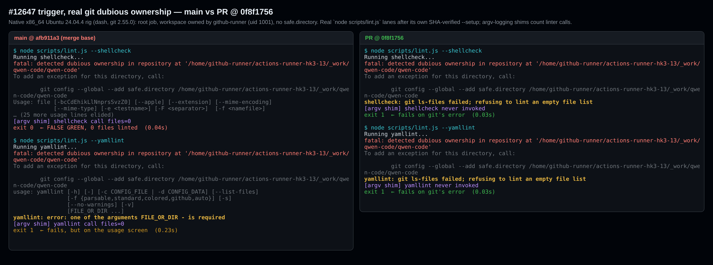
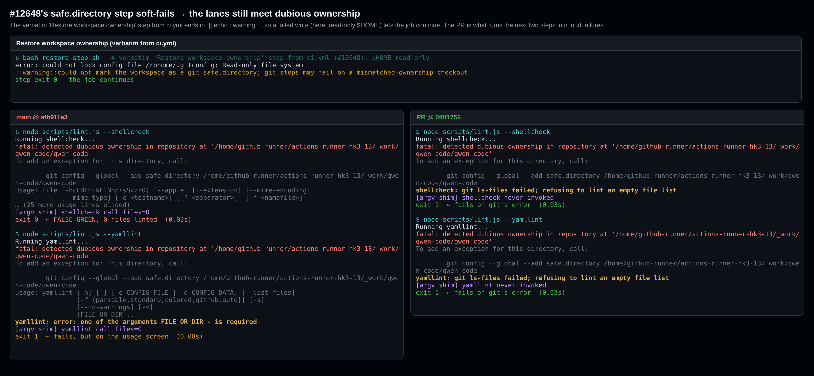
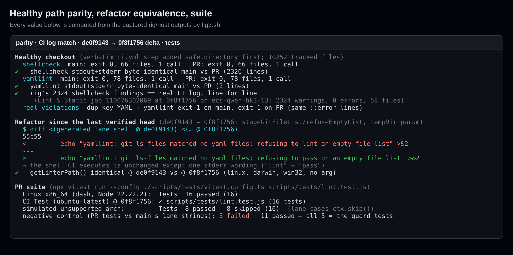
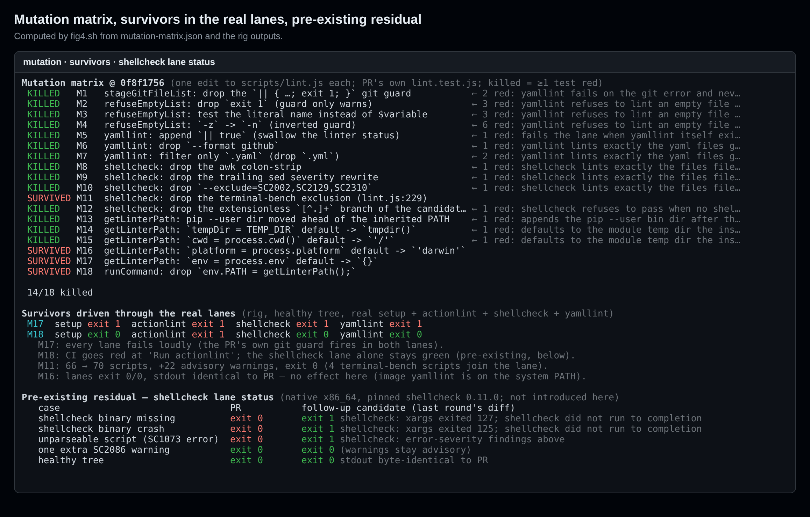

## Maintainer verification, round 2 (delta only): PR #12650 @ `0f8f1756`

**For the merge decision:** same split as [round 1](https://github.com/QwenLM/qwen-code/pull/12650#issuecomment-5853242337) at `de0f9143`. The **code is ready to merge**. The **PR metadata is not**. This round re-verifies the current head on a **native x86_64** rig. Round 1 ran under qemu, where the pinned shellcheck could not execute. This comment covers only what round 1 did not.

- **Code: ✅ re-verified at this head.** Since `de0f9143` the PR's own commits are one refactor (`ad4ceab8`) and two test-only commits (`bd9bcfc3`, `83807551`). Everything else is merges from `main`.
  - The shell that CI executes is **byte-identical** to what round 1 verified, except one stderr wording.
  - `getLinterPath()` returns identical output on linux, darwin, win32 and with no arguments.
  - The #12647 trigger still turns shellcheck's false green into a loud failure.
  - **New this round:** if #12648's own `safe.directory` step soft-fails, this PR is the backstop. That is the value this PR keeps now that #12647 is closed.
  - On a healthy tree, the rig's **2324 shellcheck findings match this head's real CI job line for line**.
  - Suite: 16/16 passing. Mutation: 14/18 killed. I measured all 4 survivors in the real lanes. None blocks the merge.
- **Metadata: ❌ unchanged.** The title, the body and `Fixes #12647` still describe the round-0 design: a yamllint version probe plus a PATH reorder. That design is not in the tree. The ready-to-apply title and body in [autofix comment 5868718857](https://github.com/QwenLM/qwen-code/pull/12650#issuecomment-5868718857) hold at this head. I checked every testable claim in it: 16 tests (6 existing + 10 new), all ten line references, the `ctx.skip()` gate, and the two ungated `getLinterPath` cases. One correction is needed before applying it. Its macOS line says the cases added since `de0f9143` are `getLinterPath` tests. In fact they are one `getLinterPath` default case and one yamllint exit-status lane case (`:366`). So 2 of the 16 cases have never run on macOS, and that cell should be ⚠️, or the sentence should say so. The autofix loop is paused at 10/10 and has no GitHub credentials, so someone with write access has to apply it.
- **Recommended path:**
  1. Apply that title and body. This drops `Fixes #12647`.
  2. Dismiss the metadata-only `CHANGES_REQUESTED` ([latest](https://github.com/QwenLM/qwen-code/pull/12650#pullrequestreview-5372546130)).
  3. Merge.

  The shellcheck-status residual in §5 is pre-existing and is better handled as a follow-up.

### Environment

| | |
| --- | --- |
| Rig | `catthehacker/ubuntu:act-latest` (Ubuntu 24.04.4), **native amd64** on an x86_64 host. `/bin/sh` = dash, git 2.55.0, GNU xargs 4.9.0, file 5.45, Node 22.22.2. yamllint 1.35.1 is preinstalled in the image, because this head's CI printed no `Installing yamllint...`. I removed the image's system-wide `safe.directory=*`. |
| Trigger | The job runs as `root` with `HOME=/root`. The workspace is `/home/github-runner/actions-runner-hk3-13/_work/qwen-code/qwen-code` (the runner that ran this head's CI), owned by `github-runner` (uid 1001). |
| Trees | The PR head `0f8f1756` tree has 10252 tracked files in a real git index. The `main` arm is the same tree with merge-base `afb911a3`'s `scripts/lint.js`; `head − base` is exactly the 2-file PR diff. `lint.js`, `lint.test.js` and `ci.yml` are unchanged on today's `main` (`27a4485d`), and the PR merges into it cleanly. |
| Lanes | The real `node scripts/lint.js --setup / --actionlint / --shellcheck / --yamllint`, each run with the workflow's `bash -eo pipefail`. `--setup` installs actionlint 1.7.12 and **shellcheck 0.11.0 `linux.x86_64`** through lint.js's own SHA-256-verified cache path. I pre-seeded the archives because downloads through this host's proxy are very slow; their SHA-256 matches the pins. Argv-logging shims, placed first on the lane PATH, `exec` the real binaries and count linter calls. |
| Host suite | Debian 13 x86_64 (dash), vitest 3.2.7 |

### 1. #12647 trigger at this head

| lane | `main` | PR |
| --- | --- | --- |
| `Run shellcheck` | **exit 0, false green**: shellcheck invoked with 0 files | **exit 1** in 0.03 s, shellcheck never invoked |
| `Run yamllint` | exit 1, but on `FILE_OR_DIR - is required` | **exit 1** in 0.03 s, yamllint never invoked |

On the PR, git's own `fatal: detected dubious ownership …` stays directly above the lane's `git ls-files failed; refusing to lint an empty file list`.

### 2. New: what happens when #12648's step soft-fails

The `safe.directory` line that #12648 added to `Restore workspace ownership` ends in `|| echo "::warning::…"`, so the job continues when it fails. I ran that step **verbatim** from `ci.yml` with a read-only `$HOME`. It printed `could not lock config file … Read-only file system` and the `::warning::`, then exited 0. The two lanes then hit dubious ownership:

- `main`: the same false green from shellcheck and the same usage-screen failure from yamllint.
- PR: two loud failures that name git's error.

So the PR backstops #12648's own failure mode.

### 3. Healthy path, real CI match, refactor delta, tests

- **Parity:** I ran the verbatim step first; it added `safe.directory`. Each arm then made **one shellcheck call over 66 scripts** and **one yamllint call over 78 files**. Both exited 0, and stdout and stderr were **byte-identical** between `main` and the PR. A duplicate-key YAML file fails yamllint with the same `::error` lines on both arms.
- **The rig matches the real runner.** This head's [Lint & Static job](https://github.com/QwenLM/qwen-code/actions/runs/36770735659/job/110076302069) ran on `ecs-qwen-hk3-13` and logged 2324 warnings, 0 errors, over 58 files. The rig's findings are **identical line for line**.
- **Refactor delta, `de0f9143` → `0f8f1756`:** I diffed the generated `shellcheck` and `yamllint` lane strings, `check` and `installer` included. The only change is the empty-YAML-list message, `refusing to lint` → `refusing to pass`. `getLinterPath()` is identical for linux, darwin, win32 and with no arguments.
- **Suite:**
  - Linux x86_64: 16/16. CI `Test (ubuntu-latest)`: `✓ scripts/tests/lint.test.js (16 tests)`.
  - With `process.arch` forced to an unsupported value for `lint.js` only: 8 passed and **8 skipped**. The lane cases go through `ctx.skip()` and do not fail.
  - Negative control: I swapped `main`'s two lane strings into the PR file and kept the exports. Exactly the **5 guard tests** fail; 11 pass.

### 4. Mutation matrix at this head

I made 18 single-edit mutants of `scripts/lint.js` and ran each against the PR's own suite. **14 are killed.** These include each guard, `$${variable}`, `-z`→`-n`, `|| true` on yamllint, the `--format github` and `--exclude` flags, the awk and sed rewrites, the pip-dir order, and the `tempDir` and `cwd` defaults. I drove each of the 4 survivors through the real lanes:

| survivor | measured effect in the real lanes | weight |
| --- | --- | --- |
| drop the `terminal-bench` exclusion (`lint.js:229`) | 66 → 70 scripts, +22 advisory warnings, exit 0 | Matches the bot's deferred `lint.js:229` finding (D12-2). Harmless today. |
| `platform` default → `'darwin'` | Output identical to the PR on this runner, because the image's yamllint is on the system PATH | Test gap only |
| `env` default → `{}` | setup, actionlint, shellcheck and yamllint **all exit 1**. The PR's own git guard fires in both lanes. | Test gap only; fails loudly |
| `runCommand` drops `env.PATH = getLinterPath()` | `Run actionlint` exits 1, so CI goes red. The **shellcheck lane alone exits 0** (`xargs: shellcheck: No such file or directory`). | This is the §5 residual again |

None of these blocks the merge. Optional hardening is two assertions in the `defaults to the module temp dir…` case:
- `toContain(process.env.PATH)` would kill the `env` mutant.
- An assertion on the pip `--user` dir for `process.platform` would kill the `platform` mutant.

### 5. Pre-existing residual, re-measured natively (not introduced here)

The shellcheck lane still takes its status from the trailing `sed`. With the real pinned x86_64 binary, the PR lane exits **0** in three cases: the binary is missing, the binary is replaced by a stand-in that dies with SIGSEGV, or a script is unparseable (SC1073 `error:`). I re-anchored round 1's [narrower candidate](https://github.com/QwenLM/qwen-code/pull/12650#issuecomment-5853242337) to the refactored source (`harness/cand.diff`); the hunk itself is unchanged. With it, the PR suite stays 16/16. Measured natively:

| case | PR | candidate |
| --- | --- | --- |
| missing binary | exit 0 | exit 1 (xargs 127) |
| SIGSEGV stand-in | exit 0 | exit 1 (xargs 125) |
| unparseable script | exit 0 | exit 1 |
| one extra SC2086 warning | exit 0 | exit 0 |
| healthy tree | exit 0 | exit 0, stdout **byte-identical** |

This belongs in a follow-up. Round 1's other residual also still holds on the real runner at this head: the `Run sensitive keyword linter` step finished in 34 ms with no output, because `lint.js` has no `--sensitive-keywords` handler.

### Not covered / rig caveats

- **macOS was not re-run this round** (Linux host). Round 1 ran 14/14 on macOS arm64 at `de0f9143`. The lane shell is byte-identical since then. The two cases added since then have not run on macOS: the yamllint exit-status lane case (stub exits 1; any non-zero xargs status passes it) and the `getLinterPath` default case.
- **Windows was not executed.** The 8 lane cases skip through `ctx.skip()`; the unsupported-arch simulation above exercises that path. The two `getLinterPath` cases normalise paths with `toPosix`, and I only reasoned through them. `Test (macos-latest)` and `Test (windows-latest)` were skipped in this PR's CI.
- This is a rig, not the ECS runner. Its healthy-path output does match the real runner line for line. The real runner image's yamllint version is unknown; the rig uses the pinned 1.35.1.

Evidence (figures, `REPORT.md`, rig Dockerfile and scenario script, mutation driver, figure generators, raw lane outputs): this directory (`harness/`, `data/`)
